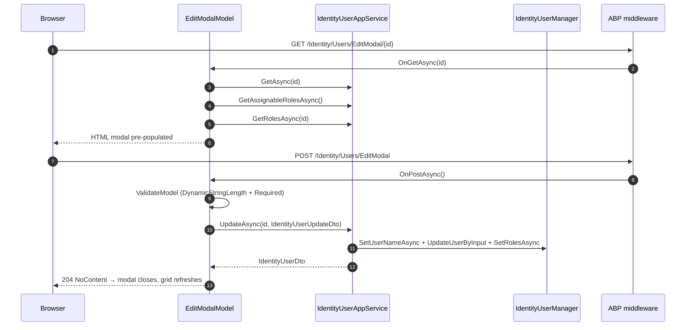

`Volo.Abp.Identity.Web` is the MVC / Razor Pages UI for managing users, roles and (via the OU extension) organization units. It is the *default* admin UI shipped with the ABP MVC startup templates. Architecturally, it is a thin Razor-Pages frontend over [HTTP API Client](/modules/identity/http-api-client) — every page binds to a view model, maps to a DTO via AutoMapper, and calls an `IIdentity*AppService`.

Reference this package from your MVC web host. Blazor hosts use [Identity.Blazor](/modules/identity/blazor) instead; an MVC host can technically host both, but the menu contributor here will not contribute to a Blazor router.

## File inventory

| File | Role |
| --- | --- |
| `AbpIdentityWebModule.cs` | DependsOn(`AbpIdentityApplicationContractsModule`, `AbpAutoMapperModule`, `AbpPermissionManagementWebModule`, `AbpAspNetCoreMvcUiThemeSharedModule`). Adds menu contributor, embeds resources, configures AutoMapper. |
| `AbpIdentityWebAutoMapperProfile.cs` | DTO ↔ ViewModel maps (Create, Edit, Index for users/roles). |
| `Navigation/AbpIdentityWebMainMenuContributor.cs` | Adds `Administration > Identity Management > Users / Roles` to the main menu. |
| `Navigation/IdentityMenuNames.cs` | Stable menu names (`AbpIdentity`, `AbpIdentity.Roles`, `AbpIdentity.Users`). |
| `Pages/Identity/IdentityPageModel.cs` | Shared page base — `LocalizationResourceType = typeof(IdentityResource)`. |
| `Pages/Identity/Users/Index.cshtml(.cs)` | Server-rendered grid + permission gates. |
| `Pages/Identity/Users/CreateModal.cshtml(.cs)` | Modal form bound to `IdentityUserCreateDto`. |
| `Pages/Identity/Users/EditModal.cshtml(.cs)` | Modal form bound to `IdentityUserUpdateDto`. |
| `Pages/Identity/Roles/Index.cshtml(.cs)` | Roles grid. |
| `Pages/Identity/Roles/CreateModal.cshtml(.cs)` | Role create form. |
| `Pages/Identity/Roles/EditModal.cshtml(.cs)` | Role edit form. |

## Module wiring

```csharp
[DependsOn(typeof(AbpIdentityApplicationContractsModule))]
[DependsOn(typeof(AbpAutoMapperModule))]
[DependsOn(typeof(AbpPermissionManagementWebModule))]
[DependsOn(typeof(AbpAspNetCoreMvcUiThemeSharedModule))]
public class AbpIdentityWebModule : AbpModule
{
    public override void PreConfigureServices(ServiceConfigurationContext context)
    {
        context.Services.PreConfigure<AbpMvcDataAnnotationsLocalizationOptions>(options =>
        {
            options.AddAssemblyResource(typeof(IdentityResource), typeof(AbpIdentityWebModule).Assembly);
        });

        PreConfigure<IMvcBuilder>(b => b.AddApplicationPartIfNotExists(typeof(AbpIdentityWebModule).Assembly));
    }

    public override void ConfigureServices(ServiceConfigurationContext context)
    {
        Configure<AbpNavigationOptions>(options => options.MenuContributors.Add(new AbpIdentityWebMainMenuContributor()));

        Configure<AbpVirtualFileSystemOptions>(options => options.FileSets.AddEmbedded<AbpIdentityWebModule>());

        context.Services.AddAutoMapperObjectMapper<AbpIdentityWebModule>();

        Configure<AbpAutoMapperOptions>(options =>
            options.AddProfile<AbpIdentityWebAutoMapperProfile>(validate: true));
    }
}
```

The `validate: true` flag on AutoMapper means a typo in any property name breaks the test suite — there is no silent mapping failure.

## Page tree

```
/Identity
├── /Users                     IndexModel              -- AbpIdentity.Users
│    ├── /CreateModal          CreateModalModel        -- AbpIdentity.Users.Create
│    └── /EditModal/{id}       EditModalModel          -- AbpIdentity.Users.Update
└── /Roles                     IndexModel              -- AbpIdentity.Roles
     ├── /CreateModal          CreateModalModel        -- AbpIdentity.Roles.Create
     └── /EditModal/{id}       EditModalModel          -- AbpIdentity.Roles.Update
```

`Index.cshtml(.cs)` is intentionally thin — the grid is rendered by a JS DataTable that calls `/api/identity/users` directly through the JS client proxy:

```csharp
public class IndexModel : IdentityPageModel
{
    public virtual Task<IActionResult> OnGetAsync()  => Task.FromResult<IActionResult>(Page());
    public virtual Task<IActionResult> OnPostAsync() => Task.FromResult<IActionResult>(Page());
}
```

That two-line model only exists so the page handles `OnPost` requests (form fallback if JavaScript is disabled).

## `CreateModalModel` walkthrough

```csharp
public class CreateModalModel : IdentityPageModel
{
    [BindProperty] public UserInfoViewModel       UserInfo { get; set; }
    [BindProperty] public AssignedRoleViewModel[] Roles    { get; set; }

    public CreateModalModel(IIdentityUserAppService identityUserAppService)
        => IdentityUserAppService = identityUserAppService;

    public virtual async Task<IActionResult> OnGetAsync()
    {
        UserInfo = new UserInfoViewModel();
        var roleDtoList = (await IdentityUserAppService.GetAssignableRolesAsync()).Items;
        Roles = ObjectMapper.Map<IReadOnlyList<IdentityRoleDto>, AssignedRoleViewModel[]>(roleDtoList);
        foreach (var role in Roles) role.IsAssigned = role.IsDefault;   // pre-check IsDefault roles
        return Page();
    }

    public virtual async Task<NoContentResult> OnPostAsync()
    {
        ValidateModel();
        var input = ObjectMapper.Map<UserInfoViewModel, IdentityUserCreateDto>(UserInfo);
        input.RoleNames = Roles.Where(r => r.IsAssigned).Select(r => r.Name).ToArray();
        await IdentityUserAppService.CreateAsync(input);
        return NoContent();
    }

    public class UserInfoViewModel : ExtensibleObject
    {
        [Required]
        [DynamicStringLength(typeof(IdentityUserConsts), nameof(IdentityUserConsts.MaxUserNameLength))]
        public string UserName { get; set; }
        // Name, Surname, Password (with [DisableAuditing]), Email (with [EmailAddress]),
        // PhoneNumber, IsActive (default true), LockoutEnabled (default true)
    }

    public class AssignedRoleViewModel
    {
        [Required, HiddenInput] public string Name { get; set; }
        public bool IsAssigned { get; set; }
        public bool IsDefault  { get; set; }
    }
}
```

The viewmodel extends `ExtensibleObject` so a property added through `ObjectExtensionManager.Instance.Modules().ConfigureIdentity(c => c.ConfigureUser(u => u.AddOrUpdateProperty<string>("SocialSecurityNumber", p => p.AllowUserToEditOnCreate = true)))` is automatically rendered by the dynamic-property tag helper.

## `EditModalModel` and the detail viewmodel

```csharp
public virtual async Task<IActionResult> OnGetAsync(Guid id)
{
    var user = await IdentityUserAppService.GetAsync(id);
    UserInfo = ObjectMapper.Map<IdentityUserDto, UserInfoViewModel>(user);
    Roles    = ObjectMapper.Map<IReadOnlyList<IdentityRoleDto>, AssignedRoleViewModel[]>(
                   (await IdentityUserAppService.GetAssignableRolesAsync()).Items);
    IsEditCurrentUser = CurrentUser.Id == id;

    var userRoleNames = (await IdentityUserAppService.GetRolesAsync(UserInfo.Id)).Items.Select(r => r.Name).ToList();
    foreach (var role in Roles)
        role.IsAssigned = userRoleNames.Contains(role.Name);

    Detail = ObjectMapper.Map<IdentityUserDto, DetailViewModel>(user);
    Detail.CreatedBy  = await GetUserNameOrNullAsync(user.CreatorId);
    Detail.ModifiedBy = await GetUserNameOrNullAsync(user.LastModifierId);
    return Page();
}

public class DetailViewModel
{
    public string  CreatedBy              { get; set; }
    public DateTime? CreationTime         { get; set; }
    public string  ModifiedBy             { get; set; }
    public DateTime? LastModificationTime { get; set; }
    public DateTimeOffset? LastPasswordChangeTime { get; set; }
    public DateTimeOffset? LockoutEnd     { get; set; }
    public int     AccessFailedCount      { get; set; }
}
```

The audit detail panel (`Detail`) renders on the right side of the modal — it makes the diff between "view" and "edit" explicit. `IsEditCurrentUser` is used by the Razor view to hide the `IsActive` toggle (a user cannot deactivate themselves).

## Menu contribution

```csharp
public class AbpIdentityWebMainMenuContributor : IMenuContributor
{
    public virtual Task ConfigureMenuAsync(MenuConfigurationContext context)
    {
        if (context.Menu.Name != StandardMenus.Main) return Task.CompletedTask;

        var l = context.GetLocalizer<IdentityResource>();
        var identityMenuItem = new ApplicationMenuItem(IdentityMenuNames.GroupName, l["Menu:IdentityManagement"], icon: "fa fa-id-card-o");
        identityMenuItem.AddItem(new ApplicationMenuItem(IdentityMenuNames.Roles, l["Roles"], url: "~/Identity/Roles")
            .RequirePermissions(IdentityPermissions.Roles.Default));
        identityMenuItem.AddItem(new ApplicationMenuItem(IdentityMenuNames.Users, l["Users"], url: "~/Identity/Users")
            .RequirePermissions(IdentityPermissions.Users.Default));

        context.Menu.GetAdministration().AddItem(identityMenuItem);
        return Task.CompletedTask;
    }
}
```

The contributor only fires for the `Main` menu and only inside the *Administration* group, so the menu items appear under `Administration > Identity Management` rather than the top level. `RequirePermissions` hides the item when the caller lacks the permission — the framework's authorization filter still enforces it server-side.

## Sequence: edit user with role reassignment



## Object extensions on the form

When `ObjectExtensionManager.Instance.Modules().ConfigureIdentity(...)` adds a property with `AllowUserToEditOnCreate = true`, the framework's `<abp-dynamic-form>` tag helper renders the matching input automatically — no Razor changes needed. The property:
* appears as a form input in `CreateModal.cshtml`,
* round-trips through `ExtensibleObject.ExtraProperties`,
* is validated by the attributes registered with the property (`[Required]`, `[StringLength]`, …),
* is mapped into `IdentityUserCreateDto.ExtraProperties` by AutoMapper's `.MapExtraProperties()`.

## Gotchas

<Warning>
**`AbpAspNetCoreMvcUiThemeSharedModule` is a hard dependency.** This page set assumes a Bootstrap-based theme (LeptonX, Basic, MaterialBlazor's Bootstrap variant…). It will not render correctly in a headless API host. If you want only the HTTP API exposed, do *not* reference this assembly — use [HTTP API](/modules/identity/http-api) directly.
</Warning>

<Warning>
**The `OnPostAsync` of `CreateModal` and `EditModal` returns `NoContent` (HTTP 204) on success.** The matching client-side JS reads the 204 and closes the modal; if you return `Page()` instead (the Razor default), the modal will not close. Subclassed modals must keep the same return convention.
</Warning>

<Warning>
**Two `IUserData`-looking lookups happen per page render.** `GetUserNameOrNullAsync` is called once for `CreatorId` and once for `LastModifierId`; both call `IdentityUserAppService.GetAsync` which requires `AbpIdentity.Users`. A user with `Users.Update` but without `Users.Default` will get a 403 on every audit-display lookup. The framework's `[Authorize]` on `GetAsync` is intentional — keep both permissions tied if you customize the role tree.
</Warning>

<Tip>
The `[DisableAuditing]` attribute on `UserInfoViewModel.Password` is what keeps clear-text passwords out of the audit log table. If you derive a custom viewmodel and forget it, every edit will record the password in `AbpAuditLogActions.Parameters` — which is then encrypted at rest only if you have configured it explicitly.
</Tip>

## Cross-links

<CardGroup cols={2}>
<Card title="Blazor" icon="bolt" href="/modules/identity/blazor">
The Blazorise-based alternative UI.
</Card>
<Card title="Application Contracts" icon="file-contract" href="/modules/identity/application-contracts">
DTOs and permissions used here.
</Card>
<Card title="Domain.Shared" icon="cube" href="/modules/identity/domain-shared">
`IdentityResource` localization that drives every label.
</Card>
<Card title="Framework: Navigation" icon="bars" href="/framework/ui/mvc-razor-pages/navigation-menu">
How `IMenuContributor` plugs into the layout.
</Card>
</CardGroup>
