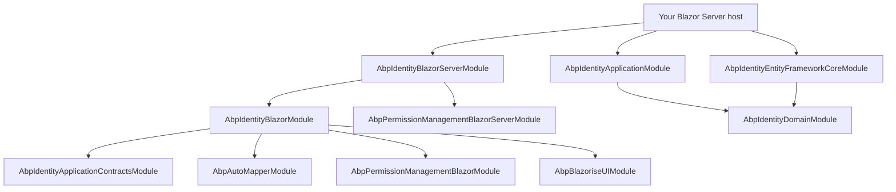
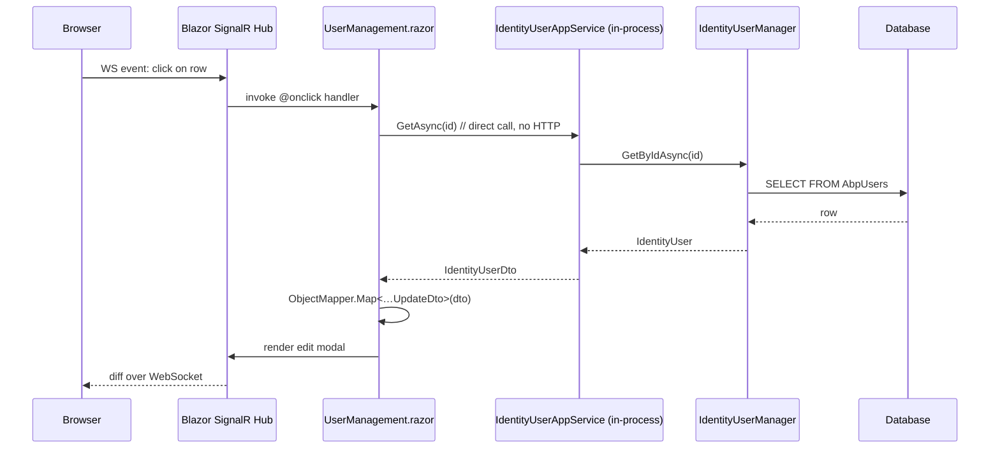

`Volo.Abp.Identity.Blazor.Server` is the smallest assembly in the Identity tier — it ships *one* class. Its job is to compose [`AbpIdentityBlazorModule`](/modules/identity/blazor) (the shared, host-agnostic UI components) with the framework's *Blazor Server* hosting plumbing so the `UserManagement.razor` and `RoleManagement.razor` pages can render on a SignalR circuit.

Reference this package from your Blazor Server *host* project alongside whatever theme module you use (`Volo.Abp.AspNetCore.Components.Server.LeptonXTheme`, `…BasicTheme`, etc.). The Identity app services resolve in-process through `Volo.Abp.Identity.Application`; no HTTP client proxies are needed.

## File inventory

| File | Role |
| --- | --- |
| `AbpIdentityBlazorServerModule.cs` | Module class. That is the entire assembly. |

## The module class — in full

```csharp
using Volo.Abp.AspNetCore.Components.Server.Theming;
using Volo.Abp.Modularity;
using Volo.Abp.PermissionManagement.Blazor.Server;

namespace Volo.Abp.Identity.Blazor.Server;

[DependsOn(
    typeof(AbpIdentityBlazorModule),
    typeof(AbpPermissionManagementBlazorServerModule)
)]
public class AbpIdentityBlazorServerModule : AbpModule
{
}
```

There is no `ConfigureServices`, no `OnApplicationInitialization`, no resource embedding — the wrapper simply tells ABP "load the shared identity Blazor module and the Server-flavour permission management module". Everything else flows transitively:

* `AbpIdentityBlazorModule` brings the pages, AutoMapper profile and navigation contributor.
* `AbpPermissionManagementBlazorServerModule` brings the server-side permission modal (the same `PermissionManagementModal` component used by `RoleManagement.razor` and `UserManagement.razor`).
* `AbpAspNetCoreComponentsServerThemingModule` (pulled in transitively by the theme) provides the layout, breadcrumbs and `<Router>` host.

## Dependency graph



## What "Server" means for Identity in practice

| Concern | Blazor Server | Notes |
| --- | --- | --- |
| App-service resolution | In-process — the `IIdentityUserAppService` registered by `AbpIdentityApplicationModule` |
| Authentication | ASP.NET Core cookie auth — `ICurrentUser` is hydrated by the framework from `HttpContext.User` |
| Authorization | Direct `IAuthorizationService.IsGrantedAsync(IdentityPermissions.Users.Create)` — fast, no extra round trip |
| Concurrency | One SignalR circuit per user session — Blazor renders happen on the server |
| Object extensions | Live in DI as `ObjectExtensionManager.Instance` — no client/server sync needed |
| Antiforgery | `[ValidateAntiForgeryToken]` handled by Blazor Server automatically |
| Permission modal | Renders directly through `AbpPermissionManagementBlazorServerModule` |

The chief implication: **you do not need [HTTP API Client](/modules/identity/http-api-client) referenced** unless you also expose the Identity API to *external* consumers from the same host. In a typical mono host you have:

```
Host project (Blazor Server)
├── Volo.Abp.Identity.Blazor.Server     ← this module
├── Volo.Abp.Identity.Application       ← in-process app services
├── Volo.Abp.Identity.HttpApi           ← optional, only if other clients hit your API
├── Volo.Abp.Identity.EntityFrameworkCore (or .MongoDB)
└── Volo.Abp.PermissionManagement.Domain.Identity (bridge)
```

## Host configuration checklist

```csharp
// Program.cs
builder.Services.AddRazorPages();
builder.Services.AddServerSideBlazor();
await builder.Services.AddApplicationAsync<YourHostModule>();

// YourHostModule.cs
[DependsOn(typeof(AbpIdentityBlazorServerModule))]
[DependsOn(typeof(AbpIdentityApplicationModule))]
[DependsOn(typeof(AbpIdentityEntityFrameworkCoreModule))]   // or AbpIdentityMongoDbModule
[DependsOn(typeof(AbpAccountWebIdentityServerModule))]      // typical for the login page
public class YourHostModule : AbpModule { /* … */ }
```

```csharp
public override void OnApplicationInitialization(ApplicationInitializationContext context)
{
    var app = context.GetApplicationBuilder();
    app.UseAuthentication();
    app.UseMultiTenancy();
    app.UseAuthorization();
    app.UseConfiguredEndpoints(endpoints =>
    {
        endpoints.MapBlazorHub();                         // ← essential for Server
        endpoints.MapFallbackToPage("/_Host");
    });
}
```

`MapBlazorHub` is the SignalR endpoint Blazor Server uses for circuit traffic. Identity's pages need it; the WebAssembly host does *not* call this.

## Sequence: clicking "Edit user" on Blazor Server



Note the absence of any HTTP boundary — `App` is the *same* `IdentityUserAppService` instance that an HTTP controller would invoke; the only difference is the caller. This is why a Blazor Server host that adds custom server-side validation can simply override `IdentityUserAppService` and see the new behavior in both the UI and any HTTP API consumers without touching the page.

## Gotchas

<Warning>
**Permissions are cached per circuit.** When an admin changes a role assignment for themselves on Blazor Server, the cached `IPermissionChecker` result for the *current circuit* is stale until the page is reloaded or the security stamp changes. ABP refreshes the principal on the next round trip; force a navigation after self-modifying role assignments to get a clean state.
</Warning>

<Warning>
**Long Identity operations block the SignalR circuit.** A bulk `UpdateRolesAsync` over thousands of users will keep the page unresponsive because Blazor Server serializes calls per circuit. Run heavy jobs through the background-job module and refresh the page from a server-side `IRealTimeNotifier` (or just navigate away and come back).
</Warning>

<Warning>
**`MapBlazorHub` must come *before* `MapFallbackToPage`** — otherwise SignalR can't establish the circuit and Identity pages will render a blank screen. This is a common copy-paste mistake when adapting a Razor Pages host to Blazor Server.
</Warning>

<Tip>
The `AbpPermissionManagementBlazorServerModule` dependency is what gives the Identity permission modal access to *server-side* policy resolution. If you ever swap permission providers (for example, federated PermissionManagement against a remote authorization service), the swap takes effect for Identity automatically because the module dependency chain stays intact.
</Tip>

## Cross-links

<CardGroup cols={2}>
<Card title="Blazor (shared)" icon="bolt" href="/modules/identity/blazor">
The UI components this wrapper hosts.
</Card>
<Card title="Blazor.WebAssembly" icon="cloud" href="/modules/identity/blazor-webassembly">
The WASM-flavored hosting wrapper.
</Card>
<Card title="Application" icon="gears" href="/modules/identity/application">
The in-process app services the pages call.
</Card>
<Card title="Permission Management" icon="lock" href="/modules/permission-management/overview">
The permission modal's backend.
</Card>
</CardGroup>
