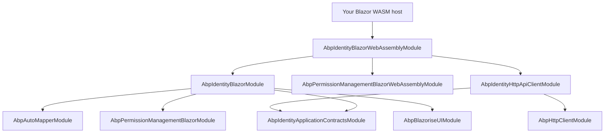
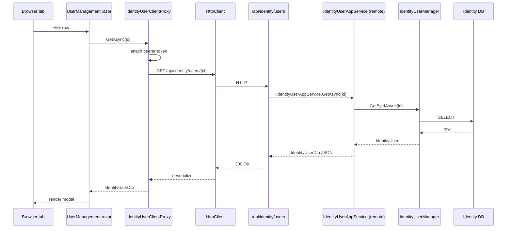

`Volo.Abp.Identity.Blazor.WebAssembly` is the WASM-flavored counterpart of [`Blazor.Server`](/modules/identity/blazor-server). The shared UI ([`Blazor`](/modules/identity/blazor)) is identical; the difference is that every call from a `UserManagement.razor` button to `IIdentityUserAppService` must cross the network because there are no Identity tables in the browser. This wrapper therefore *also* depends on [HTTP API Client](/modules/identity/http-api-client) so the app-service interfaces resolve to client proxies.

Reference this package from your Blazor WebAssembly host project. Pair it with the matching theme module (e.g. `Volo.Abp.AspNetCore.Components.WebAssembly.LeptonXTheme`) and an authentication scheme (typically OpenIddict / IdentityServer code+PKCE).

## File inventory

| File | Role |
| --- | --- |
| `AbpIdentityBlazorWebAssemblyModule.cs` | The whole assembly. |

## The module class — in full

```csharp
using Volo.Abp.AspNetCore.Components.WebAssembly.Theming;
using Volo.Abp.Modularity;
using Volo.Abp.PermissionManagement.Blazor.WebAssembly;

namespace Volo.Abp.Identity.Blazor.WebAssembly;

[DependsOn(
    typeof(AbpIdentityBlazorModule),
    typeof(AbpPermissionManagementBlazorWebAssemblyModule),
    typeof(AbpIdentityHttpApiClientModule)
)]
public class AbpIdentityBlazorWebAssemblyModule : AbpModule
{
}
```

Compared to the Server module, the *only* extra dependency is `AbpIdentityHttpApiClientModule`. That registers the four client proxies (`IdentityUserClientProxy`, `IdentityRoleClientProxy`, `IdentityUserLookupClientProxy`, `IdentityUserIntegrationClientProxy`) with `[Dependency(ReplaceServices = true)]` so the same UI components that work locally on Server now talk HTTP from the browser.

## Dependency graph



The WASM host does *not* reference `AbpIdentityApplicationModule`, `AbpIdentityEntityFrameworkCoreModule` or `AbpIdentityDomainModule`. Those live behind the remote API.

## What "WebAssembly" means for Identity in practice

| Concern | Blazor WebAssembly |
| --- | --- |
| App-service resolution | `IIdentityUserAppService` → `IdentityUserClientProxy` → HTTP |
| Authentication | OpenID Connect / OAuth code+PKCE; bearer token stored in browser session storage |
| `ICurrentUser` | Hydrated from the bearer token's claims at app start |
| Authorization | Local *display-time* policy check via cached `IPermissionGrantInfoCacheItem`; server still enforces on every request |
| Object extensions | The shared `ObjectExtensionManager.Instance` configured on both sides — the WASM host repeats the registration so dynamic forms render correctly client-side |
| Antiforgery | Not used — bearer auth instead |
| Permission modal | Calls `/api/permission-management/permissions?providerName=R&providerKey=admin` over HTTP |

## Host configuration checklist

```csharp
// Program.cs (Blazor WebAssembly host)
var builder = WebAssemblyHostBuilder.CreateDefault(args);

builder.Services.AddSingleton(sp => new HttpClient { BaseAddress = new Uri(builder.HostEnvironment.BaseAddress) });

await builder.Services.AddApplicationAsync<YourWasmHostModule>(opts =>
{
    opts.UseAutofac();
});

var host = builder.Build();
await host.InitializeAsync();
await host.RunAsync();
```

```csharp
[DependsOn(typeof(AbpIdentityBlazorWebAssemblyModule))]
[DependsOn(typeof(AbpAutofacWebAssemblyModule))]
public class YourWasmHostModule : AbpModule
{
    public override void ConfigureServices(ServiceConfigurationContext context)
    {
        var environment = context.Services.GetSingletonInstance<IWebAssemblyHostEnvironment>();
        var configuration = context.Services.GetConfiguration();

        // Tell the HTTP client proxies where the API lives
        Configure<AbpRemoteServiceOptions>(options =>
        {
            options.RemoteServices.Default = new RemoteServiceConfiguration(environment.BaseAddress);
            // optional: separate Identity backend
            // options.RemoteServices["AbpIdentity"] = new RemoteServiceConfiguration("https://identity.contoso.com");
        });

        // OIDC for cookie/bearer
        context.Services.AddOidcAuthentication(options =>
        {
            configuration.Bind("AuthServer", options.ProviderOptions);
            options.UserOptions.NameClaim = AbpClaimTypes.Name;
            options.UserOptions.RoleClaim = AbpClaimTypes.Role;
        });
    }
}
```

## Sequence: Edit user round trip on WASM



The "browser" boundary is now visible — every interaction is an HTTPS round trip. The Permission modal triggers a parallel call to `/api/permission-management/permissions?…`, which goes through `PermissionAppServiceClientProxy` from `AbpPermissionManagementBlazorWebAssemblyModule`.

## Performance notes

* `GetAssignableRolesAsync` runs once per page load; cache it in component state instead of re-fetching after every modal open.
* `GetRolesAsync(userId)` is called twice on the Edit modal (once for membership, once for assignable). If your tenant has thousands of roles, derive a custom page that calls `GetAllListAsync` instead and joins client-side.
* WASM pulls the entire `Volo.Abp.Identity.Application.Contracts` assembly into the browser as IL. The DTO graph is small (~30 KB after trimming) but watch out for transitive references from object-extension property attributes.

## Authentication wiring

The bearer token comes from your OIDC provider. ABP's `IRemoteServiceHttpClientAuthenticator` attaches it to every outbound call from the client proxies. If you have multiple Identity backends:

```json
"AbpRemoteServices": {
  "Default":     { "BaseUrl": "https://app.contoso.com/" },
  "AbpIdentity": { "BaseUrl": "https://identity.contoso.com/" }
}
```

The Identity client proxies pick the `AbpIdentity` entry because `AbpIdentityHttpApiClientModule` registers them under that remote-service name (`IdentityRemoteServiceConsts.RemoteServiceName`).

## Gotchas

<Warning>
**WASM cannot read `ConnectionStrings`.** It's an obvious point but easy to trip on — there is no database in the browser, only HTTP. Do not try to reference `Volo.Abp.Identity.EntityFrameworkCore` in your WASM host; the EF Core assemblies will load but every operation will throw on `IDbContextOptions`.
</Warning>

<Warning>
**Pre-rendering with Blazor WASM hosted under ASP.NET Core may double-fetch.** If your host prerenders Identity pages on the server *and then* hydrates with WASM, the `OnInitializedAsync` of `UserManagement.razor` runs twice. Use `PersistentComponentState` to forward the initial `GetAssignableRolesAsync` result from server to client, or accept the duplicate fetch.
</Warning>

<Warning>
**Bearer-token refresh interleaves badly with long-running modals.** If a token expires while the Edit modal is open, the next `UpdateAsync` will fail with 401 mid-action. Configure the OIDC client to refresh proactively (`options.ProviderOptions.DefaultScopes.Add("offline_access")`) and handle `AbpRemoteCallException` in the modal's `OnSaveAsync` to retry once after a silent refresh.
</Warning>

<Tip>
For shared Blazor codebases that target both Server and WASM, keep all Identity references behind a single `IIdentityUserAppService` injection — never call the controller URL directly. The same `.razor` file then works in both hosting models because the only difference is which module class your host's module depends on.
</Tip>

## Cross-links

<CardGroup cols={2}>
<Card title="Blazor (shared)" icon="bolt" href="/modules/identity/blazor">
The UI components this wrapper hosts.
</Card>
<Card title="Blazor.Server" icon="server" href="/modules/identity/blazor-server">
The in-process counterpart.
</Card>
<Card title="HTTP API Client" icon="plug" href="/modules/identity/http-api-client">
The client proxies pulled in here.
</Card>
<Card title="HTTP API" icon="globe" href="/modules/identity/http-api">
The REST surface the WASM client targets.
</Card>
</CardGroup>
