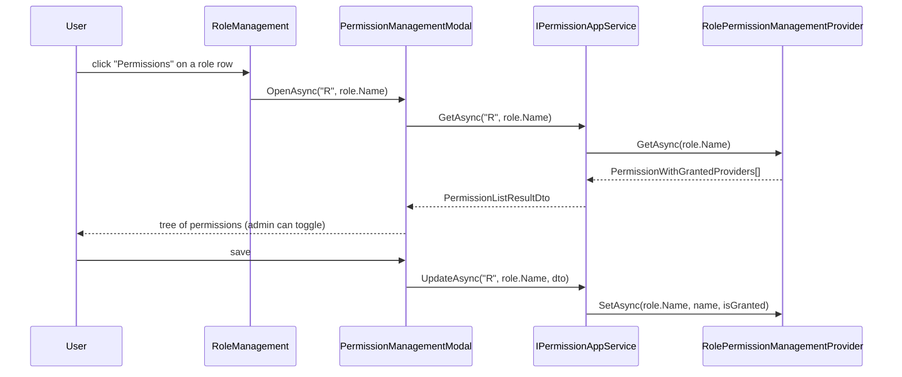

`Volo.Abp.Identity.Blazor` contains the *shared* Blazorise-based UI components for user and role management. It is the host-agnostic layer — both [Blazor Server](/modules/identity/blazor-server) and [Blazor WebAssembly](/modules/identity/blazor-webassembly) reference this assembly and add only the routing/host wiring on top.

The two pages — `UserManagement.razor` and `RoleManagement.razor` — derive from ABP's `AbpCrudPageBase<…>` so they inherit grid pagination, search, breadcrumbs, page toolbar, entity actions, create/edit modals and the standard delete confirmation. About 80% of the file is *configuration*; the actual data binding is generated by the base class.

## File inventory

| File | Role |
| --- | --- |
| `AbpIdentityBlazorModule.cs` | DependsOn(`AbpIdentityApplicationContractsModule`, `AbpAutoMapperModule`, `AbpPermissionManagementBlazorModule`, `AbpBlazoriseUIModule`). Adds router assembly, menu contributor, AutoMapper, object-extension push-down. |
| `AbpIdentityBlazorAutoMapperProfile.cs` | DTO ↔ ViewModel maps used by the create/edit modals. |
| `AbpIdentityWebMainMenuContributor.cs` | Adds `Administration > Identity Management > Users / Roles`. |
| `IdentityMenuNames.cs` | Menu name constants. |
| `Pages/Identity/UserManagement.razor` + `.razor.cs` | User CRUD page with role assignment + permissions modal. |
| `Pages/Identity/RoleManagement.razor` + `.razor.cs` | Role CRUD page with permissions modal. |
| `Pages/Identity/RoleNameComponent.razor` + `.razor.cs` | Reusable read-only role-pill component used on the Users page. |

## Module wiring

```csharp
[DependsOn(
    typeof(AbpIdentityApplicationContractsModule),
    typeof(AbpAutoMapperModule),
    typeof(AbpPermissionManagementBlazorModule),
    typeof(AbpBlazoriseUIModule))]
public class AbpIdentityBlazorModule : AbpModule
{
    public override void ConfigureServices(ServiceConfigurationContext context)
    {
        context.Services.AddAutoMapperObjectMapper<AbpIdentityBlazorModule>();
        Configure<AbpAutoMapperOptions>(options =>
            options.AddProfile<AbpIdentityBlazorAutoMapperProfile>(validate: true));

        Configure<AbpNavigationOptions>(options =>
            options.MenuContributors.Add(new AbpIdentityWebMainMenuContributor()));

        Configure<AbpRouterOptions>(options =>
            options.AdditionalAssemblies.Add(typeof(AbpIdentityBlazorModule).Assembly));

        Configure<AbpLocalizationOptions>(options =>
            options.Resources.Get<IdentityResource>().AddBaseTypes(typeof(AbpUiResource)));
    }

    public override void PostConfigureServices(ServiceConfigurationContext context)
    {
        OneTimeRunner.Run(() =>
        {
            ModuleExtensionConfigurationHelper.ApplyEntityConfigurationToUi(
                IdentityModuleExtensionConsts.ModuleName,
                IdentityModuleExtensionConsts.EntityNames.Role,
                createFormTypes: new[] { typeof(IdentityRoleCreateDto) },
                editFormTypes:   new[] { typeof(IdentityRoleUpdateDto) });

            ModuleExtensionConfigurationHelper.ApplyEntityConfigurationToUi(
                IdentityModuleExtensionConsts.ModuleName,
                IdentityModuleExtensionConsts.EntityNames.User,
                createFormTypes: new[] { typeof(IdentityUserCreateDto) },
                editFormTypes:   new[] { typeof(IdentityUserUpdateDto) });
        });
    }
}
```

The `AbpRouterOptions.AdditionalAssemblies.Add(...)` line is what makes the `[Route("/identity/users")]` attribute on `UserManagement.razor` discoverable from the host's `<Router>` component.

`ModuleExtensionConfigurationHelper.ApplyEntityConfigurationToUi` is the Blazor-side counterpart of `ApplyEntityConfigurationToApi` (in [Application Contracts](/modules/identity/application-contracts)) — it teaches the dynamic-form generator that an object-extension property like `"SocialSecurityNumber"` should produce a Blazorise input in both the create and edit modals.

## `UserManagement.razor` walkthrough

```csharp
public partial class UserManagement
{
    protected const string PermissionProviderName = "U";
    protected const string DefaultSelectedTab     = "UserInformations";

    protected PermissionManagementModal PermissionManagementModal;
    protected IReadOnlyList<IdentityRoleDto> Roles;
    protected AssignedRoleViewModel[] NewUserRoles;
    protected AssignedRoleViewModel[] EditUserRoles;
    protected string ManagePermissionsPolicyName;
    protected bool HasManagePermissionsPermission { get; set; }
    protected string CreateModalSelectedTab = DefaultSelectedTab;
    protected string EditModalSelectedTab   = DefaultSelectedTab;
    protected bool ShowPassword { get; set; }
    protected PageToolbar Toolbar { get; } = new();
    private List<TableColumn> UserManagementTableColumns => TableColumns.Get<UserManagement>();
    public  bool IsEditCurrentUser { get; set; }

    public UserManagement()
    {
        ObjectMapperContext  = typeof(AbpIdentityBlazorModule);
        LocalizationResource = typeof(IdentityResource);

        CreatePolicyName            = IdentityPermissions.Users.Create;
        UpdatePolicyName            = IdentityPermissions.Users.Update;
        DeletePolicyName            = IdentityPermissions.Users.Delete;
        ManagePermissionsPolicyName = IdentityPermissions.Users.ManagePermissions;
    }

    protected override async Task OnInitializedAsync()
    {
        await base.OnInitializedAsync();
        try   { Roles = (await AppService.GetAssignableRolesAsync()).Items; }
        catch (Exception ex) { await HandleErrorAsync(ex); }
    }

    protected override async Task SetPermissionsAsync()
    {
        await base.SetPermissionsAsync();
        HasManagePermissionsPermission =
            await AuthorizationService.IsGrantedAsync(IdentityPermissions.Users.ManagePermissions);
    }
}
```

The `*PolicyName` properties are read by `AbpCrudPageBase` to gate the "Create", "Edit" and "Delete" buttons. `HasManagePermissionsPermission` is read by the entity-action `Visible` predicate for the "Permissions" menu item.

## `RoleManagement.razor` walkthrough

```csharp
public partial class RoleManagement
{
    protected const string PermissionProviderName = "R";

    protected PermissionManagementModal PermissionManagementModal;
    protected string ManagePermissionsPolicyName;
    protected bool   HasManagePermissionsPermission { get; set; }
    protected PageToolbar Toolbar { get; } = new();
    protected List<TableColumn> RoleManagementTableColumns => TableColumns.Get<RoleManagement>();

    public RoleManagement()
    {
        ObjectMapperContext  = typeof(AbpIdentityBlazorModule);
        LocalizationResource = typeof(IdentityResource);

        CreatePolicyName            = IdentityPermissions.Roles.Create;
        UpdatePolicyName            = IdentityPermissions.Roles.Update;
        DeletePolicyName            = IdentityPermissions.Roles.Delete;
        ManagePermissionsPolicyName = IdentityPermissions.Roles.ManagePermissions;
    }

    protected override ValueTask SetEntityActionsAsync()
    {
        EntityActions.Get<RoleManagement>().AddRange(new EntityAction[]
        {
            new EntityAction
            {
                Text = L["Edit"],
                Visible = (data) => HasUpdatePermission,
                Clicked = async (data) => await OpenEditModalAsync(data.As<IdentityRoleDto>())
            },
            new EntityAction
            {
                Text = L["Permissions"],
                Visible = (data) => HasManagePermissionsPermission,
                Clicked = async (data) =>
                    await PermissionManagementModal.OpenAsync(PermissionProviderName, data.As<IdentityRoleDto>().Name)
            },
            new EntityAction
            {
                Text = L["Delete"],
                Visible = (data) => HasDeletePermission && !data.As<IdentityRoleDto>().IsStatic,
                Clicked = async (data) => await DeleteEntityAsync(data.As<IdentityRoleDto>()),
                ConfirmationMessage = (data) => GetDeleteConfirmationMessage(data.As<IdentityRoleDto>())
            }
        });
        return base.SetEntityActionsAsync();
    }
}
```

Note the `!data.As<IdentityRoleDto>().IsStatic` clause on the Delete action — the UI hides Delete for static roles so users don't get a 400 from `IdentityErrorCodes.StaticRoleDeletion`. The server-side guard in `IdentityRoleManager.DeleteAsync` remains the source of truth.

## Permissions modal

Both pages embed `<PermissionManagementModal @ref="PermissionManagementModal" />` which comes from `Volo.Abp.PermissionManagement.Blazor`. The `PermissionProviderName` ("U" for users, "R" for roles) and the entity key (`user.Id.ToString()` or `role.Name`) tell the modal which `IPermissionManagementProvider` to use.

| Page | Provider | Key |
| --- | --- | --- |
| UserManagement | `"U"` | `user.Id.ToString()` |
| RoleManagement | `"R"` | `role.Name` |

The providers themselves live in [`Volo.Abp.PermissionManagement.Domain.Identity`](/modules/permission-management/overview).

## Sequence: opening the role-permissions modal



## AutoMapper profile

```csharp
public class AbpIdentityBlazorAutoMapperProfile : Profile
{
    public AbpIdentityBlazorAutoMapperProfile()
    {
        CreateMap<IdentityUserDto, IdentityUserUpdateDto>()
            .MapExtraProperties();

        CreateMap<IdentityRoleDto, IdentityRoleUpdateDto>()
            .MapExtraProperties();

        CreateMap<IdentityRoleDto, AssignedRoleViewModel>()
            .ForMember(x => x.IsAssigned, opt => opt.MapFrom(_ => false));
    }
}
```

The `IdentityUserDto → IdentityUserUpdateDto` map is what makes a single line in `OpenEditModalAsync` populate the form — `ObjectMapper.Map<IdentityUserDto, IdentityUserUpdateDto>(roleDto)`. The `.MapExtraProperties()` extension copies the entire `ExtraProperties` dictionary so object-extension fields round-trip.

## Object extension experience

Same idea as MVC — add a property in your `*.Domain.Shared` module:

```csharp
ObjectExtensionManager.Instance.Modules()
    .ConfigureIdentity(identity => identity.ConfigureUser(user =>
        user.AddOrUpdateProperty<string>("EmployeeCode", p =>
        {
            p.Attributes.Add(new RequiredAttribute());
            p.Attributes.Add(new StringLengthAttribute(10));
        })));
```

The Blazor create and edit modals automatically render an `<input type="text">` for `EmployeeCode`, validate it via `Microsoft.AspNetCore.Components.Forms`, send it as part of `ExtraProperties` in the JSON body, and persist it as a column (EF Core) or BSON field (MongoDB).

## Gotchas

<Warning>
**Blazor Server vs WebAssembly cookie behavior differs.** `AbpCrudPageBase` calls `AppService` through whatever DI returns — for Blazor Server it is the local app service, for Blazor WebAssembly it is the HTTP client proxy. The role assignment confirmation modal might appear *before* the server has refreshed `ICurrentUser.Roles` because the security stamp validation runs on the next request. Re-render the page after a self role change.
</Warning>

<Warning>
**`TableColumn` extensions registered via `TableColumns.Get<UserManagement>().AddOrUpdate(...)` must run in `PostConfigureServices`** — running them earlier loses to the base class's own column registration. The standard pattern is to drop the registration inside a `OneTimeRunner` block, the same way `AbpIdentityBlazorModule.PostConfigureServices` runs the extension config.
</Warning>

<Warning>
**The Razor view file `.razor` is not in source control as compiled markup** — Blazorise's `<Field>`, `<TextEdit>`, `<MemoEdit>`, `<Check>` etc. all live there. If you fork `UserManagement.razor`, copy *both* the markup and the partial class so the `@ref`s line up.
</Warning>

<Tip>
The `RoleNameComponent.razor` is a reusable pill renderer for role names. Use it instead of bare `@role.Name` in custom grids so the styling stays consistent — and so the eventual Pro extension that adds tooltips for static / default roles picks up automatically.
</Tip>

## Cross-links

<CardGroup cols={2}>
<Card title="Blazor Server" icon="server" href="/modules/identity/blazor-server">
Server-side hosting wrapper.
</Card>
<Card title="Blazor WebAssembly" icon="cloud" href="/modules/identity/blazor-webassembly">
WASM hosting wrapper.
</Card>
<Card title="Web (MVC)" icon="window-maximize" href="/modules/identity/web">
Razor Pages alternative.
</Card>
<Card title="Permission Management" icon="lock" href="/modules/permission-management/overview">
The modal that "Permissions" buttons open.
</Card>
</CardGroup>
