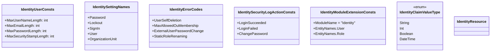

`Volo.Abp.Identity.Domain.Shared` is the bottom of the Identity stack. It contains only *types that can safely cross every layer boundary* — constants for column lengths, enums, settings names, error codes, the embedded localization resource, the four ETO classes, and the object-extension configuration helpers. There is **no logic, no DI registration, and no dependency on EF Core, MongoDB or ASP.NET Core**. The single module class (`AbpIdentityDomainSharedModule`) only depends on `AbpUsersDomainSharedModule` and the standard ABP localization plumbing.

Reference this package whenever you need to read or write a magic string that the Identity stack uses — for example to build a custom settings page that toggles `Abp.Identity.Password.RequireDigit`, or to author a custom validator that respects `IdentityUserConsts.MaxUserNameLength`.

## File inventory

| File | What it gives you |
| --- | --- |
| `AbpIdentityDomainSharedModule.cs` | Module class. Depends on `AbpUsersDomainSharedModule` + `AbpValidationModule` + `AbpLocalizationModule`. |
| `IdentityUserConsts.cs` | Length limits for `UserName`, `Email`, `PasswordHash`, `SecurityStamp`, etc. Inherits values from `AbpUserConsts`. |
| `IdentityRoleConsts.cs` | `MaxNameLength = 256`, `MaxNormalizedNameLength = 256`. |
| `IdentityClaimTypeConsts.cs` | `MaxNameLength`, `MaxRegexLength`, `MaxRegexDescriptionLength`, `MaxDescriptionLength`. |
| `IdentityRoleClaimConsts.cs` / `IdentityUserClaimConsts.cs` | `MaxClaimTypeLength`, `MaxClaimValueLength`. |
| `IdentityUserLoginConsts.cs` | `MaxLoginProviderLength`, `MaxProviderKeyLength`, `MaxProviderDisplayNameLength`. |
| `IdentityUserTokenConsts.cs` | `MaxLoginProviderLength`, `MaxNameLength`, `MaxValueLength`. |
| `OrganizationUnitConsts.cs` | `MaxDisplayNameLength`, `MaxDepth = 16`, `CodeUnitLength = 5`, `MaxCodeLength`. |
| `LinkUserTokenProviderConsts.cs` | Magic strings for the *user-linking* token provider. |
| `IdentityClaimValueType.cs` | `enum { String, Int, Boolean, DateTime }`. |
| `IdentitySecurityLogActionConsts.cs` | 14 action names (`LoginSucceeded`, `LoginFailed`, `LoginLockedout`, `ChangePassword`, …). |
| `IdentitySecurityLogConsts.cs` / `IdentitySecurityLogIdentityConsts.cs` | Default `IdentitySecurityLog.Identity` values (e.g. `"Identity"`). |
| `IdentityErrorCodes.cs` | Nine `Volo.Abp.Identity:010001..010009` codes. |
| `IUserRoleFinder.cs` | Minimal `Task<string[]> GetRolesAsync(Guid userId)` contract. |
| `Settings/IdentitySettingNames.cs` | All 13 setting keys, grouped by `Password`, `Lockout`, `SignIn`, `User`, `OrganizationUnit`. |
| `IdentityRoleEto.cs`, `IdentityRoleNameChangedEto.cs`, `IdentityClaimTypeEto.cs`, `OrganizationUnitEto.cs` | Distributed-event payload classes. |
| `Localization/IdentityResource.cs` + `Localization/*.json` | Embedded translations for 30+ languages. |
| `Volo/Abp/ObjectExtending/IdentityModuleExtensionConsts.cs` | `ModuleName = "Identity"`, `EntityNames` ("User", "Role", "ClaimType", "OrganizationUnit"). |
| `Volo/Abp/ObjectExtending/IdentityModuleExtensionConfiguration.cs` | Fluent helpers `ConfigureUser`, `ConfigureRole`, `ConfigureClaimType`, `ConfigureOrganizationUnit`. |
| `Volo/Abp/ObjectExtending/IdentityModuleExtensionConfigurationDictionaryExtensions.cs` | `dict.ConfigureIdentity()` entry point. |

## Length constants

`IdentityUserConsts` defines the maximum lengths the EF Core and MongoDB model builders apply to columns/fields. Every property is `static int { get; set; }` so you can raise a limit from your host's `PreConfigureServices` *before* `OnModelCreating` runs.

```csharp
// Volo.Abp.Identity.IdentityUserConsts (excerpt)
public static class IdentityUserConsts
{
    public static int MaxUserNameLength           { get; set; } = AbpUserConsts.MaxUserNameLength;   // 256
    public static int MaxNameLength               { get; set; } = AbpUserConsts.MaxNameLength;       //  64
    public static int MaxSurnameLength            { get; set; } = AbpUserConsts.MaxSurnameLength;    //  64
    public static int MaxNormalizedUserNameLength { get; set; } = MaxUserNameLength;                 // 256
    public static int MaxEmailLength              { get; set; } = AbpUserConsts.MaxEmailLength;      // 256
    public static int MaxNormalizedEmailLength    { get; set; } = MaxEmailLength;                    // 256
    public static int MaxPhoneNumberLength        { get; set; } = AbpUserConsts.MaxPhoneNumberLength;//  16
    public static int MaxPasswordLength           { get; set; } = 128;
    public static int MaxPasswordHashLength       { get; set; } = 256;
    public static int MaxSecurityStampLength      { get; set; } = 256;
    public static int MaxLoginProviderLength      { get; set; } = 16;
}
```

`OrganizationUnitConsts` deserves a callout because it controls a *deeply recursive* string column:

```csharp
public static class OrganizationUnitConsts
{
    public static int MaxDisplayNameLength { get; set; } = 128;
    public const int MaxDepth        = 16;                          // hard cap on tree depth
    public const int CodeUnitLength  = 5;                           // characters per segment
    public const int MaxCodeLength   = MaxDepth * (CodeUnitLength + 1) - 1; // 95 chars
}
```

`OrganizationUnit.Code` is a hierarchical path like `"00001.00042.00005"`. The `MaxDepth` and `CodeUnitLength` are `const`, not `static int { get; set; }` — they cannot be changed at runtime because the OU tree algorithms in `OrganizationUnitManager.GetNextChildCodeAsync` depend on them.

## Settings catalogue

`IdentitySettingNames` is the source of truth for every settings key the module reads. The names follow ABP's `Abp.<Module>.<Group>.<Key>` convention so they are unique across all installed modules.

```csharp
public static class IdentitySettingNames
{
    private const string Prefix = "Abp.Identity";

    public static class Password
    {
        private const string P = Prefix + ".Password";
        public const string RequiredLength                       = P + ".RequiredLength";
        public const string RequiredUniqueChars                  = P + ".RequiredUniqueChars";
        public const string RequireNonAlphanumeric               = P + ".RequireNonAlphanumeric";
        public const string RequireLowercase                     = P + ".RequireLowercase";
        public const string RequireUppercase                     = P + ".RequireUppercase";
        public const string RequireDigit                         = P + ".RequireDigit";
        public const string ForceUsersToPeriodicallyChangePassword = P + ".ForceUsersToPeriodicallyChangePassword";
        public const string PasswordChangePeriodDays             = P + ".PasswordChangePeriodDays";
    }

    public static class Lockout
    {
        private const string L = Prefix + ".Lockout";
        public const string AllowedForNewUsers   = L + ".AllowedForNewUsers";
        public const string LockoutDuration      = L + ".LockoutDuration";       // seconds
        public const string MaxFailedAccessAttempts = L + ".MaxFailedAccessAttempts";
    }

    public static class SignIn
    {
        private const string S = Prefix + ".SignIn";
        public const string RequireConfirmedEmail        = S + ".RequireConfirmedEmail";
        public const string EnablePhoneNumberConfirmation= S + ".EnablePhoneNumberConfirmation";
        public const string RequireConfirmedPhoneNumber  = S + ".RequireConfirmedPhoneNumber";
    }

    public static class User
    {
        private const string U = Prefix + ".User";
        public const string IsUserNameUpdateEnabled = U + ".IsUserNameUpdateEnabled";
        public const string IsEmailUpdateEnabled    = U + ".IsEmailUpdateEnabled";
    }

    public static class OrganizationUnit
    {
        private const string O = Prefix + ".OrganizationUnit";
        public const string MaxUserMembershipCount = O + ".MaxUserMembershipCount";
    }
}
```

These names are *projected into* `IdentityOptions` by `AbpIdentityOptionsManager` (`Volo.Abp.Identity.Domain`) every time `IOptions<IdentityOptions>.Value` is read. Defaults are declared by `AbpIdentitySettingDefinitionProvider` in the Domain layer (`RequiredLength = 6`, `LockoutDuration = 300s`, `MaxFailedAccessAttempts = 5`, `RequireConfirmedEmail = false`, …). The admin UI ships in [Setting Management](/modules/setting-management/overview); both modules read the same string key.

## Error codes

`IdentityErrorCodes` exposes constants for every `BusinessException` the Identity application service throws. They follow ABP's `<Module>:<NumericCode>` format so callers can localize the message via `IdentityResource`:

| Code | Constant | Thrown when |
| --- | --- | --- |
| `Volo.Abp.Identity:010001` | `UserSelfDeletion` | A user tries to delete their own account. |
| `Volo.Abp.Identity:010002` | `MaxAllowedOuMembership` | Adding a user to an OU would exceed `Abp.Identity.OrganizationUnit.MaxUserMembershipCount`. |
| `Volo.Abp.Identity:010003` | `ExternalUserPasswordChange` | Password change attempted on an `IsExternal = true` user. |
| `Volo.Abp.Identity:010004` | `DuplicateOrganizationUnitDisplayName` | Two OUs in the same parent share `DisplayName`. |
| `Volo.Abp.Identity:010005` | `StaticRoleRenaming` | Rename attempted on `IsStatic = true` role. |
| `Volo.Abp.Identity:010006` | `StaticRoleDeletion` | Delete attempted on `IsStatic = true` role. |
| `Volo.Abp.Identity:010007` | `UsersCanNotChangeTwoFactor` | 2FA admin lock prevents user from changing 2FA. |
| `Volo.Abp.Identity:010008` | `CanNotChangeTwoFactor` | Setting `IdentityOptions.Tokens.ChangeEmailTokenProvider` is missing. |
| `Volo.Abp.Identity:010009` | `YouCannotDelegateYourself` | `IdentityUserDelegationManager` self-delegation. |

## Security-log action constants

`IdentitySecurityLogActionConsts` exposes the strings that `IdentitySecurityLog.Action` is filled with when the various Account/Identity flows record events. The full set:

```csharp
public class IdentitySecurityLogActionConsts
{
    public static string LoginSucceeded { get; set; } = "LoginSucceeded";
    public static string LoginLockedout { get; set; } = "LoginLockedout";
    public static string LoginNotAllowed { get; set; } = "LoginNotAllowed";
    public static string LoginRequiresTwoFactor { get; set; } = "LoginRequiresTwoFactor";
    public static string LoginFailed { get; set; } = "LoginFailed";
    public static string LoginInvalidUserName { get; set; } = "LoginInvalidUserName";
    public static string LoginInvalidUserNameOrPassword { get; set; } = "LoginInvalidUserNameOrPassword";
    public static string Logout { get; set; } = "Logout";
    public static string ChangeUserName { get; set; } = "ChangeUserName";
    public static string ChangeEmail { get; set; } = "ChangeEmail";
    public static string ChangePhoneNumber { get; set; } = "ChangePhoneNumber";
    public static string ChangePassword { get; set; } = "ChangePassword";
    public static string TwoFactorEnabled { get; set; } = "TwoFactorEnabled";
    public static string TwoFactorDisabled { get; set; } = "TwoFactorDisabled";
}
```

The Account module (login pages) records `LoginSucceeded` / `LoginFailed`; `IdentityUserAppService` and the Profile pages record the four `Change*` actions; the 2FA flow records `TwoFactorEnabled` / `TwoFactorDisabled`. Logs are persisted via `IdentitySecurityLogManager.SaveAsync(IdentitySecurityLogContext)` in the Domain layer.

## Distributed-event payloads (ETOs)

Four "Event Transfer Object" classes are declared here so subscribers can reference them without taking a hard dependency on the Domain layer.

```csharp
public class IdentityRoleEto : EntityEto, IMultiTenant
{
    public Guid Id { get; set; }
    public Guid? TenantId { get; set; }
    public string Name { get; set; }
}

[Serializable]
public class IdentityClaimTypeEto
{
    public Guid Id { get; set; }
    public string Name { get; set; }
    public bool   Required { get; set; }
    public bool   IsStatic { get; set; }
    public string Regex { get; set; }
    public string RegexDescription { get; set; }
    public string Description { get; set; }
    public IdentityClaimValueType ValueType { get; set; }
}
```

`IdentityRoleNameChangedEto` is published when `IdentityRoleManager.SetRoleNameAsync` is called and carries `OldName` + `NewName` so caches keyed by role name can invalidate. `IdentityUser` does *not* have its own ETO here — it reuses `Volo.Abp.Users.UserEto` from `Users.Abstractions` so non-Identity modules can subscribe without referencing this assembly.

## Object-extension helpers

The `Volo.Abp.ObjectExtending` namespace inside this package exposes two pieces:

```csharp
// IdentityModuleExtensionConsts.cs
public static class IdentityModuleExtensionConsts
{
    public const string ModuleName = "Identity";

    public static class EntityNames
    {
        public const string User             = "User";
        public const string Role             = "Role";
        public const string ClaimType        = "ClaimType";
        public const string OrganizationUnit = "OrganizationUnit";
    }

    public static class ConfigurationNames
    {
        public const string AllowUserToEdit = "AllowUserToEdit";
    }
}
```

```csharp
// IdentityModuleExtensionConfiguration.cs (excerpt)
public class IdentityModuleExtensionConfiguration : ModuleExtensionConfiguration
{
    public IdentityModuleExtensionConfiguration ConfigureUser(
        Action<EntityExtensionConfiguration> configureAction)
        => this.ConfigureEntity(IdentityModuleExtensionConsts.EntityNames.User, configureAction);

    public IdentityModuleExtensionConfiguration ConfigureRole(Action<EntityExtensionConfiguration> a);
    public IdentityModuleExtensionConfiguration ConfigureClaimType(Action<EntityExtensionConfiguration> a);
    public IdentityModuleExtensionConfiguration ConfigureOrganizationUnit(Action<EntityExtensionConfiguration> a);
}
```

The companion `IdentityModuleExtensionConfigurationDictionaryExtensions` makes this fluent at the call site:

```csharp
// In your *.Domain.Shared module's PreConfigureServices:
ObjectExtensionManager.Instance.Modules()
    .ConfigureIdentity(identity =>
    {
        identity.ConfigureUser(user =>
        {
            user.AddOrUpdateProperty<string>("SocialSecurityNumber",
                p =>
                {
                    p.Attributes.Add(new RequiredAttribute());
                    p.Attributes.Add(new StringLengthAttribute(11));
                });
        });
        identity.ConfigureRole(role =>
        {
            role.AddOrUpdateProperty<string>("ExternalRoleId");
        });
    });
```

`AbpIdentityDomainModule.PostConfigureServices` then calls `ModuleExtensionConfigurationHelper.ApplyEntityConfigurationToEntity` to push these into `IdentityUser`, `IdentityRole`, `IdentityClaimType` and `OrganizationUnit`, and `AbpIdentityWebModule` / `AbpIdentityBlazorModule` repeat the call against their create/update DTOs so the UI form picks up the extra fields automatically.

## Localization resource

```csharp
[LocalizationResourceName("AbpIdentity")]
public class IdentityResource { }
```

`Localization/*.json` files are embedded in the assembly and registered through `AbpVirtualFileSystemOptions`. Keys you will reference most often:

* `"DisplayName:Abp.Identity.Password.RequiredLength"` and friends — driven by the setting definitions.
* `"Permission:UserManagement"`, `"Permission:Create"`, `"Permission:Edit"`, `"Permission:Delete"`, `"Permission:ChangePermissions"` — used by `IdentityPermissionDefinitionProvider`.
* `"Volo.Abp.Identity:010001"..":010009"` — the error codes above.

## Class diagram



## Gotchas

<Warning>
**Mutating `IdentityUserConsts.MaxUserNameLength` at runtime does not change existing columns.** The model-builder reads the static value once at startup. Set it in `PreConfigureServices` of a module that runs *before* `AbpIdentityEntityFrameworkCoreModule`, then issue a database migration to widen the column. The same applies to MongoDB except that Mongo schemas are implicit, so only the validator changes.
</Warning>

<Warning>
**Adding a setting through `IdentitySettingNames` requires a matching `SettingDefinition` somewhere.** This package only declares the string keys; the actual `SettingDefinition` (default value, scope) is registered by `AbpIdentitySettingDefinitionProvider` in `Volo.Abp.Identity.Domain`. If you invent a new key here without also defining it, `ISettingProvider.GetOrNullAsync` returns `null` and `IdentityOptions` will fall back to its hard-coded default.
</Warning>

<Tip>
`IUserRoleFinder` lives here (not in `Users.Domain`) because both Identity and the Account module's `AbpAccountIdentityServiceCollectionExtensions` need a role-lookup contract that does *not* depend on `IdentityUserManager`. The default implementation lives in [Identity.Domain](/modules/identity/domain) and the HTTP client implementation in [Identity.HttpApi.Client](/modules/identity/http-api-client) (`HttpClientUserRoleFinder`).
</Tip>

## Cross-links

<CardGroup cols={2}>
<Card title="Identity.Domain" icon="diagram-project" href="/modules/identity/domain">
Aggregates, managers, stores and the runtime that reads these constants.
</Card>
<Card title="Setting Management" icon="sliders" href="/modules/setting-management/overview">
UI that edits the `Abp.Identity.*` keys declared here.
</Card>
<Card title="Users.Abstractions" icon="user" href="/modules/identity/users-abstractions">
`IUserData`, `UserEto` — the bottom-tier user contracts.
</Card>
<Card title="Framework: Object Extending" icon="puzzle-piece" href="/framework/architecture/object-extending">
The `ObjectExtensionManager` pipeline this package plugs into.
</Card>
</CardGroup>
