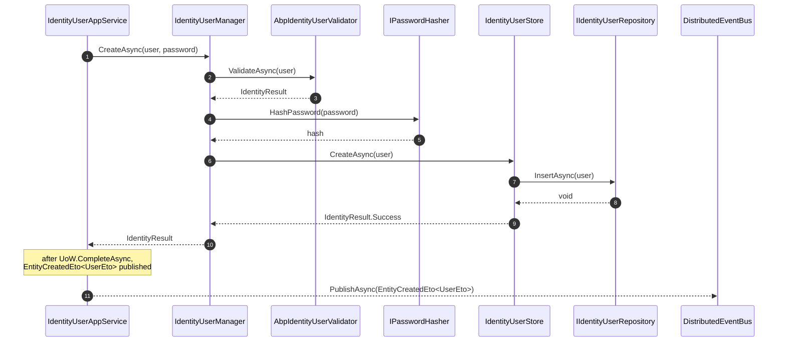

`Volo.Abp.Identity.Domain` is where ABP turns ASP.NET Core Identity into a *DDD aggregate model*. It owns six aggregate roots, four domain services (managers), a twelve-interface user store, the security-log pipeline, the external-login extensibility points and the AutoMapper profile that emits the four ETOs. Everything here implements an interface declared in `Volo.Abp.Identity.Domain` or `Volo.Abp.Users.Domain` — so the persistence layer can be swapped (EF Core ↔ MongoDB) without touching anything in this assembly.

This page walks the aggregates first, then the managers, then the integration seams (claims principal factory, security log, external login providers, settings refresh).

## File inventory (`Volo/Abp/Identity/`)

| File | Role |
| --- | --- |
| `AbpIdentityDomainModule.cs` | Registers `AddAbpIdentity`, AutoMapper profile, ETO mappings, `AbpIdentityOptionsManager`, object-extension push-down. |
| `AbpIdentityDbProperties.cs` | `DbTablePrefix = "Abp"`, `DbSchema`, `ConnectionStringName = "AbpIdentity"`. |
| `AbpIdentityOptions.cs`, `AbpIdentityOptionsManager.cs` | `ExternalLoginProviderDictionary`; refreshes `IdentityOptions` from `ISettingProvider` on every read. |
| `AbpIdentityResultException.cs`, `AbpIdentityUserValidator.cs` | Wraps `IdentityResult.Errors` in a localizable `BusinessException`; adds OU-aware user validation. |
| `AbpIdentitySettingDefinitionProvider.cs` | Declares the 13 `Abp.Identity.*` setting definitions with defaults. |
| `AbpUserClaimsPrincipalFactory.cs` | Adds `AbpClaimTypes.TenantId`, `Editions`, `SessionId` to the cookie/JWT principal. |
| `IdentityUser.cs`, `IdentityRole.cs`, `OrganizationUnit.cs`, `IdentityClaimType.cs`, `IdentityUserDelegation.cs`, `IdentityLinkUser.cs`, `IdentitySecurityLog.cs` | Aggregate roots. |
| `IdentityUserClaim.cs`, `IdentityUserRole.cs`, `IdentityUserLogin.cs`, `IdentityUserToken.cs`, `IdentityUserOrganizationUnit.cs`, `IdentityRoleClaim.cs`, `OrganizationUnitRole.cs`, `IdentityClaim.cs`, `IdentityLinkUserInfo.cs` | Owned entities & value objects. |
| `IdentityUserManager.cs`, `IdentityRoleManager.cs`, `OrganizationUnitManager.cs`, `IdentityClaimTypeManager.cs`, `IdentityLinkUserManager.cs`, `IdentityUserDelegationManager.cs` | Domain services. |
| `IdentityUserStore.cs`, `IdentityRoleStore.cs`, `IdentitySecurityLogStore.cs` | ASP.NET Core Identity *store* implementations. |
| `IExternalLoginProvider.cs`, `ExternalLoginProviderBase.cs`, `IExternalLoginProviderWithPassword.cs`, `ExternalLoginProviderWithPasswordBase.cs`, `ExternalLoginUserInfo.cs`, `ExternalLoginProviderInfo.cs`, `ExternalLoginProviderDictionary.cs` | Pluggable login backends (LDAP, legacy DB, …). |
| `IdentitySecurityLogManager.cs`, `IdentitySecurityLogContext.cs` | Writes `IdentitySecurityLog` rows. |
| `IIdentityUserRepository.cs`, `IIdentityRoleRepository.cs`, `IOrganizationUnitRepository.cs`, `IIDentityClaimTypeRepository.cs`, `IIdentitySecurityLogRepository.cs`, `IIdentityLinkUserRepository.cs`, `IIdentityUserDelegationRepository.cs` | Repository contracts implemented by EF Core / MongoDB. |
| `IdentityDataSeeder.cs`, `IdentityDataSeedContributor.cs`, `IIdentityDataSeeder.cs`, `IdentityDataSeedResult.cs` | Bootstraps the `admin` user and the `admin` role on first run. |
| `IdentityRoleNameChangedEto.cs` / `IdentityRoleNameChangedEvent.cs` | Local + distributed events fired by `IdentityRole.ChangeName`. |
| `IdentityDomainMappingProfile.cs` | AutoMapper `IdentityUser → UserEto`, `IdentityRole → IdentityRoleEto`, `IdentityClaimType → IdentityClaimTypeEto`, `OrganizationUnit → OrganizationUnitEto`. |
| `UserRoleFinder.cs` | Default `IUserRoleFinder` — joins through repositories to return role names for a user id. |
| `IdentityUserRepositoryExternalUserLookupServiceProvider.cs` | Default `IExternalUserLookupServiceProvider` for monolithic hosts. |

## Aggregates at a glance

| Aggregate | Base | Properties of note |
| --- | --- | --- |
| `IdentityUser` | `FullAuditedAggregateRoot<Guid>, IUser, IHasEntityVersion` | `TenantId`, `UserName`, `NormalizedUserName`, `Email`, `EmailConfirmed`, `PasswordHash`, `SecurityStamp`, `IsExternal`, `PhoneNumber`, `PhoneNumberConfirmed`, `IsActive`, `TwoFactorEnabled`, `LockoutEnd`, `LockoutEnabled`, `AccessFailedCount`, `ShouldChangePasswordOnNextLogin`, `EntityVersion`, `LastPasswordChangeTime`, plus owned collections `Roles`, `Claims`, `Logins`, `Tokens`, `OrganizationUnits`. |
| `IdentityRole` | `AggregateRoot<Guid>, IMultiTenant, IHasEntityVersion` | `TenantId`, `Name`, `NormalizedName`, `IsDefault`, `IsStatic`, `IsPublic`, `EntityVersion`, owned `Claims`. |
| `OrganizationUnit` | `FullAuditedAggregateRoot<Guid>, IMultiTenant, IHasEntityVersion` | `TenantId`, `ParentId`, `Code` (e.g. `"00001.00042"`), `DisplayName`, `EntityVersion`, owned `Roles`. |
| `IdentityClaimType` | `FullAuditedAggregateRoot<Guid>` | `Name`, `Required`, `IsStatic`, `Regex`, `RegexDescription`, `Description`, `ValueType` (enum), `DefaultValue`. |
| `IdentityUserDelegation` | `FullAuditedAggregateRoot<Guid>, IMultiTenant` | `SourceUserId`, `TargetUserId`, `StartTime`, `EndTime`. Used by impersonation. |
| `IdentityLinkUser` | `FullAuditedAggregateRoot<Guid>, IMultiTenant` | Two-way link `(SourceTenantId, SourceUserId) ↔ (TargetTenantId, TargetUserId)` for cross-tenant user linking. |
| `IdentitySecurityLog` | `Entity<Guid>, IMultiTenant` | `Identity`, `Action`, `UserId`, `UserName`, `TenantId`, `TenantName`, `ClientId`, `ClientIpAddress`, `CreationTime`. |

### `IdentityUser` constructor and invariants

```csharp
public IdentityUser(Guid id, [NotNull] string userName, [NotNull] string email, Guid? tenantId = null)
    : base(id)
{
    Check.NotNull(userName, nameof(userName));
    Check.NotNull(email, nameof(email));

    TenantId           = tenantId;
    UserName           = userName;
    NormalizedUserName = userName.ToUpperInvariant();
    Email              = email;
    NormalizedEmail    = email.ToUpperInvariant();
    ConcurrencyStamp   = Guid.NewGuid().ToString("N");
    SecurityStamp      = Guid.NewGuid().ToString();
    IsActive           = true;

    Roles             = new Collection<IdentityUserRole>();
    Claims            = new Collection<IdentityUserClaim>();
    Logins            = new Collection<IdentityUserLogin>();
    Tokens            = new Collection<IdentityUserToken>();
    OrganizationUnits = new Collection<IdentityUserOrganizationUnit>();
}
```

Notice that most setters are `protected internal` — application code mutates the user through `IdentityUserManager` (which inherits `UserManager<IdentityUser>`), not through direct property assignment. The exceptions are `Name`, `Surname` and `IsExternal`, which are plain public properties because they have no Identity-side invariant.

`AddRole`, `RemoveRole`, `IsInRole`, `AddOrganizationUnit`, `RemoveOrganizationUnit`, `IsInOrganizationUnit`, `AddClaim`, `RemoveClaim`, `AddLogin`, `RemoveLogin`, `SetToken`, `RemoveToken`, `SetIsActive`, `SetEmailConfirmed`, `SetPhoneNumber`, `SetPhoneNumberConfirmed`, `SetShouldChangePasswordOnNextLogin`, `SetLastPasswordChangeTime` are all instance methods on the aggregate that the store and manager call.

### `IdentityRole` invariants

```csharp
public class IdentityRole : AggregateRoot<Guid>, IMultiTenant, IHasEntityVersion
{
    public bool IsDefault { get; set; }  // automatically assigned to new users
    public bool IsStatic  { get; set; }  // cannot be deleted / renamed
    public bool IsPublic  { get; set; }  // visible to other users

    public virtual void ChangeName(string name)
    {
        Check.NotNullOrWhiteSpace(name, nameof(name));

        var oldName = Name;
        Name = name;

        AddLocalEvent(new IdentityRoleNameChangedEvent { IdentityRole = this, OldName = oldName });
        AddDistributedEvent(new IdentityRoleNameChangedEto { Id = Id, Name = Name, OldName = oldName, TenantId = TenantId });
    }
}
```

`IsStatic` is the reason `IdentityRoleManager.DeleteAsync` throws `BusinessException(IdentityErrorCodes.StaticRoleDeletion)` for the seeded `admin` role.

### `OrganizationUnit.Code` algorithm

OU codes are *path strings* that keep the entire tree queryable with a single `Code LIKE '00001.%'` predicate:

```csharp
public static string CreateCode(params int[] numbers)        // 4,2  → "00004.00002"
public static string AppendCode(string parent, string child) // "00001","00042" → "00001.00042"
public static string GetRelativeCode(string code, string parent)
public static string CalculateNextCode(string code)          // "00019.00055.00001" → "00019.00055.00002"
public static string GetLastUnitCode(string code)
public static string GetParentCode(string code)
```

`OrganizationUnitManager.GetNextChildCodeAsync(parentId)` reads the last sibling and calls `CalculateNextCode` to allocate a new one. Moving a node updates the prefix for every descendant in one round trip.

## Domain services (managers)

### `IdentityUserManager`

Extends `UserManager<IdentityUser>` so every ASP.NET Core Identity extension method (`CreateAsync`, `CheckPasswordAsync`, `GeneratePasswordResetTokenAsync`, `VerifyTwoFactorTokenAsync`, …) keeps working. ABP-specific additions:

```csharp
public virtual Task<IdentityResult>   CreateAsync(IdentityUser user, string password, bool validatePassword);
public virtual Task<IdentityUser>     GetByIdAsync(Guid id);
public virtual Task<IdentityResult>   SetRolesAsync(IdentityUser user, IEnumerable<string> roleNames);
public virtual Task                   AddToOrganizationUnitAsync(Guid userId, Guid ouId);
public virtual Task                   RemoveFromOrganizationUnitAsync(Guid userId, Guid ouId);
public virtual Task                   SetOrganizationUnitsAsync(Guid userId, params Guid[] ids);
public virtual Task<List<OrganizationUnit>> GetOrganizationUnitsAsync(IdentityUser user, bool includeDetails = false);
public virtual Task<List<IdentityUser>>     GetUsersInOrganizationUnitAsync(OrganizationUnit ou, bool includeChildren = false);
public virtual Task<IdentityResult>   AddDefaultRolesAsync(IdentityUser user);
public virtual Task<bool>             ShouldPeriodicallyChangePasswordAsync(IdentityUser user);
public virtual Task                   ChangePasswordWithRequirementsAsync(IdentityUser user, string newPassword);
```

The `SetRolesAsync` implementation shows the typical pattern — diff current vs. desired, return early on `IdentityResult.Failed`:

```csharp
public virtual async Task<IdentityResult> SetRolesAsync(IdentityUser user, IEnumerable<string> roleNames)
{
    Check.NotNull(user, nameof(user));
    Check.NotNull(roleNames, nameof(roleNames));

    var currentRoleNames = await GetRolesAsync(user);

    var result = await RemoveFromRolesAsync(user, currentRoleNames.Except(roleNames).Distinct());
    if (!result.Succeeded) return result;

    result = await AddToRolesAsync(user, roleNames.Except(currentRoleNames).Distinct());
    if (!result.Succeeded) return result;

    return IdentityResult.Success;
}
```

`CheckMaxUserOrganizationUnitMembershipCountAsync` reads `IdentitySettingNames.OrganizationUnit.MaxUserMembershipCount` and throws `BusinessException(IdentityErrorCodes.MaxAllowedOuMembership)` when exceeded.

### `IdentityRoleManager`

Extends `RoleManager<IdentityRole>`. Adds `IsStatic`-aware delete/rename and `GetDefaultOnesAsync`. The static guards live here, not in the application service, because they are *domain* invariants:

```csharp
public override async Task<IdentityResult> SetRoleNameAsync(IdentityRole role, string name)
{
    if (role.IsStatic && role.Name != name)
        throw new BusinessException(IdentityErrorCodes.StaticRoleRenaming);
    return await base.SetRoleNameAsync(role, name);
}

public override async Task<IdentityResult> DeleteAsync(IdentityRole role)
{
    if (role.IsStatic)
        throw new BusinessException(IdentityErrorCodes.StaticRoleDeletion);
    return await base.DeleteAsync(role);
}
```

### `OrganizationUnitManager`

Pure `DomainService` (does not inherit anything from ASP.NET Core Identity). Handles tree mechanics:

```csharp
public class OrganizationUnitManager : DomainService
{
    [UnitOfWork]
    public virtual async Task CreateAsync(OrganizationUnit organizationUnit)
    {
        organizationUnit.Code = await GetNextChildCodeAsync(organizationUnit.ParentId);
        await ValidateOrganizationUnitAsync(organizationUnit);
        await OrganizationUnitRepository.InsertAsync(organizationUnit);
    }

    public virtual async Task<string> GetNextChildCodeAsync(Guid? parentId) { /* CalculateNextCode */ }
    public virtual async Task        MoveAsync(Guid id, Guid? parentId)     { /* update Code + every descendant */ }
    public virtual async Task<List<OrganizationUnit>> FindChildrenAsync(Guid? parentId, bool recursive = false);
    public virtual async Task        AddRoleToOrganizationUnitAsync(Guid roleId, Guid ouId);
    public virtual async Task        RemoveRoleFromOrganizationUnitAsync(Guid roleId, Guid ouId);
}
```

`ValidateOrganizationUnitAsync` enforces `MaxDepth = 16` and uniqueness of `DisplayName` among siblings (throws `IdentityErrorCodes.DuplicateOrganizationUnitDisplayName`).

### `IdentityClaimTypeManager`

Validates uniqueness of `Name`, the `Regex` syntax, and the `Required + DefaultValue` invariant. Used by the Account profile page to render typed claim editors.

## `IdentityUserStore`

The single store class implements **twelve** ASP.NET Core Identity interfaces, so a single line — `services.AddIdentityCore<IdentityUser>().AddRoles<IdentityRole>().AddUserStore<IdentityUserStore>()` — wires every Identity feature at once:

```csharp
public class IdentityUserStore :
    IUserLoginStore<IdentityUser>,
    IUserRoleStore<IdentityUser>,
    IUserClaimStore<IdentityUser>,
    IUserPasswordStore<IdentityUser>,
    IUserSecurityStampStore<IdentityUser>,
    IUserEmailStore<IdentityUser>,
    IUserLockoutStore<IdentityUser>,
    IUserPhoneNumberStore<IdentityUser>,
    IUserTwoFactorStore<IdentityUser>,
    IUserAuthenticationTokenStore<IdentityUser>,
    IUserAuthenticatorKeyStore<IdentityUser>,
    IUserTwoFactorRecoveryCodeStore<IdentityUser>,
    ITransientDependency
{
    private const string InternalLoginProvider = "[AspNetUserStore]";
    private const string AuthenticatorKeyTokenName = "AuthenticatorKey";
    private const string RecoveryCodeTokenName     = "RecoveryCodes";
    // ... 60+ Find/Get/Set/Remove methods that delegate to IIdentityUserRepository ...
}
```

The store **does not call `SaveChangesAsync` itself** — it relies on ABP's per-request `IUnitOfWork` to flush after the application service returns. This is critical for transactional consistency between user changes and outbox events.

## Sequence: full `CreateAsync` flow



## External login providers

The Identity module ships an extensibility seam so a custom backend (LDAP, legacy SQL, federated SSO) can authenticate a user *before* a local record exists. The contract:

```csharp
public interface IExternalLoginProvider
{
    Task<bool>          TryAuthenticateAsync(string userName, string plainPassword);
    Task<IdentityUser>  CreateUserAsync(string userName, string providerName);
    Task                UpdateUserAsync(IdentityUser user, string providerName);
    Task<bool>          IsEnabledAsync();
}
```

`ExternalLoginProviderBase` provides a turn-key implementation that pulls user info from your backend (`GetUserInfoAsync` is the only abstract member) and creates a local mirror via `IdentityUserManager.CreateAsync`. `IExternalLoginProviderWithPassword` extends that with `ResetPasswordAsync` / `ChangePasswordAsync` so the provider can act as the password authority too.

Providers register through `AbpIdentityOptions.ExternalLoginProviders`:

```csharp
Configure<AbpIdentityOptions>(o =>
{
    o.ExternalLoginProviders.Add<MyLdapProvider>("LDAP");
});
```

The Account module's `AccountAppService.LoginAsync` walks `ExternalLoginProviderDictionary` *before* calling `SignInManager.PasswordSignInAsync`, so external sources can authenticate users that have never logged in locally.

## Security log

`IdentitySecurityLog` is a *flat audit row*, not an aggregate behavior. `IdentitySecurityLogManager.SaveAsync(IdentitySecurityLogContext)` is the canonical write path:

```csharp
public class IdentitySecurityLogManager : ITransientDependency
{
    public async Task SaveAsync(IdentitySecurityLogContext context)
    {
        Action<SecurityLogInfo> securityLogAction = securityLog =>
        {
            securityLog.Identity = context.Identity;
            securityLog.Action   = context.Action;
            if (!context.UserName.IsNullOrWhiteSpace())  securityLog.UserName = context.UserName;
            if (!context.ClientId.IsNullOrWhiteSpace())  securityLog.ClientId = context.ClientId;
            foreach (var p in context.ExtraProperties)   securityLog.ExtraProperties[p.Key] = p.Value;
        };

        if (CurrentUser.IsAuthenticated)
        {
            await SecurityLogManager.SaveAsync(securityLogAction);
        }
        else if (!context.UserName.IsNullOrWhiteSpace())
        {
            var user = await UserManager.FindByNameAsync(context.UserName);
            if (user != null)
            {
                using (CurrentPrincipalAccessor.Change(await UserClaimsPrincipalFactory.CreateAsync(user)))
                {
                    await SecurityLogManager.SaveAsync(securityLogAction);
                }
            }
            else
            {
                await SecurityLogManager.SaveAsync(securityLogAction);
            }
        }
    }
}
```

The branch on `CurrentUser.IsAuthenticated` matters: failed login attempts (where `CurrentUser` is anonymous) are still attributed to the user whose `UserName` was submitted, because the manager temporarily activates that principal via `ICurrentPrincipalAccessor` before recording the row.

## Settings refresh

`AbpIdentityOptionsManager : IdentityOptionsManager` overrides `Microsoft.Extensions.Options.IOptionsMonitor<IdentityOptions>.Get(name)` to call `IdentityOptions.SetAsync()` — an extension method that copies the latest values from `ISettingProvider` into the live options instance. Every `await IdentityOptions.SetAsync()` you see at the top of `IdentityUserAppService.CreateAsync`, `UpdateAsync`, etc. forces a fresh read so that an admin-driven change in `Setting Management` (e.g. raising `Password.RequiredLength`) takes effect on the *next* request.

## Permissions checked

The Domain layer itself does not call `IAuthorizationService` — that is the application-service layer's job. But the Domain layer defines the *seeded* roles and the static-role guards that drive permission behaviour:

| Domain rule | Outcome |
| --- | --- |
| `IdentityRole.IsStatic` | `IdentityRoleManager.DeleteAsync` / `SetRoleNameAsync` throw `BusinessException`. |
| `IdentityRole.IsDefault` | `IdentityUserManager.AddDefaultRolesAsync` adds the role to every new user. |
| `IdentityRole.IsPublic` | `IIdentityUserAppService.GetRolesAsync` returns this role to non-admin callers. |
| `IdentitySettingNames.OrganizationUnit.MaxUserMembershipCount` | `IdentityUserManager.CheckMaxUserOrganizationUnitMembershipCountAsync` enforces. |

## Gotchas

<Warning>
**Inheriting from `IdentityUserManager` requires you to forward the same 14-parameter constructor** (store, repos, options, hasher, validators, password validators, key normalizer, error describer, services, logger, cancellation token provider, OU repo, setting provider). Use `[Dependency(ReplaceServices = true)]` rather than wrapping — the Account, OpenIddict and IdentityServer modules all call into `IdentityUserManager` directly, so wrapping would break them.
</Warning>

<Warning>
**`IdentitySecurityLogManager.SaveAsync` is a *manual* write.** ABP does *not* automatically log every Identity operation — only the Account flow (login pages) and the user-profile pages call `SaveAsync`. If you build a custom login endpoint, you must call the manager yourself with the right `IdentitySecurityLogActionConsts.*` value.
</Warning>

<Warning>
**`IExternalLoginProvider.TryAuthenticateAsync` runs *before* lockout policy.** If your LDAP provider returns `true` for an account that ABP would otherwise consider locked, the local lockout state is reset on the matching `CreateUserAsync` / `UpdateUserAsync` call. Override `ExternalLoginProviderBase.UpdateUserAsync` to leave `AccessFailedCount` alone if you want lockout to "stick" across external auth.
</Warning>

<Tip>
The `IUpdateUserData` interface (from `Volo.Abp.Users.Domain`) is implemented by `IdentityUser` *implicitly* through `AbpUserExtensions.Update(user, IUserData)`. That is how `UserLookupService<TUser,TUserRepository>` keeps a local mirror in sync with an upstream `IExternalUserLookupServiceProvider`.
</Tip>

## Cross-links

<CardGroup cols={2}>
<Card title="Application Contracts" icon="file-contract" href="/modules/identity/application-contracts">
DTOs and the app-service interfaces that consume these managers.
</Card>
<Card title="EF Core repositories" icon="database" href="/modules/identity/efcore">
Concrete `IIdentityUserRepository` / `IIdentityRoleRepository` implementations.
</Card>
<Card title="Pro extension points" icon="puzzle-piece" href="/modules/identity/identity-pro-extensions">
Subclassing `ExternalLoginProviderBase`, `IdentitySecurityLogManager`, object-extension tricks.
</Card>
<Card title="Identity Server integration" icon="key" href="/modules/identity/identity-server-integration">
How `IdentityUserManager` plugs into OpenIddict / IdentityServer.
</Card>
</CardGroup>
