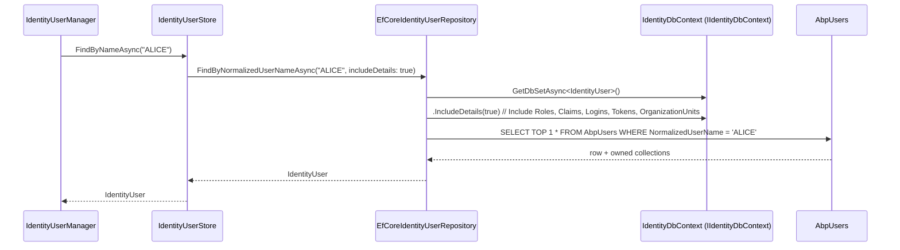

`Volo.Abp.Identity.EntityFrameworkCore` is the relational persistence implementation. It contributes:

* one `DbContext` (`IdentityDbContext`) plus a contract (`IIdentityDbContext`),
* one model-builder extension (`ConfigureIdentity()`) that maps eight aggregate roots and four owned types onto eight tables,
* seven repository implementations,
* one queryable-extension helper (`IncludeDetails`),
* and the module class that wires it all into ABP's DbContext registration pipeline.

The schema, indexes and column lengths are exhaustively documented in this page so you can write migrations confidently when you extend `IdentityUser`.

## File inventory (`Volo/Abp/Identity/EntityFrameworkCore/`)

| File | Role |
| --- | --- |
| `AbpIdentityEntityFrameworkCoreModule.cs` | Registers the DbContext + seven `AddRepository<TEntity, TRepository>` lines. |
| `IIdentityDbContext.cs` | Interface — used by `EfCoreRepository<IIdentityDbContext, …>` so multiple physical DbContexts can satisfy it. |
| `IdentityDbContext.cs` | Concrete DbContext with the seven `DbSet`s. |
| `IdentityDbContextModelBuilderExtensions.cs` | The `ConfigureIdentity()` extension that does all the mapping. |
| `IdentityEfCoreQueryableExtensions.cs` | `IncludeDetails(bool)` — eager-loads owned collections (`Roles`, `Claims`, `Logins`, `Tokens`, `OrganizationUnits`). |
| `EfCoreIdentityUserRepository.cs` | `IIdentityUserRepository`. |
| `EfCoreIdentityRoleRepository.cs` | `IIdentityRoleRepository`. |
| `EfCoreIdentityClaimTypeRepository.cs` | `IIDentityClaimTypeRepository`. |
| `EfCoreOrganizationUnitRepository.cs` | `IOrganizationUnitRepository`. |
| `EFCoreIdentitySecurityLogRepository.cs` | `IIdentitySecurityLogRepository`. |
| `EfCoreIdentityLinkUserRepository.cs` | `IIdentityLinkUserRepository`. |
| `EfCoreIdentityUserDelegationRepository.cs` | `IIdentityUserDelegationRepository`. |

## Module wiring

```csharp
[DependsOn(
    typeof(AbpIdentityDomainModule),
    typeof(AbpUsersEntityFrameworkCoreModule))]
public class AbpIdentityEntityFrameworkCoreModule : AbpModule
{
    public override void ConfigureServices(ServiceConfigurationContext context)
    {
        context.Services.AddAbpDbContext<IdentityDbContext>(options =>
        {
            options.AddRepository<IdentityUser,           EfCoreIdentityUserRepository>();
            options.AddRepository<IdentityRole,           EfCoreIdentityRoleRepository>();
            options.AddRepository<IdentityClaimType,      EfCoreIdentityClaimTypeRepository>();
            options.AddRepository<OrganizationUnit,       EfCoreOrganizationUnitRepository>();
            options.AddRepository<IdentitySecurityLog,    EFCoreIdentitySecurityLogRepository>();
            options.AddRepository<IdentityLinkUser,       EfCoreIdentityLinkUserRepository>();
            options.AddRepository<IdentityUserDelegation, EfCoreIdentityUserDelegationRepository>();
        });
    }
}
```

The dependency on `AbpUsersEntityFrameworkCoreModule` is what makes `b.ConfigureAbpUser()` available inside `ConfigureIdentity()` — that helper adds the `UserName`/`Email`/`Name`/`Surname`/`PhoneNumber` columns and their indexes.

## `IdentityDbContext`

```csharp
[ConnectionStringName(AbpIdentityDbProperties.ConnectionStringName)]   // "AbpIdentity"
public class IdentityDbContext : AbpDbContext<IdentityDbContext>, IIdentityDbContext
{
    public DbSet<IdentityUser>            Users             { get; set; }
    public DbSet<IdentityRole>            Roles             { get; set; }
    public DbSet<IdentityClaimType>       ClaimTypes        { get; set; }
    public DbSet<OrganizationUnit>        OrganizationUnits { get; set; }
    public DbSet<IdentitySecurityLog>     SecurityLogs      { get; set; }
    public DbSet<IdentityLinkUser>        LinkUsers         { get; set; }
    public DbSet<IdentityUserDelegation>  UserDelegations   { get; set; }

    public IdentityDbContext(DbContextOptions<IdentityDbContext> options) : base(options) { }

    protected override void OnModelCreating(ModelBuilder builder)
    {
        base.OnModelCreating(builder);
        builder.ConfigureIdentity();
    }
}
```

The matching interface is the type parameter on `EfCoreRepository<IIdentityDbContext, …>` so a host that replaces `IdentityDbContext` only needs to implement `IIdentityDbContext` — repositories continue to resolve.

## Schema reference

`ConfigureIdentity()` produces eight tables (the prefix `Abp` is `AbpIdentityDbProperties.DbTablePrefix`, configurable):

| Table | Aggregate / owned type | Notable columns | Notable indexes |
| --- | --- | --- | --- |
| `AbpUsers` | `IdentityUser` | `Id`, `TenantId`, `UserName`, `NormalizedUserName(256)`, `Name(64)`, `Surname(64)`, `Email`, `NormalizedEmail(256)`, `EmailConfirmed`, `PasswordHash(256)`, `SecurityStamp(256)`, `IsExternal`, `PhoneNumber(16)`, `PhoneNumberConfirmed`, `IsActive`, `TwoFactorEnabled`, `LockoutEnd`, `LockoutEnabled`, `AccessFailedCount`, `EntityVersion`, `ShouldChangePasswordOnNextLogin`, `LastPasswordChangeTime`, `ExtraProperties`, audit fields. | `NormalizedUserName`, `NormalizedEmail`, `UserName`, `Email`. |
| `AbpUserClaims` | `IdentityUserClaim` | `Id`, `UserId`, `ClaimType(256)`, `ClaimValue(1024)`. | `UserId`. |
| `AbpUserRoles` | `IdentityUserRole` | composite PK `(UserId, RoleId)`. | `(RoleId, UserId)`. |
| `AbpUserLogins` | `IdentityUserLogin` | composite PK `(UserId, LoginProvider)`, `ProviderKey`, `ProviderDisplayName`. | `(LoginProvider, ProviderKey)`. |
| `AbpUserTokens` | `IdentityUserToken` | composite PK `(UserId, LoginProvider, Name)`, `Value`. | — |
| `AbpRoles` | `IdentityRole` | `Id`, `TenantId`, `Name(256)`, `NormalizedName(256)`, `IsDefault`, `IsStatic`, `IsPublic`, `ConcurrencyStamp`, `EntityVersion`. | `NormalizedName`. |
| `AbpRoleClaims` | `IdentityRoleClaim` | `Id`, `RoleId`, `ClaimType(256)`, `ClaimValue(1024)`. | `RoleId`. |
| `AbpClaimTypes` *(host DB only)* | `IdentityClaimType` | `Id`, `Name(256)`, `Required`, `IsStatic`, `Regex(512)`, `RegexDescription(128)`, `Description(256)`, `ValueType`. | — |
| `AbpOrganizationUnits` | `OrganizationUnit` | `Id`, `TenantId`, `ParentId`, `Code(95)`, `DisplayName(128)`, `EntityVersion`, audit. | `Code`. |
| `AbpOrganizationUnitRoles` | `OrganizationUnitRole` | composite PK `(OrganizationUnitId, RoleId)`. | `(RoleId, OrganizationUnitId)`. |
| `AbpUserOrganizationUnits` | `IdentityUserOrganizationUnit` | composite PK `(OrganizationUnitId, UserId)`. | `(UserId, OrganizationUnitId)`. |
| `AbpSecurityLogs` | `IdentitySecurityLog` | `Id`, `TenantId`, `TenantName(64)`, `ApplicationName(96)`, `Identity(96)`, `Action(96)`, `UserId`, `UserName(256)`, `ClientIpAddress(64)`, `ClientId(64)`, `CorrelationId(64)`, `BrowserInfo(512)`, `CreationTime`. | `(TenantId, ApplicationName)`, `(TenantId, Identity)`, `(TenantId, Action)`, `(TenantId, UserId)`. |
| `AbpLinkUsers` *(host DB only)* | `IdentityLinkUser` | `SourceUserId`, `SourceTenantId`, `TargetUserId`, `TargetTenantId`. | unique on the four-column tuple. |
| `AbpUserDelegations` | `IdentityUserDelegation` | `SourceUserId`, `TargetUserId`, `StartTime`, `EndTime`. | — |

Two tables are wrapped in `if (builder.IsHostDatabase())`: **`AbpClaimTypes`** and **`AbpLinkUsers`**. Both are conceptually *host-scoped* (claim types apply across all tenants, link users cross tenant boundaries), so ABP excludes them from per-tenant migration DbContexts. If your deployment is single-tenant, both tables still get created — `IsHostDatabase()` returns `true` for non-multi-tenant contexts.

### `ConfigureIdentity()` excerpt — `IdentityUser`

```csharp
builder.Entity<IdentityUser>(b =>
{
    b.ToTable(AbpIdentityDbProperties.DbTablePrefix + "Users", AbpIdentityDbProperties.DbSchema);
    b.ConfigureByConvention();
    b.ConfigureAbpUser();      // from Users.EFCore — adds Name/Surname/UserName/Email columns + indexes

    b.Property(u => u.NormalizedUserName).IsRequired()
        .HasMaxLength(IdentityUserConsts.MaxNormalizedUserNameLength)
        .HasColumnName(nameof(IdentityUser.NormalizedUserName));
    b.Property(u => u.NormalizedEmail).IsRequired()
        .HasMaxLength(IdentityUserConsts.MaxNormalizedEmailLength)
        .HasColumnName(nameof(IdentityUser.NormalizedEmail));
    b.Property(u => u.PasswordHash).HasMaxLength(IdentityUserConsts.MaxPasswordHashLength);
    b.Property(u => u.SecurityStamp).IsRequired().HasMaxLength(IdentityUserConsts.MaxSecurityStampLength);
    b.Property(u => u.TwoFactorEnabled).HasDefaultValue(false);
    b.Property(u => u.LockoutEnabled).HasDefaultValue(false);
    b.Property(u => u.IsExternal).IsRequired().HasDefaultValue(false);
    b.Property(u => u.AccessFailedCount)
        .If(!builder.IsUsingOracle(), p => p.HasDefaultValue(0));

    b.HasMany(u => u.Claims)            .WithOne().HasForeignKey(uc => uc.UserId).IsRequired();
    b.HasMany(u => u.Logins)            .WithOne().HasForeignKey(ul => ul.UserId).IsRequired();
    b.HasMany(u => u.Roles)             .WithOne().HasForeignKey(ur => ur.UserId).IsRequired();
    b.HasMany(u => u.Tokens)            .WithOne().HasForeignKey(ut => ut.UserId).IsRequired();
    b.HasMany(u => u.OrganizationUnits) .WithOne().HasForeignKey(uo => uo.UserId).IsRequired();

    b.HasIndex(u => u.NormalizedUserName);
    b.HasIndex(u => u.NormalizedEmail);
    b.HasIndex(u => u.UserName);
    b.HasIndex(u => u.Email);

    b.ApplyObjectExtensionMappings();
});
```

The `b.ApplyObjectExtensionMappings()` call at the end of every entity block is what makes object-extension properties materialize as real columns when registered with `.ConfigureUser(u => u.AddOrUpdateProperty<T>("X", x => x.MapEfCore(prop => prop.HasColumnName("X"))))`.

## Repositories

### `EfCoreIdentityUserRepository`

Implements the wide surface declared by `IIdentityUserRepository`. The two methods that are easy to misread are `GetRoleNamesAsync` and `GetListAsync`.

```csharp
public virtual async Task<List<string>> GetRoleNamesAsync(Guid id, CancellationToken ct = default)
{
    var db = await GetDbContextAsync();

    // 1) directly assigned roles
    var directNames =
        from ur in db.Set<IdentityUserRole>()
        join r in db.Roles on ur.RoleId equals r.Id
        where ur.UserId == id
        select r.Name;

    // 2) roles inherited through OU memberships
    var ouIds   = db.Set<IdentityUserOrganizationUnit>().Where(q => q.UserId == id)
                                                       .Select(q => q.OrganizationUnitId).ToArray();
    var ouRoleIds = await (
        from our in db.Set<OrganizationUnitRole>()
        join ou  in db.Set<OrganizationUnit>()  on our.OrganizationUnitId equals ou.Id
        where ouIds.Contains(our.OrganizationUnitId)
        select our.RoleId).ToListAsync(GetCancellationToken(ct));
    var inheritedNames = db.Roles.Where(r => ouRoleIds.Contains(r.Id)).Select(r => r.Name);

    return await directNames.Union(inheritedNames).ToListAsync(GetCancellationToken(ct));
}
```

This is the one place the OU model *fans out* role membership. The companion `GetRoleNamesInOrganizationUnitAsync` returns *only* the inherited names so callers can attribute a role to a direct assignment vs. an OU.

`GetListAsync` accepts a 17-parameter filter surface (lockout state, email-confirmed, role id, OU id, creation/modification time ranges, …) — far wider than `GetIdentityUsersInput` exposes. Subclass the app service if you need to surface them.

### `EfCoreIdentityRoleRepository`

Implements `FindByNormalizedNameAsync`, `GetListWithUserCountAsync`, `GetDefaultOnesAsync`, paged `GetListAsync(filter)` and id-list `GetListAsync(ids)`.

### `EfCoreOrganizationUnitRepository`

Adds `GetListAsync(parentId)`, `GetChildrenAsync(parentCode, recursive)`, `GetRolesAsync(ou)`, `GetUsersInOrganizationUnitAsync(ouId)`, `GetUsersInOrganizationUnitWithChildrenAsync(code)` — the last two are the workhorses behind the admin UI's "Members" tab.

## Sequence: `FindByNormalizedUserNameAsync`



The `IncludeDetails(true)` chain costs one round trip with five `LEFT JOIN`s — `FindByIdAsync(includeDetails: false)` (used by the `[Authorize]` middleware's session-validator) takes only the user row.

## Performance notes

| Operation | Round trips | Notes |
| --- | --- | --- |
| `FindByNormalizedUserNameAsync(true)` | 1 | Five `LEFT JOIN`s — only used on login or full edit. |
| `FindByIdAsync(includeDetails: false)` | 1 | Single row; used by every authenticated request. |
| `GetListAsync(sorting, filter, ...)` | 2 | Count + page (no eager loading by default). |
| `GetRoleNamesAsync` | 2-3 | One materialized array for OU ids, one join for OU roles, one `UNION`. |
| `GetListByNormalizedRoleNameAsync` | 1 | Filtered join through `AbpUserRoles`. |

If you eagerly load `Users.Include(u => u.Roles)` in custom queries, run the resulting query against `AbpUserRoles` directly when possible — the join cardinality grows quickly when a user has many role assignments.

## Gotchas

<Warning>
**`b.HasMany(u => u.OrganizationUnits)` is a join entity, not a navigation to `OrganizationUnit`.** The `OrganizationUnits` collection on `IdentityUser` is `ICollection<IdentityUserOrganizationUnit>`. EF Core projections like `Users.Include(u => u.OrganizationUnits).ThenInclude(uo => uo.OrganizationUnit)` will fail — there is no such navigation. Use `EfCoreIdentityUserRepository.GetOrganizationUnitsAsync(user)` or join through `db.Set<OrganizationUnit>()` manually.
</Warning>

<Warning>
**`AbpClaimTypes` and `AbpLinkUsers` are skipped on tenant DbContexts.** Calling `IIDentityClaimTypeRepository.GetListAsync()` from inside `using (CurrentTenant.Change(tenantId))` would return rows from the *host* db connection because the entities are mapped only in the host DbContext. Read claim types *outside* the tenant scope (the framework's `ICurrentTenant.Change(null)`).
</Warning>

<Warning>
**`HasMany<OrganizationUnit>().WithOne().HasForeignKey(ou => ou.ParentId)` is a self-reference with no on-delete cascade.** When you delete an OU through the manager, the manager hard-deletes children one by one to fire their domain events. If you bypass the manager and call `IOrganizationUnitRepository.DeleteAsync(parent)` directly, the children become orphaned (FK violation on SQL Server, dangling references on PostgreSQL).
</Warning>

<Tip>
The `[ConnectionStringName("AbpIdentity")]` attribute lets you point Identity at a different physical database by adding `"AbpIdentity": "Server=..."` to your `ConnectionStrings` section. The default fallback is `"Default"`. This is how monolithic apps split Identity into its own database without code changes.
</Tip>

## Cross-links

<CardGroup cols={2}>
<Card title="Domain" icon="diagram-project" href="/modules/identity/domain">
The aggregates and repository contracts this layer implements.
</Card>
<Card title="MongoDB" icon="leaf" href="/modules/identity/mongodb">
The alternative persistence implementation.
</Card>
<Card title="Users.EFCore" icon="user" href="/modules/identity/users-domain">
`ConfigureAbpUser()` — the shared EF Core fragment.
</Card>
<Card title="Framework: EF Core" icon="database" href="/framework/data/entity-framework-core/overview">
`AbpDbContext`, `IncludeDetails`, repository registration.
</Card>
</CardGroup>
