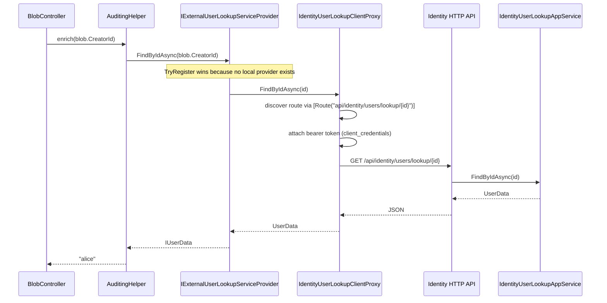

`Volo.Abp.Identity.HttpApi.Client` is the *consumer-side* of the REST surface. It generates one client proxy per app-service interface, plus two cross-service helpers — `HttpClientExternalUserLookupServiceProvider` and `HttpClientUserRoleFinder` — that bridge `Volo.Abp.Users.Abstractions` and `Volo.Abp.Identity.Application.Contracts.Integration` to a remote Identity host.

Reference this package from any *consumer* of the Identity HTTP API: Blazor WebAssembly, .NET MAUI, a non-Identity microservice that needs to look up usernames, a console app that automates user provisioning. With this package referenced, resolving `IIdentityUserAppService` from your DI container returns a proxy that speaks HTTP to the remote `RemoteServices:AbpIdentity:BaseUrl` rather than executing locally.

## File inventory

| File | Role |
| --- | --- |
| `AbpIdentityHttpApiClientModule.cs` | DependsOn(`AbpIdentityApplicationContractsModule`, `AbpHttpClientModule`). Registers static client proxies via `AddStaticHttpClientProxies(typeof(AbpIdentityApplicationContractsModule).Assembly, "AbpIdentity")`. |
| `HttpClientExternalUserLookupServiceProvider.cs` | `IExternalUserLookupServiceProvider` implementation against `IIdentityUserLookupAppService`. |
| `HttpClientUserRoleFinder.cs` | `IUserRoleFinder` implementation against `IIdentityUserIntegrationService`. |
| `IdentityUserDtoExtensions.cs` | `IdentityUserDto.ToUserInfo()` → `IUserData`. |
| `ClientProxies/Volo/Abp/Identity/IdentityUserClientProxy.Generated.cs` + `.cs` | Generated and partial-class extension of the proxy for `IIdentityUserAppService`. |
| `ClientProxies/Volo/Abp/Identity/IdentityRoleClientProxy.Generated.cs` + `.cs` | For `IIdentityRoleAppService`. |
| `ClientProxies/Volo/Abp/Identity/IdentityUserLookupClientProxy.Generated.cs` + `.cs` | For `IIdentityUserLookupAppService`. |
| `ClientProxies/Volo/Abp/Identity/Integration/IdentityUserIntegrationClientProxy.Generated.cs` + `.cs` | For `IIdentityUserIntegrationService`. |

## Module wiring

```csharp
[DependsOn(typeof(AbpIdentityApplicationContractsModule), typeof(AbpHttpClientModule))]
public class AbpIdentityHttpApiClientModule : AbpModule
{
    public override void ConfigureServices(ServiceConfigurationContext context)
    {
        context.Services.AddStaticHttpClientProxies(
            typeof(AbpIdentityApplicationContractsModule).Assembly,
            IdentityRemoteServiceConsts.RemoteServiceName);  // "AbpIdentity"

        Configure<AbpVirtualFileSystemOptions>(options =>
        {
            options.FileSets.AddEmbedded<AbpIdentityHttpApiClientModule>();
        });
    }
}
```

`AddStaticHttpClientProxies` walks every interface decorated with `[RemoteService]`, `[Route]` or `[HttpGet]/[HttpPost]/...` and registers the *generated* client proxy under that interface, with `[Dependency(ReplaceServices = true)]`. After this call, `IServiceProvider.GetRequiredService<IIdentityUserAppService>()` returns `IdentityUserClientProxy`, not the real app service — even if both assemblies are loaded.

The remote service base URL comes from configuration:

```json
{
  "RemoteServices": {
    "AbpIdentity": { "BaseUrl": "https://identity.contoso.com/" },
    "Default":     { "BaseUrl": "https://api.contoso.com/" }
  }
}
```

If no `AbpIdentity` entry exists, the proxy falls back to `Default`.

## The generated proxy pattern

```csharp
[Dependency(ReplaceServices = true)]
[ExposeServices(typeof(IIdentityUserAppService), typeof(IdentityUserClientProxy))]
public partial class IdentityUserClientProxy : ClientProxyBase<IIdentityUserAppService>, IIdentityUserAppService
{
    public virtual async Task<IdentityUserDto> GetAsync(Guid id)
    {
        return await RequestAsync<IdentityUserDto>(nameof(GetAsync), new ClientProxyRequestTypeValue
        {
            { typeof(Guid), id }
        });
    }

    public virtual async Task<PagedResultDto<IdentityUserDto>> GetListAsync(GetIdentityUsersInput input)
    {
        return await RequestAsync<PagedResultDto<IdentityUserDto>>(nameof(GetListAsync), new ClientProxyRequestTypeValue
        {
            { typeof(GetIdentityUsersInput), input }
        });
    }

    public virtual async Task<IdentityUserDto> CreateAsync(IdentityUserCreateDto input) { /* ... */ }
    public virtual async Task<IdentityUserDto> UpdateAsync(Guid id, IdentityUserUpdateDto input) { /* ... */ }
    public virtual async Task                  DeleteAsync(Guid id) { /* ... */ }
    public virtual async Task<ListResultDto<IdentityRoleDto>> GetRolesAsync(Guid id) { /* ... */ }
    public virtual async Task<ListResultDto<IdentityRoleDto>> GetAssignableRolesAsync() { /* ... */ }
    public virtual async Task                  UpdateRolesAsync(Guid id, IdentityUserUpdateRolesDto input) { /* ... */ }
    public virtual async Task<IdentityUserDto> FindByUsernameAsync(string userName) { /* ... */ }
    public virtual async Task<IdentityUserDto> FindByEmailAsync(string email) { /* ... */ }
}
```

The non-generated companion file is the *partial class extension point* — drop overrides there to customize header injection, retry, or response post-processing without losing them when the proxy is regenerated.

`ClientProxyBase<TInterface>` (from `Volo.Abp.Http.Client.ClientProxying`) handles:
* discovering the controller route from the interface method's `[Route]`/`[HttpGet]`/etc. via `IApiDescriptionFinder`;
* serializing arguments into path/query/body;
* applying `IHttpClientAuthenticator` (e.g. bearer token) before the call;
* deserializing the response into the typed return value;
* surfacing the `RemoteServiceErrorResponse` envelope as an `AbpRemoteCallException`.

## `HttpClientExternalUserLookupServiceProvider`

```csharp
[Dependency(TryRegister = true)]
public class HttpClientExternalUserLookupServiceProvider
    : IExternalUserLookupServiceProvider, ITransientDependency
{
    protected IIdentityUserLookupAppService UserLookupAppService { get; }

    public HttpClientExternalUserLookupServiceProvider(IIdentityUserLookupAppService userLookupAppService)
        => UserLookupAppService = userLookupAppService;

    public virtual async Task<IUserData> FindByIdAsync(Guid id, CancellationToken ct = default)
        => await UserLookupAppService.FindByIdAsync(id);

    public virtual async Task<IUserData> FindByUserNameAsync(string userName, CancellationToken ct = default)
        => await UserLookupAppService.FindByUserNameAsync(userName);

    public async Task<List<IUserData>> SearchAsync(
        string sorting = null, string filter = null,
        int maxResultCount = int.MaxValue, int skipCount = 0,
        CancellationToken cancellationToken = default)
    {
        var result = await UserLookupAppService.SearchAsync(new UserLookupSearchInputDto
        {
            Sorting = sorting, Filter = filter,
            MaxResultCount = maxResultCount, SkipCount = skipCount
        });
        return result.Items.Cast<IUserData>().ToList();
    }

    public async Task<long> GetCountAsync(string filter = null, CancellationToken ct = default)
        => await UserLookupAppService.GetCountAsync(new UserLookupCountInputDto { Filter = filter });
}
```

`[Dependency(TryRegister = true)]` means the registration is skipped if another `IExternalUserLookupServiceProvider` is already in DI — e.g. the in-process `IdentityUserRepositoryExternalUserLookupServiceProvider` registered by `Volo.Abp.Identity.Domain`. So a microservice that depends on *both* Identity.Domain and Identity.HttpApi.Client uses the local repository, while a microservice that depends only on Identity.HttpApi.Client uses the HTTP proxy. **This is the central behavior that lets `Volo.Abp.Users.Abstractions` "just work" in both monolith and microservice deployments.**

## `HttpClientUserRoleFinder`

```csharp
[Dependency(TryRegister = true)]
public class HttpClientUserRoleFinder : IUserRoleFinder, ITransientDependency
{
    protected IIdentityUserAppService            _userAppService;
    protected IIdentityUserIntegrationService    _userIntegrationService;

    public HttpClientUserRoleFinder(
        IIdentityUserAppService userAppService,
        IIdentityUserIntegrationService userIntegrationService)
    {
        _userAppService = userAppService;
        _userIntegrationService = userIntegrationService;
    }

    [Obsolete("Use GetRoleNamesAsync instead.")]
    public virtual async Task<string[]> GetRolesAsync(Guid userId)
    {
        var output = await _userAppService.GetRolesAsync(userId);
        return output.Items.Select(r => r.Name).ToArray();
    }

    public async Task<string[]> GetRoleNamesAsync(Guid userId)
        => await _userIntegrationService.GetRoleNamesAsync(userId);
}
```

The non-obsolete `GetRoleNamesAsync` uses the integration endpoint (`/integration-api/identity/users/{id}/role-names`) which does *not* require `AbpIdentity.Users` — perfect for token-issuance code paths where the caller is not impersonating an end user.

## `IdentityUserDtoExtensions`

A tiny `.ToUserInfo()` adapter to project `IdentityUserDto` (the management DTO) into `IUserData` (the cross-service contract). Used when client code received an `IdentityUserDto` from `GetAsync` and wants to forward it to a non-Identity-aware downstream:

```csharp
public static IUserData ToUserInfo(this IdentityUserDto user)
{
    return new UserData(
        user.Id, user.UserName, user.Email, user.Name, user.Surname,
        user.EmailConfirmed, user.PhoneNumber, user.PhoneNumberConfirmed, user.TenantId);
}
```

## Sequence: BLOB Storing wants to display a user's name

A BLOB Storing host has *no* Identity tables. It needs to render "Created by `alice`" on every BLOB record. With `Volo.Abp.Identity.HttpApi.Client` referenced:



## Configuring the proxy

```csharp
// In your host's Program.cs / Module.ConfigureServices:
context.Services.AddHttpClientProxies(
    typeof(AbpIdentityApplicationContractsModule).Assembly,
    remoteServiceConfigurationName: IdentityRemoteServiceConsts.RemoteServiceName);

// And configure the bearer token / client credentials flow:
context.Services.AddIdentityModelAuthentication("Bearer", options =>
{
    options.Authority = "https://auth.contoso.com";
    options.ApiName   = "Identity";
    options.RequireHttpsMetadata = true;
});
```

The client proxy participates in `IHttpClientAuthenticator` — if `AddIdentityModelAuthentication` is registered, the proxy automatically attaches the cached client-credentials token to outgoing requests.

## Gotchas

<Warning>
**Static proxies require regeneration when DTOs change.** The proxy serializes via `ClientProxyRequestTypeValue`, which captures the parameter *types*. If you add a property to `IdentityUserCreateDto` and only ship the new HttpApi.Client without rebuilding the consumer, the consumer's serializer silently drops the field. Always rebuild every consumer after upgrading.
</Warning>

<Warning>
**Mixing local + HTTP proxies in the same host is rarely what you want.** If your host references both `Volo.Abp.Identity.Application` *and* `Volo.Abp.Identity.HttpApi.Client`, the proxy registration runs *last* and replaces the local implementation — so even in-process Identity calls go through HTTP. To keep local calls local, do not reference HttpApi.Client; instead expose the contract through `IIdentityUserAppService` only and let DI resolve to the real service.
</Warning>

<Warning>
**`IUserRoleFinder.GetRolesAsync` is `[Obsolete]`** but still callable. It hits `/api/identity/users/{id}/roles` (which requires `AbpIdentity.Users`) and returns full `IdentityRoleDto`s. Use `GetRoleNamesAsync` (integration endpoint) instead — it requires no end-user permission and returns just the names you need for token issuance.
</Warning>

<Tip>
The `[Dependency(TryRegister = true)]` on `HttpClientExternalUserLookupServiceProvider` is what lets a *test host* register an `InMemoryUserLookupServiceProvider` first and have the HTTP proxy stay out of the way. Use the same pattern in your integration tests.
</Tip>

## Cross-links

<CardGroup cols={2}>
<Card title="HTTP API" icon="globe" href="/modules/identity/http-api">
The REST surface these proxies call into.
</Card>
<Card title="Users.Abstractions" icon="user" href="/modules/identity/users-abstractions">
`IExternalUserLookupServiceProvider`, `IUserData`, `UserData`.
</Card>
<Card title="Application Contracts" icon="file-contract" href="/modules/identity/application-contracts">
Interfaces the proxies implement.
</Card>
<Card title="Framework: Static Proxies" icon="plug" href="/framework/api-development/static-c-sharp-api-client">
How `AddStaticHttpClientProxies` works.
</Card>
</CardGroup>
