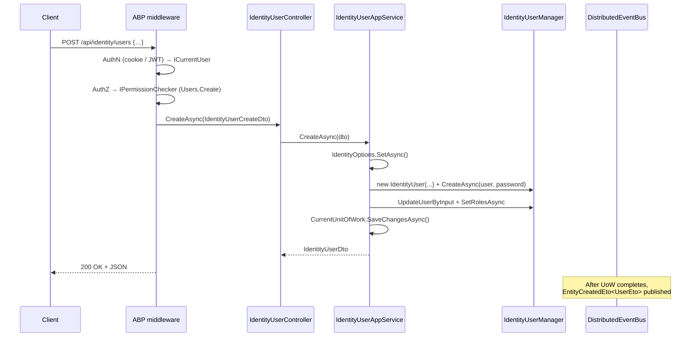

`Volo.Abp.Identity.HttpApi` is the *REST surface* of the Identity module. It has no business logic — every controller is a thin pass-through to the matching `IIdentity*AppService` interface, decorated with `[RemoteService]`, `[Area("identity")]` and explicit `[Route("api/identity/…")]` attributes so the routes are stable even if you turn off ABP's convention-based controller discovery.

Reference this package from your *HTTP host* (Web, API, BFF). The Blazor and Razor Pages UI talks to these controllers through the [HTTP API Client](/modules/identity/http-api-client) proxies.

## File inventory (`Volo/Abp/Identity/`)

| File | Route prefix | Implements |
| --- | --- | --- |
| `AbpIdentityHttpApiModule.cs` | — | `DependsOn(AbpIdentityApplicationContractsModule, AbpAspNetCoreMvcModule)`; embeds `IdentityResource` localization. |
| `IdentityUserController.cs` | `/api/identity/users` | `IIdentityUserAppService` |
| `IdentityRoleController.cs` | `/api/identity/roles` | `IIdentityRoleAppService` |
| `IdentityUserLookupController.cs` | `/api/identity/users/lookup` | `IIdentityUserLookupAppService` |
| `Integration/IdentityUserIntegrationController.cs` | `/integration-api/identity/users` | `IIdentityUserIntegrationService` |

## Module wiring

```csharp
[DependsOn(typeof(AbpIdentityApplicationContractsModule), typeof(AbpAspNetCoreMvcModule))]
public class AbpIdentityHttpApiModule : AbpModule
{
    public override void PreConfigureServices(ServiceConfigurationContext context)
    {
        PreConfigure<IMvcBuilder>(b =>
        {
            b.AddApplicationPartIfNotExists(typeof(AbpIdentityHttpApiModule).Assembly);
        });
    }

    public override void ConfigureServices(ServiceConfigurationContext context)
    {
        Configure<AbpLocalizationOptions>(options =>
        {
            options.Resources
                .Get<IdentityResource>()
                .AddBaseTypes(typeof(AbpUiResource));
        });
    }
}
```

`AddApplicationPartIfNotExists` is what makes the four controllers in this assembly discoverable when the host's `Program.cs` only registers ABP modules (no `services.AddControllers()` against this assembly). Folding `AbpUiResource` into `IdentityResource` is what makes `L["Permission:Delete"]` resolve in the Identity Razor views.

## Endpoint reference

### Users — `/api/identity/users`

| Verb | Route | App-service method | Permission |
| --- | --- | --- | --- |
| `GET` | `/api/identity/users` | `GetListAsync(GetIdentityUsersInput)` | `AbpIdentity.Users` |
| `GET` | `/api/identity/users/{id}` | `GetAsync(Guid)` | `AbpIdentity.Users` |
| `POST` | `/api/identity/users` | `CreateAsync(IdentityUserCreateDto)` | `AbpIdentity.Users.Create` |
| `PUT` | `/api/identity/users/{id}` | `UpdateAsync(Guid, IdentityUserUpdateDto)` | `AbpIdentity.Users.Update` |
| `DELETE` | `/api/identity/users/{id}` | `DeleteAsync(Guid)` | `AbpIdentity.Users.Delete` |
| `GET` | `/api/identity/users/{id}/roles` | `GetRolesAsync(Guid)` | `AbpIdentity.Users` |
| `GET` | `/api/identity/users/assignable-roles` | `GetAssignableRolesAsync()` | `AbpIdentity.Users` |
| `PUT` | `/api/identity/users/{id}/roles` | `UpdateRolesAsync(Guid, IdentityUserUpdateRolesDto)` | `AbpIdentity.Users.Update` |
| `GET` | `/api/identity/users/by-username/{userName}` | `FindByUsernameAsync(string)` | `AbpIdentity.Users` |
| `GET` | `/api/identity/users/by-email/{email}` | `FindByEmailAsync(string)` | `AbpIdentity.Users` |

```csharp
[RemoteService(Name = IdentityRemoteServiceConsts.RemoteServiceName)]
[Area(IdentityRemoteServiceConsts.ModuleName)]
[ControllerName("User")]
[Route("api/identity/users")]
public class IdentityUserController : AbpControllerBase, IIdentityUserAppService
{
    protected IIdentityUserAppService UserAppService { get; }

    public IdentityUserController(IIdentityUserAppService userAppService) => UserAppService = userAppService;

    [HttpGet, Route("{id}")]
    public virtual Task<IdentityUserDto> GetAsync(Guid id) => UserAppService.GetAsync(id);

    [HttpPost]
    public virtual Task<IdentityUserDto> CreateAsync(IdentityUserCreateDto input)
        => UserAppService.CreateAsync(input);

    // ... 8 more methods, all one-line forwards ...
}
```

### Roles — `/api/identity/roles`

| Verb | Route | Method | Permission |
| --- | --- | --- | --- |
| `GET` | `/api/identity/roles` | `GetListAsync(GetIdentityRolesInput)` | `AbpIdentity.Roles` |
| `GET` | `/api/identity/roles/all` | `GetAllListAsync()` | `AbpIdentity.Roles` |
| `GET` | `/api/identity/roles/{id}` | `GetAsync(Guid)` | `AbpIdentity.Roles` |
| `POST` | `/api/identity/roles` | `CreateAsync(IdentityRoleCreateDto)` | `AbpIdentity.Roles.Create` |
| `PUT` | `/api/identity/roles/{id}` | `UpdateAsync(Guid, IdentityRoleUpdateDto)` | `AbpIdentity.Roles.Update` |
| `DELETE` | `/api/identity/roles/{id}` | `DeleteAsync(Guid)` | `AbpIdentity.Roles.Delete` |

### User Lookup — `/api/identity/users/lookup`

| Verb | Route | Method | Permission |
| --- | --- | --- | --- |
| `GET` | `/api/identity/users/lookup/{id}` | `FindByIdAsync(Guid)` | `AbpIdentity.UserLookup` (client only) |
| `GET` | `/api/identity/users/lookup/by-username/{userName}` | `FindByUserNameAsync(string)` | `AbpIdentity.UserLookup` (client only) |
| `GET` | `/api/identity/users/lookup/search` | `SearchAsync(UserLookupSearchInputDto)` | `AbpIdentity.UserLookup` (client only) |
| `GET` | `/api/identity/users/lookup/count` | `GetCountAsync(UserLookupCountInputDto)` | `AbpIdentity.UserLookup` (client only) |

The `(client only)` qualifier matters: the permission is registered with `ClientPermissionValueProvider.ProviderName`, so only an M2M (client-credentials) token with that scope can call these endpoints — end users cannot. This is the surface other ABP microservices hit through `HttpClientExternalUserLookupServiceProvider`.

### Integration — `/integration-api/identity/users`

| Verb | Route | Method |
| --- | --- | --- |
| `GET` | `/integration-api/identity/users/{id}/role-names` | `GetRoleNamesAsync(Guid)` |

The `integration-api` prefix is reserved for `[IntegrationService]` endpoints — these are excluded from the public Swagger document by default and have a separate authentication policy (typically a shared secret or mutual TLS, configured at host level).

## Sequence: `POST /api/identity/users`



## How `[RemoteService]` interacts with auto-API

The Identity controllers declare `[RemoteService(Name = "AbpIdentity")]` *and* explicit `[Route]`s. This is the *non-conventional* style — the routes are pinned regardless of `AbpConventionalControllerOptions`. That choice has two consequences:

1. **Renaming the controllers or moving them to a different namespace does not change the route.** Existing client proxies keep working.
2. **The auto-API client proxy generator** (`abp generate-proxy`) reads `[RemoteService.Name]` to pick which controllers it scans, and uses the action signature on the interface (`IIdentityUserAppService`) — not the controller — to generate type-safe client code.

If you build a custom controller that also implements `IIdentityUserAppService` (for example a v2 with extra fields), give it the same `[RemoteService(Name = "AbpIdentity")]` so client proxies continue to discover it.

## CORS, antiforgery and content-negotiation

* The default content type is `application/json`. `multipart/form-data` is not supported on these endpoints — extension properties are nested objects within the JSON body, not form fields.
* Antiforgery is **on** for state-changing endpoints when called from a cookie session. Blazor Server and Razor Pages handle the token automatically; pure SPAs using cookie auth must include `RequestVerificationToken`.
* `OPTIONS` preflight is handled by ABP's default CORS configuration. Identity itself does not add origins.

## Error response shape

All endpoints share the framework's `RemoteServiceErrorResponse` envelope:

```json
HTTP/1.1 400 Bad Request
{
  "error": {
    "code": "Volo.Abp.Identity:010003",
    "message": "Password cannot be changed for external users",
    "details": null,
    "data": { "UserName": "alice" }
  }
}
```

The `code` matches a constant in `IdentityErrorCodes`; the `message` is resolved from `IdentityResource` for the current culture. Status codes follow ABP defaults:

| Outcome | Status | Body code |
| --- | --- | --- |
| Validation failure | `400` | `Volo.Abp.Validation:<...>` |
| Business rule (e.g. `UserSelfDeletion`) | `400` | `Volo.Abp.Identity:0100xx` |
| Not authenticated | `401` | — |
| Not authorized | `403` | `Volo.Abp.Authorization:010001` |
| Aggregate not found (`EntityNotFoundException`) | `404` | `Volo.Abp.Domain:010005` |
| Concurrency mismatch | `409` | `Volo.Abp.Domain.Entities:010003` |

## Gotchas

<Warning>
**`/api/identity/users/lookup/by-username/{userName}` will reject usernames containing a forward slash** unless you URL-encode them. ABP's route templates use the default ASP.NET Core constraint `{userName}` which forbids `/`. If your usernames are emails containing a `+`, encode the entire segment (`john%2Bwork%40example.com`).
</Warning>

<Warning>
**`PUT /api/identity/users/{id}` requires `ConcurrencyStamp`.** If the client omits it, the update succeeds *but* `EntityVersion` is not bumped, which can cause stale-data overwrites under concurrent edits. The Blazor and Razor admin UIs always echo the stamp from the most recent `GET`; if you build a custom client, do the same.
</Warning>

<Warning>
**The integration endpoint (`/integration-api/identity/users/{id}/role-names`) does not check `AbpIdentity.UserLookup`.** It is gated only by whatever authentication scheme the host pins on the `integration-api` route. If you expose this route on the open internet, *add* an explicit `[Authorize(Policy = …)]` of your own — the default `[IntegrationService]` attribute does not.
</Warning>

<Tip>
The `[Area("identity")]` attribute means routes are technically discoverable as `/identity/api/identity/users` if your host's routing template is `{area}/{controller}/{action}`. The explicit `[Route("api/identity/users")]` overrides this for HTTP, but Swagger groups the endpoints under the `identity` area so the generated docs read naturally.
</Tip>

## Cross-links

<CardGroup cols={2}>
<Card title="Application" icon="gears" href="/modules/identity/application">
The app-service implementations these controllers forward to.
</Card>
<Card title="HTTP API Client" icon="plug" href="/modules/identity/http-api-client">
The generated client proxies that consume these endpoints.
</Card>
<Card title="Application Contracts" icon="file-contract" href="/modules/identity/application-contracts">
DTOs and permission constants referenced in route bodies.
</Card>
<Card title="Framework: HTTP API" icon="globe" href="/framework/api-development/auto-controllers">
How `[RemoteService]` turns into route discovery.
</Card>
</CardGroup>
