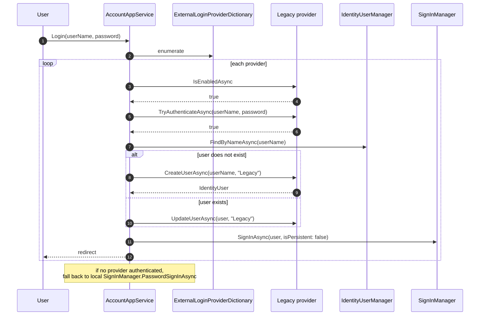

The open-source Identity module is intentionally *extensible without subclassing*. The same seams — `IExternalLoginProvider`, `IdentitySecurityLogManager`, the `ObjectExtensionManager` configuration helpers, and the `IdentityModuleExtensionConsts` keys — are what ABP Commercial's `Identity.Pro` package, the LDAP integration package and the security-log explorer all build on. This page documents those extension points so you can layer Pro-grade behavior (or your own equivalent) onto a community-edition host without reinventing the integration glue.

The page deliberately does *not* introduce non-existent Pro types — every API shown here lives in the open-source `Volo.Abp.Identity.Domain` / `Volo.Abp.Identity.Domain.Shared` assemblies. Cross-link to the matching Pro docs for the licensed extras (multi-factor, advanced security logs, OU permissions, user impersonation UI).

## File inventory (extension surface)

| File | Located in | What it exposes |
| --- | --- | --- |
| `IExternalLoginProvider.cs` | `Volo.Abp.Identity.Domain` | Pluggable login backend (LDAP, legacy DB, SSO). |
| `IExternalLoginProviderWithPassword.cs` | `Volo.Abp.Identity.Domain` | Variant that owns password change too. |
| `ExternalLoginProviderBase.cs` | `Volo.Abp.Identity.Domain` | Turn-key base — implement `GetUserInfoAsync` only. |
| `ExternalLoginProviderWithPasswordBase.cs` | `Volo.Abp.Identity.Domain` | Base for the password-owning variant. |
| `ExternalLoginProviderDictionary.cs` | `Volo.Abp.Identity.Domain` | The registration list inside `AbpIdentityOptions`. |
| `ExternalLoginProviderInfo.cs` | `Volo.Abp.Identity.Domain` | Pair of (`name`, provider `Type`). |
| `ExternalLoginUserInfo.cs` | `Volo.Abp.Identity.Domain` | DTO carried back from the backend. |
| `AbpIdentityOptions.cs` | `Volo.Abp.Identity.Domain` | Options bag that holds `ExternalLoginProviders`. |
| `IdentitySecurityLogManager.cs` | `Volo.Abp.Identity.Domain` | `SaveAsync(IdentitySecurityLogContext)` — the audit log writer. |
| `IdentitySecurityLogContext.cs` | `Volo.Abp.Identity.Domain` | Carries `Identity`, `Action`, `UserName`, `ClientId`, extras. |
| `IdentityModuleExtensionConsts.cs` | `Volo.Abp.Identity.Domain.Shared` | Module name + entity names for `ObjectExtensionManager`. |
| `IdentityModuleExtensionConfiguration.cs` + `…DictionaryExtensions.cs` | `Volo.Abp.Identity.Domain.Shared` | Fluent `ConfigureIdentity(...)` helper. |
| `IUserRoleFinder.cs` | `Volo.Abp.Identity.Domain.Shared` | Minimal `string[] GetRoleNamesAsync(Guid)` contract. |

## Extension point 1: external login providers

`IExternalLoginProvider` lets you authenticate a user against an *external authority* (LDAP, an old SQL database, a federated identity store, an HR system) *before* the user exists in `AbpUsers`. The interface:

```csharp
public interface IExternalLoginProvider
{
    Task<bool>          TryAuthenticateAsync(string userName, string plainPassword);
    Task<IdentityUser>  CreateUserAsync(string userName, string providerName);
    Task                UpdateUserAsync(IdentityUser user, string providerName);
    Task<bool>          IsEnabledAsync();
}
```

The companion `IExternalLoginProviderWithPassword` extends it with password lifecycle:

```csharp
public interface IExternalLoginProviderWithPassword
{
    bool CanObtainUserInfoWithoutPassword { get; }
    Task<IdentityUser> CreateUserAsync(string userName, string providerName, string plainPassword);
    Task               UpdateUserAsync(IdentityUser user, string providerName, string plainPassword);
}
```

The Account module's `AccountAppService.LoginAsync` walks every registered provider on every login attempt, then falls back to local `SignInManager.PasswordSignInAsync`. This is exactly the seam the Pro LDAP integration uses.

### Implementing a provider

`ExternalLoginProviderBase` does the heavy lifting — you only need to supply `TryAuthenticateAsync`, `IsEnabledAsync` and `GetUserInfoAsync(userName)`:

```csharp
public class LegacySqlExternalLoginProvider : ExternalLoginProviderBase
{
    private readonly ILegacyUserApi _legacy;

    public LegacySqlExternalLoginProvider(
        IGuidGenerator guidGenerator,
        ICurrentTenant currentTenant,
        IdentityUserManager userManager,
        IIdentityUserRepository identityUserRepository,
        IOptions<IdentityOptions> identityOptions,
        ILegacyUserApi legacy)
        : base(guidGenerator, currentTenant, userManager, identityUserRepository, identityOptions)
        => _legacy = legacy;

    public override async Task<bool> IsEnabledAsync()
        => await _legacy.IsBackendUpAsync();

    public override async Task<bool> TryAuthenticateAsync(string userName, string plainPassword)
        => await _legacy.AuthenticateAsync(userName, plainPassword);

    protected override async Task<ExternalLoginUserInfo> GetUserInfoAsync(string userName)
    {
        var profile = await _legacy.GetProfileAsync(userName)
            ?? throw new BusinessException("LegacyUserNotFound");

        return new ExternalLoginUserInfo(profile.Email)
        {
            Name           = profile.FirstName,
            Surname        = profile.LastName,
            PhoneNumber    = profile.PhoneNumber,
            EmailConfirmed = true,
            ProviderKey    = profile.Id.ToString()
        };
    }
}
```

`ExternalLoginUserInfo.Email` is mandatory (`Check.NotNullOrWhiteSpace`); `ProviderKey` defaults to the user name if you leave it null. The base class normalizes the rest:

```csharp
// from ExternalLoginProviderBase.CreateUserAsync — simplified
user.IsExternal = true;
user.SetEmailConfirmed(externalUser.EmailConfirmed ?? false);
user.SetPhoneNumber(externalUser.PhoneNumber, externalUser.PhoneNumberConfirmed ?? false);
(await UserManager.CreateAsync(user)).CheckErrors();
(await UserManager.AddDefaultRolesAsync(user)).CheckErrors();
(await UserManager.AddLoginAsync(user, new UserLoginInfo(providerName, externalUser.ProviderKey, providerName))).CheckErrors();
```

So new external users are flagged `IsExternal = true` (which then prevents local password changes via `IdentityErrorCodes.ExternalUserPasswordChange`) and receive the `IsDefault` role automatically.

### Registering a provider

```csharp
public override void ConfigureServices(ServiceConfigurationContext context)
{
    Configure<AbpIdentityOptions>(o =>
    {
        o.ExternalLoginProviders.Add<LegacySqlExternalLoginProvider>("Legacy");
        o.ExternalLoginProviders.Add<LdapExternalLoginProvider>("LDAP");
    });
}
```

The string name is what `AccountAppService` records as the `ProviderName` on the resulting `IdentityUserLogin` row, so users can re-authenticate by the same provider on subsequent logins.

### Login flow with external providers



## Extension point 2: `IdentitySecurityLogManager`

`IdentitySecurityLogManager.SaveAsync(IdentitySecurityLogContext)` is the writer. Customize it by subclassing — `[Dependency(ReplaceServices = true)]` is the idiomatic registration:

```csharp
[Dependency(ReplaceServices = true)]
[ExposeServices(typeof(IdentitySecurityLogManager))]
public class EnrichedSecurityLogManager : IdentitySecurityLogManager
{
    private readonly IIpGeolocator _geo;

    public EnrichedSecurityLogManager(
        ISecurityLogManager securityLogManager,
        IdentityUserManager userManager,
        ICurrentPrincipalAccessor currentPrincipalAccessor,
        IUserClaimsPrincipalFactory<IdentityUser> userClaimsPrincipalFactory,
        ICurrentUser currentUser,
        IIpGeolocator geo)
        : base(securityLogManager, userManager, currentPrincipalAccessor,
               userClaimsPrincipalFactory, currentUser)
        => _geo = geo;

    public override async Task SaveAsync(IdentitySecurityLogContext context)
    {
        // enrich before delegating
        var http = HttpContextAccessor.HttpContext;
        if (http?.Connection?.RemoteIpAddress is { } ip)
        {
            var loc = await _geo.LocateAsync(ip);
            context.ExtraProperties["Country"] = loc.Country;
            context.ExtraProperties["City"]    = loc.City;
        }
        await base.SaveAsync(context);
    }
}
```

The Pro security-log explorer reads exactly these enriched extra properties — adding more context to the same row keeps the existing UI working unchanged.

## Extension point 3: object extensions on the four aggregates

`IdentityModuleExtensionConsts` declares the keys:

```csharp
public static class IdentityModuleExtensionConsts
{
    public const string ModuleName = "Identity";

    public static class EntityNames
    {
        public const string User             = "User";
        public const string Role             = "Role";
        public const string ClaimType        = "ClaimType";
        public const string OrganizationUnit = "OrganizationUnit";
    }

    public static class ConfigurationNames
    {
        public const string AllowUserToEdit = "AllowUserToEdit";
    }
}
```

The fluent helper:

```csharp
ObjectExtensionManager.Instance.Modules()
    .ConfigureIdentity(identity =>
    {
        identity.ConfigureUser(user =>
        {
            user.AddOrUpdateProperty<string>("EmployeeCode", p =>
            {
                p.Attributes.Add(new RequiredAttribute());
                p.Attributes.Add(new StringLengthAttribute(10));
                p.UI.OnTable.IsVisible = true;     // show in admin grid
                p.UI.OnCreateForm.IsVisible = true;
                p.UI.OnEditForm.IsVisible   = true;
            });

            user.AddOrUpdateProperty<DateTime?>("HireDate");
        });

        identity.ConfigureRole(role =>
        {
            role.AddOrUpdateProperty<string>("ExternalRoleId");
        });
    });
```

`AbpIdentityDomainModule.PostConfigureServices` calls `ApplyEntityConfigurationToEntity` so the property flows into `IdentityUser`. `AbpIdentityApplicationContractsModule` applies it to the DTOs. `AbpIdentityWebModule` and `AbpIdentityBlazorModule` apply it to the create/edit form viewmodels. Net result: one registration → form input + DTO field + database column.

## Extension point 4: `IUserRoleFinder`

The minimal `IUserRoleFinder` contract lives in `Domain.Shared`:

```csharp
public interface IUserRoleFinder
{
    Task<string[]> GetRoleNamesAsync(Guid userId);
}
```

Two implementations ship:

| Implementation | Backend | Lives in |
| --- | --- | --- |
| `UserRoleFinder` | Local repositories | `Volo.Abp.Identity.Domain` |
| `HttpClientUserRoleFinder` | Remote integration API | `Volo.Abp.Identity.HttpApi.Client` |

Replace it to drive role names from a *third* source (e.g. an external authorization service):

```csharp
[Dependency(ReplaceServices = true)]
public class AuthzServiceUserRoleFinder : IUserRoleFinder, ITransientDependency
{
    public AuthzServiceUserRoleFinder(IAuthzServiceClient client) { /* … */ }
    public async Task<string[]> GetRoleNamesAsync(Guid userId)
        => await _client.GetRoleNamesAsync(userId);
}
```

The OpenIddict / IdentityServer token-issuance code calls `IUserRoleFinder.GetRoleNamesAsync` to mint the `role` claim — so replacing this single service redirects the entire token claim source.

## Extension point 5: customizing the `IdentityUser` aggregate behavior

Override `IdentityUserManager` to add a domain rule that should fire on *every* code path, not just app-service calls:

```csharp
[Dependency(ReplaceServices = true)]
[ExposeServices(typeof(IdentityUserManager))]
public class StrictIdentityUserManager : IdentityUserManager
{
    public StrictIdentityUserManager(/* 14 params, forwarded */) : base(/*...*/) { }

    public override async Task<IdentityResult> SetEmailAsync(IdentityUser user, string email)
    {
        if (email != null && !email.EndsWith("@contoso.com"))
            return IdentityResult.Failed(new IdentityError
            {
                Code = "Contoso.OnlyCorporateEmail",
                Description = "Only @contoso.com addresses are allowed."
            });
        return await base.SetEmailAsync(user, email);
    }
}
```

Any caller — admin app service, external login provider, account profile page, password-reset flow — that ends up calling `SetEmailAsync` goes through this rule.

## Cross-link to the Pro packages

The licensed `Volo.Identity.Pro.*` packages layer the following on top of these seams:

* **`Identity.Pro.Application`** — LDAP/`AD` providers, security-log app service, user impersonation, organization-unit permission management, claim-type management UI.
* **`Identity.Pro.Web` / `Identity.Pro.Blazor`** — richer Razor / Blazor pages for the above, the security log explorer, the impersonation toolbar.
* **`Identity.Pro.HttpApi`** — additional REST endpoints for OU permissions, claim types, and impersonation.

If you are on Community Edition, the seams above let you re-create the equivalents. If you are on Pro, the Pro modules slot in *without* replacing community DI registrations — they extend rather than replace.

## Gotchas

<Warning>
**`AbpIdentityOptions.ExternalLoginProviders` is read at *login time*, not at module init.** That means a provider's `IsEnabledAsync` is called every login; make it cheap (boolean field, dictionary lookup) or you will slow every authentication.
</Warning>

<Warning>
**Setting `IdentityUser.IsExternal = true` is a one-way trip in practice.** `IdentityErrorCodes.ExternalUserPasswordChange` blocks local password changes for that user forever. To migrate an external user to local (e.g. when retiring an LDAP), set `IsExternal = false` *and* clear the `IdentityUserLogin` row for that provider; only then can the user set a local password.
</Warning>

<Warning>
**Object-extension properties added in `PreConfigureServices` of a Domain module are not visible to `Application.Contracts`** until `AbpIdentityApplicationContractsModule.PostConfigureServices` runs. Always register extensions in `*.Domain.Shared` so every layer sees them at the same time.
</Warning>

<Tip>
The `[Dependency(ReplaceServices = true)]` + `[ExposeServices(...)]` pair is the idiomatic way to override Identity services. Always pass the full constructor parameters through — the framework wires `IdentityUserManager` through DI with 14 dependencies and forgetting one yields a confusing "service activation" error at startup.
</Tip>

## Cross-links

<CardGroup cols={2}>
<Card title="Domain" icon="diagram-project" href="/modules/identity/domain">
The base classes (`ExternalLoginProviderBase`, `IdentitySecurityLogManager`).
</Card>
<Card title="Domain.Shared" icon="cube" href="/modules/identity/domain-shared">
`IdentityModuleExtensionConsts` and the fluent helpers.
</Card>
<Card title="Identity Server integration" icon="key" href="/modules/identity/identity-server-integration">
How `IUserRoleFinder` plugs into token issuance.
</Card>
<Card title="Framework: Object Extending" icon="puzzle-piece" href="/framework/architecture/object-extending">
The `ObjectExtensionManager` pipeline this page builds on.
</Card>
</CardGroup>
