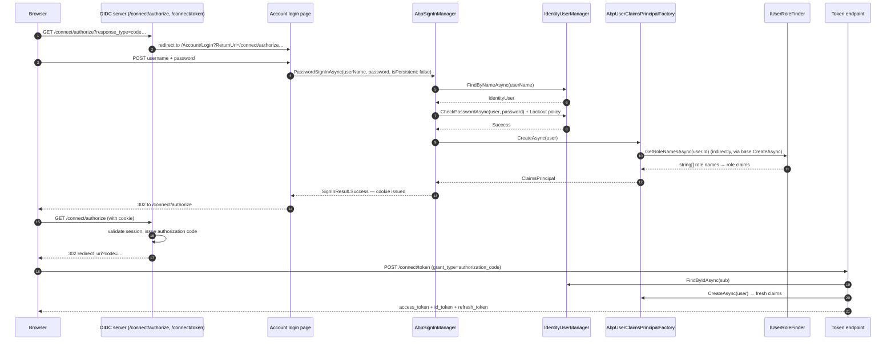

The Identity module does not ship an OIDC server itself — but it is built to plug into one cleanly. The OpenIddict-based [`modules/identityserver`](/modules/identityserver/overview) module (and the deprecated IdentityServer4-based predecessor) reuse five Identity hooks: the `AbpIdentityAspNetCoreModule` cookie wiring, `AbpSignInManager`, `AbpUserClaimsPrincipalFactory`, `AbpSecurityStampValidator`, and `IUserRoleFinder`. This page walks each, then traces a full authorization-code login through Identity.

If you came here looking for *configuration* of the OIDC server itself (scopes, clients, grants), follow the cross-link to [`modules/identityserver/`](/modules/identityserver/overview). This page is about the *Identity-side* contracts the OIDC server depends on.

## File inventory of the bridge layer

| Assembly | File | Role |
| --- | --- | --- |
| `Volo.Abp.Identity.AspNetCore` | `AbpIdentityAspNetCoreModule.cs` | Wires `AddDefaultTokenProviders()`, `LinkUserTokenProvider`, `AbpSignInManager`, `AbpIdentityUserValidator`, and the security-stamp validator. |
| `Volo.Abp.Identity.AspNetCore` | `AbpIdentityAspNetCoreOptions.cs` | `bool ConfigureAuthentication { get; set; } = true;` — set to false in API-only hosts. |
| `Volo.Abp.Identity.AspNetCore` | `AbpSignInManager.cs` | Subclass of `SignInManager<IdentityUser>` that respects `IdentityOptions.SignIn.RequireConfirmedEmail/PhoneNumber` from settings. |
| `Volo.Abp.Identity.AspNetCore` | `AbpSecurityStampValidator.cs` | Subclass that re-resolves `ClaimsPrincipal` through `AbpUserClaimsPrincipalFactory` on stamp refresh. |
| `Volo.Abp.Identity.AspNetCore` | `AbpSecurityStampValidatorCallback.cs` | Hook executed when the cookie is refreshed mid-session. |
| `Volo.Abp.Identity.AspNetCore` | `LinkUserTokenProvider.cs` | Token provider used by the user-linking flow. |
| `Volo.Abp.Identity.AspNetCore` | `SignInResultExtensions.cs` | Maps `SignInResult` to `IdentitySecurityLogActionConsts` strings. |
| `Volo.Abp.Identity.AspNetCore` (Microsoft namespace) | `AbpAspNetCoreServiceCollectionExtensions.cs` | `ForwardIdentityAuthenticationForBearer(...)` — multi-scheme helper. |
| `Volo.Abp.Identity.Domain` | `AbpUserClaimsPrincipalFactory.cs` | Adds `TenantId`, `Name`, `SurName`, `PhoneNumber`, `Email`, `*Verified` to the principal. |
| `Volo.Abp.Identity.Domain.Shared` | `IUserRoleFinder.cs` | Role-name lookup used during token issuance. |

## Authentication wiring

```csharp
[DependsOn(typeof(AbpIdentityDomainModule))]
public class AbpIdentityAspNetCoreModule : AbpModule
{
    public override void PreConfigureServices(ServiceConfigurationContext context)
    {
        PreConfigure<IdentityBuilder>(builder =>
        {
            builder
                .AddDefaultTokenProviders()
                .AddTokenProvider<LinkUserTokenProvider>(LinkUserTokenProviderConsts.LinkUserTokenProviderName)
                .AddSignInManager<AbpSignInManager>()
                .AddUserValidator<AbpIdentityUserValidator>();
        });
    }

    public override void ConfigureServices(ServiceConfigurationContext context)
    {
        context.Services.AddScoped<AbpSecurityStampValidator>();
        context.Services.AddScoped(typeof(SecurityStampValidator<IdentityUser>),
            sp => sp.GetService(typeof(AbpSecurityStampValidator)));
        context.Services.AddScoped(typeof(ISecurityStampValidator),
            sp => sp.GetService(typeof(AbpSecurityStampValidator)));

        var options = context.Services.ExecutePreConfiguredActions(new AbpIdentityAspNetCoreOptions());

        if (options.ConfigureAuthentication)
        {
            context.Services
                .AddAuthentication(o =>
                {
                    o.DefaultScheme       = IdentityConstants.ApplicationScheme;
                    o.DefaultSignInScheme = IdentityConstants.ExternalScheme;
                })
                .AddIdentityCookies();
        }
    }
}
```

So this module:
* installs the four default token providers (email, phone, authenticator, recovery);
* installs the **user-linking token provider** (`LinkUserTokenProvider`) used when an admin links two tenant users — the OIDC server reads this to issue tokens for a "linked" identity;
* swaps in `AbpSignInManager` so settings-driven sign-in policies apply;
* swaps in `AbpIdentityUserValidator` so OU-aware username validation runs;
* installs `AbpSecurityStampValidator` so a remote sign-out (rotating `SecurityStamp`) invalidates *all* active sessions on the next refresh;
* registers the default cookie scheme `IdentityConstants.ApplicationScheme` *unless* you opted out via `AbpIdentityAspNetCoreOptions.ConfigureAuthentication = false` (which API-only hosts do, because they only use bearer auth).

## Claims principal: what Identity actually emits

`AbpUserClaimsPrincipalFactory` is what controls which claims end up in your access tokens. It runs in two places:
1. on cookie sign-in (after `SignInManager.PasswordSignInAsync` succeeds),
2. on token issuance (the OIDC server calls `IUserClaimsPrincipalFactory<IdentityUser>.CreateAsync(user)` to obtain the principal).

```csharp
[UnitOfWork]
public override async Task<ClaimsPrincipal> CreateAsync(IdentityUser user)
{
    var principal = await base.CreateAsync(user);
    var identity  = principal.Identities.First();

    if (user.TenantId.HasValue)
        identity.AddIfNotContains(new Claim(AbpClaimTypes.TenantId, user.TenantId.ToString()));

    if (!user.Name.IsNullOrWhiteSpace())
        identity.AddIfNotContains(new Claim(AbpClaimTypes.Name, user.Name));

    if (!user.Surname.IsNullOrWhiteSpace())
        identity.AddIfNotContains(new Claim(AbpClaimTypes.SurName, user.Surname));

    if (!user.PhoneNumber.IsNullOrWhiteSpace())
        identity.AddIfNotContains(new Claim(AbpClaimTypes.PhoneNumber, user.PhoneNumber));

    identity.AddIfNotContains(new Claim(AbpClaimTypes.PhoneNumberVerified, user.PhoneNumberConfirmed.ToString()));

    if (!user.Email.IsNullOrWhiteSpace())
        identity.AddIfNotContains(new Claim(AbpClaimTypes.Email, user.Email));

    identity.AddIfNotContains(new Claim(AbpClaimTypes.EmailVerified, user.EmailConfirmed.ToString()));

    using (CurrentPrincipalAccessor.Change(identity))
        await AbpClaimsPrincipalFactory.CreateAsync(principal);

    return principal;
}
```

The final `AbpClaimsPrincipalFactory.CreateAsync(principal)` walks every `IAbpClaimsPrincipalContributor` registered with the framework — this is where `EditionId`, `ImpersonatorTenantId`, `SessionId`, etc. get added. The OIDC server then maps these claims into the issued token through its scope/claim configuration.

Standard mapping into `IdentityOptions` (configured in `AbpIdentityDomainModule`):

```csharp
Configure<IdentityOptions>(options =>
{
    options.ClaimsIdentity.UserIdClaimType   = AbpClaimTypes.UserId;
    options.ClaimsIdentity.UserNameClaimType = AbpClaimTypes.UserName;
    options.ClaimsIdentity.RoleClaimType     = AbpClaimTypes.Role;
    options.ClaimsIdentity.EmailClaimType    = AbpClaimTypes.Email;
});
```

So an issued JWT contains `sub` (= `AbpClaimTypes.UserId`), `preferred_username` (= `AbpClaimTypes.UserName`), `role` per Identity role, plus the additional ABP claims above.

## Role claim source: `IUserRoleFinder`

The OIDC server does *not* call `IIdentityUserAppService.GetRolesAsync(id)` — it would block on the `AbpIdentity.Users` permission. Instead it calls the lightweight `IUserRoleFinder.GetRoleNamesAsync(userId)`:

| Implementation | Roles included | Use |
| --- | --- | --- |
| `UserRoleFinder` (`Identity.Domain`) | Direct + OU-mediated | Monolithic OIDC server with local Identity DB |
| `HttpClientUserRoleFinder` (`Identity.HttpApi.Client`) | Whatever the integration endpoint returns | Distributed OIDC server calling a remote Identity service |

The two implementations resolve to the same `string[]` of role names, so the role claim is identical regardless of deployment topology.

## Sequence: authorization-code login through Identity



The two `Princ.CreateAsync` calls explain why a role change becomes visible to the client only on the *next* token refresh — the cookie carries the *previous* claim snapshot until the security-stamp validator forces a refresh.

## `AbpSecurityStampValidator`

When `IdentityUserManager.UpdateSecurityStampAsync(user)` runs (which happens implicitly on password change, role change, lockout, etc.), the existing cookies/tokens are *not* immediately invalidated. Instead, the next request hits `AbpSecurityStampValidator.OnValidatePrincipalAsync`, which:
1. compares the principal's `SecurityStamp` claim with `user.SecurityStamp`;
2. if mismatched, calls `AbpUserClaimsPrincipalFactory.CreateAsync(user)` to rebuild the principal;
3. refreshes the cookie with the new claim set.

For OIDC sessions specifically, this is what makes "force sign-out everywhere" work — the admin clears the security stamp, and every cookie session re-validates on its next round trip.

## `ForwardIdentityAuthenticationForBearer`

In monolithic hosts that expose *both* a cookie-authenticated UI *and* a bearer-authenticated API, you want a single login button to work for both. The helper:

```csharp
public static IServiceCollection ForwardIdentityAuthenticationForBearer(
    this IServiceCollection services, string jwtBearerScheme = "Bearer")
{
    services.ConfigureApplicationCookie(options =>
    {
        options.ForwardDefaultSelector = ctx =>
        {
            string authorization = ctx.Request.Headers.Authorization;
            if (!authorization.IsNullOrWhiteSpace() &&
                authorization.StartsWith("Bearer ", StringComparison.OrdinalIgnoreCase))
            {
                return jwtBearerScheme;
            }
            return null;
        };
    });

    return services;
}
```

Calling `services.ForwardIdentityAuthenticationForBearer()` in your host tells the cookie scheme: *if the incoming request has `Authorization: Bearer …`, forward to the JWT bearer scheme instead*. The two coexist on the same Identity stack.

## What the OIDC layer adds (cross-link)

The OIDC server adds:
* `/connect/authorize`, `/connect/token`, `/connect/userinfo`, `/connect/endsession`, `/connect/revocation` endpoints;
* `OpenIddictApplication` (client) and `OpenIddictScope` aggregates persisted alongside `IdentityUser`;
* claim mapping for `name`, `email`, `phone`, `role`, `tenantid` based on the scopes requested;
* refresh-token rotation;
* PKCE enforcement, DPoP, JWT signing keys.

The Identity module is invisible to client applications — they see *only* OIDC. Identity remains the *user database*.

## Configuration knobs

| Setting | Effect on token issuance |
| --- | --- |
| `Abp.Identity.SignIn.RequireConfirmedEmail` | If true, `AbpSignInManager.CanSignInAsync` returns false for `!EmailConfirmed` users → 400 from token endpoint. |
| `Abp.Identity.SignIn.RequireConfirmedPhoneNumber` | Same for phone. |
| `Abp.Identity.Password.ForceUsersToPeriodicallyChangePassword` | If true, users with stale `LastPasswordChangeTime` are redirected to `/Account/ChangePassword` before the OIDC flow continues. |
| `Abp.Identity.Lockout.MaxFailedAccessAttempts` | After this many failures the token endpoint returns `invalid_grant` and the user is locked. |

## Gotchas

<Warning>
**Setting `AbpIdentityAspNetCoreOptions.ConfigureAuthentication = false` *also* skips `AddIdentityCookies()`.** API-only hosts use this to avoid registering a default scheme — but if you forget that an OIDC interactive flow needs a cookie session to pass control between authorize and token, you'll end up with a host that cannot complete authorization code grants. Either keep the option `true` or register the cookies yourself.
</Warning>

<Warning>
**`AbpUserClaimsPrincipalFactory.CreateAsync` runs inside a `[UnitOfWork]` scope.** If you override it to call additional database services, be aware that the unit of work is *the same* one that handed back the `IdentityUser` — multiple writes inside this method participate in the same transaction.
</Warning>

<Warning>
**`IUserRoleFinder` is the *only* source of role claims** during token issuance — the role *list* the user sees in the Identity admin UI is irrelevant. If you customize `UserRoleFinder` to filter out roles by tenant or context, the missing roles disappear from issued tokens silently.
</Warning>

<Tip>
For multi-tenant OIDC, the JWT carries `tenantid` (from `AbpClaimTypes.TenantId`) as a *claim*, not as part of the `iss`. Resource servers should switch `ICurrentTenant` based on the claim — `AbpAuthenticationMiddleware` does this automatically for ABP-hosted APIs.
</Tip>

## Cross-links

<CardGroup cols={2}>
<Card title="IdentityServer module" icon="key" href="/modules/identityserver/overview">
The OpenIddict-based OIDC server that consumes these contracts.
</Card>
<Card title="Identity Domain" icon="diagram-project" href="/modules/identity/domain">
`AbpUserClaimsPrincipalFactory`, `IdentityUserManager`, settings projection.
</Card>
<Card title="Pro Extensions" icon="puzzle-piece" href="/modules/identity/identity-pro-extensions">
`IExternalLoginProvider` + `IUserRoleFinder` customization.
</Card>
<Card title="Framework: Claims" icon="id-badge" href="/framework/fundamentals/authorization">
`AbpClaimTypes`, `IAbpClaimsPrincipalContributor`, `ICurrentUser`.
</Card>
</CardGroup>
