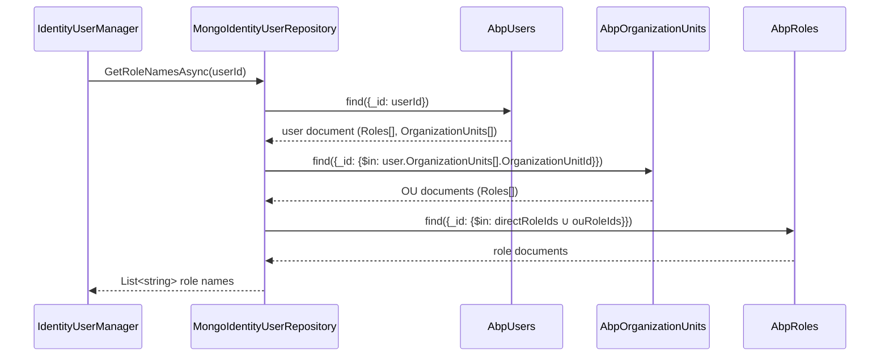

`Volo.Abp.Identity.MongoDB` mirrors the EF Core implementation against MongoDB. The aggregates and their owned collections are stored *as documents* — `IdentityUser.Roles`, `IdentityUser.Claims`, `IdentityUser.Logins`, `IdentityUser.Tokens` and `IdentityUser.OrganizationUnits` are arrays inside the user document, not separate collections. That makes single-document loads cheap (no joins) but pushes some operations (`GetListByNormalizedRoleNameAsync`, OU-mediated role lookups) into two-step queries.

Use this implementation when your application stack is already MongoDB-first. The behavior of the application services, managers and stores is identical — only the repositories change.

## File inventory (`Volo/Abp/Identity/MongoDB/`)

| File | Role |
| --- | --- |
| `AbpIdentityMongoDbModule.cs` | Registers `AbpIdentityMongoDbContext` + 7 repository implementations. |
| `IAbpIdentityMongoDbContext.cs` | Interface — `IMongoCollection<TAggregate>` per aggregate. |
| `AbpIdentityMongoDbContext.cs` | Concrete context. |
| `AbpIdentityMongoDbContextExtensions.cs` | `ConfigureIdentity()` — sets collection names. |
| `MongoIdentityUserRepository.cs` | `IIdentityUserRepository`. |
| `MongoIdentityRoleRepository.cs` | `IIdentityRoleRepository`. |
| `MongoIdentityClaimTypeRepository.cs` | `IIDentityClaimTypeRepository`. |
| `MongoOrganizationUnitRepository.cs` | `IOrganizationUnitRepository`. |
| `MongoIdentitySecurityLogRepository.cs` | `IIdentitySecurityLogRepository`. |
| `MongoIdentityLinkUserRepository.cs` | `IIdentityLinkUserRepository`. |
| `MongoIdentityUserDelegationRepository.cs` | `IIdentityUserDelegationRepository`. |

## Module wiring

```csharp
[DependsOn(
    typeof(AbpIdentityDomainModule),
    typeof(AbpUsersMongoDbModule))]
public class AbpIdentityMongoDbModule : AbpModule
{
    public override void ConfigureServices(ServiceConfigurationContext context)
    {
        context.Services.AddMongoDbContext<AbpIdentityMongoDbContext>(options =>
        {
            options.AddRepository<IdentityUser,           MongoIdentityUserRepository>();
            options.AddRepository<IdentityRole,           MongoIdentityRoleRepository>();
            options.AddRepository<IdentityClaimType,      MongoIdentityClaimTypeRepository>();
            options.AddRepository<OrganizationUnit,       MongoOrganizationUnitRepository>();
            options.AddRepository<IdentitySecurityLog,    MongoIdentitySecurityLogRepository>();
            options.AddRepository<IdentityLinkUser,       MongoIdentityLinkUserRepository>();
            options.AddRepository<IdentityUserDelegation, MongoIdentityUserDelegationRepository>();
        });
    }
}
```

`AbpUsersMongoDbModule` provides the `MongoUserRepositoryBase<TUser>` base class plus the `IUserData`-friendly bson serialization conventions inherited by `MongoIdentityUserRepository`.

## `AbpIdentityMongoDbContext`

```csharp
[ConnectionStringName(AbpIdentityDbProperties.ConnectionStringName)]   // "AbpIdentity"
public class AbpIdentityMongoDbContext : AbpMongoDbContext, IAbpIdentityMongoDbContext
{
    public IMongoCollection<IdentityUser>           Users             => Collection<IdentityUser>();
    public IMongoCollection<IdentityRole>           Roles             => Collection<IdentityRole>();
    public IMongoCollection<IdentityClaimType>      ClaimTypes        => Collection<IdentityClaimType>();
    public IMongoCollection<OrganizationUnit>       OrganizationUnits => Collection<OrganizationUnit>();
    public IMongoCollection<IdentitySecurityLog>    SecurityLogs      => Collection<IdentitySecurityLog>();
    public IMongoCollection<IdentityLinkUser>       LinkUsers         => Collection<IdentityLinkUser>();
    public IMongoCollection<IdentityUserDelegation> UserDelegations   => Collection<IdentityUserDelegation>();

    protected override void CreateModel(IMongoModelBuilder modelBuilder)
    {
        base.CreateModel(modelBuilder);
        modelBuilder.ConfigureIdentity();
    }
}
```

## Collection layout

`ConfigureIdentity()` only sets *collection names* — Mongo schemas are implicit:

```csharp
builder.Entity<IdentityUser>(b           => b.CollectionName = "AbpUsers");
builder.Entity<IdentityRole>(b           => b.CollectionName = "AbpRoles");
builder.Entity<IdentityClaimType>(b      => b.CollectionName = "AbpClaimTypes");
builder.Entity<OrganizationUnit>(b       => b.CollectionName = "AbpOrganizationUnits");
builder.Entity<IdentitySecurityLog>(b    => b.CollectionName = "AbpSecurityLogs");
builder.Entity<IdentityLinkUser>(b       => b.CollectionName = "AbpLinkUsers");
builder.Entity<IdentityUserDelegation>(b => b.CollectionName = "AbpUserDelegations");
```

| Collection | Aggregate | Embedded arrays |
| --- | --- | --- |
| `AbpUsers` | `IdentityUser` | `Roles[]` (`IdentityUserRole`), `Claims[]`, `Logins[]`, `Tokens[]`, `OrganizationUnits[]` |
| `AbpRoles` | `IdentityRole` | `Claims[]` (`IdentityRoleClaim`) |
| `AbpOrganizationUnits` | `OrganizationUnit` | `Roles[]` (`OrganizationUnitRole`) |
| `AbpClaimTypes` | `IdentityClaimType` | — |
| `AbpSecurityLogs` | `IdentitySecurityLog` | — |
| `AbpLinkUsers` | `IdentityLinkUser` | — |
| `AbpUserDelegations` | `IdentityUserDelegation` | — |

Compared to EF Core there are **eight fewer tables** because the owned types are stored as embedded arrays. This means a single `Users.FindAsync(id)` loads the full aggregate in one round trip — no `LEFT JOIN`s, no `IncludeDetails(true)` flag.

## `MongoIdentityUserRepository` highlights

The interesting methods are the ones that have to bridge between *embedded arrays* on the user document and *separate documents* in another collection.

### `GetRoleNamesAsync` — three round trips

```csharp
public virtual async Task<List<string>> GetRoleNamesAsync(Guid id, CancellationToken ct = default)
{
    ct = GetCancellationToken(ct);
    var user = await GetAsync(id, cancellationToken: ct);

    var organizationUnitIds = user.OrganizationUnits.Select(r => r.OrganizationUnitId).ToArray();

    var organizationUnits = await (await GetMongoQueryableAsync<OrganizationUnit>(ct))
        .Where(ou => organizationUnitIds.Contains(ou.Id))
        .ToListAsync(ct);

    var orgUnitRoleIds = organizationUnits.SelectMany(x => x.Roles.Select(r => r.RoleId)).ToArray();
    var roleIds        = user.Roles.Select(r => r.RoleId).ToArray();
    var allRoleIds     = orgUnitRoleIds.Union(roleIds);

    return await (await GetMongoQueryableAsync<IdentityRole>(ct))
        .Where(r => allRoleIds.Contains(r.Id))
        .Select(r => r.Name)
        .ToListAsync(ct);
}
```

1. Load the user document (1 round trip).
2. Load all OUs referenced by the user (1 round trip).
3. Load role documents for the union of (direct role ids ∪ OU role ids) (1 round trip).

Compare with the EF Core implementation which collapses (2) and (3) into a single `UNION` query. On Mongo this is the price of denormalization.

### `GetListByNormalizedRoleNameAsync` — two round trips

```csharp
public virtual async Task<List<IdentityUser>> GetListByNormalizedRoleNameAsync(string normalizedRoleName, ...)
{
    var role = await (await GetMongoQueryableAsync<IdentityRole>(ct))
        .Where(x => x.NormalizedName == normalizedRoleName)
        .OrderBy(x => x.Id)
        .FirstOrDefaultAsync(ct);

    if (role == null) return new List<IdentityUser>();

    return await (await GetMongoQueryableAsync(ct))
        .Where(u => u.Roles.Any(r => r.RoleId == role.Id))
        .ToListAsync(ct);
}
```

Look up the role id first, then query users whose embedded `Roles[]` contains it.

### `FindByLoginAsync` — one round trip

```csharp
public virtual async Task<IdentityUser> FindByLoginAsync(string loginProvider, string providerKey, ...)
{
    return await (await GetMongoQueryableAsync(ct))
        .Where(u => u.Logins.Any(l => l.LoginProvider == loginProvider && l.ProviderKey == providerKey))
        .OrderBy(x => x.Id)
        .FirstOrDefaultAsync(ct);
}
```

Because `IdentityUserLogin` is embedded, the login lookup is a single document filter rather than a join.

### `GetListByClaimAsync`

```csharp
return await (await GetMongoQueryableAsync(ct))
    .Where(u => u.Claims.Any(c => c.ClaimType == claim.Type && c.ClaimValue == claim.Value))
    .ToListAsync(ct);
```

Same pattern — claims are embedded in the user document.

## Recommended indexes

Mongo will not auto-create indexes — add them in your host's startup or via a deploy script:

```js
// AbpUsers
db.AbpUsers.createIndex({ NormalizedUserName: 1 });
db.AbpUsers.createIndex({ NormalizedEmail: 1 });
db.AbpUsers.createIndex({ "Logins.LoginProvider": 1, "Logins.ProviderKey": 1 });
db.AbpUsers.createIndex({ "Roles.RoleId": 1 });
db.AbpUsers.createIndex({ "OrganizationUnits.OrganizationUnitId": 1 });
db.AbpUsers.createIndex({ "Claims.ClaimType": 1, "Claims.ClaimValue": 1 });
db.AbpUsers.createIndex({ TenantId: 1 });

// AbpRoles
db.AbpRoles.createIndex({ NormalizedName: 1 });

// AbpOrganizationUnits
db.AbpOrganizationUnits.createIndex({ Code: 1 });
db.AbpOrganizationUnits.createIndex({ ParentId: 1 });
db.AbpOrganizationUnits.createIndex({ "Roles.RoleId": 1 });

// AbpSecurityLogs
db.AbpSecurityLogs.createIndex({ TenantId: 1, UserId: 1, CreationTime: -1 });
db.AbpSecurityLogs.createIndex({ TenantId: 1, Action: 1 });
db.AbpSecurityLogs.createIndex({ TenantId: 1, Identity: 1 });
```

The default ABP application templates already create equivalent indexes through an `IIdentityDataSeedContributor` extension; if you don't use the template, port these.

## Sequence: cross-OU role expansion



## Multi-tenancy on Mongo

ABP's `AbpMongoDbContext` applies `ICurrentTenant.Id` as an implicit filter through the `IDataFilter<IMultiTenant>` provider. The same data-filter semantics from EF Core apply — `using (CurrentTenant.Change(tenantId)) { … }` works identically. However:

* `AbpClaimTypes` and `AbpLinkUsers` are **always** in the host context (the entity registrations in `ConfigureIdentity()` do not branch on `IsHostDatabase()` like EF Core does, but the application code still treats them as host-scoped via `[DisableMultiTenancy]` on the entities themselves).
* `AbpSecurityLogs` rows from different tenants share one collection; index on `TenantId` is essential for the admin UI.

## Gotchas

<Warning>
**Embedded arrays are *replaced wholesale* on every save.** `IdentityUserManager.SetRolesAsync` modifies `user.Roles` then calls `UpdateAsync` — MongoDB replaces the entire `Roles[]` array. There is no `$push` / `$pull` optimization. For users with thousands of role assignments this is OK because the document is still small; for users with thousands of *tokens* (two-factor recovery codes, refresh tokens) consider moving tokens to a separate collection via a custom repository override.
</Warning>

<Warning>
**`MongoDB.Driver`'s LINQ provider does not translate every C# expression** — the EF Core implementations use `IQueryable` heavily, but the Mongo equivalents sometimes have to materialize intermediate arrays in memory (you can see this in `GetRoleNamesAsync` where `organizationUnits` is `await ToListAsync(...)` before extracting role ids). When you add a custom repository method, prefer the `MongoQueryable` overloads and avoid mixing in `EntityFrameworkQueryableExtensions`-style operators.
</Warning>

<Warning>
**Soft delete + tenant filter + embedded arrays = silent data loss risk.** If you delete an OU referenced by users' embedded `OrganizationUnits[]`, the user documents still contain stale references. `IdentityUserManager` handles this for OUs by calling `OrganizationUnitManager.DeleteAsync` which walks affected users — do *not* delete OUs through `IOrganizationUnitRepository.DeleteAsync` directly.
</Warning>

<Tip>
The `[ConnectionStringName("AbpIdentity")]` attribute lets you route the Identity collections to a different database (e.g. a separate `identity` Mongo cluster) by adding a `ConnectionStrings:AbpIdentity` entry. The collection names stay the same.
</Tip>

## Cross-links

<CardGroup cols={2}>
<Card title="EF Core" icon="database" href="/modules/identity/efcore">
The relational alternative — same contracts, different round-trip cost.
</Card>
<Card title="Domain" icon="diagram-project" href="/modules/identity/domain">
Repository interfaces that both implementations satisfy.
</Card>
<Card title="Users.MongoDB" icon="user" href="/modules/identity/users-domain">
`MongoUserRepositoryBase` shared base.
</Card>
<Card title="Framework: MongoDB" icon="leaf" href="/framework/data/mongodb/overview">
`AbpMongoDbContext`, model builder, data filters.
</Card>
</CardGroup>
