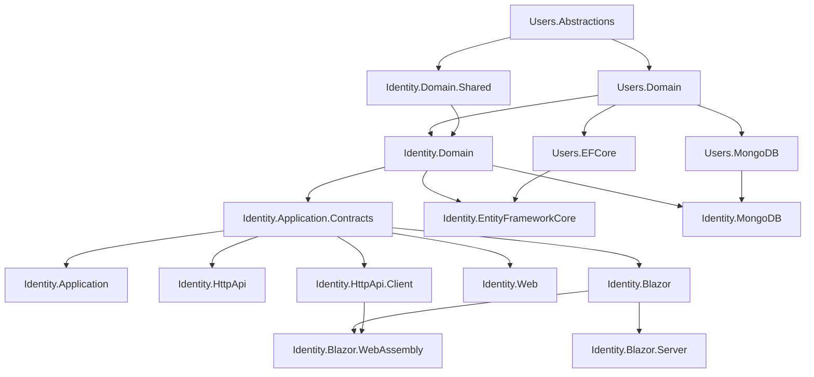
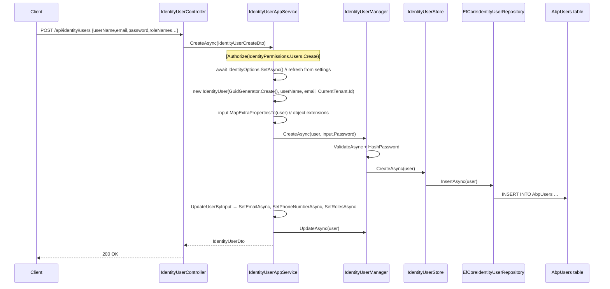

The **Identity module** is ABP's drop-in user-, role-, and organization-unit management application. It wraps `Microsoft.AspNetCore.Identity` with full ABP semantics — multi-tenancy, distributed events, object extensions, settings, permissions, audit and security logs — and exposes the result as a layered, replaceable set of NuGet packages under `Volo.Abp.Identity.*`. The thin `Volo.Abp.Users.*` siblings provide the *abstractions* (`IUser`, `IUserData`, `IExternalUserLookupServiceProvider`) that other ABP modules consume without taking a hard dependency on Identity itself.

Every package described here ships under `modules/identity/src/Volo.Abp.Identity.*` and `modules/users/src/Volo.Abp.Users.*` in the [abpframework/abp](https://github.com/abpframework/abp) repository. The split follows the standard ABP DDD layering so apps reference only what they need — a Blazor WebAssembly client pulls `HttpApi.Client` + `Blazor.WebAssembly`, while a monolithic MVC host pulls everything from `Domain` through `Web`.

## Package map

| Package | Role |
| --- | --- |
| `Volo.Abp.Users.Abstractions` | Cross-module overlay: `IUserData`, `UserData`, `UserEto`, `IExternalUserLookupServiceProvider`, `UserPasswordChangeRequestedEto`. Safe for any project. |
| `Volo.Abp.Users.Domain.Shared` | `AbpUserConsts` length constants used by Identity and any other user-aware module. |
| `Volo.Abp.Users.Domain` | `IUser` aggregate marker, `IUserRepository<TUser>`, generic `UserLookupService<TUser,TUserRepository>` and `IUpdateUserData` hook. |
| `Volo.Abp.Users.EntityFrameworkCore` / `Volo.Abp.Users.MongoDB` | `EfCoreAbpUserRepositoryBase` / `MongoUserRepositoryBase` building blocks for downstream user repositories. |
| `Volo.Abp.Identity.Domain.Shared` | Length constants, `IdentityClaimValueType`, `IdentitySettingNames`, `IdentityErrorCodes`, `IdentityModuleExtensionConsts`, localization. |
| `Volo.Abp.Identity.Domain` | `IdentityUser`, `IdentityRole`, `OrganizationUnit`, `IdentityClaimType`, `IdentityUserManager`, `IdentityRoleManager`, `OrganizationUnitManager`, `IdentityUserStore`, `IExternalLoginProvider`, `IdentitySecurityLogManager`. |
| `Volo.Abp.Identity.Application.Contracts` | `IIdentityUserAppService`, `IIdentityRoleAppService`, `IIdentityUserLookupAppService`, DTOs, `IdentityPermissions`, `IdentityPermissionDefinitionProvider`. |
| `Volo.Abp.Identity.Application` | `IdentityUserAppService`, `IdentityRoleAppService`, `IdentityUserLookupAppService`, `IdentityUserIntegrationService`, AutoMapper profile. |
| `Volo.Abp.Identity.EntityFrameworkCore` | `IdentityDbContext`, six EF Core repository implementations, `ConfigureIdentity()` model-builder extension. |
| `Volo.Abp.Identity.MongoDB` | `AbpIdentityMongoDbContext` and Mongo repository implementations. |
| `Volo.Abp.Identity.HttpApi` | `IdentityUserController`, `IdentityRoleController`, `IdentityUserLookupController`, `IdentityUserIntegrationController` (auto-API at `/api/identity/*`). |
| `Volo.Abp.Identity.HttpApi.Client` | Generated static client proxies + `HttpClientExternalUserLookupServiceProvider` + `HttpClientUserRoleFinder`. |
| `Volo.Abp.Identity.Web` | Razor Pages UI under `/Identity/Users` and `/Identity/Roles`, view models, navigation contributor. |
| `Volo.Abp.Identity.Blazor` | Shared Blazorise components: `UserManagement.razor`, `RoleManagement.razor`. |
| `Volo.Abp.Identity.Blazor.Server` / `Blazor.WebAssembly` | Thin wrappers that bind the shared Blazor module to a hosting model. |
| `Volo.Abp.Identity.AspNetCore` | Hooks for the ASP.NET Core authentication pipeline (security-stamp validator, claims principal factory). |
| `Volo.Abp.Identity.Installer` | NuGet metapackage used by the ABP CLI. |
| `Volo.Abp.PermissionManagement.Domain.Identity` | Bridge that surfaces user/role permissions to the Permission Management module. |

The remainder of this page is a high-altitude tour. Each layer has its own deep-dive: [Domain.Shared](/modules/identity/domain-shared), [Domain](/modules/identity/domain), [Application.Contracts](/modules/identity/application-contracts), [Application](/modules/identity/application), [EF Core](/modules/identity/efcore), [MongoDB](/modules/identity/mongodb), [HTTP API](/modules/identity/http-api), [HTTP API Client](/modules/identity/http-api-client), [Web](/modules/identity/web), [Blazor](/modules/identity/blazor), [Blazor.Server](/modules/identity/blazor-server) and [Blazor.WebAssembly](/modules/identity/blazor-webassembly). The `Users.*` overlay is documented in [Users.Abstractions](/modules/identity/users-abstractions) and [Users.Domain](/modules/identity/users-domain). Extension points used by ABP Commercial Pro live in [Pro extension points](/modules/identity/identity-pro-extensions); OpenIddict/IdentityServer wiring lives in [Identity Server integration](/modules/identity/identity-server-integration).

## How the layers depend on each other



The single rule is: **higher tiers depend on lower tiers, never the reverse.** `Identity.Web` can swap out for `Identity.Blazor` without touching anything below `Identity.Application.Contracts`, and the entire HTTP and UI stack can be replaced by direct in-process calls in a monolithic deployment.

## Relationship to `Microsoft.AspNetCore.Identity`

ABP does not fork ASP.NET Core Identity — it *adopts* it. `AbpIdentityDomainModule.ConfigureServices` calls the framework's `AddAbpIdentity(...)` extension which itself calls `services.AddIdentityCore<IdentityUser>()` plus all the supporting services. The mapping is:

| ASP.NET Core Identity type | ABP replacement |
| --- | --- |
| `IdentityUser` (default Entity Framework type) | `Volo.Abp.Identity.IdentityUser : FullAuditedAggregateRoot<Guid>, IUser, IHasEntityVersion` |
| `IdentityRole` | `Volo.Abp.Identity.IdentityRole : AggregateRoot<Guid>, IMultiTenant, IHasEntityVersion` |
| `UserManager<TUser>` | `IdentityUserManager : UserManager<IdentityUser>, IDomainService` |
| `RoleManager<TRole>` | `IdentityRoleManager : RoleManager<IdentityRole>, IDomainService` |
| `IUserStore<TUser>` (and 11 other interfaces) | `IdentityUserStore : IUserLoginStore<…>, IUserRoleStore<…>, IUserClaimStore<…>, IUserPasswordStore<…>, …` |
| `IRoleStore<TRole>` | `IdentityRoleStore` |
| `IUserClaimsPrincipalFactory<TUser>` | `AbpUserClaimsPrincipalFactory` |
| `IdentityErrorDescriber` | `AbpIdentityResultException` wraps `IdentityResult` errors |

Because the ABP types *inherit* from `UserManager<TUser>` and `RoleManager<TRole>`, every existing ASP.NET Core Identity API — `CreateAsync`, `CheckPasswordAsync`, `GeneratePasswordResetTokenAsync`, `ConfirmEmailAsync`, `AddLoginAsync`, `GetTwoFactorAuthenticatorKeyAsync`, etc. — works unchanged. ABP layers on multi-tenant filtering, `ICurrentTenant`/`Guid? TenantId` propagation, distributed events, and `ISettingProvider`-driven `IdentityOptions`.

```csharp
// AbpIdentityDomainModule.cs
var identityBuilder = context.Services.AddAbpIdentity(options =>
{
    options.User.RequireUniqueEmail = true;
});

Configure<IdentityOptions>(options =>
{
    options.ClaimsIdentity.UserIdClaimType   = AbpClaimTypes.UserId;
    options.ClaimsIdentity.UserNameClaimType = AbpClaimTypes.UserName;
    options.ClaimsIdentity.RoleClaimType     = AbpClaimTypes.Role;
    options.ClaimsIdentity.EmailClaimType    = AbpClaimTypes.Email;
});

context.Services.AddAbpDynamicOptions<IdentityOptions, AbpIdentityOptionsManager>();
```

The last line wires `AbpIdentityOptionsManager` to refresh `IdentityOptions` from `ISettingProvider` (`Abp.Identity.Password.*`, `Abp.Identity.Lockout.*`, `Abp.Identity.SignIn.*`) on every read, so changing a setting through the admin UI takes effect on the next call — no restart.

## Relationship to `Volo.Abp.Users.*`

`Volo.Abp.Users.*` exists so that **other ABP modules can talk about users without referencing Identity**. The Audit Logging, Background Jobs, BLOB Storing, CMS Kit, Account, OpenIddict, IdentityServer and Tenant Management modules all consume `IUserData` / `IExternalUserLookupServiceProvider`; none of them references `Volo.Abp.Identity.*` directly.

* `IUser` (in `Users.Domain`) is the *aggregate marker* — `Identity.IdentityUser` implements it.
* `IUserData` (in `Users.Abstractions`) is the *data-transfer contract* — `IdentityUserDto`, `UserData` and `UserEto` all implement it.
* `IExternalUserLookupServiceProvider` is the *cross-service lookup contract* — implemented locally by Identity itself, and remotely by `HttpClientExternalUserLookupServiceProvider` (in `Identity.HttpApi.Client`) when a microservice has no local user table.

This means a service can call `IExternalUserLookupServiceProvider.FindByIdAsync(userId)` from any host without taking a transitive dependency on EF Core, MongoDB or even on the Identity application service. See [Users.Abstractions](/modules/identity/users-abstractions) for the full contract.

## End-to-end flow: creating a user

The HTTP `POST /api/identity/users` endpoint walks every layer once. This is the canonical control-flow you can trace in your own debugger:



Every numbered hop has an extension seam:
* swap `IdentityUserAppService` to add custom DTO fields,
* override `IdentityUserManager` to enforce extra invariants,
* replace `IIdentityUserRepository` to point at a different store,
* register an additional `IExternalLoginProvider` to authenticate the user against a legacy system *before* a local record exists.

## Key cross-cutting concerns

<AccordionGroup>
<Accordion title="Multi-tenancy">
`IdentityUser`, `IdentityRole`, `OrganizationUnit`, `IdentityUserDelegation`, `IdentitySecurityLog` and `IdentityLinkUser` are all `IMultiTenant`. EF Core and MongoDB repositories filter by `ICurrentTenant.Id` automatically through ABP's data filters; manual `using (CurrentTenant.Change(tenantId))` blocks let you cross tenants when needed.
</Accordion>

<Accordion title="Settings">
`IdentitySettingNames` (in Domain.Shared) declares 13 settings under three groups — `Abp.Identity.Password.*`, `Abp.Identity.Lockout.*`, `Abp.Identity.SignIn.*` plus `Abp.Identity.User.IsUserNameUpdateEnabled`, `IsEmailUpdateEnabled` and `Abp.Identity.OrganizationUnit.MaxUserMembershipCount`. `AbpIdentityOptionsManager` projects them into `IdentityOptions` on every read.
</Accordion>

<Accordion title="Object extensions">
The static `ObjectExtensionManager.Instance.ConfigureIdentity(c => c.ConfigureUser(u => u.AddOrUpdateProperty<string>("SocialSecurityNumber"))) ` call (via `IdentityModuleExtensionConfiguration`) lets you add columns to `AbpUsers`, fields to `IdentityUserCreateDto` / `IdentityUserDto`, validation rules, and form inputs across MVC and Blazor — without subclassing anything.
</Accordion>

<Accordion title="Distributed events">
`AbpIdentityDomainModule` registers `IdentityUser → UserEto`, `IdentityRole → IdentityRoleEto`, `IdentityClaimType → IdentityClaimTypeEto`, `OrganizationUnit → OrganizationUnitEto` ETO mappings and auto-event selectors. Every insert/update/delete on these aggregates publishes `EntityCreatedEto<UserEto>` / `EntityUpdatedEto<UserEto>` / `EntityDeletedEto<UserEto>` over the distributed event bus, so audit logging or downstream caches stay consistent.
</Accordion>

<Accordion title="Security & audit">
`IdentitySecurityLogManager` and `IdentitySecurityLogContext` produce `IdentitySecurityLog` rows (login success / failure / lockout / password change / 2FA changes — see `IdentitySecurityLogActionConsts`). `IdentityUser` itself is a `FullAuditedAggregateRoot`, so creation / last-modification / soft-delete are recorded automatically.
</Accordion>
</AccordionGroup>

## Permissions surface

Defined in `IdentityPermissions` and registered by `IdentityPermissionDefinitionProvider`:

| Permission | Constant | Purpose |
| --- | --- | --- |
| `AbpIdentity.Roles` | `IdentityPermissions.Roles.Default` | View roles list |
| `AbpIdentity.Roles.Create` | `IdentityPermissions.Roles.Create` | Create roles |
| `AbpIdentity.Roles.Update` | `IdentityPermissions.Roles.Update` | Update roles |
| `AbpIdentity.Roles.Delete` | `IdentityPermissions.Roles.Delete` | Delete roles |
| `AbpIdentity.Roles.ManagePermissions` | `IdentityPermissions.Roles.ManagePermissions` | Edit role permission grants |
| `AbpIdentity.Users` | `IdentityPermissions.Users.Default` | View users list |
| `AbpIdentity.Users.Create` | `IdentityPermissions.Users.Create` | Create users |
| `AbpIdentity.Users.Update` | `IdentityPermissions.Users.Update` | Update users |
| `AbpIdentity.Users.Delete` | `IdentityPermissions.Users.Delete` | Delete users |
| `AbpIdentity.Users.ManagePermissions` | `IdentityPermissions.Users.ManagePermissions` | Edit user permission grants |
| `AbpIdentity.UserLookup` | `IdentityPermissions.UserLookup.Default` | Server-to-server user lookup (`ClientPermissionValueProvider` only) |

## Gotchas

<Warning>
**Do not register your own `IUserStore<IdentityUser>` directly with DI.** ABP's `IdentityUserStore` implements twelve interfaces simultaneously (`IUserLoginStore`, `IUserRoleStore`, `IUserClaimStore`, `IUserPasswordStore`, …). Replacing one of them with a partial store will silently disable two-factor, recovery codes, or external logins. Override `IdentityUserStore` itself instead.
</Warning>

<Warning>
**`AbpIdentityDomainModule` enforces `RequireUniqueEmail = true`.** If you migrate a legacy database with duplicate emails, override the module's `ConfigureServices` *before* calling `AddAbpIdentity` to disable the requirement, otherwise migrations succeed but user creation fails with `DuplicateEmail`.
</Warning>

<Warning>
**`IdentityUser.IsExternal` and `IdentityErrorCodes.ExternalUserPasswordChange`** — external-login users have `PasswordHash == null`. The framework blocks `ChangePassword` on them with code `Volo.Abp.Identity:010003`. Surface this in your UI; don't rely on `HasPasswordAsync`.
</Warning>

<Tip>
For services that need only *read* access to user data — like audit log enrichment or BLOB owner display names — depend on `IExternalUserLookupServiceProvider` from `Volo.Abp.Users.Abstractions` instead of `IIdentityUserAppService`. It works in both monolith and microservice deployments because `HttpClientExternalUserLookupServiceProvider` ships in `Identity.HttpApi.Client`.
</Tip>

## Where to go next

<CardGroup cols={2}>
<Card title="Domain.Shared" icon="cube" href="/modules/identity/domain-shared">
Constants, settings names, error codes, localization.
</Card>
<Card title="Domain" icon="diagram-project" href="/modules/identity/domain">
Aggregates, managers, stores, external login providers.
</Card>
<Card title="Application Contracts" icon="file-contract" href="/modules/identity/application-contracts">
DTOs, app-service interfaces, permission definitions.
</Card>
<Card title="HTTP API Client" icon="plug" href="/modules/identity/http-api-client">
Static client proxies and the cross-service user lookup.
</Card>
</CardGroup>
