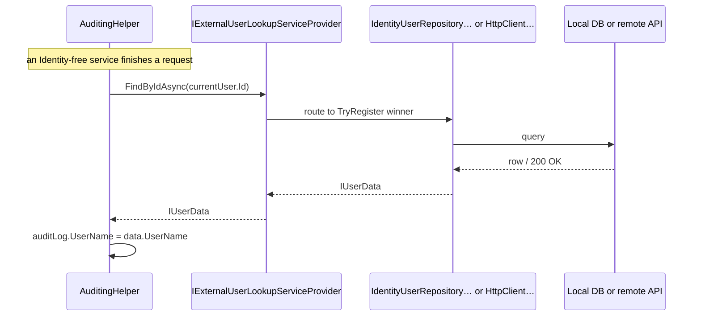

`Volo.Abp.Users.Abstractions` is the *neutral ground* between the Identity module and every other ABP module that needs to know "who is this user?". It defines a small set of data-transfer interfaces and event payloads that have no dependency on Identity, EF Core, MongoDB, or ASP.NET Core Identity. As a result, modules like Audit Logging, BLOB Storing, CMS Kit, Tenant Management, Background Jobs and even framework-level helpers (`AuditingHelper`, `EntityChangeHelper`) can talk about users without taking a transitive dependency on `Volo.Abp.Identity.*`.

Reference this package from *any* shared library — it is the smallest and most stable user-related assembly in the ABP graph.

## File inventory

| File | Role |
| --- | --- |
| `AbpUsersAbstractionModule.cs` | DependsOn(`AbpMultiTenancyModule`, `AbpEventBusModule`). No services registered. |
| `IUserData.cs` | The read-only user contract every consumer downstream binds to. |
| `UserData.cs` | Plain class implementation of `IUserData`. |
| `UserEto.cs` | `[EventName("Volo.Abp.Users.User")]` payload for distributed events. |
| `UserPasswordChangeRequestedEto.cs` | Inbox/outbox payload for "request password change" workflows. |
| `IExternalUserLookupServiceProvider.cs` | Contract for *any* user-resolution backend (local, remote, mock). |

There is intentionally no `IUser` aggregate marker here — that lives in [`Users.Domain`](/modules/identity/users-domain) because it inherits from `IAggregateRoot<Guid>` and therefore drags in `Volo.Abp.Ddd.Domain`.

## The `IUserData` contract

```csharp
public interface IUserData : IHasExtraProperties
{
    Guid    Id           { get; }
    Guid?   TenantId     { get; }
    string  UserName     { get; }
    string  Name         { get; }
    string  Surname      { get; }
    bool    IsActive     { get; }
    [CanBeNull] string Email     { get; }
    bool    EmailConfirmed       { get; }
    [CanBeNull] string PhoneNumber { get; }
    bool    PhoneNumberConfirmed { get; }
}
```

Eight properties — the minimal set needed to display "the user behind a row". The `ExtraProperties` dictionary (inherited from `IHasExtraProperties`) carries object-extension fields, which is why an audit log row's display name can include a custom `SocialSecurityNumber` extension transparently.

Important consumers of `IUserData`:

| Consumer | Use |
| --- | --- |
| `AuditingHelper` (framework) | Decorates `AuditLog.UserId` with `UserName` / `Email`. |
| `EntityChangeHelper` (framework) | Logs the user that changed an entity. |
| `Volo.Abp.BackgroundJobs` | Stores the queueing user. |
| `Volo.Abp.BlobStoring.Database` | Display name for "Uploaded by". |
| `Volo.CmsKit.Comments` | Comment author name. |
| `Volo.Abp.TenantManagement` | Resolving the tenant admin contact. |
| `Volo.Abp.Identity.Application` | Returns `UserData` from `IIdentityUserLookupAppService`. |

## `UserData` — the canonical implementation

```csharp
public class UserData : IUserData
{
    public Guid    Id { get; set; }
    public Guid?   TenantId { get; set; }
    public string  UserName { get; set; }
    public string  Name { get; set; }
    public string  Surname { get; set; }
    public bool    IsActive { get; set; }
    public string  Email { get; set; }
    public bool    EmailConfirmed { get; set; }
    public string  PhoneNumber { get; set; }
    public bool    PhoneNumberConfirmed { get; set; }
    public ExtraPropertyDictionary ExtraProperties { get; }

    public UserData() { }

    public UserData(IUserData userData) { /* copy ctor */ }

    public UserData(
        Guid id,
        [NotNull] string userName,
        [CanBeNull] string email                  = null,
        [CanBeNull] string name                   = null,
        [CanBeNull] string surname                = null,
        bool emailConfirmed                       = false,
        [CanBeNull] string phoneNumber            = null,
        bool phoneNumberConfirmed                 = false,
        Guid? tenantId                            = null,
        bool isActive                             = true,
        ExtraPropertyDictionary extraProperties   = null)
    {
        // ...
    }
}
```

The copy constructor (`UserData(IUserData)`) is what `IdentityUserLookupAppService` uses to convert internal entity-shaped `IUserData` (from the repository) into a stable, serializable DTO before returning it over HTTP.

## `UserEto` and the distributed-event contract

```csharp
[EventName("Volo.Abp.Users.User")]
public class UserEto : IUserData, IMultiTenant
{
    public Guid    Id { get; set; }
    public Guid?   TenantId { get; set; }
    public string  UserName { get; set; }
    public string  Name { get; set; }
    public string  Surname { get; set; }
    public bool    IsActive { get; set; }
    public string  Email { get; set; }
    public bool    EmailConfirmed { get; set; }
    public string  PhoneNumber { get; set; }
    public bool    PhoneNumberConfirmed { get; set; }
    public ExtraPropertyDictionary ExtraProperties { get; set; }
}
```

The `[EventName]` is what subscribers across processes see in their message broker — every ABP module subscribing to `EntityCreatedEto<UserEto>` ends up bound to a topic / queue named "`Volo.Abp.Users.User`" *plus* the `Created`/`Updated`/`Deleted` suffix injected by the framework. `Volo.Abp.Identity.Domain` configures the `IdentityUser → UserEto` mapping in `AbpIdentityDomainModule`:

```csharp
Configure<AbpDistributedEntityEventOptions>(options =>
{
    options.EtoMappings.Add<IdentityUser, UserEto>(typeof(AbpIdentityDomainModule));
    options.AutoEventSelectors.Add<IdentityUser>();
});
```

So *creating* an `IdentityUser` in one service automatically publishes `EntityCreatedEto<UserEto>` to the bus; subscribers in any other process can react without referencing Identity.

## `UserPasswordChangeRequestedEto`

```csharp
[Serializable]
[EventName("Volo.Abp.Users.UserPasswordChangeRequested")]
public class UserPasswordChangeRequestedEto : IMultiTenant
{
    public Guid?  TenantId { get; set; }
    public string UserName { get; set; }
    public string Password { get; set; }
}
```

This event is published by the Account module's password-reset flow (and by Pro tooling that performs admin-initiated password resets); the Identity module's handler receives it, resolves the user via `IdentityUserManager.FindByNameAsync`, and applies the new password through `IdentityUserManager.ResetPasswordAsync`. The split lets a *third-party Account microservice* request a password change without having Identity wired locally.

<Warning>
Because `Password` is in clear text, this event must travel over an *encrypted* transport (broker over TLS, mutual TLS, encrypted outbox column). Do not enable it without confirming your broker configuration encrypts payloads at rest and in transit.
</Warning>

## `IExternalUserLookupServiceProvider`

```csharp
public interface IExternalUserLookupServiceProvider
{
    Task<IUserData>            FindByIdAsync(Guid id, CancellationToken cancellationToken = default);
    Task<IUserData>            FindByUserNameAsync(string userName, CancellationToken cancellationToken = default);

    Task<List<IUserData>>      SearchAsync(
        string sorting = null,
        string filter = null,
        int maxResultCount = int.MaxValue,
        int skipCount = 0,
        CancellationToken cancellationToken = default);

    Task<long>                 GetCountAsync(string filter = null, CancellationToken cancellationToken = default);
}
```

This is the *pluggable lookup layer*. Three implementations ship out of the box:

| Implementation | Lives in | Used when |
| --- | --- | --- |
| `IdentityUserRepositoryExternalUserLookupServiceProvider` | `Volo.Abp.Identity.Domain` | In-process: the host has an Identity DB |
| `HttpClientExternalUserLookupServiceProvider` | `Volo.Abp.Identity.HttpApi.Client` | Out-of-process: the host calls a remote Identity API |
| `NullExternalUserLookupServiceProvider` *(test only)* | `Volo.Abp.TestBase` | Tests that don't care about user resolution |

The `[Dependency(TryRegister = true)]` attribute on each implementation means whichever assembly is referenced first wins; explicitly reference both `Identity.Domain` and `Identity.HttpApi.Client` only if you know which one you want to win.

## Sequence: audit log enriches a user id



The whole point of `IExternalUserLookupServiceProvider` is that `AL` does not know whether the lookup hit a local table or a remote service.

## Module wiring

```csharp
[DependsOn(typeof(AbpMultiTenancyModule), typeof(AbpEventBusModule))]
public class AbpUsersAbstractionModule : AbpModule { }
```

That is the entire module. No DI registrations, no options — the assembly is purely declarative. `AbpMultiTenancyModule` is depended on because `UserEto : IMultiTenant`. `AbpEventBusModule` brings the `[EventName]` attribute.

## Gotchas

<Warning>
**`IUserData.UserName` is the *current* user name, not the historical one.** If you log "edited by Bob" and Bob later renames to Robert, the audit display will say "Robert". For historical fidelity, capture the user name at the time of the audit (most modules do — `IAuditLogContributor` snapshots `UserName` into the audit log row).
</Warning>

<Warning>
**`UserData.ExtraProperties` is *not* deeply cloned by the copy constructor.** If you pass an `IUserData` whose extra properties hold mutable reference types, the copy shares them. For Identity's usage this is safe because the values are primitives; if you build a custom lookup provider that returns rich objects, deep-clone yourself.
</Warning>

<Warning>
**`UserEto` is serializable but not versioned.** Adding properties to it is *backward-compatible* if subscribers ignore unknown fields, but renaming or removing properties breaks downstream consumers silently. Treat the property surface as a published API.
</Warning>

<Tip>
For tests, register an in-memory `IExternalUserLookupServiceProvider` that returns a pre-seeded dictionary. This lets non-Identity modules be unit-tested without spinning up the full Identity stack — the standard ABP test base supports this through `services.AddTransient<IExternalUserLookupServiceProvider, MyFakeProvider>()`.
</Tip>

## Cross-links

<CardGroup cols={2}>
<Card title="Users.Domain" icon="cube" href="/modules/identity/users-domain">
`IUser`, `IUserRepository<TUser>`, `UserLookupService<,>` and `IUpdateUserData`.
</Card>
<Card title="Identity.Domain" icon="diagram-project" href="/modules/identity/domain">
The in-process implementation of `IExternalUserLookupServiceProvider`.
</Card>
<Card title="HTTP API Client" icon="plug" href="/modules/identity/http-api-client">
`HttpClientExternalUserLookupServiceProvider` — the remote alternative.
</Card>
<Card title="Framework: Distributed Events" icon="tower-broadcast" href="/framework/infrastructure/event-bus/distributed">
How `UserEto` flows over message brokers.
</Card>
</CardGroup>
