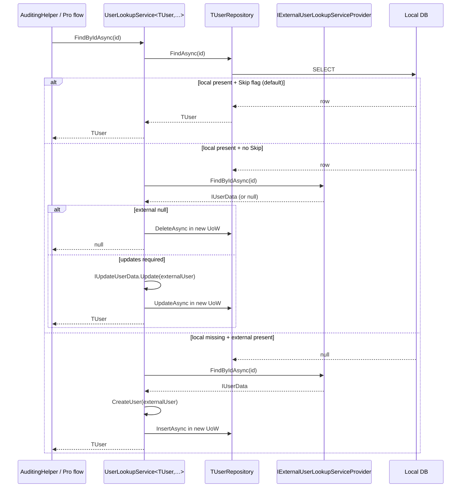

`Volo.Abp.Users.Domain` adds the *DDD-aware* user contracts on top of [`Users.Abstractions`](/modules/identity/users-abstractions). Where the abstractions assembly is purely declarative, this one introduces three small but powerful pieces: the `IUser : IAggregateRoot<Guid>` marker, the generic `IUserRepository<TUser>` and `IUserLookupService<TUser>` contracts, and the `UserLookupService<TUser,TUserRepository>` base class that knits a local user table together with an `IExternalUserLookupServiceProvider`. The two persistence companions (`Users.EntityFrameworkCore`, `Users.MongoDB`) provide reusable repository base classes.

Reference this package from any module that owns its *own* user-like aggregate but wants Identity-grade lookup semantics — the Account module's pending-user flow, an OpenIddict client store, or a domain-specific HRIS bridge.

## File inventory

| Assembly | File | Role |
| --- | --- | --- |
| `Volo.Abp.Users.Domain.Shared` | `AbpUserConsts.cs`, `AbpUsersDomainSharedModule.cs` | Length constants and the (empty) module class. |
| `Volo.Abp.Users.Domain` | `AbpUsersDomainModule.cs` | DependsOn(`AbpUsersDomainSharedModule`, `AbpUsersAbstractionModule`, `AbpDddDomainModule`). |
| `Volo.Abp.Users.Domain` | `IUser.cs` | The aggregate marker. |
| `Volo.Abp.Users.Domain` | `IUserRepository.cs` | Generic basic-repository contract. |
| `Volo.Abp.Users.Domain` | `IUserLookupService.cs` | Local + external composite lookup contract. |
| `Volo.Abp.Users.Domain` | `UserLookupService.cs` | The generic abstract base implementation. |
| `Volo.Abp.Users.Domain` | `UserLookupServiceExtensions.cs` | `GetByIdAsync` / `GetByUserNameAsync` extensions that throw `EntityNotFoundException`. |
| `Volo.Abp.Users.Domain` | `IUpdateUserData.cs` | One-method hook letting a user aggregate apply changes from an `IUserData` snapshot. |
| `Volo.Abp.Users.Domain` | `AbpUserExtensions.cs` | `user.ToAbpUserData()` projection. |
| `Volo.Abp.Users.EntityFrameworkCore` | `EfCoreUserRepositoryBase.cs` | Reusable EF Core base for any `IUser`-shaped aggregate. |
| `Volo.Abp.Users.EntityFrameworkCore` | `AbpUsersDbContextModelCreatingExtensions.cs` | `b.ConfigureAbpUser()` — the model-builder fragment Identity reuses. |
| `Volo.Abp.Users.MongoDB` | `MongoUserRepositoryBase.cs` | Reusable Mongo base for any `IUser`-shaped aggregate. |

## The `IUser` aggregate marker

```csharp
public interface IUser
    : IAggregateRoot<Guid>,
      IMultiTenant,
      IHasExtraProperties
{
    string  UserName     { get; }
    [CanBeNull] string Email     { get; }
    [CanBeNull] string Name      { get; }
    [CanBeNull] string Surname   { get; }
    bool    IsActive             { get; }
    bool    EmailConfirmed       { get; }
    [CanBeNull] string PhoneNumber { get; }
    bool    PhoneNumberConfirmed { get; }
}
```

`IUser` extends `IAggregateRoot<Guid>` so it can participate in ABP's repository/UoW pipeline. The eight properties match `IUserData` — `IdentityUser` implements both interfaces in one strike.

The `AbpUserExtensions.ToAbpUserData(this IUser user)` extension projects any `IUser` to a flat `UserData` for serialization:

```csharp
public static IUserData ToAbpUserData(this IUser user)
    => new UserData(
        id: user.Id,
        userName: user.UserName,
        email: user.Email,
        name: user.Name,
        surname: user.Surname,
        isActive: user.IsActive,
        emailConfirmed: user.EmailConfirmed,
        phoneNumber: user.PhoneNumber,
        phoneNumberConfirmed: user.PhoneNumberConfirmed,
        tenantId: user.TenantId,
        extraProperties: user.ExtraProperties);
```

## `IUserRepository<TUser>` and `IUserLookupService<TUser>`

```csharp
public interface IUserRepository<TUser> : IBasicRepository<TUser, Guid>
    where TUser : class, IUser, IAggregateRoot<Guid>
{
    Task<TUser>        FindByUserNameAsync(string userName, CancellationToken cancellationToken = default);
    Task<List<TUser>>  GetListAsync(IEnumerable<Guid> ids, CancellationToken cancellationToken = default);
    Task<List<TUser>>  SearchAsync(
        string sorting = null,
        int maxResultCount = int.MaxValue,
        int skipCount = 0,
        string filter = null,
        CancellationToken cancellationToken = default);
    Task<long>         GetCountAsync(string filter = null, CancellationToken cancellationToken = default);
}

public interface IUserLookupService<TUser>
    where TUser : class, IUser
{
    Task<TUser>             FindByIdAsync(Guid id, CancellationToken cancellationToken = default);
    Task<TUser>             FindByUserNameAsync(string userName, CancellationToken cancellationToken = default);
    Task<List<IUserData>>   SearchAsync(string sorting, string filter, int max, int skip, CancellationToken ct = default);
    Task<long>              GetCountAsync(string filter, CancellationToken ct = default);
}
```

`IUserRepository<TUser>` is the *typed* repo (returns `TUser`). `IUserLookupService<TUser>` is the *composite* lookup that uses the repository for local results and the external provider for federated results.

Two extension methods turn `null` returns into `EntityNotFoundException`:

```csharp
public static async Task<TUser> GetByIdAsync<TUser>(this IUserLookupService<TUser> svc, Guid id, …)
{
    var user = await svc.FindByIdAsync(id, ct);
    if (user == null) throw new EntityNotFoundException(typeof(TUser), id);
    return user;
}
```

## `UserLookupService<TUser, TUserRepository>` — the composite

The base class is the linchpin. It implements `IUserLookupService<TUser>` by combining a local `TUserRepository` with an optional `IExternalUserLookupServiceProvider`. The behavior table:

| Local user | External provider | External user | Action |
| --- | --- | --- | --- |
| present | absent | — | return local |
| present | present + `SkipExternalLookupIfLocalUserExists = true` (default) | — | return local |
| present | present | returns null | delete local; return null |
| present | present | returns data, local implements `IUpdateUserData` | apply update, persist, return local |
| absent | absent | — | return null |
| absent | present | returns null | return null |
| absent | present | returns data | insert local mirror, return new local |

```csharp
public async Task<TUser> FindByIdAsync(Guid id, CancellationToken ct = default)
{
    var localUser = await _userRepository.FindAsync(id, cancellationToken: ct);

    if (ExternalUserLookupServiceProvider == null)              return localUser;
    if (SkipExternalLookupIfLocalUserExists && localUser != null) return localUser;

    IUserData externalUser;
    try
    {
        externalUser = await ExternalUserLookupServiceProvider.FindByIdAsync(id, ct);
        if (externalUser == null)
        {
            if (localUser != null)
                await WithNewUowAsync(() => _userRepository.DeleteAsync(localUser, ct: ct));
            return null;
        }
    }
    catch (Exception ex)
    {
        Logger.LogException(ex);
        return localUser;     // tolerant — return whatever we have locally
    }

    if (localUser == null)
    {
        await WithNewUowAsync(() => _userRepository.InsertAsync(CreateUser(externalUser), ct: ct));
        return await _userRepository.FindAsync(id, cancellationToken: ct);
    }

    if (localUser is IUpdateUserData u && u.Update(externalUser))
        await WithNewUowAsync(() => _userRepository.UpdateAsync(localUser, ct: ct));

    return await _userRepository.FindAsync(id, cancellationToken: ct);
}

protected abstract TUser CreateUser(IUserData externalUser);   // module-specific factory
```

Two design choices stand out:

1. **`WithNewUowAsync` opens a fresh `IUnitOfWork`** so the mirror write is isolated from the caller's read-only intent.
2. **Exceptions from the external provider are *swallowed*** — the local user (if any) is returned. This makes federated user lookup graceful under partial outages.

## `IUpdateUserData` hook

```csharp
public interface IUpdateUserData
{
    bool Update([NotNull] IUserData user);    // returns true if anything changed
}
```

`IdentityUser` *does not* explicitly implement this — it gets the behavior through `AbpUserExtensions.Update(user, IUserData)` (called by the Pro identity-server bridge in some flows). Custom aggregates that mirror from an external source should implement it directly:

```csharp
public class HrisUser : AggregateRoot<Guid>, IUser, IUpdateUserData
{
    public bool Update(IUserData u)
    {
        var changed = false;
        if (Name    != u.Name)    { Name = u.Name; changed = true; }
        if (Surname != u.Surname) { Surname = u.Surname; changed = true; }
        if (Email   != u.Email)   { Email = u.Email; EmailConfirmed = u.EmailConfirmed; changed = true; }
        return changed;
    }
}
```

The return value is the optimization that prevents `UserLookupService.FindByIdAsync` from triggering a `Save` round trip when nothing actually changed.

## `EfCoreUserRepositoryBase<TDbContext,TUser>`

```csharp
public abstract class EfCoreUserRepositoryBase<TDbContext, TUser>
    : EfCoreRepository<TDbContext, TUser, Guid>, IUserRepository<TUser>
    where TDbContext : IEfCoreDbContext
    where TUser      : class, IUser
{
    public async Task<TUser> FindByUserNameAsync(string userName, CancellationToken ct = default)
        => await (await GetDbSetAsync())
            .OrderBy(x => x.Id)
            .FirstOrDefaultAsync(u => u.UserName == userName, GetCancellationToken(ct));

    public async Task<List<TUser>> SearchAsync(string sorting, int max, int skip, string filter, CancellationToken ct = default)
        => await (await GetDbSetAsync())
            .WhereIf(!filter.IsNullOrWhiteSpace(), u =>
                u.UserName.Contains(filter) ||
                (u.Email != null   && u.Email.Contains(filter))   ||
                (u.Name != null    && u.Name.Contains(filter))    ||
                (u.Surname != null && u.Surname.Contains(filter)))
            .OrderBy(sorting.IsNullOrEmpty() ? nameof(IUser.UserName) : sorting)
            .PageBy(skip, max)
            .ToListAsync(GetCancellationToken(ct));
}
```

That four-field filter (`UserName`, `Email`, `Name`, `Surname`) is the canonical "search by anything" expression — every Identity grid uses it.

The `ConfigureAbpUser()` model-builder extension applied per aggregate:

```csharp
public static void ConfigureAbpUser<TUser>(this EntityTypeBuilder<TUser> b) where TUser : class, IUser
{
    b.Property(u => u.TenantId).HasColumnName(nameof(IUser.TenantId));
    b.Property(u => u.UserName).IsRequired().HasMaxLength(AbpUserConsts.MaxUserNameLength).HasColumnName(nameof(IUser.UserName));
    b.Property(u => u.Email).IsRequired().HasMaxLength(AbpUserConsts.MaxEmailLength).HasColumnName(nameof(IUser.Email));
    b.Property(u => u.Name).HasMaxLength(AbpUserConsts.MaxNameLength).HasColumnName(nameof(IUser.Name));
    b.Property(u => u.Surname).HasMaxLength(AbpUserConsts.MaxSurnameLength).HasColumnName(nameof(IUser.Surname));
    b.Property(u => u.EmailConfirmed).HasDefaultValue(false).HasColumnName(nameof(IUser.EmailConfirmed));
    b.Property(u => u.PhoneNumber).HasMaxLength(AbpUserConsts.MaxPhoneNumberLength).HasColumnName(nameof(IUser.PhoneNumber));
    b.Property(u => u.PhoneNumberConfirmed).HasDefaultValue(false).HasColumnName(nameof(IUser.PhoneNumberConfirmed));
    b.Property(u => u.IsActive).HasColumnName(nameof(IUser.IsActive));
}
```

This is the function `IdentityDbContextModelBuilderExtensions.ConfigureIdentity` calls inside the `IdentityUser` block — using it in your own aggregate keeps the column layout consistent (and your migration files diff-free against Identity's).

## `MongoUserRepositoryBase<TDbContext,TUser>`

```csharp
public virtual async Task<TUser> FindByUserNameAsync(string userName, CancellationToken ct = default)
    => await (await GetMongoQueryableAsync(ct))
        .OrderBy(x => x.Id)
        .FirstOrDefaultAsync(u => u.UserName == userName, ct);

public async Task<List<TUser>> SearchAsync(string sorting, int max, int skip, string filter, CancellationToken ct = default)
    => await (await GetMongoQueryableAsync(ct))
        .WhereIf<TUser, IMongoQueryable<TUser>>(
            !filter.IsNullOrWhiteSpace(),
            u => u.UserName.Contains(filter) ||
                 (u.Email   != null && u.Email.Contains(filter)) ||
                 (u.Name    != null && u.Name.Contains(filter)) ||
                 (u.Surname != null && u.Surname.Contains(filter)))
        .OrderBy(sorting.IsNullOrEmpty() ? nameof(IUserData.UserName) : sorting)
        .As<IMongoQueryable<TUser>>()
        .PageBy<TUser, IMongoQueryable<TUser>>(skip, max)
        .ToListAsync(ct);
```

Same surface, Mongo idioms. `IdentityUser` extends this through `MongoIdentityUserRepository` for the OU/role joins.

## Sequence: federated user mirror via `UserLookupService`



## Gotchas

<Warning>
**`SkipExternalLookupIfLocalUserExists` defaults to `true`.** That makes the local table authoritative — once a user has been mirrored, the external provider is skipped on subsequent reads. Flip it to `false` only if your external source is the source-of-truth for profile changes; otherwise you re-hit the upstream API on every request.
</Warning>

<Warning>
**The `Update(IUserData)` hook does not reconcile *role* membership.** Roles are managed by the local `IdentityUserManager`. If your external source assigns roles, override `CreateUser` and `Update` to apply them through the manager rather than mutating an arbitrary collection.
</Warning>

<Warning>
**`AbpUsersDomainSharedModule` does *not* declare `IUser`.** `IUser` lives in `Volo.Abp.Users.Domain` because it inherits from `IAggregateRoot<Guid>`. Code that needs to talk about a user but *cannot* depend on DDD types (e.g. a shared HTTP API contract) should reference `IUserData` from `Users.Abstractions` instead.
</Warning>

<Tip>
The matching test fakes are easy to write — implement a `FakeUserRepository : IUserRepository<MyUser>` over an in-memory dictionary plus a no-op `IExternalUserLookupServiceProvider`. The `UserLookupService` behavior contract is fully covered without a database.
</Tip>

## Cross-links

<CardGroup cols={2}>
<Card title="Users.Abstractions" icon="user" href="/modules/identity/users-abstractions">
`IUserData`, `UserData`, `IExternalUserLookupServiceProvider`.
</Card>
<Card title="Identity.Domain" icon="diagram-project" href="/modules/identity/domain">
The concrete `IdentityUser`/`IdentityUserManager` built on these contracts.
</Card>
<Card title="Identity.EF Core" icon="database" href="/modules/identity/efcore">
Uses `ConfigureAbpUser` in `ConfigureIdentity()`.
</Card>
<Card title="Framework: DDD" icon="puzzle-piece" href="/framework/architecture/domain-driven-design">
Aggregate root, repository and unit-of-work foundations.
</Card>
</CardGroup>
