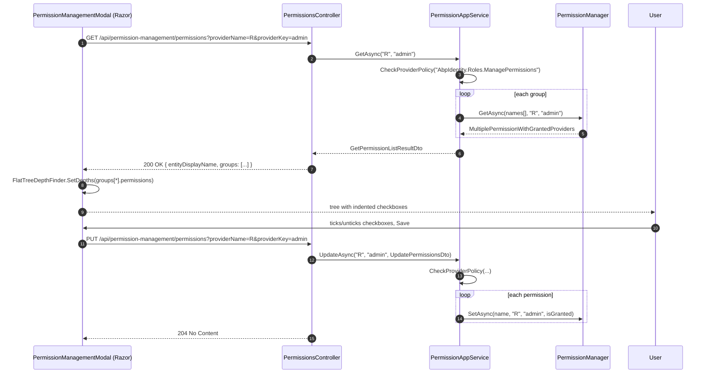

`Volo.Abp.PermissionManagement.Application.Contracts` is the contract layer that every UI client of the module depends on — the MVC Razor page, the Blazor modal, the WebAssembly proxy, the Angular `permissionManagement` package, and any custom microservice client. It declares the surface that the [HTTP API](/modules/permission-management/http-api) exposes and the DTOs that flow over the wire.

## File inventory

```
Volo.Abp.PermissionManagement.Application.Contracts/Volo/Abp/PermissionManagement/
├── AbpPermissionManagementApplicationContractsModule.cs
├── GetPermissionListResultDto.cs
├── IPermissionAppService.cs
├── PermissionGrantInfoDto.cs
├── PermissionGroupDto.cs
├── PermissionManagementRemoteServiceConsts.cs
├── ProviderInfoDto.cs
├── UpdatePermissionDto.cs
├── UpdatePermissionsDto.cs
└── Integration/
    └── IPermissionIntegrationService.cs
```

The module class is minimal and only chains dependencies:

```csharp
[DependsOn(typeof(AbpDddApplicationContractsModule))]
[DependsOn(typeof(AbpPermissionManagementDomainSharedModule))]
[DependsOn(typeof(AbpAuthorizationAbstractionsModule))]
public class AbpPermissionManagementApplicationContractsModule : AbpModule { }
```

It pulls in:

- `AbpDddApplicationContractsModule` for `IApplicationService`, `ListResultDto<T>`, and friends.
- `AbpPermissionManagementDomainSharedModule` (covered in [Domain.Shared](/modules/permission-management/domain-shared)) for `IPermissionFinder` and constants.
- `AbpAuthorizationAbstractionsModule` for the permission attributes that decorate downstream services.

Note that **no** `AbpPermissionManagementDomainModule` is referenced — the contracts layer can be deployed inside a thin client (Blazor WASM) without dragging in EF Core.

## The remote service constants

Both the HTTP API and the client proxies key off two strings:

```csharp
public class PermissionManagementRemoteServiceConsts
{
    public const string RemoteServiceName = "AbpPermissionManagement";
    public const string ModuleName        = "permissionManagement";
}
```

- `RemoteServiceName` controls which `HttpClientBuilder` is used to make outgoing calls (you can map it to a microservice base URL via `AbpRemoteServiceOptions.RemoteServices`).
- `ModuleName` is the area name on the controllers and also the name disabled in `DynamicJavaScriptProxyOptions` from the Web module so the generated `abp.services.permissionManagement.*` JS namespace is not double-emitted.

## The application service contract

```csharp
public interface IPermissionAppService : IApplicationService
{
    Task<GetPermissionListResultDto> GetAsync([NotNull] string providerName, [NotNull] string providerKey);
    Task UpdateAsync([NotNull] string providerName, [NotNull] string providerKey, UpdatePermissionsDto input);
}
```

Only two methods. Notice both take **`providerName` and `providerKey`** rather than a typed concept like `roleId`/`userId`. This is intentional — the same modal works against R (role), U (user), and C (client) by just changing the two strings.

> **Gotcha** — the parameter `[NotNull]` annotations come from JetBrains and are enforced by ReSharper at build time, not by ASP.NET model binding. A client that sends `providerName=""` will land in `PermissionAppService.GetAsync` which then fails on the `Options.ProviderPolicies.GetOrDefault(providerName)` lookup with the rather opaque message `No policy defined to get/set permissions for the provider ''.`

## DTO shape

The response builds a three-level tree: result → groups → permissions.

### GetPermissionListResultDto

```csharp
public class GetPermissionListResultDto
{
    public string EntityDisplayName { get; set; }
    public List<PermissionGroupDto> Groups { get; set; }
}
```

`EntityDisplayName` is filled in two ways:

1. The default `PermissionAppService` sets it to `providerKey` — so for a user it is the user id and for a role it is the role name.
2. The MVC Razor page overrides it from the `providerKeyDisplayName` query string when present (so the modal title can read "Permissions for Admin" instead of "Permissions for `<guid>`").

### PermissionGroupDto

```csharp
public class PermissionGroupDto
{
    public string Name { get; set; }
    public string DisplayName { get; set; }
    public string DisplayNameKey { get; set; }
    public string DisplayNameResource { get; set; }
    public List<PermissionGrantInfoDto> Permissions { get; set; }
}
```

`Name` is the immutable identifier of the `PermissionGroupDefinition` (e.g. `"AbpIdentity"`). `DisplayName` is the localized string (`Localize(StringLocalizerFactory)` on the server). `DisplayNameKey` and `DisplayNameResource` are *only* populated when the group's `DisplayName` is a `LocalizableString` — they let Angular re-localize using `Volo.Abp.AspNetCore.Mvc.UI.Theme.Shared` in the browser without round-tripping for translations.

### PermissionGrantInfoDto

```csharp
public class PermissionGrantInfoDto
{
    public string Name { get; set; }
    public string DisplayName { get; set; }
    public string ParentName { get; set; }
    public bool IsGranted { get; set; }
    public List<string> AllowedProviders { get; set; }
    public List<ProviderInfoDto> GrantedProviders { get; set; }
}
```

The flatness is deliberate — the parent/child tree is represented by `ParentName` pointing at another `Name` in the same group. This is the shape the `FlatTreeDepthFinder<T>` in the Web package consumes to compute indentation depths.

- `AllowedProviders` mirrors `PermissionDefinition.Providers`. If empty, every provider may carry the permission.
- `GrantedProviders` is the list of providers that currently grant it, as `(name, key)` tuples. This is what lets the modal show "Granted via role: admin" badges and grey out the checkbox.

### ProviderInfoDto

```csharp
public class ProviderInfoDto
{
    public string ProviderName { get; set; }
    public string ProviderKey  { get; set; }
}
```

Mirrors `PermissionValueProviderInfo` from the domain layer.

### Update DTOs

```csharp
public class UpdatePermissionsDto
{
    public UpdatePermissionDto[] Permissions { get; set; }
}

public class UpdatePermissionDto
{
    public string Name { get; set; }
    public bool   IsGranted { get; set; }
}
```

There is no validation attribute — clients can send any string. `PermissionManager.SetAsync` silently ignores undefined permission names (covered in [Domain](/modules/permission-management/domain)), but throws on disabled or provider-incompatible ones.

## Integration service

```csharp
namespace Volo.Abp.PermissionManagement.Integration;

[IntegrationService]
public interface IPermissionIntegrationService : IApplicationService
{
    Task<ListResultDto<IsGrantedResponse>> IsGrantedAsync(List<IsGrantedRequest> input);
}
```

The `[IntegrationService]` attribute tells the ABP HTTP infrastructure that this is an *inter-service* endpoint:

- It is exposed at `/integration-api/permission-management/permissions/is-granted` (note the `integration-api` prefix instead of `api`) by `PermissionIntegrationController`.
- It does not surface in the public API metadata that Swagger and Angular `AbpProxyGenerator` consume by default.
- Microservice gateways usually block calls to `/integration-api/*` from the public internet.

The endpoint exists so service A can ask service B "is this user granted these permissions?" without going through OpenIddict scopes. The default implementation delegates to `IPermissionFinder`, which itself delegates to `IPermissionManager.GetAsync(...)` against `U` keys.

## Why both `IsGrantedRequest` and `UpdatePermissionsDto`?

The two halves of the contract solve different problems:

| Direction | Contract | Endpoint | Caller |
| --- | --- | --- | --- |
| Read | `IPermissionAppService.GetAsync` | `GET /api/permission-management/permissions` | Admin UI rendering a checkbox tree. |
| Write | `IPermissionAppService.UpdateAsync` | `PUT /api/permission-management/permissions` | Admin UI saving the modal. |
| Read | `IPermissionIntegrationService.IsGrantedAsync` | `GET /integration-api/permission-management/permissions/is-granted` | Another microservice prefetching authorization for a batch of users. |

The first two require the matching `ProviderPolicies` entry (e.g. `"AbpIdentity.Roles.ManagePermissions"`). The third is gated only by whatever auth scheme protects integration endpoints in your deployment — typically a service-to-service OpenIddict scope.

## Client-side mirror

In the HTTP API Client package, every interface here gets a static client proxy via `AddStaticHttpClientProxies(typeof(AbpPermissionManagementApplicationContractsModule).Assembly, ...)`. That works precisely because:

- `IPermissionAppService` lives in this assembly.
- `IPermissionIntegrationService` lives in this assembly.
- The Angular CLI's `generate-proxy` command scans the contracts assembly's metadata to emit TypeScript clients.

If you `IServiceCollection.AddTransient<IPermissionAppService, MyAppService>()` *after* the static proxies registration, your replacement wins. This is how some commercial templates inject a tenant-aware cache layer.

## Sequence: Razor modal hitting the contract



## Gotchas

- The DTO model has no concept of an *override* — `IsGranted` is a single boolean. The UI infers "granted by another provider" from the presence of `GrantedProviders[*].ProviderName != currentProviderName`. Custom UIs should do the same instead of inventing a tri-state.
- `UpdatePermissionsDto.Permissions` is a C# array, but the Razor/Blazor modals always send the *full* list (every visible permission) on save. This is by design — the server treats unspecified permissions as "no change" because `PermissionManager.SetAsync` short-circuits when the current state matches. Sending a partial update is supported.
- The integration endpoint returns `ListResultDto<IsGrantedResponse>` — a thin wrapper. The HTTP client proxy unwraps it into `List<IsGrantedResponse>` in `HttpClientPermissionFinder`. Calling the controller directly returns the wrapped form.
- `PermissionGroupDto.DisplayNameKey` is non-null only when the group's display name was constructed via `LocalizableString.Create<TResource>("Key")`. Hard-coded literal strings come back with `DisplayNameKey == null` and the UI must use the already-localized `DisplayName` verbatim.

Continue with [Application](/modules/permission-management/application).
