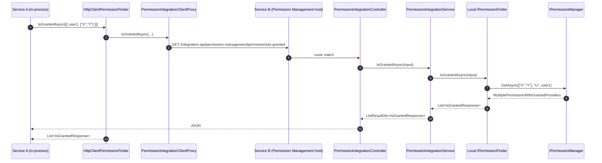

`Volo.Abp.PermissionManagement.Application` is the thin server-side implementation of the contracts described in [Application.Contracts](/modules/permission-management/application-contracts). It hosts two services:

- `PermissionAppService` — the user-facing CRUD over grants used by the modal UI.
- `PermissionIntegrationService` — the inter-service "is-granted" endpoint that wraps `IPermissionFinder`.

## File inventory

```
Volo.Abp.PermissionManagement.Application/Volo/Abp/PermissionManagement/
├── AbpPermissionManagementApplicationModule.cs
├── PermissionAppService.cs
└── Integration/
    └── PermissionIntegrationService.cs
```

The module class chains the Domain layer and the Application Contracts:

```csharp
[DependsOn(
    typeof(AbpPermissionManagementDomainModule),
    typeof(AbpPermissionManagementApplicationContractsModule),
    typeof(AbpDddApplicationModule)
)]
public class AbpPermissionManagementApplicationModule : AbpModule { }
```

No `ConfigureServices` overrides — every service is registered automatically because `ApplicationService` / `IApplicationService` triggers the conventional registration in `AbpDddApplicationModule`.

## PermissionAppService

```csharp
[Authorize]
public class PermissionAppService : ApplicationService, IPermissionAppService
{
    protected PermissionManagementOptions Options { get; }
    protected IPermissionManager PermissionManager { get; }
    protected IPermissionDefinitionManager PermissionDefinitionManager { get; }
    protected ISimpleStateCheckerManager<PermissionDefinition> SimpleStateCheckerManager { get; }
}
```

Two facts to call out before walking the code:

- `[Authorize]` is the only blanket attribute. There is no per-method `[Authorize("...")]` because the policy depends on the *provider name* in the request, not on the method. The class enforces this manually via `CheckProviderPolicy`.
- The class inherits `ApplicationService`, giving it `CurrentTenant`, `AuthorizationService`, `StringLocalizerFactory`, `ObjectMapper`, and `Logger` out of the box.

### `GetAsync` — building the grouped DTO tree

```csharp
public virtual async Task<GetPermissionListResultDto> GetAsync(string providerName, string providerKey)
{
    await CheckProviderPolicy(providerName);

    var result = new GetPermissionListResultDto
    {
        EntityDisplayName = providerKey,
        Groups = new List<PermissionGroupDto>()
    };

    var multiTenancySide = CurrentTenant.GetMultiTenancySide();

    foreach (var group in await PermissionDefinitionManager.GetGroupsAsync())
    {
        var groupDto = CreatePermissionGroupDto(group);

        var neededCheckPermissions = new List<PermissionDefinition>();

        var permissions = group.GetPermissionsWithChildren()
            .Where(x => x.IsEnabled)
            .Where(x => !x.Providers.Any() || x.Providers.Contains(providerName))
            .Where(x => x.MultiTenancySide.HasFlag(multiTenancySide));

        foreach (var permission in permissions)
        {
            if (await SimpleStateCheckerManager.IsEnabledAsync(permission))
            {
                neededCheckPermissions.Add(permission);
            }
        }

        if (!neededCheckPermissions.Any())
        {
            continue;
        }

        var grantInfoDtos = neededCheckPermissions
            .Select(CreatePermissionGrantInfoDto)
            .ToList();

        var multipleGrantInfo = await PermissionManager.GetAsync(
            neededCheckPermissions.Select(x => x.Name).ToArray(), providerName, providerKey);

        foreach (var grantInfo in multipleGrantInfo.Result)
        {
            var grantInfoDto = grantInfoDtos.First(x => x.Name == grantInfo.Name);

            grantInfoDto.IsGranted = grantInfo.IsGranted;

            foreach (var provider in grantInfo.Providers)
            {
                grantInfoDto.GrantedProviders.Add(new ProviderInfoDto
                {
                    ProviderName = provider.Name,
                    ProviderKey  = provider.Key,
                });
            }

            groupDto.Permissions.Add(grantInfoDto);
        }

        if (groupDto.Permissions.Any())
        {
            result.Groups.Add(groupDto);
        }
    }

    return result;
}
```

The filtering order is meaningful and matches what `PermissionManager.GetInternalAsync` itself does:

1. `permission.IsEnabled` — fixed boolean on the definition.
2. Provider allow-list (`x.Providers.Contains(providerName)`) — empty allow-list means "any provider".
3. Multi-tenancy side compatibility — `permission.MultiTenancySide` is a `Flags` enum; the call uses `HasFlag(CurrentTenant.GetMultiTenancySide())`.
4. `ISimpleStateCheckerManager.IsEnabledAsync` — composite of any registered `ISimpleStateChecker<PermissionDefinition>` (e.g. feature flags from the Feature Management module).

Groups that end up with zero displayable permissions are *omitted* from the result, so the UI never renders an empty tab.

### `CreatePermissionGroupDto` and the localization triple

```csharp
private PermissionGroupDto CreatePermissionGroupDto(PermissionGroupDefinition group)
{
    var localizableDisplayName = group.DisplayName as LocalizableString;

    return new PermissionGroupDto
    {
        Name        = group.Name,
        DisplayName = group.DisplayName?.Localize(StringLocalizerFactory),
        DisplayNameKey = localizableDisplayName?.Name,
        DisplayNameResource = localizableDisplayName?.ResourceType != null
            ? LocalizationResourceNameAttribute.GetName(localizableDisplayName.ResourceType)
            : null,
        Permissions = new List<PermissionGrantInfoDto>()
    };
}
```

`DisplayNameKey` and `DisplayNameResource` are only populated when the group's display name is a `LocalizableString`. Hard-coded `string` display names come back with both fields null and the client must use `DisplayName` verbatim.

### `CreatePermissionGrantInfoDto`

```csharp
private PermissionGrantInfoDto CreatePermissionGrantInfoDto(PermissionDefinition permission)
{
    return new PermissionGrantInfoDto
    {
        Name             = permission.Name,
        DisplayName      = permission.DisplayName?.Localize(StringLocalizerFactory),
        ParentName       = permission.Parent?.Name,
        AllowedProviders = permission.Providers,
        GrantedProviders = new List<ProviderInfoDto>()
    };
}
```

`AllowedProviders` is copied **by reference** from the `PermissionDefinition.Providers` list. The DTO is serialized immediately to JSON so the shared reference doesn't bite — but if you subclass `PermissionAppService` and reuse the DTO, beware.

### `UpdateAsync`

```csharp
public virtual async Task UpdateAsync(string providerName, string providerKey, UpdatePermissionsDto input)
{
    await CheckProviderPolicy(providerName);

    foreach (var permissionDto in input.Permissions)
    {
        await PermissionManager.SetAsync(
            permissionDto.Name, providerName, providerKey, permissionDto.IsGranted);
    }
}
```

It loops one permission at a time. Each `SetAsync` call:

- Validates the definition, raises an exception for disabled or provider-incompatible permissions.
- Short-circuits if the current state matches the requested state.
- Otherwise dispatches to the matching `IPermissionManagementProvider` which inserts or deletes a `PermissionGrant` row and emits an `EntityChangedEventData<PermissionGrant>` — which the cache invalidator picks up.

There is no transaction batching here. If grant #5 of 20 throws, grants #1–#4 are already committed. ABP's default unit-of-work behavior wraps the whole HTTP request in one transaction *only* when the underlying provider supports it (EF Core does; MongoDB needs a replica-set session). On MongoDB stand-alone deployments this can leave partial state — usually irrelevant for the modal because the UI re-fetches after save.

### `CheckProviderPolicy` — the policy gate

```csharp
protected virtual async Task CheckProviderPolicy(string providerName)
{
    var policyName = Options.ProviderPolicies.GetOrDefault(providerName);
    if (policyName.IsNullOrEmpty())
    {
        throw new AbpException(
            $"No policy defined to get/set permissions for the provider '{providerName}'. " +
            $"Use {nameof(PermissionManagementOptions)} to map the policy.");
    }

    await AuthorizationService.CheckAsync(policyName);
}
```

This is the **only** authorization check on the read/write endpoints beyond `[Authorize]`. The policy lookup uses the `PermissionManagementOptions.ProviderPolicies` dictionary that is populated by the satellite packages:

| Satellite | Provider name | Policy mapped |
| --- | --- | --- |
| `Volo.Abp.PermissionManagement.Domain.Identity` | `U` (UserPermissionValueProvider) | `AbpIdentity.Users.ManagePermissions` |
| `Volo.Abp.PermissionManagement.Domain.Identity` | `R` (RolePermissionValueProvider) | `AbpIdentity.Roles.ManagePermissions` |
| `Volo.Abp.PermissionManagement.Domain.IdentityServer` | `C` (ClientPermissionValueProvider) | `IdentityServer.Client.ManagePermissions` |
| `Volo.Abp.PermissionManagement.Domain.OpenIddict` | `C` (ClientPermissionValueProvider) | `OpenIddictPro.Application.ManagePermissions` |

The OpenIddict and IdentityServer entries both map to provider name `"C"` — only one of those modules is loaded at a time, so there is no conflict at runtime. The mapping is also the contract surface for custom providers — if you add your own `OrganizationUnitPermissionManagementProvider`, you must also register a policy via `Configure<PermissionManagementOptions>(o => o.ProviderPolicies["OU"] = "MyApp.OUs.ManagePermissions")`, otherwise the app service refuses every call with the exception above.

## PermissionIntegrationService

```csharp
[IntegrationService]
public class PermissionIntegrationService : ApplicationService, IPermissionIntegrationService
{
    protected IPermissionFinder PermissionFinder { get; }

    public PermissionIntegrationService(IPermissionFinder permissionFinder)
        => PermissionFinder = permissionFinder;

    public virtual async Task<ListResultDto<IsGrantedResponse>> IsGrantedAsync(List<IsGrantedRequest> input)
    {
        return new ListResultDto<IsGrantedResponse>(await PermissionFinder.IsGrantedAsync(input));
    }
}
```

A pure pass-through to `IPermissionFinder`. In the monolithic deployment that finder resolves to `PermissionFinder` (Domain layer), which calls into `IPermissionManager.GetAsync(..., U, userId)`. In a remote consumer the finder is `HttpClientPermissionFinder` (Client layer), which round-trips through this same controller — exactly the cyclical pattern that the `[IntegrationService]` attribute exists to support.

> **Gotcha** — `[IntegrationService]` does *not* automatically enforce a specific scope. The endpoint is reachable by any authenticated client that can hit `/integration-api/...`. Gateway configuration is responsible for limiting it to trusted callers.

## Sequence: integration service in a microservice mesh



The fact that Service A's local `IPermissionFinder` is `HttpClientPermissionFinder` and Service B's is `PermissionFinder` is determined entirely by which assembly each one references. The contract is identical.

## When to subclass vs. when to register a provider

Two extension paths often confused:

| Goal | Where |
| --- | --- |
| Add a new entity type that can carry grants (e.g. organization unit, group, machine identity). | Implement `IPermissionManagementProvider` and add it to `PermissionManagementOptions.ManagementProviders`. |
| Change *how* the modal looks or what fields it shows. | Subclass `PermissionAppService` (override `CreatePermissionGrantInfoDto`, `CreatePermissionGroupDto`) and re-register it with `[Dependency(ReplaceServices = true)]`. |
| Enforce extra checks before a save (audit, approval workflow). | Subclass `PermissionAppService`, override `UpdateAsync`, call base after side effects. |
| Cache or rate-limit `IsGrantedAsync`. | Decorate or replace `IPermissionFinder` / `IPermissionIntegrationService` in your downstream module. |

## Gotchas

- The class is `[Authorize]` (any authenticated user) — the *provider policy* is what really gates it. Forgetting to register a policy for a custom provider effectively turns the endpoint into a service-account 500.
- The looping `SetAsync` calls do not respect `MultiplePermissionGrantResult` semantics — they apply state per-row even when the row is "implicit through another provider". Saving a permission to `IsGranted=true` for the user when the role already grants it does insert a redundant `PermissionGrant` row (which the next read collapses back into the role provider — harmless but visible in `AbpPermissionGrants`).
- The integration service does not impersonate the target user. It calls `IPermissionFinder` under the current authenticated principal (likely a service account), then asks about *that user id's* permissions. Authorization on *who can ask* is up to the gateway.
- The DTO tree omits empty groups (no displayable permissions). A custom UI that hard-codes a tab per group will silently miss tabs whose permissions are all disabled by `ISimpleStateChecker` (typically a missing feature).

Continue with [EF Core](/modules/permission-management/efcore).
