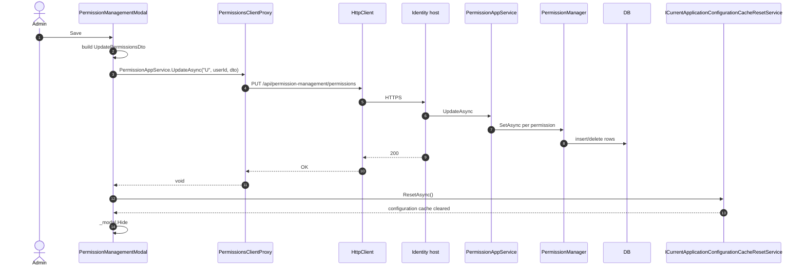

The Blazor packages render the same modal as the [MVC Razor page](/modules/permission-management/web) but with Blazorise components. There are three deliverables — a shared `Volo.Abp.PermissionManagement.Blazor` package and two hosting wrappers (`Server` and `WebAssembly`).

## File inventory

```
Volo.Abp.PermissionManagement.Blazor/
├── AbpPermissionManagementBlazorModule.cs
└── Components/
    ├── PermissionManagementModal.razor
    └── PermissionManagementModal.razor.cs

Volo.Abp.PermissionManagement.Blazor.Server/
└── AbpPermissionManagementBlazorServerModule.cs

Volo.Abp.PermissionManagement.Blazor.WebAssembly/
└── AbpPermissionManagementBlazorWebAssemblyModule.cs
```

## Shared module

```csharp
[DependsOn(
    typeof(AbpAspNetCoreComponentsWebThemingModule),
    typeof(AbpAutoMapperModule),
    typeof(AbpPermissionManagementApplicationContractsModule)
)]
public class AbpPermissionManagementBlazorModule : AbpModule
{
    public override void ConfigureServices(ServiceConfigurationContext context)
    {
        Configure<AbpLocalizationOptions>(options =>
        {
            options.Resources
                .Get<AbpPermissionManagementResource>()
                .AddBaseTypes(typeof(AbpUiResource));
        });
    }
}
```

The module only declares dependencies and registers the localization resource. No services here — the component itself is wired up via Blazor's component discovery in any application that references this assembly.

## Server hosting

```csharp
[DependsOn(
    typeof(AbpPermissionManagementBlazorModule),
    typeof(AbpAspNetCoreComponentsServerThemingModule)
)]
public class AbpPermissionManagementBlazorServerModule : AbpModule { }
```

Used in Blazor Server hosts. Notice it does **not** depend on `AbpPermissionManagementApplication` or `HttpApi.Client` — Blazor Server hits `IPermissionAppService` in-process. The host application is expected to register one (either the real application service or a client proxy to a remote one).

## WebAssembly hosting

```csharp
[DependsOn(
    typeof(AbpPermissionManagementBlazorModule),
    typeof(AbpAspNetCoreComponentsWebAssemblyThemingModule),
    typeof(AbpPermissionManagementHttpApiClientModule)
)]
public class AbpPermissionManagementBlazorWebAssemblyModule : AbpModule { }
```

The WebAssembly variant adds `AbpPermissionManagementHttpApiClientModule` so the browser app calls into the back-end via the [client proxies](/modules/permission-management/http-api-client).

## The component

`PermissionManagementModal.razor` and its code-behind together implement a Blazorise modal that mirrors the Razor page's UX:

```csharp
public partial class PermissionManagementModal
{
    [Inject] protected IPermissionAppService PermissionAppService { get; set; }
    [Inject] protected ICurrentApplicationConfigurationCacheResetService
                       CurrentApplicationConfigurationCacheResetService { get; set; }
    [Inject] protected IOptions<AbpLocalizationOptions> LocalizationOptions { get; set; }

    protected Modal _modal;
    protected string _providerName;
    protected string _providerKey;
    protected string _entityDisplayName;
    protected List<PermissionGroupDto> _groups;
    protected List<PermissionGrantInfoDto> _disabledPermissions = new();
    protected string _selectedTabName;
    protected int  _grantedPermissionCount;
    protected int  _notGrantedPermissionCount;
    protected bool _selectAllDisabled;
}
```

The component holds raw DTOs rather than the Razor page's view-model classes — Blazor's two-way binding plays nicely with the contract DTOs because every relevant property is mutable.

### Grant counters

```csharp
protected bool GrantAll
{
    get => _notGrantedPermissionCount == 0;
    set
    {
        if (_groups == null) return;

        _grantedPermissionCount = 0;
        _notGrantedPermissionCount = 0;

        foreach (var permission in _groups.SelectMany(x => x.Permissions))
        {
            if (!IsDisabledPermission(permission))
            {
                permission.IsGranted = value;
                if (value) _grantedPermissionCount++;
                else        _notGrantedPermissionCount++;
            }
        }
    }
}
```

`_grantedPermissionCount` and `_notGrantedPermissionCount` are updated on every change. They drive the "grant all" checkbox state (`GrantAll => _notGrantedPermissionCount == 0`) and the badge counts in the modal header.

### `OpenAsync`

```csharp
public virtual async Task OpenAsync(string providerName, string providerKey, string entityDisplayName = null)
{
    try
    {
        _providerName = providerName;
        _providerKey  = providerKey;

        var result = await PermissionAppService.GetAsync(_providerName, _providerKey);

        _entityDisplayName = entityDisplayName ?? result.EntityDisplayName;
        _groups = result.Groups;

        _selectAllDisabled = _groups.All(IsPermissionGroupDisabled);

        _grantedPermissionCount = 0;
        _notGrantedPermissionCount = 0;
        foreach (var permission in _groups.SelectMany(x => x.Permissions))
        {
            if (permission.IsGranted
                && permission.GrantedProviders.All(x => x.ProviderName != _providerName))
            {
                _disabledPermissions.Add(permission);
                continue;
            }

            if (permission.IsGranted) _grantedPermissionCount++;
            else                       _notGrantedPermissionCount++;
        }

        _selectedTabName = GetNormalizedGroupName(_groups.First().Name);

        await InvokeAsync(_modal.Show);
    }
    catch (Exception ex)
    {
        await HandleErrorAsync(ex);
    }
}
```

The same "granted by another provider" rule used by the Razor page is materialized here as `_disabledPermissions`. A permission is added to the disabled list when it is granted but *none* of the granting providers matches the one being edited.

### Save

```csharp
protected virtual async Task SaveAsync()
{
    try
    {
        var updateDto = new UpdatePermissionsDto
        {
            Permissions = _groups
                .SelectMany(g => g.Permissions)
                .Select(p => new UpdatePermissionDto { IsGranted = p.IsGranted, Name = p.Name })
                .ToArray()
        };

        if (!updateDto.Permissions.Any(x => x.IsGranted))
        {
            if (!await Message.Confirm(L["SaveWithoutAnyPermissionsWarningMessage"].Value))
            {
                return;
            }
        }

        await PermissionAppService.UpdateAsync(_providerName, _providerKey, updateDto);

        await CurrentApplicationConfigurationCacheResetService.ResetAsync();

        await InvokeAsync(_modal.Hide);
    }
    catch (Exception ex)
    {
        await HandleErrorAsync(ex);
    }
}
```

Two divergences from the Razor page:

1. **Empty-set confirmation.** If saving would leave the role/user with zero granted permissions, the user is asked for confirmation via Blazorise's `Message.Confirm`. The Razor page does not warn — it lets the form post go through.
2. **Cache reset.** Where the Razor page publishes a `CurrentApplicationConfigurationCacheResetEventData` over the local event bus, the Blazor component calls `ICurrentApplicationConfigurationCacheResetService.ResetAsync()` directly. The implementation under the hood is the same on Blazor Server; on WebAssembly the reset clears the client's in-memory `ApplicationConfigurationDto` so the next call refreshes it.

### Parent/child propagation

The Blazor component implements the cascading-toggle behavior the Razor page leaves to the client (it has none):

```csharp
protected virtual void PermissionChanged(bool value, PermissionGroupDto permissionGroup,
                                         PermissionGrantInfoDto permission)
{
    SetPermissionGrant(permission, value);

    if (value && permission.ParentName != null)
    {
        var parentPermission = GetParentPermission(permissionGroup, permission);
        SetPermissionGrant(parentPermission, true);
    }
    else if (value == false)
    {
        var childPermissions = GetChildPermissions(permissionGroup, permission);
        foreach (var childPermission in childPermissions)
        {
            SetPermissionGrant(childPermission, false);
        }
    }
}
```

Rules:

- Granting a child also grants its parent (so the parent's checkbox doesn't visually contradict the child).
- Revoking a parent revokes all children (cascade).

> **Gotcha** — `GetChildPermissions` uses `x.Name.StartsWith(permission.Name)` to find descendants. This works because the convention is `Parent.Child` naming (`Books.Create`, `Books.Edit`, etc.), but it fails for permissions that happen to share a name prefix without being parent/child (`Books.Edit` and `BooksAdmin.View`). Naming permissions in dotted hierarchies is therefore not optional.

### Other helpers

```csharp
protected virtual void GroupGrantAllChanged(bool value, PermissionGroupDto permissionGroup)
{
    foreach (var permission in permissionGroup.Permissions)
    {
        if (!IsDisabledPermission(permission))
        {
            SetPermissionGrant(permission, value);
        }
    }
}

protected bool IsDisabledPermission(PermissionGrantInfoDto p)
    => _disabledPermissions.Any(x => x == p);

protected virtual string GetShownName(PermissionGrantInfoDto p)
{
    if (!IsDisabledPermission(p)) return p.DisplayName;

    return string.Format("{0} ({1})",
        p.DisplayName,
        p.GrantedProviders
            .Where(x => x.ProviderName != _providerName)
            .Select(x => x.ProviderName)
            .JoinAsString(", "));
}

protected virtual Task ClosingModal(ModalClosingEventArgs eventArgs)
{
    eventArgs.Cancel = eventArgs.CloseReason == CloseReason.FocusLostClosing;
    return Task.CompletedTask;
}

protected virtual bool IsPermissionGroupDisabled(PermissionGroupDto group)
{
    var permissions = group.Permissions;
    var grantedProviders = permissions.SelectMany(x => x.GrantedProviders);
    return permissions.All(x => x.IsGranted)
        && grantedProviders.Any(p => p.ProviderName != _providerName);
}
```

`ClosingModal` deliberately cancels the close when the user clicks outside the modal — a UX choice to avoid losing unsaved changes by accident.

## Sequence: Save on Blazor WebAssembly



## Customization

The component is `public partial`, so the standard pattern is:

```csharp
public partial class MyPermissionManagementModal : PermissionManagementModal
{
    protected override Task SaveAsync()
    {
        // pre-save validation
        return base.SaveAsync();
    }
}
```

Register the subclass component in your routes and the consumers (Identity, OpenIddict) will pick it up via the standard Blazor component selection rules.

## Gotchas

- The component holds the DTOs directly. A `[Parameter]` change after `OpenAsync` will not re-render the tree — `_groups` is populated only on `OpenAsync` and not refreshed. If you need to re-open with different inputs, call `OpenAsync` again.
- `_disabledPermissions.Any(x => x == p)` uses reference equality. The same `PermissionGrantInfoDto` instance must be the one rendered; mapping/cloning the DTOs in a subclass override breaks the disabled-row detection.
- The `Message.Confirm("SaveWithoutAnyPermissionsWarningMessage")` lookup goes through `AbpPermissionManagementResource`. Removing or renaming that key in a custom resource fork raises a `MissingTranslationException` *at save time*, not at startup.
- `CurrentApplicationConfigurationCacheResetService` is a different service from the local event bus used by the Razor page. The two are aliases of the same concept but the wrong injection in a custom UI will silently skip the cache reset and the admin will need to refresh the page to see new permissions.
- The Blazorise `Modal` ref `_modal` is bound by `@ref` in the markup. Subclassing the component without also marking the field `protected` (or providing a hook) makes overriding `OpenAsync` painful.

Continue with [Identity provider](/modules/permission-management/identity-provider).
