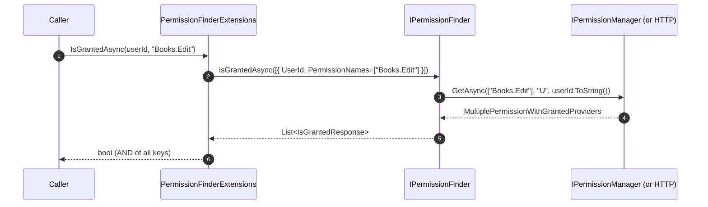

`Volo.Abp.PermissionManagement.Domain.Shared` is the smallest package in the module. It only contains types that are safe to ship to any layer — clients, servers, and contracts — because they have no dependency on EF Core, MongoDB, or the application services layer. Everything else in the module transitively depends on it.

## File inventory

```
Volo.Abp.PermissionManagement.Domain.Shared/Volo/Abp/PermissionManagement/
├── AbpPermissionManagementDomainSharedModule.cs
├── IPermissionFinder.cs
├── IsGrantedRequest.cs
├── IsGrantedResponse.cs
├── PermissionDefinitionRecordConsts.cs
├── PermissionFinderExtensions.cs
├── PermissionGrantConsts.cs
├── PermissionGroupDefinitionRecordConsts.cs
└── Localization/
    ├── AbpPermissionManagementResource.cs
    └── Domain/   (embedded JSON files)
```

The module class is intentionally tiny:

```csharp
[DependsOn(typeof(AbpValidationModule))]
public class AbpPermissionManagementDomainSharedModule : AbpModule
{
    public override void ConfigureServices(ServiceConfigurationContext context)
    {
        Configure<AbpVirtualFileSystemOptions>(options =>
        {
            options.FileSets.AddEmbedded<AbpPermissionManagementDomainSharedModule>();
        });

        Configure<AbpLocalizationOptions>(options =>
        {
            options.Resources
                .Add<AbpPermissionManagementResource>("en")
                .AddBaseTypes(typeof(AbpValidationResource))
                .AddVirtualJson("/Volo/Abp/PermissionManagement/Localization/Domain");
        });
    }
}
```

The two responsibilities are:

1. Register the embedded virtual file set (so the localization JSON ships with the assembly).
2. Register the `AbpPermissionManagementResource` and tell it to load JSON from `/Volo/Abp/PermissionManagement/Localization/Domain`.

That resource is the parent localization namespace used by the application contracts, HTTP API, MVC Web, and Blazor packages — each of them re-`Get`s it and chains a UI resource on top.

## Schema constants

Two constant classes pin the database column lengths so the EF Core mapping in `AbpPermissionManagementDbContextModelBuilderExtensions` and the Mongo configuration are consistent with the entity validators:

```csharp
public class PermissionDefinitionRecordConsts
{
    public static int MaxNameLength { get; set; } = 128;
    public static int MaxDisplayNameLength { get; set; } = 256;
    public static int MaxProvidersLength { get; set; } = 128;
    public static int MaxStateCheckersLength { get; set; } = 256;
}

public class PermissionGroupDefinitionRecordConsts
{
    public static int MaxNameLength { get; set; } = 128;
    public static int MaxDisplayNameLength { get; set; } = 256;
}

public static class PermissionGrantConsts
{
    public static int MaxProviderNameLength { get; set; } = 64;
    public static int MaxProviderKeyLength { get; set; } = 64;
}
```

The `set` accessors are **public and static** — you can override them in your module's `PreConfigureServices` *before* EF Core builds the model. This is how downstream products extend, for instance, `MaxProviderKeyLength` so that custom provider keys (an email address, a hierarchical org path) can fit.

> **Gotcha** — the values must be overridden before `AbpPermissionManagementDbContextModelBuilderExtensions.ConfigurePermissionManagement` runs. Doing it later has no effect on the column definitions, and EF will silently truncate on insert if your provider key exceeds 64 characters.

`PermissionGrantConsts.MaxProviderKeyLength = 64` is also the practical reason role names cannot exceed 64 characters in the Identity module: a role grant stores `ProviderKey = roleName`.

## The IPermissionFinder contract

`IPermissionFinder` is the *bulk* interface used by other modules (Account, Identity, microservices) and by the integration endpoint to ask "for these users, which of these permissions are granted?":

```csharp
public interface IPermissionFinder
{
    Task<List<IsGrantedResponse>> IsGrantedAsync(List<IsGrantedRequest> requests);
}

public class IsGrantedRequest
{
    public Guid UserId { get; set; }
    public string[] PermissionNames { get; set; }
}

public class IsGrantedResponse
{
    public Guid UserId { get; set; }
    public Dictionary<string, bool> Permissions { get; set; }
}
```

The shape is deliberately *batched* — one request per user with a vector of permission names, one response per user with a map of name → granted. That matches the way back-end services typically prefetch authorization decisions before rendering a payload.

There are two implementations of `IPermissionFinder` in the module:

| Implementation | Assembly | When chosen |
| --- | --- | --- |
| `PermissionFinder` | `Volo.Abp.PermissionManagement.Domain` | In-process, talks to `IPermissionManager` directly. |
| `HttpClientPermissionFinder` | `Volo.Abp.PermissionManagement.HttpApi.Client` | Remote, calls the integration service over HTTP. Registered with `[Dependency(TryRegister = true)]` so it only kicks in when the in-process version is absent. |

Both are covered in [Domain](/modules/permission-management/domain) and [HTTP API Client](/modules/permission-management/http-api-client).

### Single-permission convenience

For the common "does this user have this permission?" question, `PermissionFinderExtensions` provides two overloads:

```csharp
public static class PermissionFinderExtensions
{
    public async static Task<bool> IsGrantedAsync(
        this IPermissionFinder permissionFinder, Guid userId, string permissionName)
    {
        return await permissionFinder.IsGrantedAsync(userId, new[] { permissionName });
    }

    public async static Task<bool> IsGrantedAsync(
        this IPermissionFinder permissionFinder, Guid userId, string[] permissionNames)
    {
        return (await permissionFinder.IsGrantedAsync(new List<IsGrantedRequest>
        {
            new IsGrantedRequest
            {
                UserId = userId,
                PermissionNames = permissionNames
            }
        })).Any(x => x.UserId == userId
                  && x.Permissions.All(p => permissionNames.Contains(p.Key) && p.Value));
    }
}
```

The vector overload returns `true` only when **every** requested permission is granted — it is an *AND* check, not *ANY*. If you want OR semantics, call the integration service directly and inspect the dictionary.

> **Gotcha** — the vector extension method matches on `permissionNames.Contains(p.Key)` so an extra, unrequested permission in the response doesn't break the result. If you ask for `["A", "B"]`, the extension still passes when the dictionary additionally contains `"C": true`.

## Sequence: external code asking a question



Notice that `IPermissionFinder` *always* checks against the `U` (user) provider key. Role and client grants are *cascaded into* the user check by `RolePermissionManagementProvider` and `ClientPermissionManagementProvider` — this is why a remote service can ask a single "U" question and still see the full picture.

## Localization resource

The resource is referenced everywhere as a base type:

```csharp
namespace Volo.Abp.PermissionManagement.Localization;

[LocalizationResourceName("AbpPermissionManagement")]
public class AbpPermissionManagementResource { }
```

Add your own module's resource on top by chaining:

```csharp
Configure<AbpLocalizationOptions>(options =>
{
    options.Resources
        .Get<MyAppResource>()
        .AddBaseTypes(typeof(AbpPermissionManagementResource));
});
```

The base-type relationship means a request for `"PermissionManagement.SaveWithoutAnyPermissionsWarningMessage"` (used by the Blazor modal) falls through to the embedded JSON in this package even when the active resource is your application's.

## Why this layer exists

ABP enforces a strict no-cycles policy across its packages. The `Domain.Shared` layer is the only place a *client* (HTTP API Client, Blazor WebAssembly) can pick up the `IPermissionFinder` interface and the validation constants without dragging in the Domain layer. Keeping the contract here means the WebAssembly app and any microservice consumer can implement, mock, or remote-call `IPermissionFinder` without referencing EF Core or MongoDB.

## Gotchas summary

- All constants are mutable statics — set them once at startup or you will be debugging a race condition later. There is no synchronization.
- The localization resource is named via `[LocalizationResourceName("AbpPermissionManagement")]` (declared on the resource class itself in the source tree). Renaming it breaks every consumer that pulls keys from it.
- `IsGrantedRequest.UserId` is a `Guid`, not a string — there is no way to ask the finder about a role or client. Use `IPermissionManager.GetAsync` for that.

Continue with [Domain](/modules/permission-management/domain).
