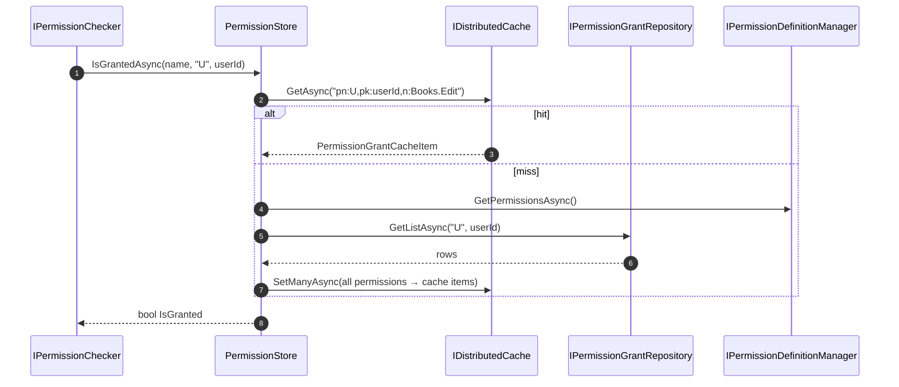

The `Volo.Abp.PermissionManagement.Domain` package is where the entire grant model lives — the persisted `PermissionGrant` aggregate, the `PermissionStore` that backs the authorization check, the `PermissionManager` façade that the UI calls into, and the static/dynamic plumbing that bridges code-defined permissions with the database.

## File inventory

```
Volo.Abp.PermissionManagement.Domain/Volo/Abp/PermissionManagement/
├── AbpPermissionManagementDbProperties.cs
├── AbpPermissionManagementDomainModule.cs
├── DynamicPermissionDefinitionStore.cs
├── DynamicPermissionDefinitionStoreInMemoryCache.cs
├── IDynamicPermissionDefinitionStoreInMemoryCache.cs
├── IPermissionDataSeeder.cs
├── IPermissionDefinitionRecordRepository.cs
├── IPermissionDefinitionSerializer.cs
├── IPermissionGrantRepository.cs
├── IPermissionGroupDefinitionRecordRepository.cs
├── IPermissionManagementProvider.cs
├── IPermissionManager.cs
├── IStaticPermissionSaver.cs
├── MultiplePermissionValueProviderGrantInfo.cs
├── MultiplePermissionWithGrantedProviders.cs
├── PermissionDataSeedContributor.cs
├── PermissionDataSeeder.cs
├── PermissionDefinitionRecord.cs
├── PermissionDefinitionSerializer.cs
├── PermissionFinder.cs
├── PermissionGrant.cs
├── PermissionGrantCacheItem.cs
├── PermissionGrantCacheItemInvalidator.cs
├── PermissionGroupDefinitionRecord.cs
├── PermissionManagementOptions.cs
├── PermissionManagementProvider.cs
├── PermissionManager.cs
├── PermissionStore.cs
├── PermissionValueProviderGrantInfo.cs
├── PermissionValueProviderInfo.cs
├── PermissionWithGrantedProviders.cs
└── StaticPermissionSaver.cs
```

## Entities

### PermissionGrant

```csharp
public class PermissionGrant : Entity<Guid>, IMultiTenant
{
    public virtual Guid? TenantId { get; protected set; }

    [NotNull] public virtual string Name { get; protected set; }
    [NotNull] public virtual string ProviderName { get; protected set; }
    [CanBeNull] public virtual string ProviderKey { get; protected internal set; }

    public PermissionGrant(
        Guid id,
        [NotNull] string name,
        [NotNull] string providerName,
        [CanBeNull] string providerKey,
        Guid? tenantId = null)
    {
        Id = id;
        Name = Check.NotNullOrWhiteSpace(name, nameof(name));
        ProviderName = Check.NotNullOrWhiteSpace(providerName, nameof(providerName));
        ProviderKey = providerKey;
        TenantId = tenantId;
    }
}
```

Notes from the source:

- A `// TODO: To aggregate root?` comment confirms it is intentionally *not* an aggregate root yet — it is a flat entity participating in repositories without children.
- `ProviderKey` is `[CanBeNull]` in the type signature but, in practice, every concrete provider passes a non-null string. The MongoDB and EF Core indexes treat it as a composite unique key with `(TenantId, Name, ProviderName, ProviderKey)`.
- `ProviderKey` has `protected internal set` so the `PermissionManager` can patch it via `UpdateProviderKeyAsync` when a role is renamed.

### PermissionDefinitionRecord

The persisted shadow of a `PermissionDefinition`:

```csharp
public class PermissionDefinitionRecord : BasicAggregateRoot<Guid>, IHasExtraProperties
{
    public string GroupName { get; set; }
    public string Name { get; set; }
    public string ParentName { get; set; }
    public string DisplayName { get; set; }
    public bool IsEnabled { get; set; }
    public MultiTenancySides MultiTenancySide { get; set; }
    public string Providers { get; set; }      // Comma separated list of provider names
    public string StateCheckers { get; set; }  // Serialized state checker info
    public ExtraPropertyDictionary ExtraProperties { get; protected set; }

    public bool HasSameData(PermissionDefinitionRecord otherRecord) { ... }
    public void Patch(PermissionDefinitionRecord otherRecord)       { ... }
}
```

The `HasSameData` / `Patch` pair is the heart of `StaticPermissionSaver` — instead of `DELETE + INSERT`, the saver compares hashes and patches mutable fields when they drift.

### PermissionGroupDefinitionRecord

The simpler sibling:

```csharp
public class PermissionGroupDefinitionRecord : BasicAggregateRoot<Guid>, IHasExtraProperties
{
    public string Name { get; set; }
    public string DisplayName { get; set; }
    public ExtraPropertyDictionary ExtraProperties { get; protected set; }
    public bool HasSameData(PermissionGroupDefinitionRecord otherRecord) { ... }
    public void Patch(PermissionGroupDefinitionRecord otherRecord)       { ... }
}
```

## The repository contract

```csharp
public interface IPermissionGrantRepository : IBasicRepository<PermissionGrant, Guid>
{
    Task<PermissionGrant> FindAsync(string name, string providerName, string providerKey,
        CancellationToken cancellationToken = default);

    Task<List<PermissionGrant>> GetListAsync(string providerName, string providerKey,
        CancellationToken cancellationToken = default);

    Task<List<PermissionGrant>> GetListAsync(string[] names, string providerName, string providerKey,
        CancellationToken cancellationToken = default);
}
```

Three reads cover every use case in the module:

- `FindAsync` — the management provider's grant/revoke path needs to know if a specific row exists.
- `GetListAsync(pn, pk)` — `PermissionStore` warms its cache for every defined permission of that provider/key pair.
- `GetListAsync(names, pn, pk)` — `PermissionManager.GetInternalAsync` walks the management providers and asks only about a known vector of permission names.

## PermissionManager — the management façade

The class is registered as `ISingletonDependency`. Its responsibilities:

1. Validate the permission against the definition manager.
2. Walk the configured `ManagementProviders` in order to compute the *current* grant state across all providers.
3. Delegate the actual write to the provider whose `Name` matches the caller's `providerName`.

```csharp
public PermissionManager(
    IPermissionDefinitionManager permissionDefinitionManager,
    ISimpleStateCheckerManager<PermissionDefinition> simpleStateCheckerManager,
    IPermissionGrantRepository permissionGrantRepository,
    IServiceProvider serviceProvider,
    IGuidGenerator guidGenerator,
    IOptions<PermissionManagementOptions> options,
    ICurrentTenant currentTenant,
    IDistributedCache<PermissionGrantCacheItem> cache)
{ ... }
```

The provider list is built lazily from the options:

```csharp
_lazyProviders = new Lazy<List<IPermissionManagementProvider>>(
    () => Options
        .ManagementProviders
        .Select(c => serviceProvider.GetRequiredService(c) as IPermissionManagementProvider)
        .ToList(),
    true);
```

### `GetAsync` — building `PermissionWithGrantedProviders`

The public `GetAsync(name, providerName, providerKey)` calls the bulk `GetInternalAsync(permissions[], providerName, providerKey)`. That method is the core of the resolve sequence:

```csharp
foreach (var permission in permissions
                            .Where(x => x.IsEnabled)
                            .Where(x => x.MultiTenancySide.HasFlag(CurrentTenant.GetMultiTenancySide()))
                            .Where(x => !x.Providers.Any() || x.Providers.Contains(providerName)))
{
    if (await SimpleStateCheckerManager.IsEnabledAsync(permission))
    {
        neededCheckPermissions.Add(permission);
    }
}

foreach (var provider in ManagementProviders)
{
    var multiplePermissionValueProviderGrantInfo =
        await provider.CheckAsync(permissionNames, providerName, providerKey);

    foreach (var providerResultDict in multiplePermissionValueProviderGrantInfo.Result)
    {
        if (providerResultDict.Value.IsGranted)
        {
            var perm = multiplePermissionWithGrantedProviders.Result
                .First(x => x.Name == providerResultDict.Key);
            perm.IsGranted = true;
            perm.Providers.Add(new PermissionValueProviderInfo(
                provider.Name, providerResultDict.Value.ProviderKey));
        }
    }
}
```

The interesting subtleties:

- `permission.Providers` is the *allow-list* declared on the `PermissionDefinition`. If it is non-empty, only those providers can carry the permission.
- Every registered `IPermissionManagementProvider` is asked, not just the one matching `providerName`. The R provider, for example, also answers when called with `U` keys because it cascades user → roles internally.
- Each granting provider is added to `PermissionWithGrantedProviders.Providers`. This is what the UI uses to grey out a "User overrides" checkbox: the modal shows that a permission is granted *through* role R even when looked up by user U.

### `SetAsync` — the write path

```csharp
public virtual async Task SetAsync(string permissionName, string providerName, string providerKey, bool isGranted)
{
    var permission = await PermissionDefinitionManager.GetOrNullAsync(permissionName);
    if (permission == null) return; // silently ignore

    if (!permission.IsEnabled || !await SimpleStateCheckerManager.IsEnabledAsync(permission))
        throw new ApplicationException($"The permission named '{permission.Name}' is disabled!");

    if (permission.Providers.Any() && !permission.Providers.Contains(providerName))
        throw new ApplicationException($"... not compatible with the provider named '{providerName}'");

    if (!permission.MultiTenancySide.HasFlag(CurrentTenant.GetMultiTenancySide()))
        throw new ApplicationException($"... not compatible with the current multitenancy side ...");

    var currentGrantInfo = await GetInternalAsync(permission, providerName, providerKey);
    if (currentGrantInfo.IsGranted == isGranted) return; // no-op

    var provider = ManagementProviders.FirstOrDefault(m => m.Name == providerName)
        ?? throw new AbpException("Unknown permission management provider: " + providerName);

    await provider.SetAsync(permissionName, providerKey, isGranted);
}
```

Five guards run before any DB write:

1. Undefined → silently ignored. This is critical for backward compatibility with removed permissions.
2. Disabled → exception. State checkers run here too.
3. Provider not in allow-list → exception.
4. Multi-tenancy side mismatch → exception.
5. Already in target state → early-return (no log, no event, no write).

### `UpdateProviderKeyAsync` and `DeleteAsync`

```csharp
public virtual async Task<PermissionGrant> UpdateProviderKeyAsync(PermissionGrant g, string providerKey)
{
    using (CurrentTenant.Change(g.TenantId))
    {
        await Cache.RemoveAsync(PermissionGrantCacheItem.CalculateCacheKey(g.Name, g.ProviderName, g.ProviderKey));
    }
    g.ProviderKey = providerKey;
    return await PermissionGrantRepository.UpdateAsync(g);
}

public virtual async Task DeleteAsync(string providerName, string providerKey)
{
    var grants = await PermissionGrantRepository.GetListAsync(providerName, providerKey);
    foreach (var grant in grants)
        await PermissionGrantRepository.DeleteAsync(grant);
}
```

Both are used by the Identity satellite — the first when a role is renamed, the second when a role or user is deleted.

## PermissionManagementProvider — the default strategy

The abstract base class implements all three contract methods against `IPermissionGrantRepository`:

```csharp
public virtual async Task<MultiplePermissionValueProviderGrantInfo> CheckAsync(
    string[] names, string providerName, string providerKey)
{
    var result = new MultiplePermissionValueProviderGrantInfo(names);
    if (providerName != Name) return result; // not my problem

    var grants = await PermissionGrantRepository.GetListAsync(names, providerName, providerKey);
    foreach (var n in names)
    {
        var isGrant = grants.Any(x => x.Name == n);
        result.Result[n] = new PermissionValueProviderGrantInfo(isGrant, providerKey);
    }
    return result;
}

protected virtual async Task GrantAsync(string name, string providerKey)
{
    var existing = await PermissionGrantRepository.FindAsync(name, Name, providerKey);
    if (existing != null) return;
    await PermissionGrantRepository.InsertAsync(
        new PermissionGrant(GuidGenerator.Create(), name, Name, providerKey, CurrentTenant.Id));
}

protected virtual async Task RevokeAsync(string name, string providerKey)
{
    var existing = await PermissionGrantRepository.FindAsync(name, Name, providerKey);
    if (existing == null) return;
    await PermissionGrantRepository.DeleteAsync(existing);
}
```

Subclasses override the methods they need:

- `UserPermissionManagementProvider` keeps the base behavior verbatim — its `Name` is `U`.
- `RolePermissionManagementProvider` (Identity package) overrides `CheckAsync` to also resolve role grants when the caller is asking about a user key, so role grants surface in the user's effective permissions list.
- `ClientPermissionManagementProvider` (IdentityServer/OpenIddict) wraps every call in `using (CurrentTenant.Change(null))` to force host scope.

## PermissionStore — the cached read side

`PermissionStore` implements `IPermissionStore` from `Volo.Abp.Authorization.Permissions`. The runtime authorization check (via `IPermissionChecker`) calls into here.

Key constructor parameters:

```csharp
public PermissionStore(
    IPermissionGrantRepository permissionGrantRepository,
    IDistributedCache<PermissionGrantCacheItem> cache,
    IPermissionDefinitionManager permissionDefinitionManager)
```

The single-permission path:

```csharp
public virtual async Task<bool> IsGrantedAsync(string name, string providerName, string providerKey)
{
    return (await GetCacheItemAsync(name, providerName, providerKey)).IsGranted;
}

protected virtual async Task<PermissionGrantCacheItem> GetCacheItemAsync(
    string name, string providerName, string providerKey)
{
    var cacheKey = CalculateCacheKey(name, providerName, providerKey);
    var cacheItem = await Cache.GetAsync(cacheKey);
    if (cacheItem != null) return cacheItem;

    cacheItem = new PermissionGrantCacheItem(false);
    await SetCacheItemsAsync(providerName, providerKey, name, cacheItem);
    return cacheItem;
}
```

On a miss the store calls `SetCacheItemsAsync`, which reads the full `(providerName, providerKey)` grant list once and seeds the cache **for every defined permission** — granted entries get `true`, the rest get `false`:

```csharp
var grantedPermissionsHashSet = new HashSet<string>(
    (await PermissionGrantRepository.GetListAsync(providerName, providerKey)).Select(p => p.Name));

foreach (var permission in permissions)
{
    var isGranted = grantedPermissionsHashSet.Contains(permission.Name);
    cacheItems.Add(new KeyValuePair<string, PermissionGrantCacheItem>(
        CalculateCacheKey(permission.Name, providerName, providerKey),
        new PermissionGrantCacheItem(isGranted)));
}
await Cache.SetManyAsync(cacheItems);
```

The bulk overload `IsGrantedAsync(string[] names, ...)` uses `Cache.GetManyAsync` and only re-reads the repository for keys that the cache lost. The result is shaped as a `MultiplePermissionGrantResult`:

```csharp
result.Result.Add(name, granted ? PermissionGrantResult.Granted : PermissionGrantResult.Undefined);
```

Notice the store never returns `PermissionGrantResult.Prohibited` — explicit denial is not modeled, so an *absent* row simply means "this provider didn't grant it" and lets the next value provider in the chain answer.

## PermissionGrantCacheItem and its invalidator

```csharp
[Serializable]
public class PermissionGrantCacheItem
{
    private const string CacheKeyFormat = "pn:{0},pk:{1},n:{2}";
    public bool IsGranted { get; set; }

    public static string CalculateCacheKey(string name, string providerName, string providerKey)
        => string.Format(CacheKeyFormat, providerName, providerKey, name);

    public static string GetPermissionNameFormCacheKeyOrNull(string cacheKey)
    {
        var result = FormattedStringValueExtracter.Extract(cacheKey, CacheKeyFormat, true);
        return result.IsMatch ? result.Matches.Last().Value : null;
    }
}
```

The invalidator is a local event handler — every successful insert, update, or delete of a `PermissionGrant` triggers a cache evict:

```csharp
public class PermissionGrantCacheItemInvalidator :
    ILocalEventHandler<EntityChangedEventData<PermissionGrant>>, ITransientDependency
{
    public virtual async Task HandleEventAsync(EntityChangedEventData<PermissionGrant> eventData)
    {
        var cacheKey = CalculateCacheKey(eventData.Entity.Name,
            eventData.Entity.ProviderName, eventData.Entity.ProviderKey);
        using (CurrentTenant.Change(eventData.Entity.TenantId))
        {
            await Cache.RemoveAsync(cacheKey);
        }
    }
}
```

The `CurrentTenant.Change(eventData.Entity.TenantId)` is critical — the distributed cache's key prefix includes the tenant id, so the evict has to happen *under the right tenant scope*.

## Static & dynamic definition stores

### StaticPermissionSaver

Runs on startup when `PermissionManagementOptions.SaveStaticPermissionsToDatabase` is true. It:

1. Acquires `ApplicationDistributedLockKey` — only the first running instance of this app processes the rest.
2. Serializes the in-memory static groups into `PermissionGroupDefinitionRecord[]` and `PermissionDefinitionRecord[]` via `IPermissionDefinitionSerializer`.
3. Computes an MD5 hash of those arrays plus the configured `DeletedPermissionGroups` / `DeletedPermissions` lists and compares to the value cached under `KeyPrefix_AppName_AbpPermissionsHash`. Bail out on match.
4. Acquires `CommonDistributedLockKey` (shared across all applications) for up to five minutes.
5. Inside a single transactional unit of work, diffs records against `IPermissionGroupDefinitionRecordRepository` / `IPermissionDefinitionRecordRepository` and issues `InsertManyAsync`, `UpdateManyAsync`, `DeleteManyAsync` calls.
6. If anything changed, bumps the `KeyPrefix_AbpInMemoryPermissionCacheStamp` value to invalidate the in-memory store.

```csharp
if (cachedHash == currentHash) return;

await using (var commonLockHandle = await DistributedLock.TryAcquireAsync(
                 GetCommonDistributedLockKey(), TimeSpan.FromMinutes(5)))
{
    if (commonLockHandle == null)
        throw new AbpException("Could not acquire distributed lock for saving static permissions!");

    using (var unitOfWork = UnitOfWorkManager.Begin(requiresNew: true, isTransactional: true))
    {
        var hasChangesInGroups      = await UpdateChangedPermissionGroupsAsync(permissionGroupRecords);
        var hasChangesInPermissions = await UpdateChangedPermissionsAsync(permissionRecords);

        if (hasChangesInGroups || hasChangesInPermissions)
        {
            await Cache.SetStringAsync(
                GetCommonStampCacheKey(),
                Guid.NewGuid().ToString(),
                new DistributedCacheEntryOptions { SlidingExpiration = TimeSpan.FromDays(30) },
                CancellationTokenProvider.Token);
        }
        await unitOfWork.CompleteAsync();
    }
}
```

### DynamicPermissionDefinitionStore

Replaces the default static store when `IsDynamicPermissionStoreEnabled = true`:

```csharp
[Dependency(ReplaceServices = true)]
public class DynamicPermissionDefinitionStore : IDynamicPermissionDefinitionStore, ITransientDependency
{ ... }
```

The read path is gated on a 30-second `LastCheckTime` window so it doesn't hammer the distributed cache, then it compares the local `CacheStamp` to the value at `KeyPrefix_AbpInMemoryPermissionCacheStamp`:

```csharp
protected virtual async Task EnsureCacheIsUptoDateAsync()
{
    if (StoreCache.LastCheckTime.HasValue &&
        DateTime.Now.Subtract(StoreCache.LastCheckTime.Value).TotalSeconds < 30)
        return;

    var stampInDistributedCache = await GetOrSetStampInDistributedCache();
    if (stampInDistributedCache == StoreCache.CacheStamp)
    {
        StoreCache.LastCheckTime = DateTime.Now;
        return;
    }

    await UpdateInMemoryStoreCache(); // re-read from the DB
    StoreCache.CacheStamp = stampInDistributedCache;
    StoreCache.LastCheckTime = DateTime.Now;
}
```

`GetOrSetStampInDistributedCache` itself uses a two-minute distributed lock so two replicas don't both seed a new stamp on first start.

### Module wiring

`AbpPermissionManagementDomainModule.OnApplicationInitializationAsync` schedules `SaveStaticPermissionsToDatabaseAsync` followed by `PreCacheDynamicPermissionsAsync` on a background `Task.Run`. The saver is wrapped in a Polly `WaitAndRetryAsync(8, ...)` exponential-backoff loop so transient DB outages on startup do not crash the host:

```csharp
await Policy
    .Handle<Exception>()
    .WaitAndRetryAsync(8, retryAttempt => TimeSpan.FromSeconds(
        RandomHelper.GetRandom(
            (int)Math.Pow(2, retryAttempt) * 8,
            (int)Math.Pow(2, retryAttempt) * 12)))
    .ExecuteAsync(...);
```

In data-migration environments both flags are switched off:

```csharp
if (context.Services.IsDataMigrationEnvironment())
{
    Configure<PermissionManagementOptions>(options =>
    {
        options.SaveStaticPermissionsToDatabase = false;
        options.IsDynamicPermissionStoreEnabled = false;
    });
}
```

## PermissionDataSeeder

Used by Identity's role/user seeding to grant a vector of permissions in one shot:

```csharp
public virtual async Task SeedAsync(
    string providerName,
    string providerKey,
    IEnumerable<string> grantedPermissions,
    Guid? tenantId = null)
{
    using (CurrentTenant.Change(tenantId))
    {
        var names = grantedPermissions.ToArray();
        var existing = (await PermissionGrantRepository.GetListAsync(names, providerName, providerKey))
            .Select(x => x.Name).ToList();

        foreach (var permissionName in names.Except(existing))
        {
            await PermissionGrantRepository.InsertAsync(
                new PermissionGrant(GuidGenerator.Create(), permissionName, providerName, providerKey, tenantId));
        }
    }
}
```

It bypasses `PermissionManager.SetAsync` and writes straight to the repository, so the validation guards (disabled permission, provider allow-list, multi-tenancy side) **do not run** during seeding. Treat it as a build-time API, not a runtime one.

## Permission lookup sequence

Putting the read path together for `IsGranted("Books.Edit", "U", userId)`:



The role overlay happens one level up. `IPermissionChecker` calls each value provider in `R, U, C` order; the `R` provider expands roles via `IUserRoleFinder` and asks `PermissionStore` per role.

## Gotchas

- `PermissionManager` constructs its provider list via `IServiceProvider.GetRequiredService(c) as IPermissionManagementProvider`. Registering a type in `ManagementProviders` *without* also registering it as a DI service (or having `[ISingletonDependency]` on the class) crashes on first use.
- `permission.Providers` is a `List<string>` of *allowed* provider names declared on the definition. An empty list means "any provider may carry it" — non-empty is a strict whitelist.
- `PermissionStore.IsGrantedAsync(string[] names, ...)` short-circuits to the single-name path when `names.Length == 1`. The behavior is correct but the cache hit-rate metric in your distributed cache will look skewed if you log many single-permission checks.
- `PermissionGrantCacheItem.GetPermissionNameFormCacheKeyOrNull` (the misspelling is in the source) returns `null` when the key shape doesn't match — useful when iterating arbitrary cache keys but means external callers must defensively null-check.
- `StaticPermissionSaver`'s MD5 hash *intentionally* ignores `Id` via `AbpIgnorePropertiesModifiers` so re-seeded ids don't trigger a rewrite. If you mutate any *other* field on a `PermissionDefinitionRecord` directly in the DB, the saver will overwrite it on the next startup.

Continue with [Application.Contracts](/modules/permission-management/application-contracts).
