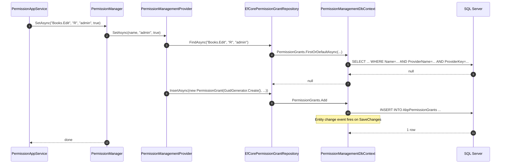

`Volo.Abp.PermissionManagement.EntityFrameworkCore` is the relational persistence layer. It wires three tables — `AbpPermissionGrants`, `AbpPermissions`, `AbpPermissionGroups` — onto the entities defined in [Domain](/modules/permission-management/domain) and ships the three repository implementations that satisfy the interfaces declared there.

## File inventory

```
Volo.Abp.PermissionManagement.EntityFrameworkCore/Volo/Abp/PermissionManagement/EntityFrameworkCore/
├── AbpPermissionManagementDbContextModelBuilderExtensions.cs
├── AbpPermissionManagementEntityFrameworkCoreModule.cs
├── EfCorePermissionDefinitionRecordRepository.cs
├── EfCorePermissionGrantRepository.cs
├── EfCorePermissionGroupDefinitionRecordRepository.cs
├── IPermissionManagementDbContext.cs
└── PermissionManagementDbContext.cs
```

## Module wiring

```csharp
[DependsOn(typeof(AbpPermissionManagementDomainModule))]
[DependsOn(typeof(AbpEntityFrameworkCoreModule))]
public class AbpPermissionManagementEntityFrameworkCoreModule : AbpModule
{
    public override void ConfigureServices(ServiceConfigurationContext context)
    {
        context.Services.AddAbpDbContext<PermissionManagementDbContext>(options =>
        {
            options.AddDefaultRepositories<IPermissionManagementDbContext>();

            options.AddRepository<PermissionGroupDefinitionRecord, EfCorePermissionGroupDefinitionRecordRepository>();
            options.AddRepository<PermissionDefinitionRecord,     EfCorePermissionDefinitionRecordRepository>();
            options.AddRepository<PermissionGrant,                EfCorePermissionGrantRepository>();
        });
    }
}
```

Two things to notice:

1. The default repositories are bound to the **interface** `IPermissionManagementDbContext`, not the concrete `PermissionManagementDbContext`. That is the ABP pattern that lets host applications consolidate this DbContext into their own monolithic context via `[ReplaceDbContext]`.
2. The custom repository overrides only exist because each of those interfaces (`IPermissionGrantRepository`, `IPermissionDefinitionRecordRepository`) adds methods on top of `IBasicRepository<TEntity, Guid>`.

## The DbContext

### Interface

```csharp
[ConnectionStringName(AbpPermissionManagementDbProperties.ConnectionStringName)]
public interface IPermissionManagementDbContext : IEfCoreDbContext
{
    DbSet<PermissionGroupDefinitionRecord> PermissionGroups { get; }
    DbSet<PermissionDefinitionRecord>      Permissions      { get; }
    DbSet<PermissionGrant>                 PermissionGrants { get; }
}
```

`ConnectionStringName` is `"AbpPermissionManagement"`. In a monolith all ABP modules share the same connection string; in a microservice deployment you can split this off by adding:

```json
{
  "ConnectionStrings": {
    "AbpPermissionManagement": "Server=...;Database=PermissionsDb;..."
  }
}
```

### Implementation

```csharp
[ConnectionStringName(AbpPermissionManagementDbProperties.ConnectionStringName)]
public class PermissionManagementDbContext
    : AbpDbContext<PermissionManagementDbContext>, IPermissionManagementDbContext
{
    public DbSet<PermissionGroupDefinitionRecord> PermissionGroups { get; set; }
    public DbSet<PermissionDefinitionRecord>      Permissions      { get; set; }
    public DbSet<PermissionGrant>                 PermissionGrants { get; set; }

    public PermissionManagementDbContext(DbContextOptions<PermissionManagementDbContext> options)
        : base(options) { }

    protected override void OnModelCreating(ModelBuilder builder)
    {
        base.OnModelCreating(builder);
        builder.ConfigurePermissionManagement();
    }
}
```

The `base.OnModelCreating` invocation matters — it runs the ABP convention configurations (concurrency stamp, soft-delete query filter, multi-tenant filter, audit columns) before the module-specific mapping.

## Model builder extension

```csharp
public static void ConfigurePermissionManagement([NotNull] this ModelBuilder builder)
{
    Check.NotNull(builder, nameof(builder));

    builder.Entity<PermissionGrant>(b =>
    {
        b.ToTable(AbpPermissionManagementDbProperties.DbTablePrefix + "PermissionGrants",
                  AbpPermissionManagementDbProperties.DbSchema);

        b.ConfigureByConvention();

        b.Property(x => x.Name)        .HasMaxLength(PermissionDefinitionRecordConsts.MaxNameLength) .IsRequired();
        b.Property(x => x.ProviderName).HasMaxLength(PermissionGrantConsts.MaxProviderNameLength)   .IsRequired();
        b.Property(x => x.ProviderKey) .HasMaxLength(PermissionGrantConsts.MaxProviderKeyLength)    .IsRequired();

        b.HasIndex(x => new { x.TenantId, x.Name, x.ProviderName, x.ProviderKey }).IsUnique();

        b.ApplyObjectExtensionMappings();
    });

    builder.Entity<PermissionGroupDefinitionRecord>(b =>
    {
        b.ToTable(AbpPermissionManagementDbProperties.DbTablePrefix + "PermissionGroups",
                  AbpPermissionManagementDbProperties.DbSchema);

        b.ConfigureByConvention();

        b.Property(x => x.Name)       .HasMaxLength(PermissionGroupDefinitionRecordConsts.MaxNameLength)       .IsRequired();
        b.Property(x => x.DisplayName).HasMaxLength(PermissionGroupDefinitionRecordConsts.MaxDisplayNameLength).IsRequired();

        b.HasIndex(x => new { x.Name }).IsUnique();

        b.ApplyObjectExtensionMappings();
    });

    builder.Entity<PermissionDefinitionRecord>(b =>
    {
        b.ToTable(AbpPermissionManagementDbProperties.DbTablePrefix + "Permissions",
                  AbpPermissionManagementDbProperties.DbSchema);

        b.ConfigureByConvention();

        b.Property(x => x.GroupName)    .HasMaxLength(PermissionGroupDefinitionRecordConsts.MaxNameLength).IsRequired();
        b.Property(x => x.Name)         .HasMaxLength(PermissionDefinitionRecordConsts.MaxNameLength)     .IsRequired();
        b.Property(x => x.ParentName)   .HasMaxLength(PermissionDefinitionRecordConsts.MaxNameLength);
        b.Property(x => x.DisplayName)  .HasMaxLength(PermissionDefinitionRecordConsts.MaxDisplayNameLength).IsRequired();
        b.Property(x => x.Providers)    .HasMaxLength(PermissionDefinitionRecordConsts.MaxProvidersLength);
        b.Property(x => x.StateCheckers).HasMaxLength(PermissionDefinitionRecordConsts.MaxStateCheckersLength);

        b.HasIndex(x => new { x.Name }).IsUnique();
        b.HasIndex(x => new { x.GroupName });

        b.ApplyObjectExtensionMappings();
    });

    builder.TryConfigureObjectExtensions<PermissionManagementDbContext>();
}
```

### Resulting tables

| Table | Columns (key ones) | Indexes |
| --- | --- | --- |
| `AbpPermissionGrants` | `Id`, `TenantId`, `Name(128)`, `ProviderName(64)`, `ProviderKey(64)` | Unique `(TenantId, Name, ProviderName, ProviderKey)` |
| `AbpPermissionGroups` | `Id`, `Name(128)`, `DisplayName(256)`, `ExtraProperties` | Unique `(Name)` |
| `AbpPermissions` | `Id`, `GroupName(128)`, `Name(128)`, `ParentName(128)`, `DisplayName(256)`, `IsEnabled`, `MultiTenancySide`, `Providers(128)`, `StateCheckers(256)`, `ExtraProperties` | Unique `(Name)`, non-unique `(GroupName)` |

The `Providers` column being only `MaxProvidersLength = 128` characters is the practical cap on how many providers a single permission can declare — five providers with three-character names (`U,R,C`) easily fit; a permission with twenty providers will not.

### Convention mapping (`ConfigureByConvention`)

`ConfigureByConvention` is the ABP extension that applies the standard column mapping:

- `IMultiTenant.TenantId` becomes a `Guid?` column with the multi-tenant query filter attached.
- `IHasExtraProperties.ExtraProperties` is serialized as JSON into an `ExtraProperties` text column.
- `BasicAggregateRoot<Guid>.ConcurrencyStamp` becomes an `nvarchar(40)` column tagged `IsConcurrencyToken`.

### Object extensions

`ApplyObjectExtensionMappings()` plus `TryConfigureObjectExtensions<PermissionManagementDbContext>()` are how downstream applications add custom columns to `AbpPermissionGrants` or the definition tables via ABP's `ObjectExtensionManager`. This is used, for example, by some commercial templates to tack an `AuthorityLevel` column onto `PermissionGrant`.

## Repositories

### EfCorePermissionGrantRepository

```csharp
public class EfCorePermissionGrantRepository :
    EfCoreRepository<IPermissionManagementDbContext, PermissionGrant, Guid>,
    IPermissionGrantRepository
{
    public virtual async Task<PermissionGrant> FindAsync(
        string name, string providerName, string providerKey,
        CancellationToken cancellationToken = default)
    {
        return await (await GetDbSetAsync())
            .OrderBy(x => x.Id)
            .FirstOrDefaultAsync(s =>
                s.Name == name &&
                s.ProviderName == providerName &&
                s.ProviderKey == providerKey,
                GetCancellationToken(cancellationToken));
    }

    public virtual async Task<List<PermissionGrant>> GetListAsync(
        string providerName, string providerKey, CancellationToken cancellationToken = default)
    {
        return await (await GetDbSetAsync())
            .Where(s => s.ProviderName == providerName && s.ProviderKey == providerKey)
            .ToListAsync(GetCancellationToken(cancellationToken));
    }

    public virtual async Task<List<PermissionGrant>> GetListAsync(
        string[] names, string providerName, string providerKey,
        CancellationToken cancellationToken = default)
    {
        return await (await GetDbSetAsync())
            .Where(s =>
                names.Contains(s.Name) &&
                s.ProviderName == providerName &&
                s.ProviderKey == providerKey)
            .ToListAsync(GetCancellationToken(cancellationToken));
    }
}
```

The two-key index `(TenantId, Name, ProviderName, ProviderKey)` is what makes `FindAsync` cheap; it is unique so the optimizer picks a seek even though the query orders by `Id`. The `OrderBy(x => x.Id)` is mostly a defensive convention — given the unique index, only one row can ever match.

The bulk overload uses `names.Contains(s.Name)` which compiles to an `IN (...)` predicate. EF Core's parameter limit (around 2,100 on SQL Server) caps the practical batch size. For typical permission sets (under 200 names per group) this is comfortable.

### EfCorePermissionDefinitionRecordRepository

```csharp
public class EfCorePermissionDefinitionRecordRepository :
    EfCoreRepository<IPermissionManagementDbContext, PermissionDefinitionRecord, Guid>,
    IPermissionDefinitionRecordRepository
{
    public virtual async Task<PermissionDefinitionRecord> FindByNameAsync(
        string name, CancellationToken cancellationToken = default)
    {
        return await (await GetDbSetAsync())
            .OrderBy(x => x.Id)
            .FirstOrDefaultAsync(r => r.Name == name, cancellationToken);
    }
}
```

The unique index on `Name` again makes this a seek. `DynamicPermissionDefinitionStore` only ever uses the base `IBasicRepository.GetListAsync()` to refill its in-memory cache; `FindByNameAsync` is provided for ad-hoc downstream queries.

### EfCorePermissionGroupDefinitionRecordRepository

```csharp
public class EfCorePermissionGroupDefinitionRecordRepository :
    EfCoreRepository<IPermissionManagementDbContext, PermissionGroupDefinitionRecord, Guid>,
    IPermissionGroupDefinitionRecordRepository
{
}
```

A pure marker class — nothing extra over the basic repository.

## Wiring into an application DbContext

In a monolith you typically want the Permission Management tables in your application's own DbContext, not in a separate one. The standard pattern uses ABP's DbContext replacement:

```csharp
[ReplaceDbContext(typeof(IPermissionManagementDbContext))]
public class MyAppDbContext : AbpDbContext<MyAppDbContext>, IPermissionManagementDbContext
{
    public DbSet<PermissionGroupDefinitionRecord> PermissionGroups { get; set; }
    public DbSet<PermissionDefinitionRecord>      Permissions      { get; set; }
    public DbSet<PermissionGrant>                 PermissionGrants { get; set; }

    protected override void OnModelCreating(ModelBuilder builder)
    {
        base.OnModelCreating(builder);
        builder.ConfigurePermissionManagement();
        // ... your own mappings
    }
}
```

After registration, the ABP repository factory transparently materializes `IPermissionGrantRepository` from `MyAppDbContext` instead of from `PermissionManagementDbContext`. The default `PermissionManagementDbContext` is still produced (it has to exist for the type registry) but it is never instantiated.

## EF Core migrations

Two flags in `AbpPermissionManagementDomainModule` keep the migrator clean:

```csharp
if (context.Services.IsDataMigrationEnvironment())
{
    Configure<PermissionManagementOptions>(options =>
    {
        options.SaveStaticPermissionsToDatabase = false;
        options.IsDynamicPermissionStoreEnabled = false;
    });
}
```

When the application is run with `--migrate-only` (or whatever your hosting equivalent is), the `IsDataMigrationEnvironment()` helper flips both flags off — the migrator won't try to acquire a distributed cache lock against a Redis instance that may not be present at migration time.

## Sequence: typical write path



The event side effect is what triggers `PermissionGrantCacheItemInvalidator`. EF Core's `SaveChanges` interceptor is wired into ABP's unit-of-work to publish `EntityChangedEventData<PermissionGrant>` on commit.

## Gotchas

- The unique index on `(TenantId, Name, ProviderName, ProviderKey)` *includes* `TenantId`. The same `(R, admin, Books.Edit)` triple can exist once for the host (TenantId NULL) and once per tenant — which is required: a tenant's `admin` role is a different thing from the host's.
- The index is **filtered to non-nullable TenantId on SQL Server only as of EF Core 6+** if you build a filtered index manually. The default mapping does not produce a filtered index, so SQL Server treats `(NULL, name, U, key)` and `(NULL, name, U, key)` as distinct (one NULL is not equal to another). This is normally fine because the host has only one tenant scope (NULL), so duplicates can't happen.
- The Mongo and EF Core repositories share the entity types but the EF mapping uses `b.HasIndex(...).IsUnique()` whereas Mongo defines no equivalent. If you migrate data between engines, you must enforce uniqueness yourself.
- The schema name comes from `AbpCommonDbProperties.DbSchema` (defaults to `null`, i.e. the database default). Override it before module initialization to land all tables in a custom schema — too late, and EF migrations diverge from runtime queries.

Continue with [MongoDB](/modules/permission-management/mongodb).
