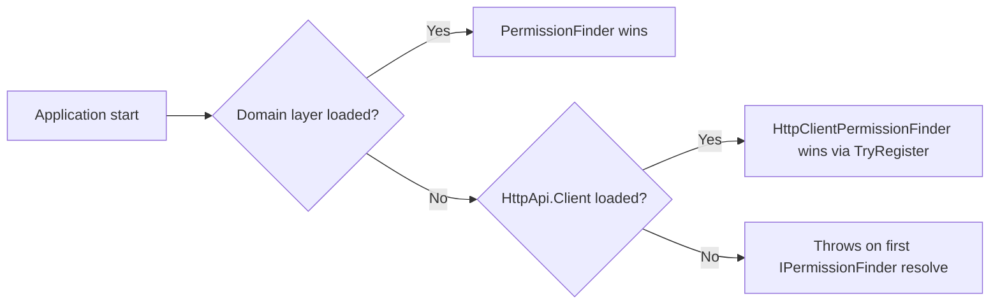
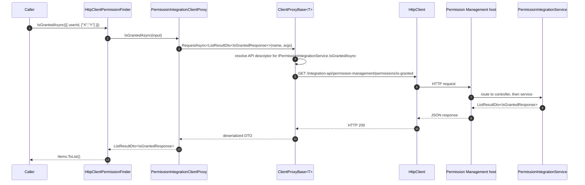

`Volo.Abp.PermissionManagement.HttpApi.Client` is the consumer-side complement of [HTTP API](/modules/permission-management/http-api). It contains generated client proxies that implement the same contracts as the controllers, so a remote caller can `_permissionAppService.GetAsync("U", userId)` from any process without referencing the application layer.

## File inventory

```
Volo.Abp.PermissionManagement.HttpApi.Client/
├── ClientProxies/Volo/Abp/PermissionManagement/
│   ├── PermissionsClientProxy.cs
│   ├── PermissionsClientProxy.Generated.cs
│   └── Integration/
│       ├── PermissionIntegrationClientProxy.cs
│       └── PermissionIntegrationClientProxy.Generated.cs
└── Volo/Abp/PermissionManagement/
    ├── AbpPermissionManagementHttpApiClientModule.cs
    └── HttpClientPermissionFinder.cs
```

The `.Generated.cs` files are produced by the ABP source generator from the controller metadata. The non-generated partial classes are intentionally empty — they exist as customization seams.

## Module wiring

```csharp
[DependsOn(
    typeof(AbpPermissionManagementApplicationContractsModule),
    typeof(AbpHttpClientModule))]
public class AbpPermissionManagementHttpApiClientModule : AbpModule
{
    public override void ConfigureServices(ServiceConfigurationContext context)
    {
        context.Services.AddStaticHttpClientProxies(
            typeof(AbpPermissionManagementApplicationContractsModule).Assembly,
            PermissionManagementRemoteServiceConsts.RemoteServiceName
        );

        Configure<AbpVirtualFileSystemOptions>(options =>
        {
            options.FileSets.AddEmbedded<AbpPermissionManagementHttpApiClientModule>();
        });
    }
}
```

The key call is `AddStaticHttpClientProxies(typeof(AbpPermissionManagementApplicationContractsModule).Assembly, "AbpPermissionManagement")`. ABP scans the contracts assembly for every `IApplicationService` / `IRemoteService` interface and registers the matching `ClientProxyBase<T>` implementation against the "AbpPermissionManagement" remote-service name. The base URL for that name comes from `AbpRemoteServiceOptions`:

```json
{
  "RemoteServices": {
    "AbpPermissionManagement": {
      "BaseUrl": "https://identity.svc.local/"
    },
    "Default": {
      "BaseUrl": "https://api.svc.local/"
    }
  }
}
```

If no entry matches, the `Default` URL is used.

## PermissionsClientProxy

The customization seam:

```csharp
// PermissionsClientProxy.cs
namespace Volo.Abp.PermissionManagement;

public partial class PermissionsClientProxy
{
}
```

The generated half:

```csharp
// PermissionsClientProxy.Generated.cs
[Dependency(ReplaceServices = true)]
[ExposeServices(typeof(IPermissionAppService), typeof(PermissionsClientProxy))]
public partial class PermissionsClientProxy
    : ClientProxyBase<IPermissionAppService>, IPermissionAppService
{
    public virtual async Task<GetPermissionListResultDto> GetAsync(string providerName, string providerKey)
    {
        return await RequestAsync<GetPermissionListResultDto>(nameof(GetAsync), new ClientProxyRequestTypeValue
        {
            { typeof(string), providerName },
            { typeof(string), providerKey }
        });
    }

    public virtual async Task UpdateAsync(string providerName, string providerKey, UpdatePermissionsDto input)
    {
        await RequestAsync(nameof(UpdateAsync), new ClientProxyRequestTypeValue
        {
            { typeof(string), providerName },
            { typeof(string), providerKey },
            { typeof(UpdatePermissionsDto), input }
        });
    }
}
```

`ClientProxyBase<T>.RequestAsync` is the workhorse:

- It looks up the API description for `IPermissionAppService.GetAsync` via `IApiDescriptionFinder` (which talks to the ABP API metadata published by the host).
- Picks the matching HTTP method and URL template (`GET /api/permission-management/permissions`).
- Binds each argument by its declared C# type. `ClientProxyRequestTypeValue` is an ordered list of `(Type, object)` pairs that maps positionally onto the parameters in the metadata.
- Issues the call through the named `HttpClient` (resolved from `IHttpClientFactory` under the remote-service name), attaches auth headers via the configured `IRemoteServiceHttpClientAuthenticator`, and deserializes the response.

The `[Dependency(ReplaceServices = true)]` is important — it ensures the proxy takes the slot of any default `IPermissionAppService` registered by `AbpPermissionManagementApplicationContractsModule`. Without it, a consumer that loaded both `Application` and `HttpApi.Client` would have two registrations and the wrong one might win.

> **Gotcha** — if your host accidentally references *both* `Volo.Abp.PermissionManagement.Application` and `Volo.Abp.PermissionManagement.HttpApi.Client`, the proxy wins because of `ReplaceServices = true`. Calling `_permissionAppService.GetAsync(...)` from the host will silently make an HTTP call to itself — a confusing infinite loop on the first request that often blows the request queue.

## PermissionIntegrationClientProxy

```csharp
[Dependency(ReplaceServices = true)]
[ExposeServices(typeof(IPermissionIntegrationService), typeof(PermissionIntegrationClientProxy))]
[IntegrationService]
public partial class PermissionIntegrationClientProxy
    : ClientProxyBase<IPermissionIntegrationService>, IPermissionIntegrationService
{
    public virtual async Task<ListResultDto<IsGrantedResponse>> IsGrantedAsync(List<IsGrantedRequest> input)
    {
        return await RequestAsync<ListResultDto<IsGrantedResponse>>(nameof(IsGrantedAsync), new ClientProxyRequestTypeValue
        {
            { typeof(List<IsGrantedRequest>), input }
        });
    }
}
```

The `[IntegrationService]` attribute is preserved on the proxy. The base `ClientProxyBase` uses this signal — combined with the controller's `[Route("integration-api/...")]` — to route through the integration HTTP client builder. Some hosting configurations register a separate `HttpClient` for integration traffic with stricter timeouts.

## HttpClientPermissionFinder

The most consequential file in the package:

```csharp
[Dependency(TryRegister = true)]
public class HttpClientPermissionFinder : IPermissionFinder, ITransientDependency
{
    protected IPermissionIntegrationService PermissionIntegrationService { get; }

    public HttpClientPermissionFinder(IPermissionIntegrationService permissionIntegrationService)
    {
        PermissionIntegrationService = permissionIntegrationService;
    }

    public virtual async Task<List<IsGrantedResponse>> IsGrantedAsync(List<IsGrantedRequest> requests)
    {
        return (await PermissionIntegrationService.IsGrantedAsync(requests)).Items.ToList();
    }
}
```

Three subtle but important traits:

1. **`[Dependency(TryRegister = true)]`** — this only registers the implementation if `IPermissionFinder` has not yet been registered. The Domain layer's `PermissionFinder` (a `[ITransientDependency]` implementing the same interface) wins by default, but in a remote-only consumer (a microservice that does not load the Domain layer) `HttpClientPermissionFinder` becomes the active implementation.
2. **`Items.ToList()`** — the integration service returns `ListResultDto<IsGrantedResponse>`; the finder strips the wrapper so consumers get the canonical `List<IsGrantedResponse>` that `IPermissionFinder` declares.
3. The finder is shaped *identically* to the Domain layer's `PermissionFinder` from the caller's perspective. Switching from monolithic to distributed deployment of the permission service is therefore invisible to any code that depends on `IPermissionFinder`.

## Choosing the right finder



The Domain layer's `PermissionFinder` is registered with the default `[ITransientDependency]`, so its registration order matters less than the gate on `TryRegister`. Any custom `IPermissionFinder` you register with `[Dependency(ReplaceServices = true)]` overrides both.

## Sequence: remote IPermissionFinder



## Embedded virtual file system

The module also registers its own assembly via `AddEmbedded<AbpPermissionManagementHttpApiClientModule>()`. The package itself does not ship any embedded JSON, but the registration reserves the prefix for downstream extensions and is required by ABP's `IVirtualFileProvider` when modules contribute UI views consumed by the client.

## Customization paths

| Goal | Where |
| --- | --- |
| Add a default header on every outbound call (e.g. `X-Tenant-Id`). | Implement `IHttpClientHandler` or `DelegatingHandler`, register it for the `"AbpPermissionManagement"` named HTTP client. |
| Decorate the client proxy with caching. | Subclass `PermissionsClientProxy` and re-register with `[Dependency(ReplaceServices = true)]` *after* the generated proxy. |
| Use a different integration service URL for `is-granted`. | Register a custom `IRemoteServiceHttpClientAuthenticator` or split via `AbpRemoteServiceOptions.RemoteServices`. |
| Replace `HttpClientPermissionFinder` with a gRPC variant. | Implement `IPermissionFinder` directly and register with `[Dependency(ReplaceServices = true)]`. |

## Gotchas

- `AddStaticHttpClientProxies` scans the *contracts* assembly, not this assembly. If you fork the contracts package and forget to update the assembly reference in this call, your fork's interfaces won't get proxies.
- `RequestAsync` resolves the API description from `IApiDescriptionFinder`, which by default caches `application-configuration` data fetched from the remote host. Schema mismatches between the client's expectation and the running server (e.g. you upgraded the server but not the client NuGet package) surface as `AbpRemoteCallException` with vague messages — comparing the generated proxy against the server's `IApiDescriptionFinder` output is the fastest way to diagnose.
- `IsGrantedRequest.UserId` serializes as a stringified GUID. The integration controller's GET binding tolerates both standard hyphen formats and the dotted shape; query-string variants of the same call will not work because the body shape is required.
- The proxies are partial classes — adding methods or overriding `RequestAsync` in the non-generated half is the supported customization seam. Modifying the `.Generated.cs` files directly is unsupported because the build regenerates them in commercial templates.

Continue with [Web (MVC/Razor)](/modules/permission-management/web).
