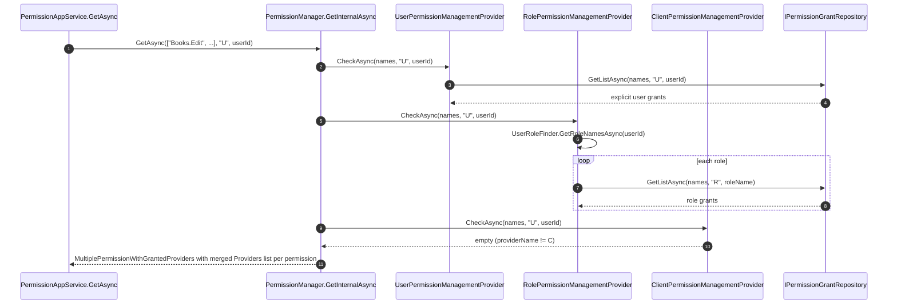

`Volo.Abp.PermissionManagement.Domain.Identity` is the satellite package that adds the **R** (role) and **U** (user) management providers to the [Domain](/modules/permission-management/domain) layer. It is the bridge between the generic permission management system and the Identity module's users and roles.

Although the source lives under `modules/identity/src/`, it is conceptually part of permission management — the moment your application loads `Volo.Abp.Identity.Domain`, this package wires itself in.

## File inventory

```
modules/identity/src/Volo.Abp.PermissionManagement.Domain.Identity/Volo/Abp/PermissionManagement/
├── RolePermissionManagerExtensions.cs
├── UserPermissionManagerExtensions.cs
└── Identity/
    ├── AbpPermissionManagementDomainIdentityModule.cs
    ├── RoleDeletedEventHandler.cs
    ├── RolePermissionManagementProvider.cs
    ├── RoleUpdateEventHandler.cs
    └── UserPermissionManagementProvider.cs
```

## Module wiring

```csharp
[DependsOn(
    typeof(AbpIdentityDomainSharedModule),
    typeof(AbpPermissionManagementDomainModule)
)]
public class AbpPermissionManagementDomainIdentityModule : AbpModule
{
    public override void ConfigureServices(ServiceConfigurationContext context)
    {
        Configure<PermissionManagementOptions>(options =>
        {
            options.ManagementProviders.Add<UserPermissionManagementProvider>();
            options.ManagementProviders.Add<RolePermissionManagementProvider>();

            options.ProviderPolicies[UserPermissionValueProvider.ProviderName] = "AbpIdentity.Users.ManagePermissions";
            options.ProviderPolicies[RolePermissionValueProvider.ProviderName] = "AbpIdentity.Roles.ManagePermissions";
        });
    }
}
```

Three things are configured:

1. `UserPermissionManagementProvider` is added to `ManagementProviders`.
2. `RolePermissionManagementProvider` is added next.
3. The matching `ProviderPolicies` are mapped so `PermissionAppService.CheckProviderPolicy` knows which policy to enforce on R / U endpoints.

The order matters. `PermissionManager.GetInternalAsync` walks the providers in registration order and ORs their results. With `U` registered before `R`, the user's effective permissions are computed by first asking "is this user explicitly granted?", then "does any of the user's roles grant it?". Both contribute to `PermissionWithGrantedProviders.Providers`.

> **Gotcha** — the `[DependsOn(typeof(AbpIdentityDomainSharedModule))]` is intentional: it pulls in the `AbpIdentity` localization resource which `IUserRoleFinder` needs but does not transitively load `AbpIdentityDomainModule`. This keeps the package usable from a microservice that depends only on Identity contracts.

## UserPermissionManagementProvider

```csharp
public class UserPermissionManagementProvider : PermissionManagementProvider
{
    public override string Name => UserPermissionValueProvider.ProviderName; // "U"

    public UserPermissionManagementProvider(
        IPermissionGrantRepository permissionGrantRepository,
        IGuidGenerator guidGenerator,
        ICurrentTenant currentTenant)
        : base(permissionGrantRepository, guidGenerator, currentTenant) { }
}
```

Almost trivial — it inherits the base behavior verbatim. The base class's `CheckAsync` looks for `PermissionGrant` rows matching `ProviderName == "U"` and the supplied `providerKey` (the user id stringified). `GrantAsync`/`RevokeAsync` insert/delete the same way.

The class exists primarily to give the framework a distinct DI type to register and a clear conceptual home — `Name => "U"` is the identity that `PermissionManager.SetAsync` matches against.

## RolePermissionManagementProvider

This is where the interesting cascading logic lives. `RolePermissionManagementProvider.CheckAsync` is the most important override in the entire module:

```csharp
public class RolePermissionManagementProvider : PermissionManagementProvider
{
    public override string Name => RolePermissionValueProvider.ProviderName; // "R"

    protected IUserRoleFinder UserRoleFinder { get; }

    public RolePermissionManagementProvider(
        IPermissionGrantRepository permissionGrantRepository,
        IGuidGenerator guidGenerator,
        ICurrentTenant currentTenant,
        IUserRoleFinder userRoleFinder)
        : base(permissionGrantRepository, guidGenerator, currentTenant)
    {
        UserRoleFinder = userRoleFinder;
    }

    public async override Task<PermissionValueProviderGrantInfo> CheckAsync(
        string name, string providerName, string providerKey)
    {
        var multipleGrantInfo = await CheckAsync(new[] { name }, providerName, providerKey);
        return multipleGrantInfo.Result.Values.First();
    }

    public async override Task<MultiplePermissionValueProviderGrantInfo> CheckAsync(
        string[] names, string providerName, string providerKey)
    {
        var result = new MultiplePermissionValueProviderGrantInfo(names);
        var permissionGrants = new List<PermissionGrant>();

        if (providerName == Name)
        {
            permissionGrants.AddRange(
                await PermissionGrantRepository.GetListAsync(names, providerName, providerKey));
        }

        if (providerName == UserPermissionValueProvider.ProviderName)
        {
            var userId = Guid.Parse(providerKey);
            var roleNames = await UserRoleFinder.GetRoleNamesAsync(userId);

            foreach (var roleName in roleNames)
            {
                permissionGrants.AddRange(
                    await PermissionGrantRepository.GetListAsync(names, Name, roleName));
            }
        }

        permissionGrants = permissionGrants.Distinct().ToList();
        if (!permissionGrants.Any())
        {
            return result;
        }

        foreach (var permissionName in names)
        {
            var permissionGrant = permissionGrants.FirstOrDefault(x => x.Name == permissionName);
            if (permissionGrant != null)
            {
                result.Result[permissionName] =
                    new PermissionValueProviderGrantInfo(true, permissionGrant.ProviderKey);
            }
        }

        return result;
    }
}
```

The two branches handle the two scenarios where the role provider can answer:

1. **The caller is asking about a role directly** (`providerName == "R"`). The provider behaves like the base — it reads role grants for the given role name.
2. **The caller is asking about a user** (`providerName == "U"`). The provider resolves the user's roles via `IUserRoleFinder`, then unions all role grants for those roles into the response.

This is what makes the management UI for a *user* show greyed-out permissions with the badge "Granted via role: admin". From the UI's perspective the role provider has "granted" the permission with `ProviderKey = "admin"`.

> **Gotcha** — `Guid.Parse(providerKey)` will throw if a custom caller passes a non-GUID provider key for `U`. The base `PermissionManagementProvider` never validates the shape of `providerKey`. If you extend `U` to allow synthetic keys (e.g. anonymous users), patch this parse first.

The `permissionGrants.Distinct()` call collapses duplicates that occur when a user belongs to two roles that both grant the same permission. Without it, the modal would show the same provider tag twice.

## RoleDeletedEventHandler

When a role is deleted, every grant attached to it must go away too:

```csharp
public class RoleDeletedEventHandler :
    IDistributedEventHandler<EntityDeletedEto<IdentityRoleEto>>, ITransientDependency
{
    protected IPermissionManager PermissionManager { get; }

    public RoleDeletedEventHandler(IPermissionManager permissionManager)
        => PermissionManager = permissionManager;

    public async Task HandleEventAsync(EntityDeletedEto<IdentityRoleEto> eventData)
    {
        await PermissionManager.DeleteAsync(RolePermissionValueProvider.ProviderName, eventData.Entity.Name);
    }
}
```

`PermissionManager.DeleteAsync(providerName, providerKey)` reads every `PermissionGrant` for that key and deletes each one through the repository. Each delete fires `EntityChangedEventData<PermissionGrant>`, which the cache invalidator handles. The handler reacts to the **distributed** event so that in a microservice topology, the permission service cleans up even when Identity owns role storage.

The same logic should apply to user deletion but Identity's user delete is handled through a different module — see the Identity user lifecycle docs for the full picture.

## RoleUpdateEventHandler

Role name changes are *not* deletes — grants must be transferred to the new name:

```csharp
public class RoleUpdateEventHandler :
    IDistributedEventHandler<IdentityRoleNameChangedEto>, ITransientDependency
{
    protected IPermissionManager PermissionManager { get; }
    protected IPermissionGrantRepository PermissionGrantRepository { get; }

    public RoleUpdateEventHandler(
        IPermissionManager permissionManager,
        IPermissionGrantRepository permissionGrantRepository)
    {
        PermissionManager = permissionManager;
        PermissionGrantRepository = permissionGrantRepository;
    }

    public async Task HandleEventAsync(IdentityRoleNameChangedEto eventData)
    {
        var permissionGrantsInRole = await PermissionGrantRepository
            .GetListAsync(RolePermissionValueProvider.ProviderName, eventData.OldName);

        foreach (var permissionGrant in permissionGrantsInRole)
        {
            await PermissionManager.UpdateProviderKeyAsync(permissionGrant, eventData.Name);
        }
    }
}
```

`UpdateProviderKeyAsync` (from the Domain layer's `PermissionManager`) does two things per grant:

1. Removes the *old* cache entry under `pn:R,pk:{oldName},n:{name}`.
2. Updates the row's `ProviderKey` and saves it. The entity change event then evicts any cache entry under the new key.

Both events are distributed — they cross service boundaries — so they correctly run in the permission management service even when Identity hosts role storage somewhere else.

## Manager extensions

Two helper static classes keep callers concise:

```csharp
public static class RolePermissionManagerExtensions
{
    public static Task<PermissionWithGrantedProviders> GetForRoleAsync(
        this IPermissionManager mgr, string roleName, string permissionName)
        => mgr.GetAsync(permissionName, RolePermissionValueProvider.ProviderName, roleName);

    public static Task<List<PermissionWithGrantedProviders>> GetAllForRoleAsync(
        this IPermissionManager mgr, string roleName)
        => mgr.GetAllAsync(RolePermissionValueProvider.ProviderName, roleName);

    public static Task SetForRoleAsync(
        this IPermissionManager mgr, string roleName, string permissionName, bool isGranted)
        => mgr.SetAsync(permissionName, RolePermissionValueProvider.ProviderName, roleName, isGranted);
}

public static class UserPermissionManagerExtensions
{
    public static Task<List<PermissionWithGrantedProviders>> GetAllForUserAsync(
        this IPermissionManager mgr, Guid userId)
        => mgr.GetAllAsync(UserPermissionValueProvider.ProviderName, userId.ToString());

    public static Task SetForUserAsync(
        this IPermissionManager mgr, Guid userId, string name, bool isGranted)
        => mgr.SetAsync(name, UserPermissionValueProvider.ProviderName, userId.ToString(), isGranted);
}
```

These convert the typed concepts (`roleName`, `userId`) into the underlying `(providerName, providerKey)` tuple. They are the idiomatic API for seeding scripts and admin background jobs.

> **Gotcha** — `GetAllForUserAsync(userId)` returns *only* what the user provider grants. It does **not** include role-inherited permissions, despite what the name might suggest. To get the user's *effective* permissions, call `GetAsync(names[], "U", userId.ToString())` instead — the role provider's `CheckAsync` cascade will fold in role grants.

## Sequence: cascade resolve (R → U → C)

The full management-side cascade when the modal asks "what permissions does user U have?" looks like:



Each layer contributes its own entry to `PermissionWithGrantedProviders.Providers`. The result is the union of explicit user grants and role-inherited grants — which is exactly what the modal renders as checkboxes plus grey badges.

## Customization recipes

### Adding an "Organization Unit" provider

```csharp
public class OuPermissionManagementProvider : PermissionManagementProvider
{
    public override string Name => "OU";

    public OuPermissionManagementProvider(
        IPermissionGrantRepository repo, IGuidGenerator g, ICurrentTenant ct)
        : base(repo, g, ct) { }
}
```

Then:

```csharp
Configure<PermissionManagementOptions>(options =>
{
    options.ManagementProviders.Add<OuPermissionManagementProvider>();
    options.ProviderPolicies["OU"] = "MyApp.OUs.ManagePermissions";
});
```

To make user grants cascade through OU membership, override `CheckAsync` the way `RolePermissionManagementProvider` does — resolve the user's OUs when `providerName == "U"` and merge their grants.

### Restricting role permissions to a tenant

The `RolePermissionManagementProvider` does **not** override the multi-tenant behavior — grants are scoped to `CurrentTenant.Id`. If you want host-only role grants for system-level roles, wrap the relevant calls in `using (CurrentTenant.Change(null))` inside an `IPermissionManager` decorator.

## Gotchas

- The order of `ManagementProviders.Add<...>()` determines the order of cascade. Adding a new provider *before* the role provider when `providerName == "U"` can short-circuit the role lookup if your provider also returns `true` early.
- `EntityDeletedEto<IdentityRoleEto>` is a **distributed** event; it requires a distributed event bus implementation registered (default is the local bus stub in monoliths). If your monolith has not opted into distributed events, role deletion will not clean up grants in detached deployments.
- `IUserRoleFinder.GetRoleNamesAsync(userId)` returns the user's *direct* roles — not role hierarchies. ABP roles are flat by design; if you implement role nesting, override the finder.
- The provider's `Guid.Parse(providerKey)` will throw `FormatException` if a custom caller passes a non-GUID provider key for `U`. The exception propagates up the stack as a 500.

Continue with [OpenIddict provider](/modules/permission-management/openiddict-provider).
