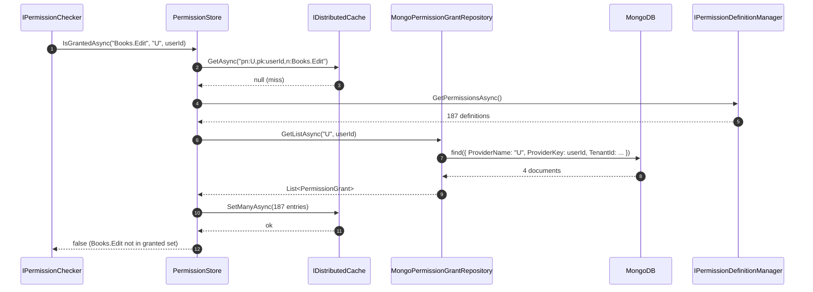

`Volo.Abp.PermissionManagement.MongoDB` is the document-store mirror of the [EF Core](/modules/permission-management/efcore) package. The same entities (`PermissionGrant`, `PermissionDefinitionRecord`, `PermissionGroupDefinitionRecord`) land in three Mongo collections.

## File inventory

```
Volo.Abp.PermissionManagement.MongoDB/Volo/Abp/PermissionManagement/MongoDb/
├── AbpPermissionManagementMongoDbContextExtensions.cs
├── AbpPermissionManagementMongoDbModule.cs
├── IPermissionManagementMongoDbContext.cs
├── MongoPermissionDefinitionRecordRepository.cs
├── MongoPermissionGrantRepository.cs
├── MongoPermissionGroupDefinitionRecordRepository.cs
└── PermissionManagementMongoDbContext.cs
```

## Module wiring

```csharp
[DependsOn(
    typeof(AbpPermissionManagementDomainModule),
    typeof(AbpMongoDbModule)
)]
public class AbpPermissionManagementMongoDbModule : AbpModule
{
    public override void ConfigureServices(ServiceConfigurationContext context)
    {
        context.Services.AddMongoDbContext<PermissionManagementMongoDbContext>(options =>
        {
            options.AddDefaultRepositories<IPermissionManagementMongoDbContext>();

            options.AddRepository<PermissionGroupDefinitionRecord, MongoPermissionGroupDefinitionRecordRepository>();
            options.AddRepository<PermissionDefinitionRecord,     MongoPermissionDefinitionRecordRepository>();
            options.AddRepository<PermissionGrant,                MongoPermissionGrantRepository>();
        });
    }
}
```

Symmetrically with the EF Core module, custom repositories are registered for the entities whose `I*Repository` interfaces add methods beyond `IBasicRepository<T, Guid>`.

## The MongoDbContext

### Interface

```csharp
[ConnectionStringName(AbpPermissionManagementDbProperties.ConnectionStringName)]
public interface IPermissionManagementMongoDbContext : IAbpMongoDbContext
{
    IMongoCollection<PermissionGroupDefinitionRecord> PermissionGroups { get; }
    IMongoCollection<PermissionDefinitionRecord>      Permissions      { get; }
    IMongoCollection<PermissionGrant>                 PermissionGrants { get; }
}
```

Same connection string name as EF Core: `"AbpPermissionManagement"`.

### Implementation

```csharp
[ConnectionStringName(AbpPermissionManagementDbProperties.ConnectionStringName)]
public class PermissionManagementMongoDbContext : AbpMongoDbContext, IPermissionManagementMongoDbContext
{
    public IMongoCollection<PermissionGroupDefinitionRecord> PermissionGroups => Collection<PermissionGroupDefinitionRecord>();
    public IMongoCollection<PermissionDefinitionRecord>      Permissions      => Collection<PermissionDefinitionRecord>();
    public IMongoCollection<PermissionGrant>                 PermissionGrants => Collection<PermissionGrant>();

    protected override void CreateModel(IMongoModelBuilder modelBuilder)
    {
        base.CreateModel(modelBuilder);
        modelBuilder.ConfigurePermissionManagement();
    }
}
```

`Collection<T>()` is an `AbpMongoDbContext` helper that resolves the collection name from the model builder; `CreateModel` is the lifecycle hook where conventions are registered.

## Collection mapping

```csharp
public static void ConfigurePermissionManagement(this IMongoModelBuilder builder)
{
    Check.NotNull(builder, nameof(builder));

    builder.Entity<PermissionGroupDefinitionRecord>(b =>
    {
        b.CollectionName = AbpPermissionManagementDbProperties.DbTablePrefix + "PermissionGroups";
    });

    builder.Entity<PermissionDefinitionRecord>(b =>
    {
        b.CollectionName = AbpPermissionManagementDbProperties.DbTablePrefix + "Permissions";
    });

    builder.Entity<PermissionGrant>(b =>
    {
        b.CollectionName = AbpPermissionManagementDbProperties.DbTablePrefix + "PermissionGrants";
    });
}
```

Only the collection names are overridden. Field types and indexes are inferred from the C# class shape and the BSON conventions configured globally by `AbpMongoDbModule` (camelCase property names, `Guid` as standard binary).

> **Gotcha** — unlike EF Core, the Mongo mapping declares **no unique index**. The composite uniqueness on `(TenantId, Name, ProviderName, ProviderKey)` is enforced only at application-level by `PermissionManagementProvider.GrantAsync`, which calls `FindAsync` before inserting. Under high concurrency two writes can race and both insert; you must add the index manually in production:
>
> ```javascript
> db.AbpPermissionGrants.createIndex(
>   { TenantId: 1, Name: 1, ProviderName: 1, ProviderKey: 1 },
>   { unique: true }
> );
> ```

The same is true of the `Name` indexes on `AbpPermissions` and `AbpPermissionGroups` — application-level lookup is fast for small permission sets, but a unique index is recommended.

## Repositories

### MongoPermissionGrantRepository

```csharp
public class MongoPermissionGrantRepository :
    MongoDbRepository<IPermissionManagementMongoDbContext, PermissionGrant, Guid>,
    IPermissionGrantRepository
{
    public virtual async Task<PermissionGrant> FindAsync(
        string name, string providerName, string providerKey,
        CancellationToken cancellationToken = default)
    {
        cancellationToken = GetCancellationToken(cancellationToken);
        return await (await GetMongoQueryableAsync(cancellationToken))
            .OrderBy(x => x.Id)
            .FirstOrDefaultAsync(s =>
                s.Name == name &&
                s.ProviderName == providerName &&
                s.ProviderKey == providerKey,
                cancellationToken);
    }

    public virtual async Task<List<PermissionGrant>> GetListAsync(
        string providerName, string providerKey, CancellationToken cancellationToken = default)
    {
        cancellationToken = GetCancellationToken(cancellationToken);
        return await (await GetMongoQueryableAsync(cancellationToken))
            .Where(s => s.ProviderName == providerName && s.ProviderKey == providerKey)
            .ToListAsync(cancellationToken);
    }

    public virtual async Task<List<PermissionGrant>> GetListAsync(
        string[] names, string providerName, string providerKey,
        CancellationToken cancellationToken = default)
    {
        cancellationToken = GetCancellationToken(cancellationToken);
        return await (await GetMongoQueryableAsync(cancellationToken))
            .Where(s =>
                names.Contains(s.Name) &&
                s.ProviderName == providerName &&
                s.ProviderKey == providerKey)
            .ToListAsync(cancellationToken);
    }
}
```

The implementations are line-by-line mirrors of the EF Core repository — the `MongoDB.Driver.Linq` provider turns `names.Contains(s.Name)` into an `$in` query.

### MongoPermissionDefinitionRecordRepository

```csharp
public class MongoPermissionDefinitionRecordRepository :
    MongoDbRepository<IPermissionManagementMongoDbContext, PermissionDefinitionRecord, Guid>,
    IPermissionDefinitionRecordRepository
{
    public virtual async Task<PermissionDefinitionRecord> FindByNameAsync(
        string name, CancellationToken cancellationToken = default)
    {
        cancellationToken = GetCancellationToken(cancellationToken);
        return await (await GetMongoQueryableAsync(cancellationToken))
            .OrderBy(x => x.Id)
            .FirstOrDefaultAsync(s => s.Name == name, cancellationToken);
    }
}
```

### MongoPermissionGroupDefinitionRecordRepository

```csharp
public class MongoPermissionGroupDefinitionRecordRepository :
    MongoDbRepository<IPermissionManagementMongoDbContext, PermissionGroupDefinitionRecord, Guid>,
    IPermissionGroupDefinitionRecordRepository
{
}
```

Same marker pattern as EF Core — only basic CRUD is needed.

## Multi-tenant data filter

`PermissionGrant.TenantId` is filtered by the standard ABP multi-tenant data filter registered in `AbpMultiTenancyModule`. When the current tenant is `T1`, queries against `PermissionGrants` automatically append `TenantId == T1`. The filter is suspended by `using (CurrentTenant.Change(null))` inside `ApplicationPermissionManagementProvider` and `ClientPermissionManagementProvider` so client grants always live at host scope.

## Wiring into an application Mongo context

In a monolithic deployment you can collapse the module collections into your own context:

```csharp
[ConnectionStringName("Default")]
public class MyAppMongoDbContext
    : AbpMongoDbContext, IPermissionManagementMongoDbContext
{
    public IMongoCollection<PermissionGroupDefinitionRecord> PermissionGroups => Collection<PermissionGroupDefinitionRecord>();
    public IMongoCollection<PermissionDefinitionRecord>      Permissions      => Collection<PermissionDefinitionRecord>();
    public IMongoCollection<PermissionGrant>                 PermissionGrants => Collection<PermissionGrant>();

    protected override void CreateModel(IMongoModelBuilder modelBuilder)
    {
        base.CreateModel(modelBuilder);
        modelBuilder.ConfigurePermissionManagement();
        // ... your collections
    }
}
```

Then declare the replacement at registration time:

```csharp
context.Services.AddMongoDbContext<MyAppMongoDbContext>(options =>
{
    options.AddDefaultRepositories<IPermissionManagementMongoDbContext>(includeAllEntities: true);
    options.ReplaceDbContext<IPermissionManagementMongoDbContext>();
});
```

## Sequence: cache miss against MongoDB



The shape of the read is identical to the EF Core path — the only difference is the storage engine. Whether you run with EF Core or MongoDB, the upper layers (`PermissionStore`, `PermissionManager`, `PermissionAppService`) are unchanged.

## Transactions

MongoDB transactions require a replica set. ABP's MongoDB unit of work transparently uses sessions when the deployment supports them — the upshot is that a Razor modal save against a stand-alone MongoDB is *not* atomic across the 20 permission rows it writes. Two practical mitigations:

1. Run MongoDB as a single-node replica set (`rs.initiate()` on a single instance) so sessions and transactions are available.
2. Subclass `PermissionAppService.UpdateAsync` to either run inside an explicit `IUnitOfWorkManager.Begin(requiresNew: true, isTransactional: true)` block, or batch the writes via a stored procedure equivalent in your application.

## Why no unique indexes by default?

The Mongo configuration intentionally avoids declaring indexes because:

- Index creation conflicts during multi-host startup are a real operational pain on Mongo, especially with hashed shard keys.
- ABP's commercial templates ship a Data Migrator that creates indexes from a manifest; that gives operators control over background vs. foreground index builds.

The result is that the module is *correct* without indexes (concurrent inserts are protected by the `FindAsync`-then-`InsertAsync` pattern under a unit of work) but not *fast*. Always add the unique compound index on `AbpPermissionGrants` and the unique `Name` indexes on `AbpPermissions` / `AbpPermissionGroups` in production deployments.

## Gotchas

- The Mongo `_id` field for these entities is the entity's `Guid Id` mapped as `BinData` subtype 04 (UUID standard). The C# driver writes this transparently, but ad-hoc queries from `mongosh` need `UUID("...")` to match.
- `ExtraProperties` is serialized as a nested BSON document. Queries against `ExtraProperties.SomeKey` work but cannot be expressed via the LINQ provider — you must drop into `IMongoCollection.Find(Builders<T>.Filter...)`.
- `ConcurrencyStamp` is a string column on EF Core but Mongo does not enforce optimistic concurrency by convention. The base `AbpMongoDbContext` does compare-and-swap on the stamp during `UpdateAsync`. If you bypass the repository and call the driver directly, you must handle the stamp yourself.
- The `BasicAggregateRoot<Guid>` base does not produce `CreationTime`/`LastModificationTime` columns — those properties are only present on `AuditedAggregateRoot`. `PermissionDefinitionRecord` and `PermissionGroupDefinitionRecord` therefore have no audit fields in either backend.

Continue with [HTTP API](/modules/permission-management/http-api).
