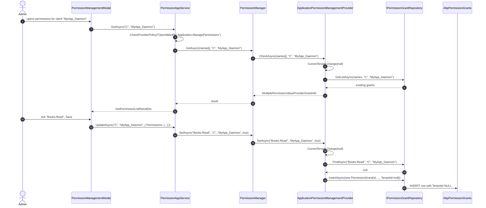

The OpenIddict satellite of the Permission Management module registers a `C` (client) management provider so administrators can grant permissions to OAuth clients (machine-to-machine credentials, daemon services, S2S workloads). Its job is conceptually identical to the user/role providers, but with one absolute rule: **client grants always live at host scope, never at tenant scope.**

This page also covers the parallel package for legacy IdentityServer4 deployments. They share the same provider name (`C`) and the same data model.

## File inventory

```
modules/openiddict/src/Volo.Abp.PermissionManagement.Domain.OpenIddict/Volo/Abp/PermissionManagement/OpenIddict/
├── AbpPermissionManagementDomainOpenIddictModule.cs
└── ApplicationPermissionManagementProvider.cs

modules/identityserver/src/Volo.Abp.PermissionManagement.Domain.IdentityServer/Volo/Abp/PermissionManagement/IdentityServer/
├── AbpPermissionManagementDomainIdentityServerModule.cs
└── ClientPermissionManagementProvider.cs
```

The OpenIddict package is the modern one used by ABP 7+ templates. The IdentityServer package is the legacy variant for applications still on IdentityServer4.

## OpenIddict module wiring

```csharp
[DependsOn(
    typeof(AbpOpenIddictDomainSharedModule),
    typeof(AbpPermissionManagementDomainModule)
)]
public class AbpPermissionManagementDomainOpenIddictModule : AbpModule
{
    public override void ConfigureServices(ServiceConfigurationContext context)
    {
        Configure<PermissionManagementOptions>(options =>
        {
            options.ManagementProviders.Add<ApplicationPermissionManagementProvider>();
            options.ProviderPolicies[ClientPermissionValueProvider.ProviderName]
                = "OpenIddictPro.Application.ManagePermissions";
        });
    }
}
```

Three configuration entries:

1. The provider is added to `PermissionManagementOptions.ManagementProviders`.
2. The provider's name (`"C"` — from `ClientPermissionValueProvider.ProviderName`) is mapped to the `OpenIddictPro.Application.ManagePermissions` policy.
3. The dependency on `AbpOpenIddictDomainSharedModule` pulls in the constants the policy depends on. The provider does **not** call into the OpenIddict store at all — it only writes `PermissionGrant` rows like every other provider.

> **Gotcha** — the policy `OpenIddictPro.Application.ManagePermissions` is part of the **commercial** OpenIddict Pro module. In the free OpenIddict module the policy is undefined and the modal will fail with the `No policy defined to get/set permissions for the provider 'C'` exception unless you register a policy yourself.

## ApplicationPermissionManagementProvider

```csharp
public class ApplicationPermissionManagementProvider : PermissionManagementProvider
{
    public override string Name => ClientPermissionValueProvider.ProviderName; // "C"

    public ApplicationPermissionManagementProvider(
        IPermissionGrantRepository permissionGrantRepository,
        IGuidGenerator guidGenerator,
        ICurrentTenant currentTenant)
        : base(permissionGrantRepository, guidGenerator, currentTenant) { }

    public override Task<PermissionValueProviderGrantInfo> CheckAsync(
        string name, string providerName, string providerKey)
    {
        using (CurrentTenant.Change(null))
        {
            return base.CheckAsync(name, providerName, providerKey);
        }
    }

    protected override Task GrantAsync(string name, string providerKey)
    {
        using (CurrentTenant.Change(null))
        {
            return base.GrantAsync(name, providerKey);
        }
    }

    protected override Task RevokeAsync(string name, string providerKey)
    {
        using (CurrentTenant.Change(null))
        {
            return base.RevokeAsync(name, providerKey);
        }
    }

    public override Task SetAsync(string name, string providerKey, bool isGranted)
    {
        using (CurrentTenant.Change(null))
        {
            return base.SetAsync(name, providerKey, isGranted);
        }
    }
}
```

The class overrides every public method to wrap the call in `using (CurrentTenant.Change(null))`. The semantics:

- `CurrentTenant.Change(null)` puts the ambient tenant id back to `null` (host scope) for the duration of the using block.
- The base implementation reads `CurrentTenant.Id` when constructing a new `PermissionGrant`, so the inserted row carries `TenantId = null`.
- Reads run under the host filter — there is only one row per `(name, "C", clientId)` triple across the whole deployment.

The point: a client (OAuth application) is *globally* defined, not per tenant. A tenant admin should never grant permissions to a client because the same client serves every tenant.

### CheckAsync vs the bulk overload

The provider overrides **only** the single-permission `CheckAsync` overload. The bulk `CheckAsync(string[] names, ...)` is left as the base implementation, which does not switch the tenant scope. In practice this is fine: the bulk overload is called from `PermissionManager.GetInternalAsync` which itself runs at the tenant scope of the management UI, and the matching rows are scoped by the multi-tenant filter — so the bulk read against `(C, clientId)` simply returns no rows when called under a tenant scope.

> **Gotcha** — there is a subtle asymmetry between the single and bulk overloads. If you write a custom integration that calls `multiplePermissionValueProviderGrantInfo = await provider.CheckAsync(["X","Y"], "C", clientId)` under a tenant scope, you will get back `IsGranted = false` even though the host has the grants. Wrap your call in `CurrentTenant.Change(null)` yourself.

## ClientPermissionManagementProvider (IdentityServer4 legacy)

```csharp
public class ClientPermissionManagementProvider : PermissionManagementProvider
{
    public override string Name => ClientPermissionValueProvider.ProviderName; // "C"

    public ClientPermissionManagementProvider(
        IPermissionGrantRepository permissionGrantRepository,
        IGuidGenerator guidGenerator,
        ICurrentTenant currentTenant)
        : base(permissionGrantRepository, guidGenerator, currentTenant) { }

    public override Task<PermissionValueProviderGrantInfo> CheckAsync(string name, string providerName, string providerKey)
        { using (CurrentTenant.Change(null)) { return base.CheckAsync(name, providerName, providerKey); } }

    protected override Task GrantAsync(string name, string providerKey)
        { using (CurrentTenant.Change(null)) { return base.GrantAsync(name, providerKey); } }

    protected override Task RevokeAsync(string name, string providerKey)
        { using (CurrentTenant.Change(null)) { return base.RevokeAsync(name, providerKey); } }

    public override Task SetAsync(string name, string providerKey, bool isGranted)
        { using (CurrentTenant.Change(null)) { return base.SetAsync(name, providerKey, isGranted); } }
}
```

Code is identical except for the class name and namespace. The module wiring also differs only in the policy:

```csharp
Configure<PermissionManagementOptions>(options =>
{
    options.ManagementProviders.Add<ClientPermissionManagementProvider>();
    options.ProviderPolicies[ClientPermissionValueProvider.ProviderName] = "IdentityServer.Client.ManagePermissions";
});
```

A deployment loads either the OpenIddict variant or the IdentityServer variant — not both. The `ProviderPolicies` dictionary entry would otherwise collide (same key, different value), but the loading is mutually exclusive in templates.

## Provider key semantics

What goes in `providerKey` for a client grant?

- **OpenIddict**: the OAuth `client_id` string (e.g. `"MyApp_Daemon"`). This is what the OpenIddict server emits in the access token's `client_id` claim.
- **IdentityServer4**: the IdentityServer4 `Client.ClientId`. Same string concept.

The `ClientPermissionValueProvider` in the authorization layer reads this same claim at request time to identify the calling client, and `PermissionStore.IsGrantedAsync(name, "C", clientId)` returns the runtime answer.

> **Gotcha** — the provider key is *case-sensitive*. OpenIddict's client store treats client ids as case-sensitive by default, but operators sometimes accidentally register `"my-app"` and `"My-App"` and find that grants made against one form do not satisfy the other.

## Sequence: granting a client permission



The crucial detail: the inserted `PermissionGrant` row has `TenantId = NULL`. A tenant admin browsing their own `AbpPermissionGrants` rows will not see the grant (the multi-tenant filter hides host rows), but the OpenIddict client will still satisfy the permission at runtime — because the matching `ClientPermissionValueProvider` reads against host scope too.

## Authorization-side counterpart

To complete the picture, the runtime check that uses these grants is `ClientPermissionValueProvider` (in `Volo.Abp.Authorization`):

```csharp
public class ClientPermissionValueProvider
{
    public const string ProviderName = "C";
    // ... reads PermissionStore against (name, "C", clientIdFromClaim)
}
```

It runs in the same `R → U → C` chain as the other value providers, but for a typical web request `C` only contributes when the principal has no `sub` claim (i.e. a client-credentials token). When both a `sub` and a `client_id` are present, `R` and `U` win first, but `C` can still add permissions (the chain is OR-merged).

## Provider for "client + user" tokens

What about a token that has both a `sub` (user) and a `client_id` (OAuth client)? The default `ClientPermissionValueProvider` honors both — it reads the client grants regardless of whether a user is present. Practically:

- A user signed in via the OpenIddict authorization-code flow ends up with permissions = `(user grants) ∪ (role grants) ∪ (client grants of the requesting application)`.
- A daemon using client-credentials gets only `(client grants)` because there is no user/role context.

This is rarely surprising in practice, but consequential — granting a permission to the SPA client effectively *gives that permission to every user signing in through that SPA*. Operators usually leave client grants narrow (read-only utility permissions) and rely on role grants for sensitive operations.

## When to extend instead of inherit

If your application needs:

- **Client permissions per-tenant** — do not inherit from `ApplicationPermissionManagementProvider`; the host-scope `CurrentTenant.Change(null)` is wired into every method. Instead, write a new provider with a different `Name` (e.g. `"CT"`) and a corresponding value provider on the authorization side.
- **Wildcards or pattern grants** — neither the OpenIddict nor IdentityServer providers support patterns. You need to subclass `PermissionManagementProvider` and override `CheckAsync` to match patterns at query time.

## Gotchas

- The provider's `CheckAsync(string name, ...)` overload changes the tenant scope; the bulk overload does not. Calling the bulk overload outside `PermissionManager` requires a manual `CurrentTenant.Change(null)`.
- The cache key still includes the tenant id in the distributed cache prefix. Switching tenant scope via `using (CurrentTenant.Change(null))` *also* re-routes the cache lookup — which is what makes the host scope effective across reads.
- If both the OpenIddict and IdentityServer satellite packages were ever loaded together (a fragile commercial-template upgrade), the second `ProviderPolicies["C"] = ...` assignment wins. Add a startup check to prevent this in your composition root.
- Granting client permissions in the modal requires the calling administrator to have the `OpenIddictPro.Application.ManagePermissions` policy. In free-tier OpenIddict deployments this policy does not exist; register a custom one or replace the mapping in `PermissionManagementOptions`.
- The `ClientPermissionValueProvider` reads the *raw* `client_id` claim — not the *display name* of the OpenIddict application. Grants must use the technical id.

That completes the Permission Management deep dive. The next section opens **Setting Management** with its own overview.
