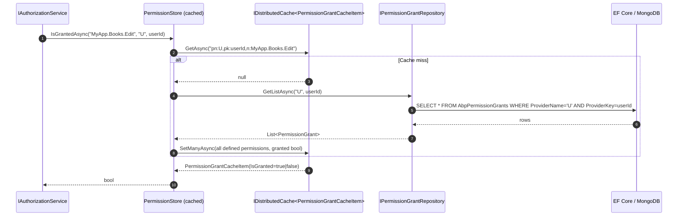
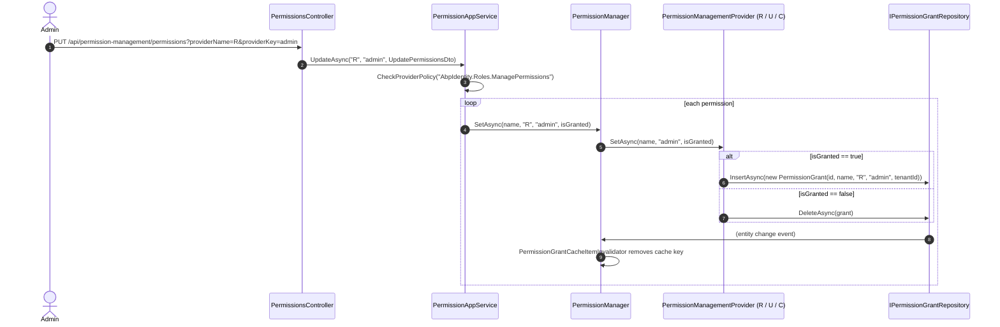

The ABP authorization layer (`Volo.Abp.Authorization`) defines *what* a permission is — a `PermissionDefinition` tied to a name, optional parent, group, allowed value providers, multi‑tenancy side, and state checkers. The **Permission Management module** is the persistent, manageable counterpart. It stores `PermissionGrant` rows, resolves *who* has each permission via an ordered chain of `IPermissionManagementProvider` implementations, and ships the modal UI that administrators use to toggle checkboxes.

This page is the entry point for the 13-page deep dive on this module. It explains the layering, the providers used at runtime, the grant resolution sequence (R → U → C), and the moving parts you will see in the rest of the section.

## Source map

```
modules/permission-management/src/
├── Volo.Abp.PermissionManagement.Domain.Shared          → constants, IPermissionFinder, IsGrantedRequest/Response
├── Volo.Abp.PermissionManagement.Domain                 → PermissionGrant, PermissionManager, PermissionStore,
│                                                          DynamicPermissionDefinitionStore, StaticPermissionSaver
├── Volo.Abp.PermissionManagement.Application.Contracts  → IPermissionAppService, DTOs, IPermissionIntegrationService
├── Volo.Abp.PermissionManagement.Application            → PermissionAppService, PermissionIntegrationService
├── Volo.Abp.PermissionManagement.EntityFrameworkCore    → EF Core mapping + repositories
├── Volo.Abp.PermissionManagement.MongoDB                → MongoDB collections + repositories
├── Volo.Abp.PermissionManagement.HttpApi                → PermissionsController, PermissionIntegrationController
├── Volo.Abp.PermissionManagement.HttpApi.Client         → static client proxies, HttpClientPermissionFinder
├── Volo.Abp.PermissionManagement.Web                    → Razor PermissionManagementModal page
├── Volo.Abp.PermissionManagement.Blazor                 → Blazorise modal component
├── Volo.Abp.PermissionManagement.Blazor.Server          → server-side hosting glue
└── Volo.Abp.PermissionManagement.Blazor.WebAssembly     → WASM hosting glue
```

In addition, two satellite packages live next to their feature modules:

```
modules/identity/src/Volo.Abp.PermissionManagement.Domain.Identity        → User + Role providers
modules/openiddict/src/Volo.Abp.PermissionManagement.Domain.OpenIddict    → OpenIddict Application (client) provider
modules/identityserver/src/Volo.Abp.PermissionManagement.Domain.IdentityServer → legacy IdentityServer client provider
```

These are covered in the [Identity provider](/modules/permission-management/identity-provider) and [OpenIddict provider](/modules/permission-management/openiddict-provider) pages.

## The two halves: definitions and grants

Permission Management deals with two completely separate concepts that share a name:

1. **Permission definitions** — *static* metadata about each permission (`PermissionDefinition`/`PermissionGroupDefinition`) declared in a `PermissionDefinitionProvider` from any module. These can optionally be saved to the database as `PermissionDefinitionRecord` and `PermissionGroupDefinitionRecord` rows by `StaticPermissionSaver`, and complemented by a *dynamic* definition store (`DynamicPermissionDefinitionStore`).
2. **Permission grants** — *runtime* facts that say "for permission X under provider P with key K, isGranted = true". These live in the `PermissionGrant` table. There is no row for revoked permissions; absence == not granted.

The grant side is the focus of most of this module. Definitions are mostly resolved through the authorization layer (`IPermissionDefinitionManager`), and Permission Management plugs a dynamic store into that interface when enabled.

## Providers (value providers vs management providers)

There are two parallel provider abstractions and the wording can be confusing:

| Abstraction | Defined in | Role |
| --- | --- | --- |
| `IPermissionValueProvider` (`UserPermissionValueProvider`, `RolePermissionValueProvider`, `ClientPermissionValueProvider`) | `Volo.Abp.Authorization` | Used by the runtime **authorization check** to decide whether the current principal has a permission. |
| `IPermissionManagementProvider` (`UserPermissionManagementProvider`, `RolePermissionManagementProvider`, `ClientPermissionManagementProvider`, `ApplicationPermissionManagementProvider`) | `Volo.Abp.PermissionManagement` | Used by the **management UI / API** to read and write grants for an entity (`R:admin`, `U:guid`, `C:my‑client`). |

The two share *provider names* — single-character strings declared as constants in the value providers:

```csharp
// framework/src/Volo.Abp.Authorization/Volo/Abp/Authorization/Permissions/
public class UserPermissionValueProvider   { public const string ProviderName = "U"; }
public class RolePermissionValueProvider   { public const string ProviderName = "R"; }
public class ClientPermissionValueProvider { public const string ProviderName = "C"; }
```

Every `PermissionGrant` row carries this `ProviderName` plus a `ProviderKey` (the role name, user id stringified, or client id). This is the universal addressing scheme for grants.

## Runtime resolution sequence

When the application asks *"is user U=`<guid>` granted permission `MyApp.Books.Edit`?"*, the chain is:



That handles the *value provider* side. The authorization layer runs each registered `IPermissionValueProvider` in order, and the first one returning `Granted` wins. The order is configured by `AbpPermissionOptions.ValueProviders` and defaults to **R → U → C** so that role grants are cheap to overlay, user grants override roles, and client (machine-to-machine) grants apply when there is no user.

When an administrator uses the **management UI**, the flow is the dual:



Notice that the same `IPermissionGrantRepository` is the single source of truth used by both flows. The cache layer (a distributed cache of `PermissionGrantCacheItem`) makes the read path fast; the `PermissionGrantCacheItemInvalidator` local event handler keeps it consistent on every insert/update/delete.

## Key abstractions at a glance

| Type | File | Purpose |
| --- | --- | --- |
| `PermissionGrant` | `Domain/PermissionGrant.cs` | The row: `Id`, `TenantId`, `Name`, `ProviderName`, `ProviderKey`. |
| `IPermissionGrantRepository` | `Domain/IPermissionGrantRepository.cs` | Repository contract: `FindAsync(name, pn, pk)`, `GetListAsync(pn, pk)`, `GetListAsync(names, pn, pk)`. |
| `PermissionGrantCacheItem` | `Domain/PermissionGrantCacheItem.cs` | `{ IsGranted: bool }` cached under `pn:{providerName},pk:{providerKey},n:{name}`. |
| `PermissionStore` | `Domain/PermissionStore.cs` | Implements `IPermissionStore` from the authorization layer using the repository + cache. |
| `PermissionManager` | `Domain/PermissionManager.cs` | The management-side façade. Validates the permission, walks `ManagementProviders`, persists grants. |
| `IPermissionManagementProvider` | `Domain/IPermissionManagementProvider.cs` | Strategy that knows how to check and persist grants for a single provider name. |
| `PermissionManagementProvider` | `Domain/PermissionManagementProvider.cs` | Default base class that reads/writes the `PermissionGrant` table directly. |
| `PermissionDefinitionRecord` | `Domain/PermissionDefinitionRecord.cs` | Persisted form of a `PermissionDefinition`. |
| `PermissionGroupDefinitionRecord` | `Domain/PermissionGroupDefinitionRecord.cs` | Persisted form of a `PermissionGroupDefinition`. |
| `StaticPermissionSaver` | `Domain/StaticPermissionSaver.cs` | Pushes the static, code-defined definitions into the DB on startup. |
| `DynamicPermissionDefinitionStore` | `Domain/DynamicPermissionDefinitionStore.cs` | Reads DB-backed definitions back into an in-memory cache for `IPermissionDefinitionManager`. |
| `PermissionFinder` / `IPermissionFinder` | `Domain/PermissionFinder.cs` + `Domain.Shared` | Convenience facade returning bulk `IsGrantedResponse` for integration scenarios. |
| `PermissionAppService` | `Application/PermissionAppService.cs` | The REST surface (`/api/permission-management/permissions`). |
| `PermissionIntegrationService` | `Application/Integration/...` | Internal integration endpoint used by other microservices. |

## Multi-tenancy

`PermissionGrant` implements `IMultiTenant`. The `TenantId` is stamped from `ICurrentTenant.Id` whenever a `PermissionManagementProvider` inserts a row. Reads are filtered by ABP's standard multi-tenant data filter. Two provider implementations deliberately suppress this filter:

- `ApplicationPermissionManagementProvider` (OpenIddict) and `ClientPermissionManagementProvider` (IdentityServer) wrap every `CheckAsync`/`GrantAsync`/`RevokeAsync`/`SetAsync` in `using (CurrentTenant.Change(null))` so client grants always live at host scope, regardless of who is logged in.
- The same providers therefore *intentionally* refuse to grant a client permission to a tenant; the row is host-scoped.

`PermissionManager.SetAsync` also enforces `permission.MultiTenancySide` against `CurrentTenant.GetMultiTenancySide()`, so a host-only permission cannot be granted in a tenant scope.

## Configuration knobs

`PermissionManagementOptions` (Domain) is the central options class. The interesting properties:

```csharp
public class PermissionManagementOptions
{
    public ITypeList<IPermissionManagementProvider> ManagementProviders { get; }
    public Dictionary<string, string> ProviderPolicies { get; }
    public bool SaveStaticPermissionsToDatabase { get; set; } = true;
    public bool IsDynamicPermissionStoreEnabled { get; set; } = false;
}
```

- `ManagementProviders` — the ordered list of strategies (R, U, C, …) that `PermissionManager` walks.
- `ProviderPolicies` — maps a provider name to the policy that protects its endpoints. For example, the Identity satellite registers `R → "AbpIdentity.Roles.ManagePermissions"` and `U → "AbpIdentity.Users.ManagePermissions"`. `PermissionAppService.CheckProviderPolicy` throws if a caller hits the endpoint with a provider name that has no policy.
- `SaveStaticPermissionsToDatabase` — runs `StaticPermissionSaver` on startup (default `true`).
- `IsDynamicPermissionStoreEnabled` — registers `DynamicPermissionDefinitionStore` as the active definition store (default `false`).

Both flags are forced to `false` when `IsDataMigrationEnvironment()` is true so the EF migrator doesn't try to talk to a distributed lock.

## Pages in this section

<CardGroup cols={2}>
  <Card title="Domain.Shared" href="/modules/permission-management/domain-shared">
    Constants, `IPermissionFinder`, `IsGrantedRequest`/`Response`.
  </Card>
  <Card title="Domain" href="/modules/permission-management/domain">
    `PermissionGrant`, `PermissionManager`, `PermissionStore`, definition records, static/dynamic stores.
  </Card>
  <Card title="Application.Contracts" href="/modules/permission-management/application-contracts">
    `IPermissionAppService`, `PermissionGrantInfoDto`, integration interface, remote-service constants.
  </Card>
  <Card title="Application" href="/modules/permission-management/application">
    `PermissionAppService` + `PermissionIntegrationService`, group materialization, policy guard.
  </Card>
  <Card title="EF Core" href="/modules/permission-management/efcore">
    Table mappings, indexes, EF Core repositories.
  </Card>
  <Card title="MongoDB" href="/modules/permission-management/mongodb">
    Mongo collections, repository implementations.
  </Card>
  <Card title="HTTP API" href="/modules/permission-management/http-api">
    Controllers, routes, integration endpoint.
  </Card>
  <Card title="HTTP API Client" href="/modules/permission-management/http-api-client">
    Static client proxies, `HttpClientPermissionFinder`.
  </Card>
  <Card title="Web (MVC/Razor)" href="/modules/permission-management/web">
    `PermissionManagementModal` Razor page, flat-tree depth finder.
  </Card>
  <Card title="Blazor" href="/modules/permission-management/blazor">
    Blazorise modal, parent/child toggling, current configuration reset.
  </Card>
  <Card title="Identity provider" href="/modules/permission-management/identity-provider">
    Role and user management providers, role-rename and role-deleted handlers.
  </Card>
  <Card title="OpenIddict provider" href="/modules/permission-management/openiddict-provider">
    `ApplicationPermissionManagementProvider`, host-scope enforcement.
  </Card>
</CardGroup>

## Gotchas

- The cache key format is `pn:{providerName},pk:{providerKey},n:{name}`. `PermissionGrantCacheItem.GetPermissionNameFormCacheKeyOrNull` parses it back. Custom code that constructs keys by hand will silently miss the invalidator.
- `PermissionStore.GetCacheItemAsync` populates the cache **for every defined permission** on a miss, not just the requested one. That is by design — most callers ask about many permissions per request — but a single check still triggers a full repository read for the `(providerName, providerKey)` pair.
- `PermissionManager.SetAsync` silently ignores undefined permission names. They could be remnants from a removed module living in the dynamic store; throwing would break upgrades.
- `permission.IsEnabled` and the `ISimpleStateCheckerManager<PermissionDefinition>` chain are checked *before* the providers run. A disabled permission is never granted, regardless of any existing `PermissionGrant` row.
- `StaticPermissionSaver` acquires two distributed locks — one per application and one common to all apps sharing the database — so multi-instance deployments don't race when seeding the same permission set.

Continue with [Domain.Shared](/modules/permission-management/domain-shared).
