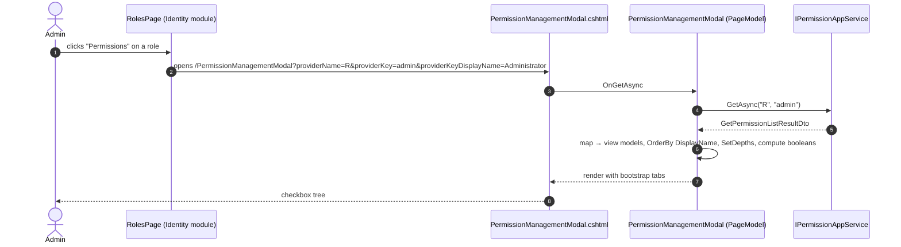
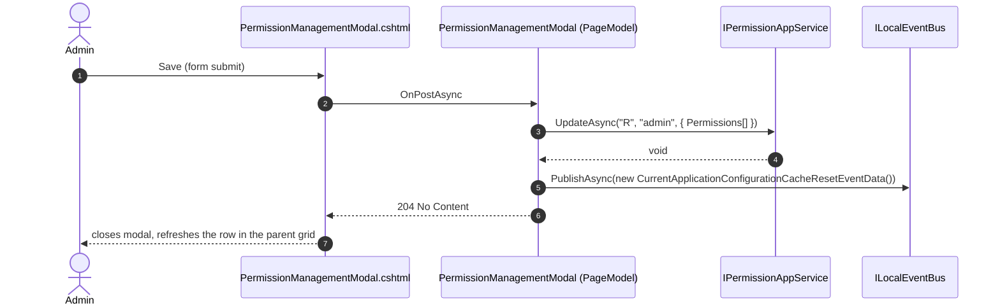

`Volo.Abp.PermissionManagement.Web` is the Razor Pages UI for administrators. It ships a single modal page that the Identity, OpenIddict (or IdentityServer), and tenant management modules embed via JavaScript. The package's footprint is intentionally tiny — most of the work happens through the application service.

## File inventory

```
Volo.Abp.PermissionManagement.Web/
├── AbpPermissionManagementWebAutoMapperProfile.cs
├── AbpPermissionManagementWebModule.cs
├── Pages/AbpPermissionManagement/
│   ├── PermissionManagementModal.cshtml
│   └── PermissionManagementModal.cshtml.cs
└── Utils/
    ├── FlatTreeDepthFinder.cs
    └── IFlatTreeItem.cs
```

## Module wiring

```csharp
[DependsOn(typeof(AbpPermissionManagementApplicationContractsModule))]
[DependsOn(typeof(AbpAspNetCoreMvcUiBootstrapModule))]
[DependsOn(typeof(AbpAutoMapperModule))]
public class AbpPermissionManagementWebModule : AbpModule
{
    public override void PreConfigureServices(ServiceConfigurationContext context)
    {
        context.Services.PreConfigure<AbpMvcDataAnnotationsLocalizationOptions>(options =>
        {
            options.AddAssemblyResource(typeof(AbpPermissionManagementResource));
        });

        PreConfigure<IMvcBuilder>(mvcBuilder =>
        {
            mvcBuilder.AddApplicationPartIfNotExists(typeof(AbpPermissionManagementWebModule).Assembly);
        });
    }

    public override void ConfigureServices(ServiceConfigurationContext context)
    {
        Configure<AbpVirtualFileSystemOptions>(options =>
        {
            options.FileSets.AddEmbedded<AbpPermissionManagementWebModule>();
        });

        context.Services.AddAutoMapperObjectMapper<AbpPermissionManagementWebModule>();
        Configure<AbpAutoMapperOptions>(options =>
        {
            options.AddProfile<AbpPermissionManagementWebAutoMapperProfile>(validate: true);
        });

        Configure<DynamicJavaScriptProxyOptions>(options =>
        {
            options.DisableModule(PermissionManagementRemoteServiceConsts.ModuleName);
        });
    }
}
```

Key points:

1. The `[ApplicationPart]` registration enables the embedded `cshtml` files to be discovered by MVC even when this DLL is pulled in transitively.
2. `AddAssemblyResource(typeof(AbpPermissionManagementResource))` makes `[Display(Name = "...")]` attributes on the view models pick up keys from the permission management localization resource.
3. `Configure<DynamicJavaScriptProxyOptions>(o => o.DisableModule("permissionManagement"))` is critical — without it, the host would emit a duplicate `abp.services.permissionManagement.*` namespace alongside the embedded one this package ships, causing JS to fail with "redeclaration of const".

## AutoMapper profile

```csharp
public class AbpPermissionManagementWebAutoMapperProfile : Profile
{
    public AbpPermissionManagementWebAutoMapperProfile()
    {
        CreateMap<PermissionGroupDto, PermissionManagementModal.PermissionGroupViewModel>()
            .Ignore(p => p.IsAllPermissionsGranted);

        CreateMap<PermissionGrantInfoDto, PermissionManagementModal.PermissionGrantInfoViewModel>()
            .ForMember(p => p.Depth, opts => opts.Ignore());

        CreateMap<ProviderInfoDto, PermissionManagementModal.ProviderInfoViewModel>();
    }
}
```

Two source fields are intentionally ignored:

- `PermissionGroupViewModel.IsAllPermissionsGranted` — computed in `OnGetAsync` after the tree is materialized.
- `PermissionGrantInfoViewModel.Depth` — computed by `FlatTreeDepthFinder` from `ParentName` references after mapping.

The `validate: true` flag on `AddProfile` makes AutoMapper throw at startup if any map is incomplete — a useful early-warning when downstream extensions add new DTO fields.

## The Razor page model

`PermissionManagementModal.cshtml.cs` declares three top-level `BindProperty(SupportsGet = true)` properties that drive the modal:

```csharp
public class PermissionManagementModal : AbpPageModel
{
    [Required] [HiddenInput] [BindProperty(SupportsGet = true)]
    public string ProviderName { get; set; }

    [Required] [HiddenInput] [BindProperty(SupportsGet = true)]
    public string ProviderKey { get; set; }

    [BindProperty(SupportsGet = true)]
    public string ProviderKeyDisplayName { get; set; }

    [BindProperty]
    public List<PermissionGroupViewModel> Groups { get; set; }

    public string EntityDisplayName { get; set; }
    public bool   SelectAllInThisTab { get; set; }
    public bool   SelectAllInAllTabs { get; set; }

    protected IPermissionAppService PermissionAppService { get; }
    protected ILocalEventBus        LocalEventBus        { get; }
    public AbpLocalizationOptions   LocalizationOptions  { get; }
}
```

`ProviderKeyDisplayName` is the optional override that lets the embedding page send a human-readable label (e.g. `"Administrator"` for the admin role) instead of the raw key.

### `OnGetAsync`

```csharp
public virtual async Task<IActionResult> OnGetAsync()
{
    ValidateModel();

    var result = await PermissionAppService.GetAsync(ProviderName, ProviderKey);

    EntityDisplayName = !string.IsNullOrWhiteSpace(ProviderKeyDisplayName)
        ? ProviderKeyDisplayName
        : result.EntityDisplayName;

    Groups = ObjectMapper
        .Map<List<PermissionGroupDto>, List<PermissionGroupViewModel>>(result.Groups)
        .OrderBy(g => g.DisplayName)
        .ToList();

    foreach (var group in Groups)
    {
        new FlatTreeDepthFinder<PermissionGrantInfoViewModel>().SetDepths(group.Permissions);
    }

    foreach (var group in Groups)
    {
        group.IsAllPermissionsGranted = group.Permissions.All(p => p.IsGranted);
    }

    SelectAllInAllTabs = Groups.All(g => g.IsAllPermissionsGranted);

    return Page();
}
```

Three post-processing steps after the DTOs come back:

1. **Order groups by display name.** The application service returns groups in the order the `IPermissionDefinitionManager` saw them; the modal sorts alphabetically for a stable tab strip.
2. **Compute `Depth` per permission.** This is what produces the indentation in the rendered HTML — each child permission's `<label>` is left-padded according to its depth in the parent/child tree.
3. **Compute the tab-level and all-tabs "select all" booleans.** These drive the master checkboxes that toggle a whole tab or the whole modal.

### `OnPostAsync`

```csharp
public virtual async Task<IActionResult> OnPostAsync()
{
    ValidateModel();

    var updatePermissionDtos = Groups
        .SelectMany(g => g.Permissions)
        .Select(p => new UpdatePermissionDto { Name = p.Name, IsGranted = p.IsGranted })
        .ToArray();

    await PermissionAppService.UpdateAsync(
        ProviderName,
        ProviderKey,
        new UpdatePermissionsDto { Permissions = updatePermissionDtos });

    await LocalEventBus.PublishAsync(new CurrentApplicationConfigurationCacheResetEventData());

    return NoContent();
}
```

The `LocalEventBus.PublishAsync(new CurrentApplicationConfigurationCacheResetEventData())` line is the one most downstream developers miss when re-implementing the modal: the application configuration endpoint caches the *current user's* granted permissions, and that cache must be invalidated whenever the admin saves changes to their own grants. Without it, the user has to log out and back in to see their new rights.

The response is **204 No Content**. The Bootstrap JavaScript shim that opens the modal closes it on a 2xx; the embedding page typically calls `abp.notify.success` next.

## View models

```csharp
public class PermissionGroupViewModel
{
    public string Name { get; set; }
    public bool   IsAllPermissionsGranted { get; set; }
    public string DisplayName { get; set; }
    public List<PermissionGrantInfoViewModel> Permissions { get; set; }

    public string GetNormalizedGroupName() => Name.Replace(".", "_");

    public bool IsDisabled(string currentProviderName)
    {
        var grantedProviders = Permissions.SelectMany(x => x.GrantedProviders);
        return Permissions.All(x => x.IsGranted)
            && grantedProviders.All(p => p.ProviderName != currentProviderName);
    }
}

public class PermissionGrantInfoViewModel : IFlatTreeItem
{
    [Required] [HiddenInput] public string Name { get; set; }
    public string DisplayName { get; set; }
    public int    Depth { get; set; }
    public string ParentName { get; set; }
    public bool   IsGranted { get; set; }
    public List<string> AllowedProviders { get; set; }
    public List<ProviderInfoViewModel> GrantedProviders { get; set; }

    public bool IsDisabled(string currentProviderName)
        => IsGranted && GrantedProviders.All(p => p.ProviderName != currentProviderName);

    public string GetShownName(string currentProviderName)
    {
        if (!IsDisabled(currentProviderName)) return DisplayName;

        return string.Format("{0} ({1})",
            DisplayName,
            GrantedProviders
                .Where(p => p.ProviderName != currentProviderName)
                .Select(p => p.ProviderName)
                .JoinAsString(", "));
    }
}
```

The `IsDisabled(currentProviderName)` pattern is the "granted through another provider" rule the modal uses:

- If every permission in the group is granted, **and** none of the granting providers is the one being edited, the whole tab is disabled.
- For a single permission, the same logic applies at the row level. `GetShownName` decorates the display name with the other provider's name so an admin editing a user's permissions sees `Books.Edit (R)` — meaning the permission is granted by a role and editing the user grant won't change anything.

## FlatTreeDepthFinder

```csharp
public class FlatTreeDepthFinder<T> where T : class, IFlatTreeItem
{
    public virtual void SetDepths(List<T> items) => SetDepths(items, null, 0);

    private static void SetDepths(List<T> items, string currentParent, int currentDepth)
    {
        foreach (var item in items)
        {
            if (item.ParentName == currentParent)
            {
                item.Depth = currentDepth;
                SetDepths(items, item.Name, currentDepth + 1);
            }
        }
    }
}

public interface IFlatTreeItem
{
    string Name { get; }
    string ParentName { get; }
    int    Depth { get; set; }
}
```

A small recursive walk that flattens a parent/child graph onto integer depths. The algorithm is O(n²) — fine for a list of a few hundred permissions per group, but it does revisit every item for each parent. If a downstream module re-uses the helper for very large trees, profile first.

## Sequence: opening the modal



After the admin clicks Save:



## Embedding the modal in your own page

Identity's `RolesController` view template embeds the modal with a snippet roughly like:

```html
<a class="grid-action"
   href="javascript:;"
   data-busy-text="@L["ProcessingWithThreeDot"]"
   data-url="@Url.Page("/AbpPermissionManagement/PermissionManagementModal",
                       new { providerName = "R", providerKey = role.Name,
                             providerKeyDisplayName = role.Name })"
   data-modal>
   @L["Permissions"]
</a>
```

The `data-modal` attribute is handled by `abp.ModalManager`, which loads the URL, opens a bootstrap modal, and re-posts the form on Save.

## Gotchas

- `Groups.OrderBy(g => g.DisplayName)` sorts using the *current* request culture's collation. Tab order can therefore differ across locales — usually desired, occasionally surprising.
- `LocalEventBus.PublishAsync(new CurrentApplicationConfigurationCacheResetEventData())` resets the cache **only for the current process**. In a multi-instance deployment behind a load balancer, the *other* instances still hold stale permission caches until the distributed cache invalidator (the `PermissionGrantCacheItemInvalidator`) processes the entity change events.
- `PermissionGroupViewModel.IsDisabled` checks `Permissions.All(x => x.IsGranted)`. A *single* ungranted child permission un-disables the whole tab — which is the correct semantic for the modal but easy to misread in code review.
- The view models are `public` nested types on `PermissionManagementModal`. AutoMapper's profile relies on the full qualified name (`PermissionManagementModal.PermissionGroupViewModel`). Subclassing the page to add a property to the view model means re-registering the map.
- `FlatTreeDepthFinder.SetDepths` recurses without a cycle check. A malformed permission set with `A.ParentName = B` and `B.ParentName = A` will stack-overflow.

Continue with [Blazor](/modules/permission-management/blazor).
