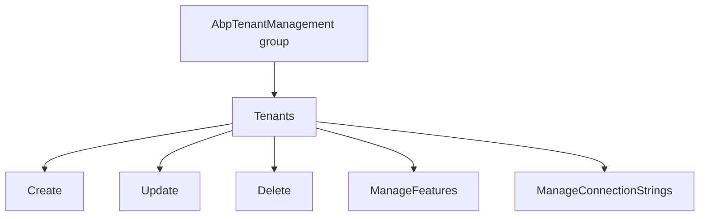
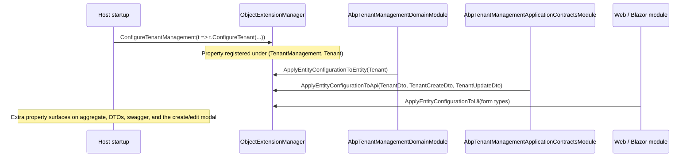

`Volo.Abp.TenantManagement.Application.Contracts` is the public contract every consumer of the module binds to: `ITenantAppService`, the DTOs it exchanges, the permission constants, and the remote-service name used by the HTTP API and proxy modules. It is a tiny assembly with no implementation — that lives one level up in `Volo.Abp.TenantManagement.Application`. The reason for the split is the same as everywhere in ABP: a Blazor WebAssembly client (or any external service) can reference contracts without dragging in EF Core, AutoMapper, or anything domain-specific.

## Files

```
Volo/Abp/TenantManagement/
├── AbpTenantManagementApplicationContractsModule.cs
├── AbpTenantManagementPermissionDefinitionProvider.cs
├── GetTenantsInput.cs
├── ITenantAppService.cs
├── TenantCreateDto.cs
├── TenantCreateOrUpdateDtoBase.cs
├── TenantDto.cs
├── TenantManagementPermissions.cs
├── TenantManagementRemoteServiceConsts.cs
└── TenantUpdateDto.cs
```

## The module class

```csharp
[DependsOn(
    typeof(AbpDddApplicationContractsModule),
    typeof(AbpTenantManagementDomainSharedModule),
    typeof(AbpAuthorizationAbstractionsModule))]
public class AbpTenantManagementApplicationContractsModule : AbpModule
{
    public override void PostConfigureServices(ServiceConfigurationContext context)
    {
        OneTimeRunner.Run(() =>
        {
            ModuleExtensionConfigurationHelper
                .ApplyEntityConfigurationToApi(
                    TenantManagementModuleExtensionConsts.ModuleName,
                    TenantManagementModuleExtensionConsts.EntityNames.Tenant,
                    getApiTypes: new[] { typeof(TenantDto) },
                    createApiTypes: new[] { typeof(TenantCreateDto) },
                    updateApiTypes: new[] { typeof(TenantUpdateDto) });
        });
    }
}
```

`ApplyEntityConfigurationToApi` is the second hop of the extension-property pipeline introduced in [Domain.Shared](/modules/tenant-management/domain-shared#object-extension-hooks). After the host calls `ObjectExtensionManager.Instance.ConfigureTenantManagement(...)`, this call attaches the same property metadata to all three DTOs. `OneTimeRunner` makes it idempotent — even if multiple modules depend on Application.Contracts, the registration runs once per process.

Dependencies are minimal: DDD application contracts (paged/sorted result, `ICrudAppService`), Domain.Shared (constants and the localization resource), and authorization abstractions (`MultiTenancySides`, the permission types).

## `ITenantAppService`

```csharp
public interface ITenantAppService
    : ICrudAppService<TenantDto, Guid, GetTenantsInput, TenantCreateDto, TenantUpdateDto>
{
    Task<string> GetDefaultConnectionStringAsync(Guid id);

    Task UpdateDefaultConnectionStringAsync(Guid id, string defaultConnectionString);

    Task DeleteDefaultConnectionStringAsync(Guid id);
}
```

The base `ICrudAppService<...>` gives:

```csharp
Task<TenantDto>                  GetAsync(Guid id);
Task<PagedResultDto<TenantDto>>  GetListAsync(GetTenantsInput input);
Task<TenantDto>                  CreateAsync(TenantCreateDto input);
Task<TenantDto>                  UpdateAsync(Guid id, TenantUpdateDto input);
Task                             DeleteAsync(Guid id);
```

The three extra methods deal with the **default** connection string only. Named per-module strings exist on the aggregate (`Tenant.SetConnectionString("AbpAuditLogging", ...)`) but the service surface keeps just the default to match the standard UI affordance. Hosts that need fine-grained routing override the app service.

Returning `string` for `GetDefaultConnectionStringAsync` is intentional — exposing the raw value is the whole point of the endpoint, gated behind `ManageConnectionStrings` permission.

## DTOs

### `TenantDto`

```csharp
public class TenantDto : ExtensibleEntityDto<Guid>, IHasConcurrencyStamp
{
    public string Name { get; set; }
    public string ConcurrencyStamp { get; set; }
}
```

`ExtensibleEntityDto<Guid>` brings `Id` and the `ExtraProperties` dictionary, so extension properties registered through `ObjectExtensionManager` flow back to the client. `ConcurrencyStamp` is forwarded straight from the aggregate so the Razor Pages edit modal can include it as a hidden input.

### `TenantCreateOrUpdateDtoBase`

```csharp
public abstract class TenantCreateOrUpdateDtoBase : ExtensibleObject
{
    [Required]
    [DynamicStringLength(typeof(TenantConsts), nameof(TenantConsts.MaxNameLength))]
    [Display(Name = "TenantName")]
    public string Name { get; set; }

    public TenantCreateOrUpdateDtoBase() : base(false) { }
}
```

`base(false)` tells `ExtensibleObject` *not* to pre-populate `ExtraProperties` with property defaults — the values come from the request payload. `DynamicStringLength` resolves `TenantConsts.MaxNameLength` at runtime, so if the host pushes the limit to 128, the validator picks the new value up without recompiling.

`Display(Name = "TenantName")` is a localization key. Combined with `AddAssemblyResource(typeof(AbpTenantManagementResource), ...)` in the Web module, validation messages like *"The TenantName field is required."* resolve through the tenant management resource.

### `TenantCreateDto`

```csharp
public class TenantCreateDto : TenantCreateOrUpdateDtoBase
{
    [Required, EmailAddress, MaxLength(256)]
    public virtual string AdminEmailAddress { get; set; }

    [Required, MaxLength(128), DisableAuditing]
    public virtual string AdminPassword { get; set; }
}
```

Two non-persisted credentials:

- `AdminEmailAddress` — used by the Identity-side seeder to create the first user inside the new tenant.
- `AdminPassword` — same. `[DisableAuditing]` tells the audit-log interceptor not to record the value in `AbpAuditLogActions`.

Neither value is stored on `Tenant`. `TenantAppService.CreateAsync` forwards them as `DataSeedContext` properties and as `TenantCreatedEto.Properties`. The seeder runs *inside* the new tenant scope (see [Application](/modules/tenant-management/application)), so it can write to the user table backed by the tenant's own connection string if one was supplied.

`virtual` setters allow host applications to subclass and add extra fields without object-extension scaffolding.

### `TenantUpdateDto`

```csharp
public class TenantUpdateDto : TenantCreateOrUpdateDtoBase, IHasConcurrencyStamp
{
    public string ConcurrencyStamp { get; set; }
}
```

No admin credentials — updates rename only. The concurrency stamp flows back from `TenantDto.ConcurrencyStamp` so the server can reject stale writes.

### `GetTenantsInput`

```csharp
public class GetTenantsInput : PagedAndSortedResultRequestDto
{
    public string Filter { get; set; }
}
```

`PagedAndSortedResultRequestDto` is `MaxResultCount` + `SkipCount` + `Sorting`. `Filter` is a free-text needle matched with `Name.Contains(filter)` by both the EF Core and Mongo repositories.

## Permissions

### `TenantManagementPermissions`

```csharp
public static class TenantManagementPermissions
{
    public const string GroupName = "AbpTenantManagement";

    public static class Tenants
    {
        public const string Default                 = GroupName + ".Tenants";
        public const string Create                  = Default + ".Create";
        public const string Update                  = Default + ".Update";
        public const string Delete                  = Default + ".Delete";
        public const string ManageFeatures          = Default + ".ManageFeatures";
        public const string ManageConnectionStrings = Default + ".ManageConnectionStrings";
    }

    public static string[] GetAll()
        => ReflectionHelper.GetPublicConstantsRecursively(typeof(TenantManagementPermissions));
}
```

These are the policy names the `[Authorize(...)]` attributes on `TenantAppService` and `TenantController` reference. `GetAll()` is what's used to seed permission grants for the admin role.

### `AbpTenantManagementPermissionDefinitionProvider`

```csharp
public override void Define(IPermissionDefinitionContext context)
{
    var tenantManagementGroup = context.AddGroup(TenantManagementPermissions.GroupName,
        L("Permission:TenantManagement"));

    var tenantsPermission = tenantManagementGroup.AddPermission(
        TenantManagementPermissions.Tenants.Default,
        L("Permission:TenantManagement"),
        multiTenancySide: MultiTenancySides.Host);

    tenantsPermission.AddChild(TenantManagementPermissions.Tenants.Create,                  L("Permission:Create"),                  multiTenancySide: MultiTenancySides.Host);
    tenantsPermission.AddChild(TenantManagementPermissions.Tenants.Update,                  L("Permission:Edit"),                    multiTenancySide: MultiTenancySides.Host);
    tenantsPermission.AddChild(TenantManagementPermissions.Tenants.Delete,                  L("Permission:Delete"),                  multiTenancySide: MultiTenancySides.Host);
    tenantsPermission.AddChild(TenantManagementPermissions.Tenants.ManageFeatures,          L("Permission:ManageFeatures"),          multiTenancySide: MultiTenancySides.Host);
    tenantsPermission.AddChild(TenantManagementPermissions.Tenants.ManageConnectionStrings, L("Permission:ManageConnectionStrings"), multiTenancySide: MultiTenancySides.Host);
}
```

Every permission carries `multiTenancySide: MultiTenancySides.Host`. The framework's permission-checking pipeline hides them entirely from tenant-side users — a request running as a tenant cannot *grant* them, *check* them positively, or see them in the management UI. This is the single line that prevents one tenant from seeing or modifying another.

The hierarchy is a single parent permission with five children:



`Tenants.Default` is the base policy guarding both the menu item and the index page. Without it, even `Create` is unreachable because the user cannot navigate to the page.

## Remote-service constants

```csharp
public class TenantManagementRemoteServiceConsts
{
    public const string RemoteServiceName = "AbpTenantManagement";
    public const string ModuleName = "multi-tenancy";
}
```

`RemoteServiceName` is the key under `RemoteServices` in `appsettings.json` that the `HttpApi.Client` uses to find the base URL of the host. `TenantController` is decorated with `[RemoteService(Name = TenantManagementRemoteServiceConsts.RemoteServiceName)]` so swagger groups its operations correctly.

`ModuleName` is the area: routes become `/api/multi-tenancy/tenants`. The MVC `Web` package disables the *dynamic* JavaScript proxy for this module (`options.DisableModule(TenantManagementRemoteServiceConsts.ModuleName)`) because the Razor Pages call the app service directly through DI rather than over HTTP.

## Data contract by endpoint

| Endpoint | Input DTO | Output DTO |
| --- | --- | --- |
| `GetAsync(id)` | `Guid` | `TenantDto` |
| `GetListAsync(input)` | `GetTenantsInput` | `PagedResultDto<TenantDto>` |
| `CreateAsync(input)` | `TenantCreateDto` | `TenantDto` |
| `UpdateAsync(id, input)` | `Guid`, `TenantUpdateDto` | `TenantDto` |
| `DeleteAsync(id)` | `Guid` | — |
| `GetDefaultConnectionStringAsync(id)` | `Guid` | `string?` |
| `UpdateDefaultConnectionStringAsync(id, …)` | `Guid`, `string` | — |
| `DeleteDefaultConnectionStringAsync(id)` | `Guid` | — |

All of these are bound to HTTP routes by the `TenantController` and re-exposed verbatim by the static `TenantClientProxy`.

## Extension property flow



A single registration in the host's `ConfigureServices` lights up the property on all three layers.

## What goes in this package — and what doesn't

In:

- The interface every consumer (Razor, Blazor, WASM, dynamic-proxy) binds to.
- DTOs decorated only with `System.ComponentModel.DataAnnotations` and ABP's `DynamicStringLength` / `DisableAuditing` / `ExtensibleObject`.
- Permission constants and the definition provider.

Out:

- Any AutoMapper profile — that's in `Application` and `Web`/`Blazor`.
- Any access to `Tenant` or `ITenantRepository` — that's in `Application`.
- Any HTTP-routing attributes — those decorate `TenantController` in `HttpApi`.

That separation is what keeps the Blazor WebAssembly bundle small: it references `Application.Contracts` for types and `HttpApi.Client` for transport — never `Application` or `Domain`.
