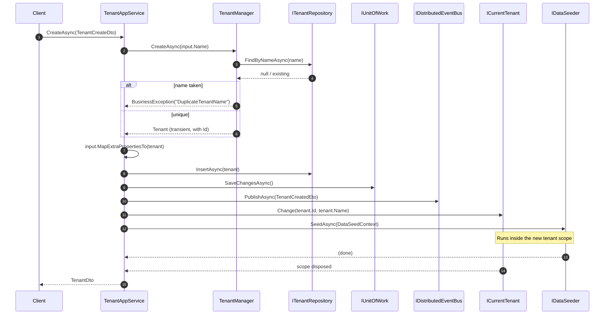

`Volo.Abp.TenantManagement.Application` implements the contract defined in [Application.Contracts](/modules/tenant-management/application-contracts). It is a small assembly: one base class, the `TenantAppService`, and an AutoMapper profile. Everything interesting is inside `CreateAsync`, which orchestrates four collaborators (manager, repository, event bus, data seeder) to produce a working tenant.

## Files

```
Volo/Abp/TenantManagement/
├── AbpTenantManagementApplicationAutoMapperProfile.cs
├── AbpTenantManagementApplicationModule.cs
├── TenantAppService.cs
└── TenantManagementAppServiceBase.cs
```

## The module class

```csharp
[DependsOn(typeof(AbpTenantManagementDomainModule))]
[DependsOn(typeof(AbpTenantManagementApplicationContractsModule))]
[DependsOn(typeof(AbpDddApplicationModule))]
public class AbpTenantManagementApplicationModule : AbpModule
{
    public override void ConfigureServices(ServiceConfigurationContext context)
    {
        context.Services.AddAutoMapperObjectMapper<AbpTenantManagementApplicationModule>();
        Configure<AbpAutoMapperOptions>(options =>
        {
            options.AddProfile<AbpTenantManagementApplicationAutoMapperProfile>(validate: true);
        });
    }
}
```

`AddAutoMapperObjectMapper<AbpTenantManagementApplicationModule>` creates a dedicated `IObjectMapper<AbpTenantManagementApplicationModule>` so that `TenantManagementAppServiceBase` can ask for *its own* mapper, isolated from any other module's profiles. `validate: true` triggers AutoMapper's startup validation — every property mapping has to be explicit or the host fails fast.

## `TenantManagementAppServiceBase`

```csharp
public abstract class TenantManagementAppServiceBase : ApplicationService
{
    protected TenantManagementAppServiceBase()
    {
        ObjectMapperContext = typeof(AbpTenantManagementApplicationModule);
        LocalizationResource = typeof(AbpTenantManagementResource);
    }
}
```

Two side-effects:

- `ObjectMapperContext` makes `this.ObjectMapper` resolve `IObjectMapper<AbpTenantManagementApplicationModule>` — the same profile registered above.
- `LocalizationResource` makes `this.L["..."]` look up keys in `AbpTenantManagementResource`.

Both are standard ABP boilerplate; everything else inherits from `ApplicationService` (`CurrentTenant`, `CurrentUnitOfWork`, `Logger`, …).

## `TenantAppService`

The class declaration:

```csharp
[Authorize(TenantManagementPermissions.Tenants.Default)]
public class TenantAppService : TenantManagementAppServiceBase, ITenantAppService
{
    protected IDataSeeder DataSeeder { get; }
    protected ITenantRepository TenantRepository { get; }
    protected ITenantManager TenantManager { get; }
    protected IDistributedEventBus DistributedEventBus { get; }
    // ...
}
```

The class-level `[Authorize(Tenants.Default)]` makes every endpoint require at least the parent permission. Action-level attributes layer further policies on top (`Create`, `Update`, `Delete`, `ManageConnectionStrings`). The framework's `MultiTenancySides.Host` annotation on those policies means a tenant-side user is rejected even before authorization is checked.

### Read operations

```csharp
public virtual async Task<TenantDto> GetAsync(Guid id)
{
    return ObjectMapper.Map<Tenant, TenantDto>(
        await TenantRepository.GetAsync(id)
    );
}

public virtual async Task<PagedResultDto<TenantDto>> GetListAsync(GetTenantsInput input)
{
    if (input.Sorting.IsNullOrWhiteSpace())
    {
        input.Sorting = nameof(Tenant.Name);
    }

    var count = await TenantRepository.GetCountAsync(input.Filter);
    var list = await TenantRepository.GetListAsync(
        input.Sorting,
        input.MaxResultCount,
        input.SkipCount,
        input.Filter
    );

    return new PagedResultDto<TenantDto>(
        count,
        ObjectMapper.Map<List<Tenant>, List<TenantDto>>(list)
    );
}
```

Defaulting `Sorting` to `Name` is a small UX detail — the database can keep an index on `Name` (it does; see [EF Core](/modules/tenant-management/efcore)). `GetListAsync` does not eagerly load `ConnectionStrings` (the repository defaults `includeDetails` to `false`), so the index page does one cheap query.

### Create — the orchestration

```csharp
[Authorize(TenantManagementPermissions.Tenants.Create)]
public virtual async Task<TenantDto> CreateAsync(TenantCreateDto input)
{
    var tenant = await TenantManager.CreateAsync(input.Name);
    input.MapExtraPropertiesTo(tenant);

    await TenantRepository.InsertAsync(tenant);

    await CurrentUnitOfWork.SaveChangesAsync();

    await DistributedEventBus.PublishAsync(
        new TenantCreatedEto
        {
            Id = tenant.Id,
            Name = tenant.Name,
            Properties =
            {
                { "AdminEmail", input.AdminEmailAddress },
                { "AdminPassword", input.AdminPassword }
            }
        });

    using (CurrentTenant.Change(tenant.Id, tenant.Name))
    {
        //TODO: Handle database creation?
        // TODO: Seeder might be triggered via event handler.
        await DataSeeder.SeedAsync(
            new DataSeedContext(tenant.Id)
                .WithProperty("AdminEmail", input.AdminEmailAddress)
                .WithProperty("AdminPassword", input.AdminPassword)
        );
    }

    return ObjectMapper.Map<Tenant, TenantDto>(tenant);
}
```

Six steps, each with a clear responsibility:

1. **`TenantManager.CreateAsync`** validates the name is unique and constructs the aggregate. Nothing is saved yet — the manager is intentionally pure.
2. **`MapExtraPropertiesTo`** copies any `ExtraProperties` registered via the object-extension manager from DTO to aggregate.
3. **`TenantRepository.InsertAsync`** stages the new row.
4. **`CurrentUnitOfWork.SaveChangesAsync`** flushes the insert immediately, so the new `Id` is committed before any side effect runs. Without this explicit flush, the seeder inside `CurrentTenant.Change(...)` would see an empty `AbpTenants` row for `FindAsync` (cache hits notwithstanding) and downstream consumers of the distributed event would race the transaction.
5. **`DistributedEventBus.PublishAsync(TenantCreatedEto)`** hands the credentials off to whichever module owns user creation — typically the Identity module subscribes to seed an admin user. Because publishing happens on the distributed bus, the consumer can live in another process.
6. **`CurrentTenant.Change(tenant.Id, tenant.Name)`** rescopes the request to the new tenant, then runs `DataSeeder.SeedAsync` with the admin properties. The seeder runs *inside* the tenant scope, which means data filters route any writes to the per-tenant database when a connection string has been provisioned.

The two `TODO` comments are part of the source: database provisioning is left to ops, and the seeder is run inline (synchronously inside the request) rather than as an event handler. Hosts that need automated database creation typically override `CreateAsync` to call into an `IMigrationManager` of their own.

### Create flow



### Update

```csharp
[Authorize(TenantManagementPermissions.Tenants.Update)]
public virtual async Task<TenantDto> UpdateAsync(Guid id, TenantUpdateDto input)
{
    var tenant = await TenantRepository.GetAsync(id);

    await TenantManager.ChangeNameAsync(tenant, input.Name);

    tenant.SetConcurrencyStampIfNotNull(input.ConcurrencyStamp);
    input.MapExtraPropertiesTo(tenant);

    await TenantRepository.UpdateAsync(tenant);

    return ObjectMapper.Map<Tenant, TenantDto>(tenant);
}
```

Three quirks worth noting:

- `GetAsync` (not `FindAsync`) throws `EntityNotFoundException` on a bad id — the controller turns it into a `404`.
- `ChangeNameAsync` re-runs the uniqueness check; passing the current tenant's id as `expectedId` means renaming to the same value is a no-op, not a duplicate error.
- `SetConcurrencyStampIfNotNull` is the optimistic-concurrency control. If the client posts a stale stamp, `AbpDbContext.SaveChanges` raises `DbUpdateConcurrencyException` (wrapped into ABP's `AbpDbConcurrencyException`) and the modal surfaces a localized error.

### Delete

```csharp
[Authorize(TenantManagementPermissions.Tenants.Delete)]
public virtual async Task DeleteAsync(Guid id)
{
    var tenant = await TenantRepository.FindAsync(id);
    if (tenant == null) return;
    await TenantRepository.DeleteAsync(tenant);
}
```

Deliberately tolerant of a missing tenant — `FindAsync` returns `null`, the service returns silently. The repository's `DeleteAsync` is soft-delete because `Tenant` extends `FullAuditedAggregateRoot`. Distributed `EntityDeletedEto<TenantEto>` is published automatically by ABP's domain pipeline; nothing extra is needed here.

### Connection-string endpoints

```csharp
[Authorize(TenantManagementPermissions.Tenants.ManageConnectionStrings)]
public virtual async Task<string> GetDefaultConnectionStringAsync(Guid id)
{
    var tenant = await TenantRepository.GetAsync(id);
    return tenant?.FindDefaultConnectionString();
}

[Authorize(TenantManagementPermissions.Tenants.ManageConnectionStrings)]
public virtual async Task UpdateDefaultConnectionStringAsync(Guid id, string defaultConnectionString)
{
    var tenant = await TenantRepository.GetAsync(id);
    tenant.SetDefaultConnectionString(defaultConnectionString);
    await TenantRepository.UpdateAsync(tenant);
}

[Authorize(TenantManagementPermissions.Tenants.ManageConnectionStrings)]
public virtual async Task DeleteDefaultConnectionStringAsync(Guid id)
{
    var tenant = await TenantRepository.GetAsync(id);
    tenant.RemoveDefaultConnectionString();
    await TenantRepository.UpdateAsync(tenant);
}
```

Three calls, all routed through `Tenant`'s helpers from the [Domain](/modules/tenant-management/domain) chapter. Each save fires the `EntityChangedEventData<Tenant>` local event that `TenantCacheItemInvalidator` listens for; the next read pulls a fresh `TenantConfiguration` with the updated `ConnectionStrings` dictionary.

Database-per-tenant becomes a single PUT:

```http
PUT /api/multi-tenancy/tenants/{id}/default-connection-string
Content-Type: application/json

"Server=tenants-acme.db;Database=acme;..."
```

After the next cache miss, every `DbContext` resolving `Default` for tenant `id` opens the new server instead of the host's.

## The mapping profile

```csharp
public class AbpTenantManagementApplicationAutoMapperProfile : Profile
{
    public AbpTenantManagementApplicationAutoMapperProfile()
    {
        CreateMap<Tenant, TenantDto>()
            .MapExtraProperties();
    }
}
```

Just `Tenant → TenantDto`. `MapExtraProperties()` is the AutoMapper extension that copies `IHasExtraProperties.ExtraProperties` over so registered extension properties round-trip.

Other directions live in adjacent packages:

| Direction | Profile |
| --- | --- |
| `Tenant → TenantDto` | `AbpTenantManagementApplicationAutoMapperProfile` (this package) |
| `Tenant → TenantConfiguration`, `Tenant → TenantEto` | `AbpTenantManagementDomainMappingProfile` ([Domain](/modules/tenant-management/domain)) |
| `TenantDto → EditModalModel.TenantInfoModel`, etc. | `AbpTenantManagementWebAutoMapperProfile` ([Web](/modules/tenant-management/web)) |
| `TenantDto → TenantUpdateDto` | `AbpTenantManagementBlazorAutoMapperProfile` ([Blazor](/modules/tenant-management/blazor)) |

Keeping each profile in its own layer lets a WASM client skip the Web mappings entirely.

## Data-seeder contract

`IDataSeeder.SeedAsync(DataSeedContext)` is a fan-out: every `IDataSeedContributor` in the container runs against the given context. The Tenant Management app service supplies two well-known properties — `AdminEmail` and `AdminPassword` — and a `TenantId`. Identity's contributor reads them and creates the first admin user; other modules can subscribe and do their own seeding.

Because the call is wrapped in `CurrentTenant.Change(tenant.Id, …)`, every writer sees the new tenant as the current one and either:

- writes into the per-tenant database, if the tenant was created with a connection string already set;
- writes into the host database with `TenantId` automatically stamped on `IMultiTenant` entities, if not.

A second important consequence: anything the seeder reads (settings, features, …) is also tenant-scoped. A `SettingProvider` call inside the seeder will pull tenant defaults, not host defaults.

## Distributed events emitted

| Event | Producer | When |
| --- | --- | --- |
| `EntityCreatedEto<TenantEto>` | ABP domain pipeline | After `InsertAsync` commits. |
| `TenantCreatedEto` | `TenantAppService.CreateAsync` | Right after the unit of work commits, before the seeder runs. |
| `EntityUpdatedEto<TenantEto>` | ABP domain pipeline | After any aggregate write (name change or connection-string change). |
| `EntityDeletedEto<TenantEto>` | ABP domain pipeline | After `DeleteAsync` commits. |

`TenantCreatedEto` is the module-specific signal that carries the throwaway admin credentials; the ABP pipeline events are the canonical lifecycle signals every other module can wire onto without a Tenant Management dependency.

## What `TenantAppService` does **not** do

- It does not create a database for the tenant — that is one of the two `TODO`s.
- It does not enroll the tenant in `IFeatureManager` — the Features modal in the UI does that directly through the Feature Management module.
- It does not expose endpoints for named connection strings — only `Default`. Custom routing per module needs a host-side extension.

The next stop is persistence. Choose [EF Core](/modules/tenant-management/efcore) or [MongoDB](/modules/tenant-management/mongodb) depending on your stack — both implement the same `ITenantRepository` contract.
