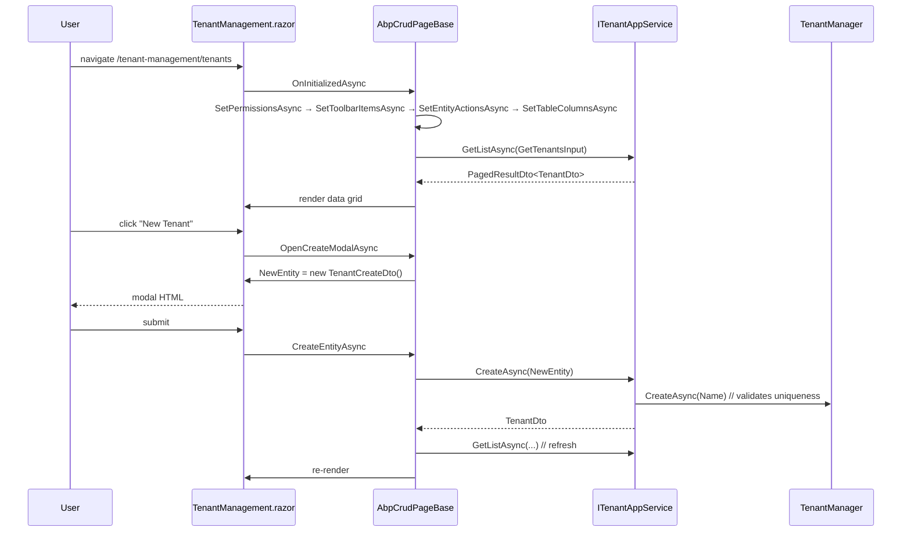
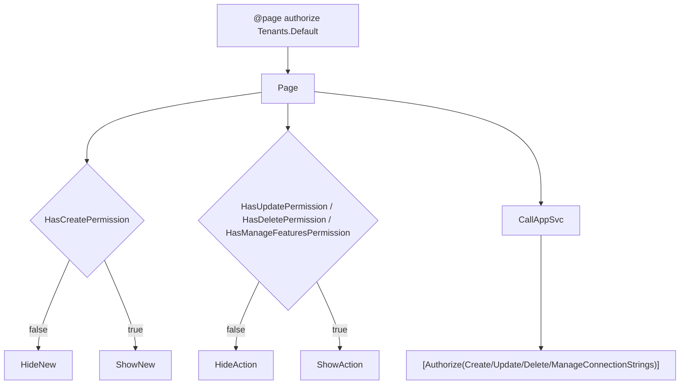

`Volo.Abp.TenantManagement.Blazor` is the Blazorise UI for the module. It targets `AbpCrudPageBase`, ships a single page with a data grid, a create modal, an edit modal, and a delegated Features modal, plus a menu contributor that adds the page under the administration menu. Two thin packages — `Blazor.Server` and `Blazor.WebAssembly` — compose it into either hosting mode.

## Files

```
Volo.Abp.TenantManagement.Blazor/
├── _Imports.razor
├── AbpTenantManagementBlazorAutoMapperProfile.cs
├── AbpTenantManagementBlazorModule.cs
├── Navigation/
│   ├── TenantManagementBlazorMenuContributor.cs
│   └── TenantManagementMenuNames.cs
└── Pages/TenantManagement/
    ├── TenantManagement.razor
    └── TenantManagement.razor.cs

Volo.Abp.TenantManagement.Blazor.Server/
└── AbpTenantManagementBlazorServerModule.cs

Volo.Abp.TenantManagement.Blazor.WebAssembly/
└── AbpTenantManagementBlazorWebAssemblyModule.cs
```

## Module classes

### `AbpTenantManagementBlazorModule`

```csharp
[DependsOn(
    typeof(AbpAutoMapperModule),
    typeof(AbpTenantManagementApplicationContractsModule),
    typeof(AbpFeatureManagementBlazorModule))]
public class AbpTenantManagementBlazorModule : AbpModule
{
    public override void ConfigureServices(ServiceConfigurationContext context)
    {
        context.Services.AddAutoMapperObjectMapper<AbpTenantManagementBlazorModule>();
        Configure<AbpAutoMapperOptions>(options =>
        {
            options.AddProfile<AbpTenantManagementBlazorAutoMapperProfile>(validate: true);
        });

        Configure<AbpNavigationOptions>(options =>
        {
            options.MenuContributors.Add(new TenantManagementBlazorMenuContributor());
        });

        Configure<AbpRouterOptions>(options =>
        {
            options.AdditionalAssemblies.Add(typeof(AbpTenantManagementBlazorModule).Assembly);
        });

        Configure<AbpLocalizationOptions>(options =>
        {
            options.Resources
                .Get<AbpTenantManagementResource>()
                .AddBaseTypes(
                    typeof(AbpFeatureManagementResource),
                    typeof(AbpUiResource));
        });
    }

    public override void PostConfigureServices(ServiceConfigurationContext context)
    {
        OneTimeRunner.Run(() =>
        {
            ModuleExtensionConfigurationHelper.ApplyEntityConfigurationToUi(
                TenantManagementModuleExtensionConsts.ModuleName,
                TenantManagementModuleExtensionConsts.EntityNames.Tenant,
                createFormTypes: new[] { typeof(TenantCreateDto) },
                editFormTypes:   new[] { typeof(TenantUpdateDto) });
        });
    }
}
```

Five concerns:

1. **AutoMapper** — register a per-module mapper so `IObjectMapper<AbpTenantManagementBlazorModule>` is distinct from other layers' mappers.
2. **Navigation** — register `TenantManagementBlazorMenuContributor` so the menu shows up.
3. **`AbpRouterOptions.AdditionalAssemblies`** — tell ABP's router (the Blazorise host) to scan this assembly for `@page` directives. Without it, `TenantManagement.razor` would not match a route.
4. **Localization base types** — same composition as the Web module: feature-management and UI resources flow through the tenant resource.
5. **`ApplyEntityConfigurationToUi`** — wire up extension properties on `TenantCreateDto` / `TenantUpdateDto`. Unlike the Web module (which uses dedicated view models), the Blazor UI binds directly to the DTOs and so registers the DTOs themselves.

### `AbpTenantManagementBlazorServerModule`

```csharp
[DependsOn(
    typeof(AbpTenantManagementBlazorModule),
    typeof(AbpFeatureManagementBlazorServerModule))]
public class AbpTenantManagementBlazorServerModule : AbpModule { }
```

Nothing else — Blazor Server runs in-process. The DI container resolves `ITenantAppService` to the real `TenantAppService`, hitting the database directly.

### `AbpTenantManagementBlazorWebAssemblyModule`

```csharp
[DependsOn(
    typeof(AbpTenantManagementBlazorModule),
    typeof(AbpFeatureManagementBlazorWebAssemblyModule),
    typeof(AbpTenantManagementHttpApiClientModule))]
public class AbpTenantManagementBlazorWebAssemblyModule : AbpModule { }
```

The crucial addition here is `AbpTenantManagementHttpApiClientModule` — in WebAssembly the container resolves `ITenantAppService` to `TenantClientProxy`, which forwards every call over HTTP. The same `TenantManagement.razor` page works in both modes without modification.

## Menu

```csharp
public class TenantManagementBlazorMenuContributor : IMenuContributor
{
    public virtual Task ConfigureMenuAsync(MenuConfigurationContext context)
    {
        if (context.Menu.Name != StandardMenus.Main) return Task.CompletedTask;

        var administrationMenu = context.Menu.GetAdministration();
        var l = context.GetLocalizer<AbpTenantManagementResource>();

        var tenantManagementMenuItem = new ApplicationMenuItem(
            TenantManagementMenuNames.GroupName,
            l["Menu:TenantManagement"],
            icon: "fa fa-users");
        administrationMenu.AddItem(tenantManagementMenuItem);

        tenantManagementMenuItem.AddItem(new ApplicationMenuItem(
                TenantManagementMenuNames.Tenants,
                l["Tenants"],
                url: "~/tenant-management/tenants")
            .RequirePermissions(TenantManagementPermissions.Tenants.Default));

        return Task.CompletedTask;
    }
}
```

Same shape as the MVC menu contributor; the route is the kebab-case `~/tenant-management/tenants` to match Blazor URL conventions, where the Web variant used `~/TenantManagement/Tenants`. The host application's routing decides which contributor runs — both can co-exist in the same process.

## The page

`TenantManagement.razor` declares its route and inheritance:

```razor
@page "/tenant-management/tenants"
@attribute [Authorize(TenantManagementPermissions.Tenants.Default)]
@inherits AbpCrudPageBase<ITenantAppService, TenantDto, Guid, GetTenantsInput, TenantCreateDto, TenantUpdateDto>
```

`AbpCrudPageBase<TAppService, TEntityDto, TKey, TGetListInput, TCreateInput, TUpdateInput>` is the framework's CRUD page base. It provides:

- `Entities`, `TotalCount`, `CurrentPage`, `PageSize` for the data grid.
- `OnDataGridReadAsync` for paged + sorted loads.
- `OpenCreateModalAsync`, `OpenEditModalAsync`, `CreateEntityAsync`, `UpdateEntityAsync`, `DeleteEntityAsync` lifecycle methods.
- Permission flags `HasCreatePermission`, `HasUpdatePermission`, `HasDeletePermission`.
- `CreatePolicyName`, `UpdatePolicyName`, `DeletePolicyName` constants.

The page's code-behind wires the module-specific bits.

### Code-behind

```csharp
public partial class TenantManagement
{
    protected const string FeatureProviderName = "T";

    protected bool HasManageFeaturesPermission;
    protected string ManageFeaturesPolicyName;

    protected FeatureManagementModal FeatureManagementModal;

    protected bool ShowPassword { get; set; }

    protected PageToolbar Toolbar { get; } = new();

    protected List<TableColumn> TenantManagementTableColumns => TableColumns.Get<TenantManagement>();

    public TenantManagement()
    {
        LocalizationResource = typeof(AbpTenantManagementResource);
        ObjectMapperContext  = typeof(AbpTenantManagementBlazorModule);

        CreatePolicyName = TenantManagementPermissions.Tenants.Create;
        UpdatePolicyName = TenantManagementPermissions.Tenants.Update;
        DeletePolicyName = TenantManagementPermissions.Tenants.Delete;

        ManageFeaturesPolicyName = TenantManagementPermissions.Tenants.ManageFeatures;
    }

    protected override ValueTask SetBreadcrumbItemsAsync()
    {
        BreadcrumbItems.Add(new BlazoriseUI.BreadcrumbItem(L["Menu:TenantManagement"]));
        BreadcrumbItems.Add(new BlazoriseUI.BreadcrumbItem(L["Tenants"]));
        return base.SetBreadcrumbItemsAsync();
    }

    protected override async Task SetPermissionsAsync()
    {
        await base.SetPermissionsAsync();
        HasManageFeaturesPermission = await AuthorizationService.IsGrantedAsync(ManageFeaturesPolicyName);
    }

    protected override string GetDeleteConfirmationMessage(TenantDto entity)
        => string.Format(L["TenantDeletionConfirmationMessage"], entity.Name);

    protected override ValueTask SetToolbarItemsAsync()
    {
        Toolbar.AddButton(
            L["NewTenant"],
            OpenCreateModalAsync,
            IconName.Add,
            requiredPolicyName: CreatePolicyName);
        return base.SetToolbarItemsAsync();
    }

    protected override ValueTask SetEntityActionsAsync()
    {
        EntityActions.Get<TenantManagement>().AddRange(new EntityAction[]
        {
            new EntityAction
            {
                Text    = L["Edit"],
                Visible = (data) => HasUpdatePermission,
                Clicked = async (data) => { await OpenEditModalAsync(data.As<TenantDto>()); }
            },
            new EntityAction
            {
                Text    = L["Features"],
                Visible = (data) => HasManageFeaturesPermission,
                Clicked = async (data) =>
                {
                    var tenant = data.As<TenantDto>();
                    await FeatureManagementModal.OpenAsync(FeatureProviderName, tenant.Id.ToString());
                }
            },
            new EntityAction
            {
                Text                = L["Delete"],
                Visible             = (data) => HasDeletePermission,
                Clicked             = async (data) => await DeleteEntityAsync(data.As<TenantDto>()),
                ConfirmationMessage = (data) => GetDeleteConfirmationMessage(data.As<TenantDto>())
            }
        });

        return base.SetEntityActionsAsync();
    }

    protected override ValueTask SetTableColumnsAsync()
    {
        TenantManagementTableColumns.AddRange(new TableColumn[]
        {
            new TableColumn
            {
                Title   = L["Actions"],
                Actions = EntityActions.Get<TenantManagement>(),
            },
            new TableColumn
            {
                Title    = L["TenantName"],
                Sortable = true,
                Data     = nameof(TenantDto.Name),
            },
        });

        TenantManagementTableColumns.AddRange(GetExtensionTableColumns(
            TenantManagementModuleExtensionConsts.ModuleName,
            TenantManagementModuleExtensionConsts.EntityNames.Tenant));

        return base.SetTableColumnsAsync();
    }

    protected virtual void TogglePasswordVisibility() => ShowPassword = !ShowPassword;
}
```

Key points:

- The base type's three policy names are set in the constructor. The toolbar and entity actions use `requiredPolicyName: CreatePolicyName` etc. so the framework can pre-evaluate visibility before rendering.
- **`SetPermissionsAsync`** is the one place a child policy is checked — `ManageFeatures`. Because `AbpCrudPageBase` does not know about it, the page extends the hook.
- **Feature provider name `"T"`** is the convention agreed with the Feature Management module — providers register short keys (`"T"` for tenant, `"U"` for user, …). Calling `FeatureManagementModal.OpenAsync(FeatureProviderName, tenant.Id.ToString())` is the only feature-management coupling.
- **Extension columns** are added through `GetExtensionTableColumns(...)`. After a host registers a `Region` property through `ObjectExtensionManager`, the grid grows a *Region* column automatically.
- **`TogglePasswordVisibility`** flips the password input between text and password modes inside the create modal — purely cosmetic, but called from a button in the Razor template.

### The Razor template

The create modal binds directly to a `TenantCreateDto` (`NewEntity` from the base type). Validation runs through Blazorise's `Validations` component with `MessageLocalizer="@LH.Localize"`, sourced from `AbpBlazorMessageLocalizerHelper<AbpTenantManagementResource>`:

```razor
@inject AbpBlazorMessageLocalizerHelper<AbpTenantManagementResource> LH

<Validations @ref="@CreateValidationsRef" Model="@NewEntity" ValidateOnLoad="false">
    <Validation MessageLocalizer="@LH.Localize">
        <Field>
            <FieldLabel>@L["TenantName"] *</FieldLabel>
            <TextEdit @bind-Text="@NewEntity.Name" Autofocus="true">
                <Feedback><ValidationError/></Feedback>
            </TextEdit>
        </Field>
    </Validation>
    <Validation MessageLocalizer="@LH.Localize">
        <Field>
            <FieldLabel>@L["DisplayName:AdminEmailAddress"] *</FieldLabel>
            <TextEdit Role="@TextRole.Email" @bind-Text="@NewEntity.AdminEmailAddress" />
        </Field>
    </Validation>
    <Validation MessageLocalizer="@LH.Localize">
        <Field>
            <FieldLabel>@L["DisplayName:AdminPassword"] *</FieldLabel>
            <Addons>
                <Addon AddonType="AddonType.Body">
                    <TextEdit Role="ShowPassword ? TextRole.Text : TextRole.Password" @bind-Text="@NewEntity.AdminPassword" />
                </Addon>
                <Addon AddonType="AddonType.End">
                    <Button Color="Color.Secondary" Clicked="@(() => TogglePasswordVisibility())">
                        <Icon Name="ShowPassword ? IconName.Eye : IconName.EyeSlash" />
                    </Button>
                </Addon>
            </Addons>
        </Field>
    </Validation>
    <ExtensionProperties TEntityType="TenantCreateDto" TResourceType="AbpTenantManagementResource"
                        Entity="@NewEntity" LH="@LH"
                        ModalType="ExtensionPropertyModalType.CreateModal" />
</Validations>
```

`<ExtensionProperties .../>` is the Blazor counterpart of the Tag Helper used in the Razor Pages: it walks the object-extension manager and renders an input for each registered extension property.

The edit modal is analogous but uses `EditingEntity` (typed as `TenantUpdateDto`) and renders only the name input plus extension properties.

## The Blazor AutoMapper profile

```csharp
public class AbpTenantManagementBlazorAutoMapperProfile : Profile
{
    public AbpTenantManagementBlazorAutoMapperProfile()
    {
        CreateMap<TenantDto, TenantUpdateDto>()
            .MapExtraProperties();
    }
}
```

One mapping: `TenantDto → TenantUpdateDto`, used by `AbpCrudPageBase.OpenEditModalAsync` to populate `EditingEntity` from the row data. `MapExtraProperties()` carries any extension property values across.

Going the *other* way (DTO → form view model) is not needed because the Blazor UI binds the DTO directly — there is no separate `TenantInfoModel` like the Razor Pages UI defines.

## Lifecycle



In **Blazor Server** every call from the page model to `ITenantAppService` is a normal C# call — the page model and the app service share the same `IServiceProvider` and DbContext. In **Blazor WebAssembly** the same call hits `TenantClientProxy`, which posts the JSON over HTTP. The grid behaviour is identical; only the transport changes.

## Authorization layering



Three layers: the page-level `[Authorize]`, the row-level `Visible` predicates, and the app-service attributes. The page never offers an affordance the backend would reject.

## Features modal

`FeatureManagementModal` is a Blazor component supplied by Feature Management's Blazor module. The page declares a `@ref` to one instance, and opens it with the provider key shared across the framework — `"T"` (tenant) plus the tenant id as string. The modal does its own HTTP / DI work; Tenant Management just hands it the right key.

The `ManageFeatures` permission is the only Tenant Management permission that does not gate a CRUD operation — it gates the affordance to open the modal.

## Where extensions land

| Layer | Extension hook |
| --- | --- |
| Table columns | `GetExtensionTableColumns(...)` — automatic. |
| Create modal inputs | `<ExtensionProperties TEntityType="TenantCreateDto" />` — automatic. |
| Edit modal inputs | `<ExtensionProperties TEntityType="TenantUpdateDto" />` — automatic. |
| Action buttons | Override `SetEntityActionsAsync` in a derived page. |
| Toolbar | Override `SetToolbarItemsAsync` or add through `AbpPageToolbarOptions`. |

A host that wants a completely custom UI can derive from `TenantManagement` (it is a `partial class`) and override the virtuals.

## Composition matrix

| Host | Module reference | App service binding |
| --- | --- | --- |
| Blazor Server monolith | `AbpTenantManagementBlazorServerModule` | `TenantAppService` (in-process) |
| Blazor WASM monolith | `AbpTenantManagementBlazorWebAssemblyModule` | `TenantClientProxy` over HTTP |
| Microservice gateway (Server) hosting the page | `AbpTenantManagementBlazorServerModule` + `AbpTenantManagementHttpApiClientModule` | `TenantClientProxy` over HTTP |

The Blazor UI is the most portable surface in the module — same code path runs on three hosting strategies just by changing the top-level `[DependsOn]` declaration. That portability is the dividend the whole layered design pays out.
