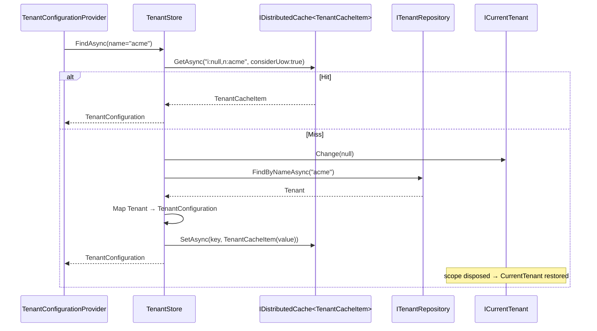

`Volo.Abp.TenantManagement.Domain` is where the module's behaviour lives. It defines the `Tenant` aggregate, its child `TenantConnectionString` entity, the `TenantManager` domain service that enforces invariants, the `ITenantRepository` persistence contract, and — crucially — the `TenantStore` that registers itself as `ITenantStore` so the framework's multi-tenancy pipeline reads from the `AbpTenants` table.

## Files

```
Volo/Abp/TenantManagement/
├── AbpTenantManagementDbProperties.cs
├── AbpTenantManagementDomainMappingProfile.cs
├── AbpTenantManagementDomainModule.cs
├── ITenantManager.cs
├── ITenantRepository.cs
├── Tenant.cs
├── TenantCacheItem.cs
├── TenantCacheItemInvalidator.cs
├── TenantConnectionString.cs
├── TenantManager.cs
└── TenantStore.cs
```

## The `Tenant` aggregate

```csharp
public class Tenant : FullAuditedAggregateRoot<Guid>, IHasEntityVersion
{
    public virtual string Name { get; protected set; }
    public virtual int EntityVersion { get; protected set; }
    public virtual List<TenantConnectionString> ConnectionStrings { get; protected set; }

    protected Tenant() { }

    protected internal Tenant(Guid id, [NotNull] string name)
        : base(id)
    {
        SetName(name);
        ConnectionStrings = new List<TenantConnectionString>();
    }
    // ...
}
```

The contract is small, but every choice is deliberate.

| Aspect | Choice | Why |
| --- | --- | --- |
| Base type | `FullAuditedAggregateRoot<Guid>` | Soft-delete + audit + concurrency stamp. Deleted tenants stay queryable for forensics. |
| `Name` setter | `protected set` | Only `Tenant.SetName` or `TenantManager.ChangeNameAsync` can change it — uniqueness is enforced through the manager. |
| Constructor | `protected internal` | Only `TenantManager.CreateAsync` may construct a tenant; uniqueness is checked first. |
| `EntityVersion` | `IHasEntityVersion` | Bumped on every save by `AbpDbContext`; flowed into `TenantEto` for distributed consumers. |
| `ConnectionStrings` | `List<TenantConnectionString>` | Owned collection; mutated through `SetConnectionString` / `RemoveConnectionString` so a `TenantId` is always present. |

`SetName` is the single guarded setter:

```csharp
protected internal virtual void SetName([NotNull] string name)
{
    Name = Check.NotNullOrWhiteSpace(name, nameof(name), TenantConsts.MaxNameLength);
}
```

`Check.NotNullOrWhiteSpace(value, name, maxLength)` throws an `AbpException` if `value` is `null`, blank, or longer than `TenantConsts.MaxNameLength`. The domain stays correct even when callers bypass the application service.

### Connection-string helpers

```csharp
[CanBeNull] public virtual string FindDefaultConnectionString()
    => FindConnectionString(Data.ConnectionStrings.DefaultConnectionStringName);

[CanBeNull] public virtual string FindConnectionString(string name)
    => ConnectionStrings.FirstOrDefault(c => c.Name == name)?.Value;

public virtual void SetDefaultConnectionString(string connectionString)
    => SetConnectionString(Data.ConnectionStrings.DefaultConnectionStringName, connectionString);

public virtual void SetConnectionString(string name, string connectionString)
{
    var tenantConnectionString = ConnectionStrings.FirstOrDefault(x => x.Name == name);
    if (tenantConnectionString != null) tenantConnectionString.SetValue(connectionString);
    else ConnectionStrings.Add(new TenantConnectionString(Id, name, connectionString));
}

public virtual void RemoveDefaultConnectionString()
    => RemoveConnectionString(Data.ConnectionStrings.DefaultConnectionStringName);
```

`Data.ConnectionStrings.DefaultConnectionStringName` is just the constant `"Default"` from `Volo.Abp.Data`. Two important observations:

1. `SetConnectionString` is upsert — same `Name` mutates in place, new `Name` appends. The aggregate root manages identity.
2. `FindConnectionString` returns `null` for missing names. This null is what `MultiTenantConnectionStringResolver` interprets as *fall back to host-side `ConnectionStrings`*. That single nullability gives you shared-database, database-per-tenant, and per-module routing as a single mechanism.

## `TenantConnectionString`

```csharp
public class TenantConnectionString : Entity
{
    public virtual Guid TenantId { get; protected set; }
    public virtual string Name { get; protected set; }
    public virtual string Value { get; protected set; }

    public TenantConnectionString(Guid tenantId, [NotNull] string name, [NotNull] string value)
    {
        TenantId = tenantId;
        Name = Check.NotNullOrWhiteSpace(name, nameof(name), TenantConnectionStringConsts.MaxNameLength);
        SetValue(value);
    }

    public virtual void SetValue([NotNull] string value)
    {
        Value = Check.NotNullOrWhiteSpace(value, nameof(value), TenantConnectionStringConsts.MaxValueLength);
    }

    public override object[] GetKeys() => new object[] { TenantId, Name };
}
```

Plain `Entity`, not `Entity<TKey>` — its identity is the composite `(TenantId, Name)` returned by `GetKeys()`. The EF Core mapping reflects that with `b.HasKey(x => new { x.TenantId, x.Name })`. There is no surrogate `Id` column.

`Value` is not parsed. Operations like "set the database catalog" are the caller's responsibility — typically a host administrator pasting a full Azure SQL or Mongo connection string into the UI.

## `TenantManager`

```csharp
public class TenantManager : DomainService, ITenantManager
{
    protected ITenantRepository TenantRepository { get; }

    public TenantManager(ITenantRepository tenantRepository)
    {
        TenantRepository = tenantRepository;
    }

    public virtual async Task<Tenant> CreateAsync(string name)
    {
        Check.NotNull(name, nameof(name));
        await ValidateNameAsync(name);
        return new Tenant(GuidGenerator.Create(), name);
    }

    public virtual async Task ChangeNameAsync(Tenant tenant, string name)
    {
        Check.NotNull(tenant, nameof(tenant));
        Check.NotNull(name, nameof(name));
        await ValidateNameAsync(name, tenant.Id);
        tenant.SetName(name);
    }

    protected virtual async Task ValidateNameAsync(string name, Guid? expectedId = null)
    {
        var tenant = await TenantRepository.FindByNameAsync(name);
        if (tenant != null && tenant.Id != expectedId)
        {
            throw new BusinessException("Volo.Abp.TenantManagement:DuplicateTenantName")
                .WithData("Name", name);
        }
    }
}
```

A short class doing one thing: keeping `Name` unique. Note the shape:

- `CreateAsync` does not insert — it only constructs. The application service inserts via the repository. This keeps the domain free of `Add`/`SaveChanges` concerns and makes the manager trivially mockable.
- `ChangeNameAsync` mutates the passed-in aggregate, also without saving. Same separation.
- `ValidateNameAsync(name, expectedId)` is the only collaboration with the repository, and `expectedId` lets `ChangeNameAsync` ignore the current tenant when checking for duplicates.

The exception code `Volo.Abp.TenantManagement:DuplicateTenantName` is registered for localization in `AbpTenantManagementDomainSharedModule` via `MapCodeNamespace`.

## `ITenantRepository`

```csharp
public interface ITenantRepository : IBasicRepository<Tenant, Guid>
{
    Task<Tenant> FindByNameAsync(string name, bool includeDetails = true, CancellationToken cancellationToken = default);

    Task<List<Tenant>> GetListAsync(
        string sorting = null,
        int maxResultCount = int.MaxValue,
        int skipCount = 0,
        string filter = null,
        bool includeDetails = false,
        CancellationToken cancellationToken = default);

    Task<long> GetCountAsync(string filter = null, CancellationToken cancellationToken = default);

    // Obsolete synchronous overloads kept for source compatibility.
}
```

`IBasicRepository<Tenant, Guid>` gives `FindAsync`, `GetAsync`, `InsertAsync`, `UpdateAsync`, `DeleteAsync` for free. The interface adds the name lookup (used by `TenantManager` and `TenantStore`), the filter/page/sort `GetListAsync` (used by `TenantAppService.GetListAsync`), and the count (used to populate the paged result).

`includeDetails` controls whether the `ConnectionStrings` collection is eagerly loaded. `TenantStore.FindAsync` keeps the default (`true`) because connection strings are exactly what the multi-tenancy pipeline asks for next; list/search calls pass `false` to keep the query light.

## `TenantStore`

This is the bridge to the framework. It implements `ITenantStore` (from `Volo.Abp.MultiTenancy.Abstractions`), so once the Tenant Management Domain module is referenced, `TenantConfigurationProvider` finds tenants in the database — no extra wiring.

```csharp
public class TenantStore : ITenantStore, ITransientDependency
{
    protected ITenantRepository TenantRepository { get; }
    protected IObjectMapper<AbpTenantManagementDomainModule> ObjectMapper { get; }
    protected ICurrentTenant CurrentTenant { get; }
    protected IDistributedCache<TenantCacheItem> Cache { get; }

    public virtual async Task<TenantConfiguration> FindAsync(string name)
        => (await GetCacheItemAsync(null, name)).Value;

    public virtual async Task<TenantConfiguration> FindAsync(Guid id)
        => (await GetCacheItemAsync(id, null)).Value;

    protected virtual async Task<TenantCacheItem> GetCacheItemAsync(Guid? id, string name)
    {
        var cacheKey = CalculateCacheKey(id, name);

        var cacheItem = await Cache.GetAsync(cacheKey, considerUow: true);
        if (cacheItem != null) return cacheItem;

        if (id.HasValue)
        {
            using (CurrentTenant.Change(null))
            {
                var tenant = await TenantRepository.FindAsync(id.Value);
                return await SetCacheAsync(cacheKey, tenant);
            }
        }

        if (!name.IsNullOrWhiteSpace())
        {
            using (CurrentTenant.Change(null))
            {
                var tenant = await TenantRepository.FindByNameAsync(name);
                return await SetCacheAsync(cacheKey, tenant);
            }
        }

        throw new AbpException("Both id and name can't be invalid.");
    }
}
```

Three things to call out:

1. **`using (CurrentTenant.Change(null))`** wraps every read. The tenant store is queried while resolving the current tenant, so the query must run as *host*. Without this scope, the multi-tenant data filter would try to add `WHERE TenantId = @CurrentTenant` to the tenant table itself and either filter out everything or recurse. The TODO in the source notes that host-side entity support would replace this trick.
2. **Cache key** is `i:{id|null},n:{name|null}` (from `TenantCacheItem.CalculateCacheKey`). Both lookups share the same cache namespace, so a hit by id will not be reused on a lookup by name and vice versa — duplicated entries by design, since invalidation runs by both key shapes.
3. **`considerUow: true`** on `GetAsync`/`SetAsync` means writes are buffered until the unit of work commits. If the same request creates a tenant and then resolves it, the cache state remains consistent.

`Cache.GetAsync(cacheKey, considerUow: true)` returns the wrapper `TenantCacheItem`; its `Value` is the `TenantConfiguration` shaped exactly like a host-defined tenant. Even for "tenant not found", the cache stores a `TenantCacheItem(null)` — negative results are memoized too, so unknown subdomains do not slam the database.

### Mapping Tenant → TenantConfiguration

`AbpTenantManagementDomainMappingProfile` projects connection strings from `List<TenantConnectionString>` into the framework's flat dictionary type:

```csharp
CreateMap<Tenant, TenantConfiguration>()
    .ForMember(ti => ti.ConnectionStrings, opts =>
    {
        opts.MapFrom((tenant, ti) =>
        {
            var connStrings = new ConnectionStrings();
            foreach (var connectionString in tenant.ConnectionStrings)
            {
                connStrings[connectionString.Name] = connectionString.Value;
            }
            return connStrings;
        });
    })
    .ForMember(x => x.IsActive, x => x.Ignore());

CreateMap<Tenant, TenantEto>();
```

`ConnectionStrings` is `Dictionary<string, string>` with a sentinel for the default key — exactly what `MultiTenantConnectionStringResolver` expects. `IsActive` is ignored because the aggregate has no such field today; all stored tenants are considered active.

## Caching and invalidation

```csharp
[Serializable]
[IgnoreMultiTenancy]
public class TenantCacheItem
{
    private const string CacheKeyFormat = "i:{0},n:{1}";
    public TenantConfiguration Value { get; set; }
    // ...
    public static string CalculateCacheKey(Guid? id, string name)
    {
        if (id == null && name.IsNullOrWhiteSpace())
            throw new AbpException("Both id and name can't be invalid.");
        return string.Format(CacheKeyFormat,
            id?.ToString() ?? "null",
            (name.IsNullOrWhiteSpace() ? "null" : name));
    }
}
```

`[IgnoreMultiTenancy]` is non-optional — cache entries are shared across tenants because `TenantStore` reads them with `CurrentTenant.Change(null)`.

Invalidation rides the local event bus:

```csharp
public class TenantCacheItemInvalidator
    : ILocalEventHandler<EntityChangedEventData<Tenant>>, ITransientDependency
{
    public virtual async Task HandleEventAsync(EntityChangedEventData<Tenant> eventData)
    {
        await Cache.RemoveAsync(TenantCacheItem.CalculateCacheKey(eventData.Entity.Id, null), considerUow: true);
        await Cache.RemoveAsync(TenantCacheItem.CalculateCacheKey(null, eventData.Entity.Name), considerUow: true);
    }
}
```

`EntityChangedEventData<Tenant>` is published by ABP's domain pipeline on any insert / update / delete. The invalidator removes both shapes of the cache key, so the next read (by id or by name) repopulates. `considerUow: true` makes the removal wait for the surrounding UoW to commit; cache and database flip atomically.

## Cache-aware resolution sequence



## Module wiring

```csharp
[DependsOn(typeof(AbpMultiTenancyModule))]
[DependsOn(typeof(AbpTenantManagementDomainSharedModule))]
[DependsOn(typeof(AbpDataModule))]
[DependsOn(typeof(AbpDddDomainModule))]
[DependsOn(typeof(AbpAutoMapperModule))]
[DependsOn(typeof(AbpCachingModule))]
public class AbpTenantManagementDomainModule : AbpModule
{
    public override void ConfigureServices(ServiceConfigurationContext context)
    {
        context.Services.AddAutoMapperObjectMapper<AbpTenantManagementDomainModule>();
        Configure<AbpAutoMapperOptions>(options =>
        {
            options.AddProfile<AbpTenantManagementDomainMappingProfile>(validate: true);
        });
        Configure<AbpDistributedEntityEventOptions>(options =>
        {
            options.EtoMappings.Add<Tenant, TenantEto>();
        });
    }

    public override void PostConfigureServices(ServiceConfigurationContext context)
    {
        OneTimeRunner.Run(() =>
        {
            ModuleExtensionConfigurationHelper.ApplyEntityConfigurationToEntity(
                TenantManagementModuleExtensionConsts.ModuleName,
                TenantManagementModuleExtensionConsts.EntityNames.Tenant,
                typeof(Tenant)
            );
        });
    }
}
```

Three dependencies matter most:

- `AbpMultiTenancyModule` — supplies `ITenantStore` (which `TenantStore` overrides), `ICurrentTenant`, `MultiTenantConnectionStringResolver`.
- `AbpDataModule` — supplies `Data.ConnectionStrings.DefaultConnectionStringName` and the connection-string resolver chain.
- `AbpCachingModule` — supplies `IDistributedCache<TenantCacheItem>`.

`PostConfigureServices` projects any host-defined extension properties onto the aggregate via the object-extension manager — the only reason to run after `ConfigureServices` is so that the host has had a chance to call `ObjectExtensionManager.Instance.ConfigureTenantManagement(...)` in its own `ConfigureServices`.

## DB properties

```csharp
public static class AbpTenantManagementDbProperties
{
    public static string DbTablePrefix { get; set; } = AbpCommonDbProperties.DbTablePrefix; // default "Abp"
    public static string DbSchema { get; set; } = AbpCommonDbProperties.DbSchema;
    public const string ConnectionStringName = "AbpTenantManagement";
}
```

`ConnectionStringName` is the constant referenced by `[ConnectionStringName("AbpTenantManagement")]` on both the EF Core and MongoDB DbContexts. The host can map that name to its own database in `appsettings.json`; the framework picks it up at startup.

## What you get out of this layer

By referencing only `AbpTenantManagementDomainModule`, a host gains:

- An aggregate that validates name length and uniqueness.
- A cached `ITenantStore` driven by the database.
- Distributed-event `TenantEto` mappings.
- All the extension hooks; tables and DTOs come from later layers.

The next layer up — [Application.Contracts](/modules/tenant-management/application-contracts) — exposes the CRUD surface that drives every UI.
