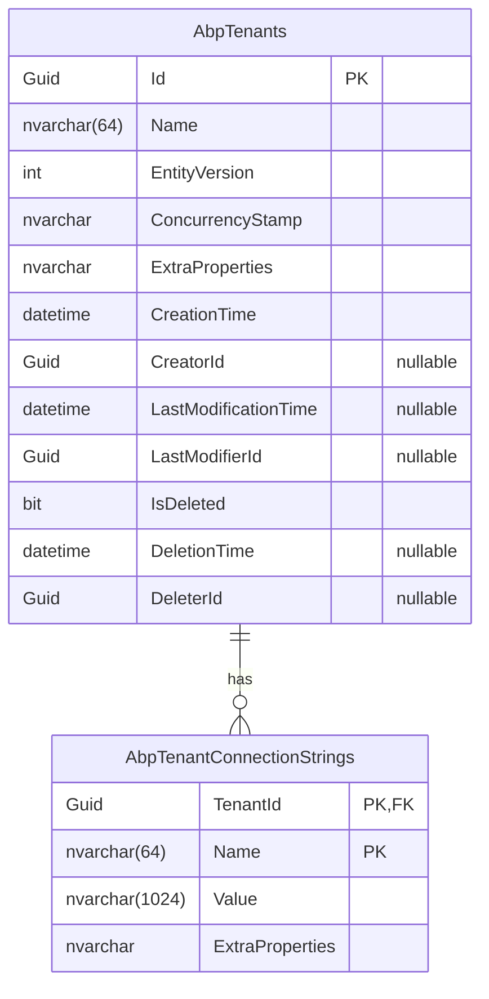

`Volo.Abp.TenantManagement.EntityFrameworkCore` is one of two interchangeable persistence layers (the other being [MongoDB](/modules/tenant-management/mongodb)). It contributes a `DbContext`, an `ITenantRepository` implementation, and a `ModelBuilder` extension that maps `Tenant` and `TenantConnectionString` to the `AbpTenants` and `AbpTenantConnectionStrings` tables.

## Files

```
Volo/Abp/TenantManagement/EntityFrameworkCore/
├── AbpTenantManagementDbContextModelCreatingExtensions.cs
├── AbpTenantManagementEntityFrameworkCoreModule.cs
├── EfCoreTenantRepository.cs
├── ITenantManagementDbContext.cs
├── TenantManagementDbContext.cs
└── TenantManagementEfCoreQueryableExtensions.cs
```

## The module class

```csharp
[DependsOn(typeof(AbpTenantManagementDomainModule))]
[DependsOn(typeof(AbpEntityFrameworkCoreModule))]
public class AbpTenantManagementEntityFrameworkCoreModule : AbpModule
{
    public override void ConfigureServices(ServiceConfigurationContext context)
    {
        context.Services.AddAbpDbContext<TenantManagementDbContext>(options =>
        {
            options.AddDefaultRepositories<ITenantManagementDbContext>();
        });
    }
}
```

Two registrations:

- `AddAbpDbContext<TenantManagementDbContext>` plugs the context into the framework's UoW/transaction infrastructure.
- `AddDefaultRepositories<ITenantManagementDbContext>` generates `IRepository<Tenant, Guid>` and `IRepository<TenantConnectionString>` from the `DbSet`s on the interface, so every entity gets a generic repository for free.

The custom `EfCoreTenantRepository` is auto-discovered by ABP because it implements `ITenantRepository`; explicit registration is unnecessary.

## `ITenantManagementDbContext`

```csharp
[IgnoreMultiTenancy]
[ConnectionStringName(AbpTenantManagementDbProperties.ConnectionStringName)]
public interface ITenantManagementDbContext : IEfCoreDbContext
{
    DbSet<Tenant> Tenants { get; }
    DbSet<TenantConnectionString> TenantConnectionStrings { get; }
}
```

Two attributes deserve attention:

- **`[IgnoreMultiTenancy]`** — the `IMultiTenant` data filter never runs on this context, because the host owns it and its rows describe other tenants. Without this attribute, every query would be silently filtered to `WHERE TenantId = NULL`.
- **`[ConnectionStringName("AbpTenantManagement")]`** — the host's `appsettings.json` can map this name to a dedicated database. The default falls back to `Default`. Both are looked up via `MultiTenantConnectionStringResolver` with `CurrentTenant.Id = null`.

`IEfCoreDbContext` is the framework's marker that triggers ABP's UoW/audit interceptors.

## `TenantManagementDbContext`

```csharp
[IgnoreMultiTenancy]
[ConnectionStringName(AbpTenantManagementDbProperties.ConnectionStringName)]
public class TenantManagementDbContext
    : AbpDbContext<TenantManagementDbContext>, ITenantManagementDbContext
{
    public DbSet<Tenant> Tenants { get; set; }
    public DbSet<TenantConnectionString> TenantConnectionStrings { get; set; }

    public TenantManagementDbContext(DbContextOptions<TenantManagementDbContext> options)
        : base(options) { }

    protected override void OnModelCreating(ModelBuilder builder)
    {
        base.OnModelCreating(builder);
        builder.ConfigureTenantManagement();
    }
}
```

`AbpDbContext<T>` adds: UoW participation, audit logging, soft-delete filter, `IHasEntityVersion` stamping, `IHasConcurrencyStamp` enforcement, and local-event publication. Re-declaring `[IgnoreMultiTenancy]` and `[ConnectionStringName(...)]` on the class is required because attribute lookup checks the runtime type, not the interface.

`builder.ConfigureTenantManagement()` is the extension method that owns the schema.

## Schema

```csharp
public static void ConfigureTenantManagement(this ModelBuilder builder)
{
    Check.NotNull(builder, nameof(builder));

    if (builder.IsTenantOnlyDatabase())
    {
        return;
    }

    builder.Entity<Tenant>(b =>
    {
        b.ToTable(AbpTenantManagementDbProperties.DbTablePrefix + "Tenants",
                  AbpTenantManagementDbProperties.DbSchema);
        b.ConfigureByConvention();
        b.Property(t => t.Name).IsRequired().HasMaxLength(TenantConsts.MaxNameLength);
        b.HasMany(u => u.ConnectionStrings).WithOne().HasForeignKey(uc => uc.TenantId).IsRequired();
        b.HasIndex(u => u.Name);
        b.ApplyObjectExtensionMappings();
    });

    builder.Entity<TenantConnectionString>(b =>
    {
        b.ToTable(AbpTenantManagementDbProperties.DbTablePrefix + "TenantConnectionStrings",
                  AbpTenantManagementDbProperties.DbSchema);
        b.ConfigureByConvention();
        b.HasKey(x => new { x.TenantId, x.Name });
        b.Property(cs => cs.Name).IsRequired().HasMaxLength(TenantConnectionStringConsts.MaxNameLength);
        b.Property(cs => cs.Value).IsRequired().HasMaxLength(TenantConnectionStringConsts.MaxValueLength);
        b.ApplyObjectExtensionMappings();
    });

    builder.TryConfigureObjectExtensions<TenantManagementDbContext>();
}
```

Pick the line apart:

| Call | Effect |
| --- | --- |
| `IsTenantOnlyDatabase()` | Early return when the host shares the context with a tenant-only DB. See below. |
| `ConfigureByConvention()` | Applies ABP's standard mappings: auditing columns, soft-delete column, `IHasConcurrencyStamp`, `IHasExtraProperties`. |
| `b.HasMany(...).WithOne().HasForeignKey(uc => uc.TenantId)` | Owned collection, cascade-delete by FK. The principal-side does not need a navigation property on `TenantConnectionString` (`WithOne()` with no argument). |
| `b.HasIndex(u => u.Name)` | Non-unique index. The uniqueness rule is enforced in the domain by `TenantManager.ValidateNameAsync`; this index just makes the lookup fast. |
| `b.HasKey(x => new { x.TenantId, x.Name })` | Composite PK on the join table — no surrogate `Id`. |
| `ApplyObjectExtensionMappings()` | Per-entity hook — projects properties registered through `ObjectExtensionManager.ConfigureTenantManagement` onto the model. |
| `TryConfigureObjectExtensions<TenantManagementDbContext>()` | Context-wide hook — projects extension properties for any extra entity types the host has added to the context. |

The schema is host-owned: `[IgnoreMultiTenancy]` on the context means rows are never tagged with `TenantId` (other than the FK column inside `TenantConnectionString`, which is a different `TenantId` referring to the parent aggregate).

### Resulting tables



Column types vary by provider — `nvarchar` on SQL Server, `varchar` on PostgreSQL, etc. — but the lengths come from `TenantConsts` and `TenantConnectionStringConsts`. Indexes other than `IX_AbpTenants_Name` are not explicitly defined; `ConfigureByConvention` adds the soft-delete and audit columns but no extra indexes on them.

### `IsTenantOnlyDatabase`

The `IsTenantOnlyDatabase()` guard is what makes the **database-per-tenant** topology work cleanly. When a separate `DbContext` (any module's, not just this one) inherits from `TenantManagementDbContext` but is intended to be opened only against a tenant-owned database, that context calls `ModelBuilder.SetTenantOnlyDatabase()` and the conditional skips registering `AbpTenants` / `AbpTenantConnectionStrings` entirely — those tables only exist in the host database.

In effect: a tenant database gets every other module's tables, but never the `Tenants` table. The host database holds the directory; the tenant databases hold the data.

## `EfCoreTenantRepository`

```csharp
public class EfCoreTenantRepository
    : EfCoreRepository<ITenantManagementDbContext, Tenant, Guid>, ITenantRepository
{
    public EfCoreTenantRepository(IDbContextProvider<ITenantManagementDbContext> dbContextProvider)
        : base(dbContextProvider) { }

    public virtual async Task<Tenant> FindByNameAsync(
        string name, bool includeDetails = true, CancellationToken cancellationToken = default)
    {
        return await (await GetDbSetAsync())
            .IncludeDetails(includeDetails)
            .OrderBy(t => t.Id)
            .FirstOrDefaultAsync(t => t.Name == name, GetCancellationToken(cancellationToken));
    }

    public virtual async Task<List<Tenant>> GetListAsync(
        string sorting = null,
        int maxResultCount = int.MaxValue,
        int skipCount = 0,
        string filter = null,
        bool includeDetails = false,
        CancellationToken cancellationToken = default)
    {
        return await (await GetDbSetAsync())
            .IncludeDetails(includeDetails)
            .WhereIf(!filter.IsNullOrWhiteSpace(), u => u.Name.Contains(filter))
            .OrderBy(sorting.IsNullOrEmpty() ? nameof(Tenant.Name) : sorting)
            .PageBy(skipCount, maxResultCount)
            .ToListAsync(GetCancellationToken(cancellationToken));
    }

    public virtual async Task<long> GetCountAsync(
        string filter = null, CancellationToken cancellationToken = default)
    {
        return await (await GetQueryableAsync())
            .WhereIf(!filter.IsNullOrWhiteSpace(), u => u.Name.Contains(filter))
            .CountAsync(cancellationToken: GetCancellationToken(cancellationToken));
    }

    public override async Task<IQueryable<Tenant>> WithDetailsAsync()
    {
        return (await GetQueryableAsync()).IncludeDetails();
    }
}
```

Key points:

- `EfCoreRepository<TDbContext, TEntity, TKey>` supplies generic CRUD plus `GetDbSetAsync` / `GetQueryableAsync`. Both go through `IDbContextProvider`, which honours the multi-tenant connection-string resolver for the *current* tenant — except this context is `[IgnoreMultiTenancy]` so the resolver is forced through the host scope.
- `OrderBy(t => t.Id)` before `FirstOrDefaultAsync` in `FindByNameAsync` keeps the result deterministic if the (defensive) database ever holds a duplicate name. The domain prevents it via `TenantManager.ValidateNameAsync`, but DB-level uniqueness is not enforced — only the index.
- `IncludeDetails(includeDetails)` calls the queryable extension below to opt into eager loading of `ConnectionStrings`.
- `GetListAsync(sorting, …, includeDetails: false)` keeps the index page cheap — there is no join to `AbpTenantConnectionStrings`.
- `OrderBy(sorting.IsNullOrEmpty() ? nameof(Tenant.Name) : sorting)` uses `System.Linq.Dynamic.Core` to accept strings like `"Name desc"` directly.

The synchronous `FindByName`/`FindById` overloads are marked `[Obsolete]`; they remain for source compatibility with older repositories. New code should always use the async variants.

## Queryable extension

```csharp
public static class TenantManagementEfCoreQueryableExtensions
{
    public static IQueryable<Tenant> IncludeDetails(this IQueryable<Tenant> queryable, bool include = true)
    {
        if (!include) return queryable;
        return queryable.Include(x => x.ConnectionStrings);
    }
}
```

A single `Include`. There are no further child collections on `Tenant`, so `WithDetailsAsync()` boils down to this one call. The repository centralizes the eager-loading rule so a custom service does not have to remember which navigations exist.

## Connection-string resolution at runtime

How an EF Core query inside Tenant Management actually opens its connection:

```mermaid
sequenceDiagram
    participant Caller as TenantAppService
    participant Provider as IDbContextProvider
    participant Resolver as MultiTenantConnectionStringResolver
    participant Current as ICurrentTenant
    participant CFG as IConfiguration
    participant DBC as DbContext

    Caller->>Provider: GetDbContextAsync()
    Provider->>Resolver: ResolveAsync("AbpTenantManagement")
    Resolver->>Current: tenant id
    Note over Resolver: [IgnoreMultiTenancy] → use host scope
    Resolver->>CFG: ConnectionStrings:AbpTenantManagement
    alt host has the named CS
        CFG-->>Resolver: "Server=host-tenants;…"
    else fall back
        CFG-->>Resolver: ConnectionStrings:Default
    end
    Resolver-->>Provider: connection string
    Provider->>DBC: new DbContextOptions(connection string)
    DBC-->>Caller: tracked entities
```

A *tenant-scoped* request (say, the data seeder running inside `CurrentTenant.Change(tenant.Id)`) goes through the same resolver. Because the **tenant**'s `ConnectionStrings` dictionary will likely *not* contain `"AbpTenantManagement"` (that table only exists host-side), the resolver falls back to the host context — there is no way for the seeder to accidentally write to `AbpTenants` inside a tenant database.

## EF migrations

The module does not ship its own `IMigrator` or design-time `DbContext` factory. By convention, the host application's `DbContext` implements `ITenantManagementDbContext` (or composes the `TenantManagementDbContext` directly) and contributes the migration. Inside `OnModelCreating`, the host calls `builder.ConfigureTenantManagement()` so the schema lands in its own migration history. This is the standard ABP pattern — every module exposes a `Configure*` extension; the host orchestrates which modules share a database and which get their own.

A tenant-only database simply skips this call (via the `IsTenantOnlyDatabase` flag), and the migration omits the two tables.

## Running on PostgreSQL, MySQL, SQLite, Oracle

The mapping does not call any provider-specific APIs. The only provider-aware decisions are made by `ConfigureByConvention` — for example, `IHasConcurrencyStamp` becomes `rowversion` on SQL Server and a `varchar` column elsewhere — and by EF's column-type inference for `string`. Every other ABP-tested provider works without changes.

`HasMaxLength(1024)` on `TenantConnectionString.Value` translates to `nvarchar(1024)` on SQL Server and to `character varying(1024)` on PostgreSQL; both are well under the row-size limit.

## What a host has to do

A minimal host that hosts the EF Core module:

1. Reference `Volo.Abp.TenantManagement.EntityFrameworkCore` from the host's EF Core project.
2. In the host's `DbContext`, call `builder.ConfigureTenantManagement()` from `OnModelCreating`.
3. Scaffold a migration; deploy it to the host database.
4. Optionally set `"ConnectionStrings:AbpTenantManagement"` in `appsettings.json` to send the tenant directory to its own database.

Reads and writes from `TenantAppService` then route through this layer transparently. The next layer — [MongoDB](/modules/tenant-management/mongodb) — is the drop-in alternative.
