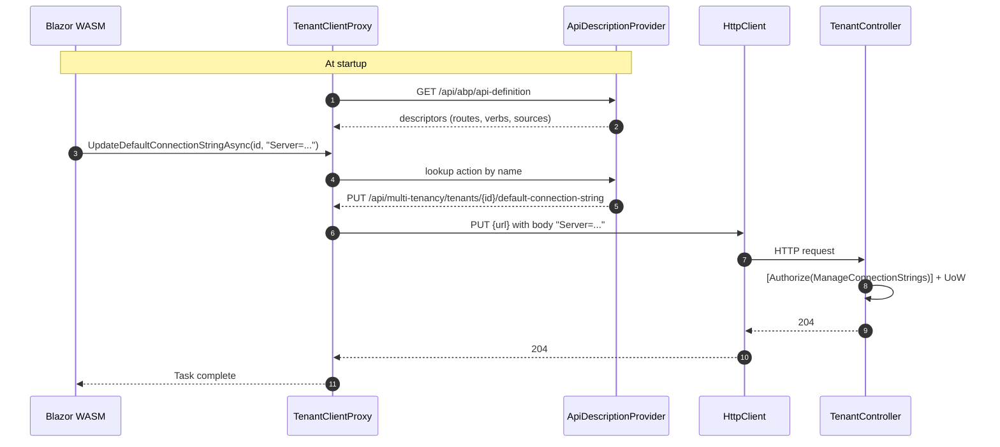

`Volo.Abp.TenantManagement.HttpApi.Client` is the C# proxy half of the HTTP API. It contains a generated `TenantClientProxy` that implements `ITenantAppService` and forwards every call to the matching HTTP endpoint, along with the module registration that wires the proxy into the DI container. It is what makes a Blazor WebAssembly client (or a microservice, or a console app) talk to a Tenant Management HTTP host without writing any HTTP code.

## Files

```
Volo/Abp/TenantManagement/
└── AbpTenantManagementHttpApiClientModule.cs

ClientProxies/Volo/Abp/TenantManagement/
├── TenantClientProxy.cs            // partial — extension hook for hand-written customisations
└── TenantClientProxy.Generated.cs  // generated by the abp-cli "generate-proxy" tooling
```

The generated file is committed; it is regenerated when the controller's signature changes. The hand-written partial is the safe place to add overrides or extra methods.

## The module class

```csharp
[DependsOn(
    typeof(AbpTenantManagementApplicationContractsModule),
    typeof(AbpHttpClientModule))]
public class AbpTenantManagementHttpApiClientModule : AbpModule
{
    public override void ConfigureServices(ServiceConfigurationContext context)
    {
        context.Services.AddStaticHttpClientProxies(
            typeof(AbpTenantManagementApplicationContractsModule).Assembly,
            TenantManagementRemoteServiceConsts.RemoteServiceName);

        Configure<AbpVirtualFileSystemOptions>(options =>
        {
            options.FileSets.AddEmbedded<AbpTenantManagementHttpApiClientModule>();
        });
    }
}
```

Three things happen:

1. **`AddStaticHttpClientProxies(assembly, remoteServiceName)`** scans the Application.Contracts assembly for application-service interfaces and binds each to its matching `ClientProxyBase<T>` implementation. The second argument — `"AbpTenantManagement"` — is the key the proxy looks up under `RemoteServices` in `appsettings.json` to find the base URL.
2. **The Application.Contracts dependency** ensures the `ITenantAppService` interface and DTOs are loaded.
3. **`AbpHttpClientModule`** is the framework's `HttpClient` integration: authentication delegation, current-tenant headers, exception subscriber, etc.

The virtual file system call is there so localization JSON files embedded in the client assembly are picked up — useful when the client ships a translated message for a fault originating from the proxy itself.

## Configuration in the host

A WASM client's `appsettings.json` typically looks like this:

```json
{
  "RemoteServices": {
    "Default": {
      "BaseUrl": "https://identity.example.com"
    },
    "AbpTenantManagement": {
      "BaseUrl": "https://saas.example.com"
    }
  }
}
```

If only `Default` is present, the proxy uses that. Splitting `AbpTenantManagement` out is what lets a microservice topology run Tenant Management behind a different host than Identity.

## `TenantClientProxy`

```csharp
[Dependency(ReplaceServices = true)]
[ExposeServices(typeof(ITenantAppService), typeof(TenantClientProxy))]
public partial class TenantClientProxy : ClientProxyBase<ITenantAppService>, ITenantAppService
{
    public virtual async Task<TenantDto> GetAsync(Guid id)
    {
        return await RequestAsync<TenantDto>(nameof(GetAsync), new ClientProxyRequestTypeValue
        {
            { typeof(Guid), id }
        });
    }

    public virtual async Task<PagedResultDto<TenantDto>> GetListAsync(GetTenantsInput input)
    {
        return await RequestAsync<PagedResultDto<TenantDto>>(nameof(GetListAsync), new ClientProxyRequestTypeValue
        {
            { typeof(GetTenantsInput), input }
        });
    }

    public virtual async Task<TenantDto> CreateAsync(TenantCreateDto input)
    {
        return await RequestAsync<TenantDto>(nameof(CreateAsync), new ClientProxyRequestTypeValue
        {
            { typeof(TenantCreateDto), input }
        });
    }

    public virtual async Task<TenantDto> UpdateAsync(Guid id, TenantUpdateDto input)
    {
        return await RequestAsync<TenantDto>(nameof(UpdateAsync), new ClientProxyRequestTypeValue
        {
            { typeof(Guid), id },
            { typeof(TenantUpdateDto), input }
        });
    }

    public virtual async Task DeleteAsync(Guid id)
    {
        await RequestAsync(nameof(DeleteAsync), new ClientProxyRequestTypeValue
        {
            { typeof(Guid), id }
        });
    }

    public virtual async Task<string> GetDefaultConnectionStringAsync(Guid id)
    {
        return await RequestAsync<string>(nameof(GetDefaultConnectionStringAsync), new ClientProxyRequestTypeValue
        {
            { typeof(Guid), id }
        });
    }

    public virtual async Task UpdateDefaultConnectionStringAsync(Guid id, string defaultConnectionString)
    {
        await RequestAsync(nameof(UpdateDefaultConnectionStringAsync), new ClientProxyRequestTypeValue
        {
            { typeof(Guid), id },
            { typeof(string), defaultConnectionString }
        });
    }

    public virtual async Task DeleteDefaultConnectionStringAsync(Guid id)
    {
        await RequestAsync(nameof(DeleteDefaultConnectionStringAsync), new ClientProxyRequestTypeValue
        {
            { typeof(Guid), id }
        });
    }
}
```

A few observations:

- **`[Dependency(ReplaceServices = true)]` + `[ExposeServices(typeof(ITenantAppService), typeof(TenantClientProxy))]`** replaces any existing `ITenantAppService` registration. The same DI binding the Razor Pages use to inject an `ITenantAppService` resolves the proxy in a WASM client.
- **`ClientProxyBase<TService>`** carries the heavy lifting: pick the correct `HttpClient`, attach `__tenant`/`Authorization` headers, serialize the body, post, and translate the response. The base type knows the action name through the `RequestAsync(string actionName, …)` argument and consults the *application-description* metadata fetched from the server at startup to look up route templates, HTTP verbs, and parameter binding sources.
- **`ClientProxyRequestTypeValue`** is a dictionary keyed by parameter type. The proxy can disambiguate parameters of the same type from the action's metadata, but the consumer side keeps each call explicit and reflection-free.
- All methods are `virtual` so the partial class can override any of them — for example to add caching, retries, or telemetry.

## Application-description metadata

`ClientProxyBase` does not hard-code routes. At startup, the framework fetches `/api/abp/api-definition` from the configured remote service base URL; the response describes every controller's actions: route, verb, parameter sources, return type. The proxy looks the action up by name (`nameof(GetAsync)`) and uses the metadata to build the HTTP request.

This indirection means a controller can rewrite its route or change parameter binding without breaking the client — as long as the action name stays the same, the proxy continues to work.



## Hand-written extension

`TenantClientProxy.cs` is empty by default:

```csharp
// This file is part of TenantClientProxy, you can customize it here
// ReSharper disable once CheckNamespace
namespace Volo.Abp.TenantManagement;

public partial class TenantClientProxy
{
}
```

A host can add overrides here without modifying generated code. Typical usages:

- Override `CreateAsync` to bypass the generated call and instead call a multi-step provisioning endpoint.
- Add a non-`ITenantAppService` method to call an enterprise-only endpoint.
- Wrap calls in retry policies.

Anything added here survives proxy regeneration.

## Headers the proxy sets

`ClientProxyBase` (via `IHttpClientProxy`) attaches a small set of standard headers:

| Header | Source |
| --- | --- |
| `Authorization: Bearer …` | `IAccessTokenProvider` (e.g. the WASM auth library). |
| `__tenant: <id>` | `ICurrentTenant.Id`, used by the server's `QueryStringTenantResolveContributor` / `HeaderTenantResolveContributor` chain — see [multi-tenancy resolution](/flows/multi-tenancy-resolution). |
| `Accept-Language: <culture>` | `IAbpRequestCultureCookieHelper` / `CultureInfo.CurrentUICulture`. |
| `X-Requested-With: XMLHttpRequest` | Marks AJAX-style calls so the server skips browser challenge responses. |
| `Content-Type: application/json` | Default for any body. |

The `__tenant` header is the reason a host-side WASM admin can manage tenants without being inside any tenant: the proxy emits no `__tenant` header at all when `ICurrentTenant.Id` is `null`, so the request runs as the host.

## Error mapping

The proxy throws ABP exceptions, not raw `HttpRequestException`. The base type subscribes to ABP's `IRemoteServiceErrorMessageHandler` which:

- Reads the JSON envelope (the same shape produced by the controller's exception filter).
- Reconstructs `AbpRemoteCallException`, `AbpAuthorizationException`, `EntityNotFoundException`, or `BusinessException` based on the status code and the body.
- Preserves the localized message so a Blazor UI can render it verbatim.

A duplicate-tenant-name error therefore surfaces in the WASM client as a `BusinessException` with the original `Volo.Abp.TenantManagement:DuplicateTenantName` code — the UI can match on the code or just display the message.

## When you reference this package

| Scenario | Reference |
| --- | --- |
| Blazor WebAssembly host | Yes — directly, plus `AbpTenantManagementBlazorWebAssemblyModule` depends on it. |
| Blazor Server host | No — Server runs in-process with the app service. |
| Razor Pages host | No — same reason. |
| Microservice that consumes the Tenant Management API | Yes. |
| Aspire/orchestrator inspecting tenants from a worker | Yes. |
| A daemon that only reads tenants (cron, healthcheck) | Yes — but consider caching the result locally. |

## Performance notes

- The API description is fetched once per process and cached. Restarts re-fetch.
- `HttpClient` lifetimes follow ABP's `IHttpClientFactory` integration; the proxy does not hold connections.
- JSON serialization uses `System.Text.Json` with the framework's converters for `ExtraProperties` and `PagedResultDto`.

## What it does **not** do

- It does not replace the dynamic-proxy infrastructure used by other ABP HTTP clients — `ClientProxyBase` is the *static* alternative. The dynamic version exists but is disabled for this module specifically (see [HTTP API](/modules/tenant-management/http-api#how-clients-consume-it)).
- It does not duplicate authorization. The proxy posts the call; the server enforces the `[Authorize(...)]` policies and returns 403 if not granted.
- It does not implement any `ITenantStore`. Tenant Management's `ITenantStore` lives behind the *server's* domain layer; clients consume tenants only through the app service.

Next is the [Web (MVC / Razor Pages)](/modules/tenant-management/web) UI, which calls into `ITenantAppService` directly through DI; [Blazor](/modules/tenant-management/blazor) covers the Blazorise UI that uses this proxy in WebAssembly mode.
