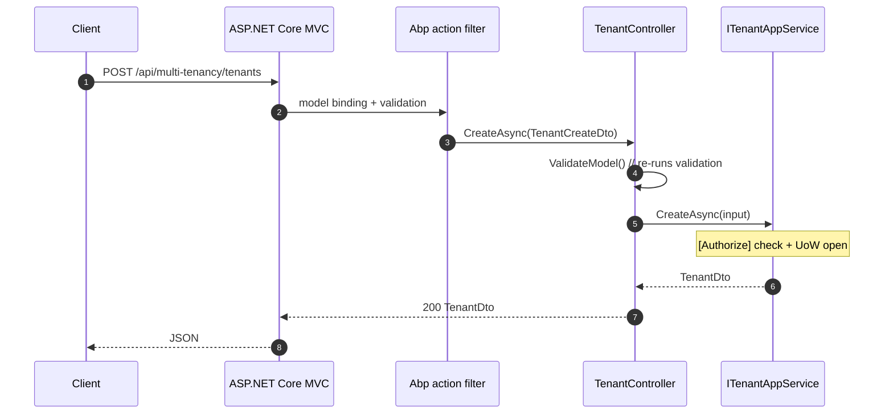

`Volo.Abp.TenantManagement.HttpApi` is the thin transport layer: a single ASP.NET Core MVC controller that re-exposes `ITenantAppService` over HTTP. It owns no business logic — every action delegates to the injected `ITenantAppService` — but it owns the routing template, the area name, and the model-validation hook that returns 400 instead of a runtime exception when a `TenantCreateDto` is missing fields.

## Files

```
Volo/Abp/TenantManagement/
├── AbpTenantManagementHttpApiModule.cs
└── TenantController.cs
```

## The module class

```csharp
[DependsOn(
    typeof(AbpTenantManagementApplicationContractsModule),
    typeof(AbpFeatureManagementHttpApiModule),
    typeof(AbpAspNetCoreMvcModule))]
public class AbpTenantManagementHttpApiModule : AbpModule
{
    public override void PreConfigureServices(ServiceConfigurationContext context)
    {
        PreConfigure<IMvcBuilder>(mvcBuilder =>
        {
            mvcBuilder.AddApplicationPartIfNotExists(typeof(AbpTenantManagementHttpApiModule).Assembly);
        });
    }

    public override void ConfigureServices(ServiceConfigurationContext context)
    {
        Configure<AbpLocalizationOptions>(options =>
        {
            options.Resources
                .Get<AbpTenantManagementResource>()
                .AddBaseTypes(
                    typeof(AbpFeatureManagementResource),
                    typeof(AbpUiResource));
        });
    }
}
```

Three details:

1. **`AddApplicationPartIfNotExists`** registers the assembly as an MVC application part so `TenantController` is discovered by ASP.NET Core's controller scan. The "if not exists" guard makes the call idempotent — important when the host has its own custom controllers that already exist as parts.
2. **`AbpFeatureManagementHttpApiModule`** is pulled in because the Features modal (in both Web and Blazor) calls `/api/feature-management/features?providerName=T&providerKey={tenantId}`. The controller for that endpoint ships in the Feature Management module; Tenant Management's HTTP layer just depends on it being present.
3. **Resource base types** add `AbpFeatureManagementResource` and `AbpUiResource` to the tenant resource so any localized text emitted from the controller (or, more commonly, from a downstream UI calling this controller) resolves verbs like *Save*, *Cancel*, *Features*, etc.

The MVC dependency is on `AbpAspNetCoreMvcModule` only — there is no dependency on UI layers; the HTTP API works in pure API hosts.

## `TenantController`

```csharp
[Controller]
[RemoteService(Name = TenantManagementRemoteServiceConsts.RemoteServiceName)]
[Area(TenantManagementRemoteServiceConsts.ModuleName)]
[Route("api/multi-tenancy/tenants")]
public class TenantController : AbpControllerBase, ITenantAppService
{
    protected ITenantAppService TenantAppService { get; }

    public TenantController(ITenantAppService tenantAppService)
    {
        TenantAppService = tenantAppService;
    }
    // ... action methods ...
}
```

A few attributes do a lot of work:

| Attribute | Effect |
| --- | --- |
| `[Controller]` | Treat the class as a controller even though it inherits from `AbpControllerBase`. |
| `[RemoteService(Name = "AbpTenantManagement")]` | Tells ABP's dynamic proxy infrastructure and swagger grouping which remote service the actions belong to. |
| `[Area("multi-tenancy")]` | Sets the MVC area; combined with the route prefix it produces `/api/multi-tenancy/tenants`. |
| `[Route("api/multi-tenancy/tenants")]` | Base path for every action. |

The comment in the source is a reminder of a real quirk: `// Throws exception on validation if we inherit from Controller`. `AbpControllerBase` integrates with ABP's validation pipeline correctly; `Controller` does not, so attempting to inherit from the standard base class would skip ABP's `[ValidationException → 400]` mapping.

Implementing `ITenantAppService` on the controller is intentional. The interface inheritance is what ABP's swagger generator uses to attach the request/response DTO schemas without any extra annotation work — and it also makes the controller signature-stable when the contract changes.

## Routes

```csharp
[HttpGet] [Route("{id}")]
public virtual Task<TenantDto> GetAsync(Guid id) => TenantAppService.GetAsync(id);

[HttpGet]
public virtual Task<PagedResultDto<TenantDto>> GetListAsync(GetTenantsInput input)
    => TenantAppService.GetListAsync(input);

[HttpPost]
public virtual Task<TenantDto> CreateAsync(TenantCreateDto input)
{
    ValidateModel();
    return TenantAppService.CreateAsync(input);
}

[HttpPut] [Route("{id}")]
public virtual Task<TenantDto> UpdateAsync(Guid id, TenantUpdateDto input)
    => TenantAppService.UpdateAsync(id, input);

[HttpDelete] [Route("{id}")]
public virtual Task DeleteAsync(Guid id) => TenantAppService.DeleteAsync(id);

[HttpGet] [Route("{id}/default-connection-string")]
public virtual Task<string> GetDefaultConnectionStringAsync(Guid id)
    => TenantAppService.GetDefaultConnectionStringAsync(id);

[HttpPut] [Route("{id}/default-connection-string")]
public virtual Task UpdateDefaultConnectionStringAsync(Guid id, string defaultConnectionString)
    => TenantAppService.UpdateDefaultConnectionStringAsync(id, defaultConnectionString);

[HttpDelete] [Route("{id}/default-connection-string")]
public virtual Task DeleteDefaultConnectionStringAsync(Guid id)
    => TenantAppService.DeleteDefaultConnectionStringAsync(id);
```

The map:

| Verb | Path | Action |
| --- | --- | --- |
| `GET` | `/api/multi-tenancy/tenants/{id}` | `GetAsync` |
| `GET` | `/api/multi-tenancy/tenants` | `GetListAsync` |
| `POST` | `/api/multi-tenancy/tenants` | `CreateAsync` |
| `PUT` | `/api/multi-tenancy/tenants/{id}` | `UpdateAsync` |
| `DELETE` | `/api/multi-tenancy/tenants/{id}` | `DeleteAsync` |
| `GET` | `/api/multi-tenancy/tenants/{id}/default-connection-string` | `GetDefaultConnectionStringAsync` |
| `PUT` | `/api/multi-tenancy/tenants/{id}/default-connection-string` | `UpdateDefaultConnectionStringAsync` |
| `DELETE` | `/api/multi-tenancy/tenants/{id}/default-connection-string` | `DeleteDefaultConnectionStringAsync` |

Only `CreateAsync` calls `ValidateModel()` explicitly. The other actions either accept simple types (`Guid`, `string`) or rely on ABP's automatic action-filter validation. The explicit call on `CreateAsync` was added to make the password-length validation surface as a clean 400 even when the underlying app service runs through dynamic proxy interception.

All actions are `virtual` so a host application can subclass the controller to add behaviour (e.g., custom audit log entries, cross-tenant authorization, response shaping).

## Request flow



`Authorize` lives on the application service — the controller does not duplicate it. That is the standard ABP layering: any caller (controller, integration test, in-process Razor Page) goes through the same authorization gate.

## Inheritance from `AbpControllerBase`

`AbpControllerBase` brings:

- `Logger`, `L` (localizer), `CurrentUser`, `CurrentTenant`.
- `ValidateModel()` helper.
- The framework's exception filter mapping `BusinessException`, `UserFriendlyException`, `AbpAuthorizationException`, and validation errors to specific HTTP status codes with a consistent envelope.
- Wires `LocalizationResource = typeof(AbpTenantManagementResource)` by default? — no: that has to be set per controller if desired. This controller leaves the property unset because every error message bubbles up from the application service which already has the resource configured.

The duplicate `[Authorize(Tenants.Default)]` you might expect on the controller is not present — it sits exclusively on the application service. Routing layer stays as thin as possible.

## Validation errors

A bad `CreateAsync` payload produces an HTTP 400 with the envelope:

```json
{
  "error": {
    "code": null,
    "message": "Your request is not valid!",
    "details": "The following errors were detected during validation.\n - The TenantName field is required.\n - The AdminEmailAddress field is required.",
    "data": null,
    "validationErrors": [
      { "message": "The TenantName field is required.", "members": ["name"] },
      { "message": "The AdminEmailAddress field is required.", "members": ["adminEmailAddress"] }
    ]
  }
}
```

Validation messages route through `AbpTenantManagementResource` because the request DTO carries `Display(Name = "TenantName")` and the resource includes a localization key by that name.

## Duplicate-name and concurrency errors

`TenantManager.ValidateNameAsync` throws `BusinessException("Volo.Abp.TenantManagement:DuplicateTenantName")`. The ABP exception filter:

1. Reads the exception's *code* and looks it up via `AbpExceptionLocalizationOptions.MapCodeNamespace("Volo.Abp.TenantManagement", typeof(AbpTenantManagementResource))` (registered in [Domain.Shared](/modules/tenant-management/domain-shared)).
2. Maps it to HTTP 403 (business error) with the localized message and the `Name` data property attached.

Optimistic concurrency on `UpdateAsync` produces an `AbpDbConcurrencyException`, mapped to HTTP 409 by the framework with a localized message from `AbpUiResource` (added as a base type by this module).

## How clients consume it

Three transports use this controller:

| Client | How |
| --- | --- |
| Razor Pages (Web package) | Direct DI — the page model injects `ITenantAppService`; the HTTP layer is bypassed. |
| Blazor Server | Same — direct DI. |
| Blazor WebAssembly | Via `TenantClientProxy` ([HttpApi.Client](/modules/tenant-management/http-api-client)) over HTTP. |
| External services | Either via the static `TenantClientProxy` or via raw HTTP (swagger documents the surface). |

The MVC `Web` module specifically *disables* the dynamic JS proxy for this controller:

```csharp
// AbpTenantManagementWebModule.cs
Configure<DynamicJavaScriptProxyOptions>(options =>
{
    options.DisableModule(TenantManagementRemoteServiceConsts.ModuleName);
});
```

That prevents the `~/Abp/ServiceProxyScript` endpoint from emitting a JavaScript stub for the controller — the Web UI does not need one, since it calls the app service directly through Razor Pages.

## What this layer does **not** do

- It does not own authentication. The host's authentication scheme (cookies, JWT, OpenIddict) decides who the caller is; the controller just enforces what their identity entails through the app service's `[Authorize]` attributes.
- It does not duplicate the app service's permission decisions.
- It does not transform DTOs — every action passes inputs and outputs through unchanged.

The next package, [HttpApi.Client](/modules/tenant-management/http-api-client), is the static C# client proxy that talks to this controller.
