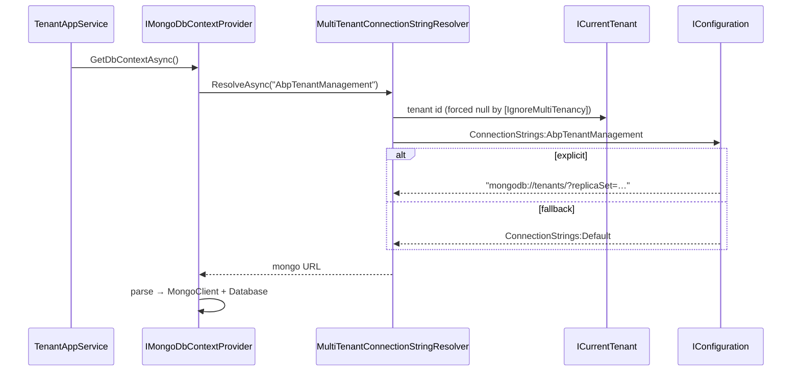

`Volo.Abp.TenantManagement.MongoDB` mirrors the [EF Core](/modules/tenant-management/efcore) package: a `MongoDbContext`, an `ITenantRepository` implementation, and a model-builder extension. The repository contract is identical, so swapping providers is a packaging decision — nothing in the Application or HTTP API layers changes.

## Files

```
Volo/Abp/TenantManagement/MongoDb/
├── AbpTenantManagementMongoDbContextExtensions.cs
├── AbpTenantManagementMongoDbModule.cs
├── ITenantManagementMongoDbContext.cs
├── MongoTenantRepository.cs
└── TenantManagementMongoDbContext.cs
```

## The module class

```csharp
[DependsOn(
    typeof(AbpTenantManagementDomainModule),
    typeof(AbpMongoDbModule))]
public class AbpTenantManagementMongoDbModule : AbpModule
{
    public override void ConfigureServices(ServiceConfigurationContext context)
    {
        context.Services.AddMongoDbContext<TenantManagementMongoDbContext>(options =>
        {
            options.AddDefaultRepositories<ITenantManagementMongoDbContext>();
            options.AddRepository<Tenant, MongoTenantRepository>();
        });
    }
}
```

Two registrations matter:

- `AddDefaultRepositories<ITenantManagementMongoDbContext>` produces `IRepository<Tenant, Guid>` from the interface.
- `AddRepository<Tenant, MongoTenantRepository>` explicitly maps the custom repository onto `Tenant`, so when ABP's discovery later asks for `ITenantRepository`, it gets `MongoTenantRepository`.

The explicit registration is necessary here because the EF Core package relies on convention-based discovery of the repository through its interface; the Mongo extension method `AddRepository<TEntity, TRepository>` is more explicit so the framework can substitute the custom repository for the generic one even when the interface is `MongoDbRepository<...>`-shaped.

## `ITenantManagementMongoDbContext`

```csharp
[IgnoreMultiTenancy]
[ConnectionStringName(AbpTenantManagementDbProperties.ConnectionStringName)]
public interface ITenantManagementMongoDbContext : IAbpMongoDbContext
{
    IMongoCollection<Tenant> Tenants { get; }
}
```

The same two attributes as the EF Core counterpart:

- `[IgnoreMultiTenancy]` — never apply the `IMultiTenant` filter to this context; rows describe tenants, they are not tenant-owned data.
- `[ConnectionStringName("AbpTenantManagement")]` — the host can map this to a dedicated cluster or database.

Only `Tenants` is exposed — `TenantConnectionString` is not a separate collection. Mongo embeds the connection-strings array inside the parent document.

## `TenantManagementMongoDbContext`

```csharp
[IgnoreMultiTenancy]
[ConnectionStringName(AbpTenantManagementDbProperties.ConnectionStringName)]
public class TenantManagementMongoDbContext
    : AbpMongoDbContext, ITenantManagementMongoDbContext
{
    public IMongoCollection<Tenant> Tenants => Collection<Tenant>();

    protected override void CreateModel(IMongoModelBuilder modelBuilder)
    {
        base.CreateModel(modelBuilder);
        modelBuilder.ConfigureTenantManagement();
    }
}
```

`AbpMongoDbContext` is ABP's wrapper around `IMongoDatabase` — it integrates with the UoW pipeline (Mongo transactions when configured), audit logging, and soft-delete filters. `Collection<Tenant>()` returns the underlying `IMongoCollection<Tenant>` lazily.

## Collection mapping

```csharp
public static class AbpTenantManagementMongoDbContextExtensions
{
    public static void ConfigureTenantManagement(this IMongoModelBuilder builder)
    {
        Check.NotNull(builder, nameof(builder));

        builder.Entity<Tenant>(b =>
        {
            b.CollectionName = AbpTenantManagementDbProperties.DbTablePrefix + "Tenants";
        });
    }
}
```

A single declaration: `Tenant` lives in the `AbpTenants` collection. The default table prefix `"Abp"` plus the suffix `"Tenants"` matches the SQL table name. No `TenantConnectionString` collection is registered — Mongo persists the `List<TenantConnectionString> ConnectionStrings` property as an embedded array of subdocuments by default, mirroring the EF Core *owned collection* semantics.

### Document shape

A typical document:

```json
{
  "_id": "8f3a...",
  "Name": "acme",
  "EntityVersion": 4,
  "ConcurrencyStamp": "0f7c...",
  "ExtraProperties": { "Region": "EU" },
  "ConnectionStrings": [
    { "TenantId": "8f3a...", "Name": "Default",          "Value": "mongodb://acme:..." },
    { "TenantId": "8f3a...", "Name": "AbpAuditLogging",  "Value": "mongodb://audit:..." }
  ],
  "CreationTime": "2024-01-30T12:00:00Z",
  "CreatorId": null,
  "LastModificationTime": null,
  "LastModifierId": null,
  "IsDeleted": false,
  "DeletionTime": null,
  "DeleterId": null
}
```

Two subtle differences from the relational layout:

1. The composite key `(TenantId, Name)` from `TenantConnectionString.GetKeys()` is not enforced by the database. The domain prevents duplicates: `Tenant.SetConnectionString` upserts by `Name`, never appending. Mongo simply stores whatever the aggregate hands over.
2. There is no separate `IX_AbpTenants_Name` index. Hosts that expect many tenants typically add their own through a mongo migration or an init script: `db.AbpTenants.createIndex({ Name: 1 })`.

## `MongoTenantRepository`

```csharp
public class MongoTenantRepository
    : MongoDbRepository<ITenantManagementMongoDbContext, Tenant, Guid>, ITenantRepository
{
    public MongoTenantRepository(IMongoDbContextProvider<ITenantManagementMongoDbContext> dbContextProvider)
        : base(dbContextProvider) { }

    public virtual async Task<Tenant> FindByNameAsync(
        string name, bool includeDetails = true, CancellationToken cancellationToken = default)
    {
        return await (await GetMongoQueryableAsync(cancellationToken))
            .FirstOrDefaultAsync(t => t.Name == name, GetCancellationToken(cancellationToken));
    }

    public virtual async Task<List<Tenant>> GetListAsync(
        string sorting = null,
        int maxResultCount = int.MaxValue,
        int skipCount = 0,
        string filter = null,
        bool includeDetails = false,
        CancellationToken cancellationToken = default)
    {
        return await (await GetMongoQueryableAsync(cancellationToken))
            .WhereIf<Tenant, IMongoQueryable<Tenant>>(
                !filter.IsNullOrWhiteSpace(),
                u => u.Name.Contains(filter))
            .OrderBy(sorting.IsNullOrEmpty() ? nameof(Tenant.Name) : sorting)
            .As<IMongoQueryable<Tenant>>()
            .PageBy<Tenant, IMongoQueryable<Tenant>>(skipCount, maxResultCount)
            .ToListAsync(GetCancellationToken(cancellationToken));
    }

    public virtual async Task<long> GetCountAsync(string filter = null,
        CancellationToken cancellationToken = default)
    {
        return await (await GetMongoQueryableAsync(cancellationToken))
            .WhereIf<Tenant, IMongoQueryable<Tenant>>(
                !filter.IsNullOrWhiteSpace(),
                u => u.Name.Contains(filter))
            .CountAsync(cancellationToken: GetCancellationToken(cancellationToken));
    }
}
```

Notes:

- The signatures are exactly those of the EF Core version. `TenantAppService` and `TenantStore` are coded against `ITenantRepository` and never see Mongo or EF specifics.
- `includeDetails` is accepted but unused — the embedded array always travels with the parent document, so eager loading is a no-op on Mongo. Keeping the parameter preserves source compatibility with the contract.
- `WhereIf<Tenant, IMongoQueryable<Tenant>>(...)` is the ABP-provided overload that preserves the `IMongoQueryable` type so subsequent `OrderBy`, `PageBy`, and `ToListAsync` can run server-side. Without the explicit casts, the LINQ chain falls back to `IQueryable<T>`, which the Mongo driver materializes eagerly.
- Sorting accepts a string (`"Name desc"`), forwarded through `System.Linq.Dynamic.Core`.
- The obsolete synchronous overloads (`FindByName`, `FindById`) live alongside the async versions for API parity with `ITenantRepository`.

## Connection-string resolution

The flow is the same as on EF Core — host scope, named connection string, fall back to default — but the *fallback* shape is Mongo's:



Database-per-tenant works the same way it does for SQL: put a Mongo URL into `Tenant.SetDefaultConnectionString("mongodb://acme:...")` and any *tenant-scoped* `DbContext` will see it through the same resolver. The `AbpTenants` collection itself remains host-side because of `[IgnoreMultiTenancy]`.

## Soft delete on Mongo

`Tenant` is `FullAuditedAggregateRoot<Guid>`, so `IsDeleted` flows naturally as a document field. `AbpMongoDbContext` registers an `IDataFilter<ISoftDelete>` that translates `_.Find(...)` calls into a server-side `$match` excluding deleted documents. The filter is suspended for the host scope inside `TenantStore.GetCacheItemAsync` automatically — `CurrentTenant.Change(null)` does not affect soft-delete, but `MongoDbRepository.FindAsync` does respect it. A *deleted* tenant therefore returns `null` from `TenantStore.FindAsync` and the framework treats the host as the active scope, which is the correct behaviour for a tenant that has been disabled.

## Concurrency

ABP's Mongo integration honours `IHasConcurrencyStamp` by checking the stamp on save: the update filter includes `{ ConcurrencyStamp: <old> }` and the operation throws `AbpDbConcurrencyException` when no document matches. The stamp on the embedded `ConnectionStrings` array is not separately versioned; concurrent updates to the same tenant's connection string serialize through the parent document.

`IHasEntityVersion` is updated on every save, identical to the SQL flow.

## Collection initialization

Mongo creates collections lazily — the first insert provisions the namespace. There is no migration step. Production deployments typically run a small init script to add a `Name` index:

```javascript
db.AbpTenants.createIndex(
  { Name: 1 },
  { name: "IX_AbpTenants_Name" }
);
```

ABP does not ship this; it leaves database operations to the host.

## What the host has to do

A minimal host on Mongo:

1. Reference `Volo.Abp.TenantManagement.MongoDB`.
2. In the host's `IAbpMongoDbContext`, call `modelBuilder.ConfigureTenantManagement()` from `CreateModel`.
3. Add a connection string named `AbpTenantManagement` (or rely on `Default`).
4. Optional: add an index on `Name`.

Everything above the persistence boundary is provider-agnostic: the same `TenantAppService`, the same controller, the same UI.

## Mixed-provider topologies

Nothing prevents using EF Core for the host (so `AbpTenants` lives in SQL) and Mongo as the tenant default database — the connection-string resolver does not care about the *kind* of database. The string can be either a SQL connection or a Mongo URL, as long as the consumer (a per-tenant `DbContext`) is configured for that provider. The Tenant Management module is just a directory; the rest of the system is what consumes the values.
