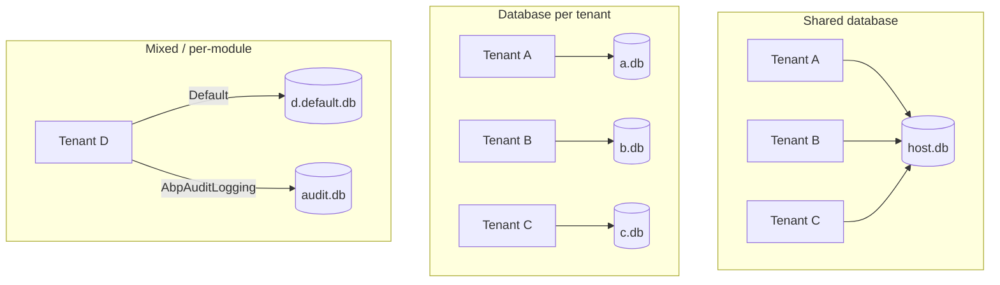
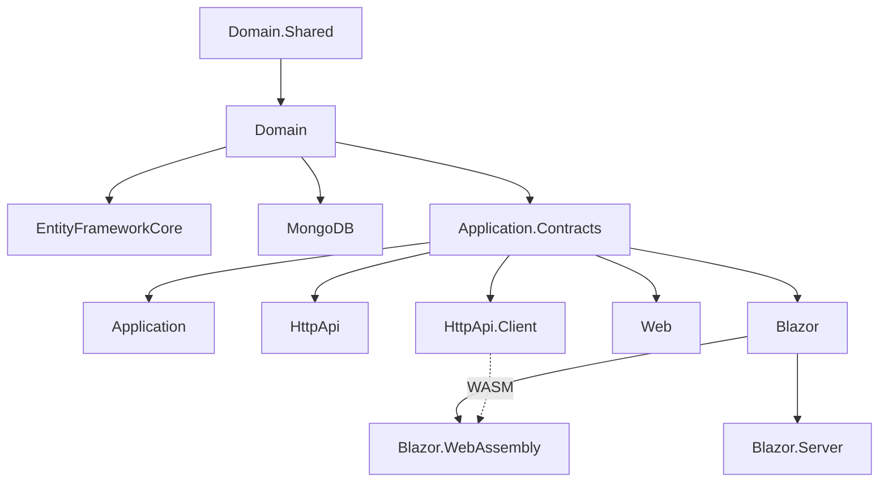

The Tenant Management module is the host-side implementation of the abstractions defined in `Volo.Abp.MultiTenancy`. The framework defines *what* a tenant is (`ITenantStore`, `ICurrentTenant`, `TenantConfiguration`, `ITenantResolveContributor`), and this module supplies *where the records live*: a `Tenants` aggregate with auditing and concurrency, a child collection of named connection strings, a CRUD application service, an MVC and a Blazor UI, and EF Core / MongoDB persistence — all wired so a host administrator can register tenants and route their data to dedicated databases.

The module is sliced into the standard ABP layout. Each package targets one architectural layer; downstream applications reference whichever combination matches their stack.

| Package | Role |
| --- | --- |
| `Volo.Abp.TenantManagement.Domain.Shared` | Constants, ETOs, localization resource, extension config. |
| `Volo.Abp.TenantManagement.Domain` | `Tenant`, `TenantConnectionString`, `TenantManager`, `ITenantRepository`, `TenantStore`. |
| `Volo.Abp.TenantManagement.Application.Contracts` | `ITenantAppService`, DTOs, permissions. |
| `Volo.Abp.TenantManagement.Application` | `TenantAppService` (CRUD + connection-string endpoints, data seeding). |
| `Volo.Abp.TenantManagement.EntityFrameworkCore` | `TenantManagementDbContext`, `EfCoreTenantRepository`. |
| `Volo.Abp.TenantManagement.MongoDB` | `TenantManagementMongoDbContext`, `MongoTenantRepository`. |
| `Volo.Abp.TenantManagement.HttpApi` | `TenantController` exposing `/api/multi-tenancy/tenants`. |
| `Volo.Abp.TenantManagement.HttpApi.Client` | Static C# proxy (`TenantClientProxy`). |
| `Volo.Abp.TenantManagement.Web` | MVC/Razor Pages UI under `~/TenantManagement/Tenants`. |
| `Volo.Abp.TenantManagement.Blazor`, `.Blazor.Server`, `.Blazor.WebAssembly` | Blazorise UI under `/tenant-management/tenants`. |
| `Volo.Abp.TenantManagement.Installer` | NuGet content for the ABP CLI installer. |

## Where it fits in the multi-tenancy stack

`Volo.Abp.MultiTenancy` defines the contracts:

- `ITenantResolveContributor` chain resolves an id-or-name on every request.
- `ITenantStore` translates that id/name into a `TenantConfiguration` (id, name, connection strings).
- `ICurrentTenant` exposes the resolved tenant to the rest of the request.
- `ConnectionStringName` attributes and `MultiTenantConnectionStringResolver` pick which connection string a `DbContext` opens.

The Tenant Management module plugs into that pipeline at one point: it ships a `TenantStore : ITenantStore` that reads from the `AbpTenants` table (via `ITenantRepository`) instead of `appsettings.json`. Everything else — resolution, current-tenant filtering, connection-string routing — is unchanged; see [Multi-tenancy resolution](/flows/multi-tenancy-resolution) for that pipeline in detail.

```mermaid
flowchart LR
    subgraph Framework["Volo.Abp.MultiTenancy"]
        Resolver[TenantResolver]
        Current[ICurrentTenant]
        CSResolver[MultiTenantConnectionStringResolver]
    end
    subgraph Module["Volo.Abp.TenantManagement"]
        Repo[(AbpTenants table)]
        Store[TenantStore : ITenantStore]
        Mgr[TenantManager]
        AppSvc[TenantAppService]
    end
    Resolver --> Store
    Store --> Repo
    Mgr --> Repo
    AppSvc --> Mgr
    AppSvc --> Repo
    Current --> CSResolver
    Store -. caches .-> Cache[(IDistributedCache&lt;TenantCacheItem&gt;)]
    CSResolver -. reads TenantConfiguration.ConnectionStrings .-> Store
```

`TenantStore` is registered as `ITransientDependency` and implements `ITenantStore`, so once `AbpTenantManagementDomainModule` is referenced the framework's `MultiTenantConnectionStringResolver` automatically sees database-backed tenants.

## Aggregate at a glance

```csharp
// Volo.Abp.TenantManagement/Tenant.cs
public class Tenant : FullAuditedAggregateRoot<Guid>, IHasEntityVersion
{
    public virtual string Name { get; protected set; }
    public virtual int EntityVersion { get; protected set; }
    public virtual List<TenantConnectionString> ConnectionStrings { get; protected set; }
    // ...
}
```

Three things to call out:

1. **`FullAuditedAggregateRoot<Guid>`** — soft-delete plus full audit (`CreationTime`, `CreatorId`, `LastModificationTime`, `DeletionTime`, …). Deleted tenants stay in the table; the data filter hides them from queries. Combined with `IHasConcurrencyStamp`, optimistic concurrency is built in.
2. **`IHasEntityVersion`** — bumped on every change. The `TenantEto` carries the same field so distributed event consumers can detect stale data.
3. **`ConnectionStrings`** — a `List<TenantConnectionString>`, each a `(TenantId, Name)`-keyed entity holding a `Value`. The `Name` slot is the `ConnectionStringName` that DbContexts ask for at runtime; `"Default"` is special and returned by `FindDefaultConnectionString()`.

## Connection-string strategies

The aggregate's `ConnectionStrings` slot is the seam that makes both shared-database and database-per-tenant work without code changes.



- **Shared database** — `Tenant.ConnectionStrings` is empty. `MultiTenantConnectionStringResolver` falls back to the host's `appsettings.json`. `DataFilter<IMultiTenant>` rewrites every query to `WHERE TenantId = @CurrentTenant`.
- **Database per tenant** — call `tenant.SetDefaultConnectionString("Server=...")` (or hit `PUT /api/multi-tenancy/tenants/{id}/default-connection-string`). Every `DbContext` resolves through that string; the multi-tenant filter is bypassed because the database is the boundary.
- **Per-module** — call `tenant.SetConnectionString("AbpAuditLogging", "...")` to route just one module's `[ConnectionStringName]` to a separate database. `Tenant Management`'s own `[ConnectionStringName("AbpTenantManagement")]` is host-only because of `[IgnoreMultiTenancy]`.

The HTTP API currently surfaces only the default connection string (`{id}/default-connection-string`); named connection strings are written via the domain APIs or by extending the application service.

## Module dependency graph



This matches `[DependsOn(...)]` declarations on each module class. Notice that the persistence packages (`EntityFrameworkCore`, `MongoDB`) depend on `Domain` only — they are interchangeable, and a host app picks exactly one. The UI packages depend on `Application.Contracts` (DTOs and permissions), not on `Application`: in a multi-host topology the Blazor WASM client never has the domain assembly loaded.

## Permissions

The host-only permission group `AbpTenantManagement` is defined in `AbpTenantManagementPermissionDefinitionProvider`:

```csharp
var tenantsPermission = tenantManagementGroup.AddPermission(
    TenantManagementPermissions.Tenants.Default,
    L("Permission:TenantManagement"),
    multiTenancySide: MultiTenancySides.Host);

tenantsPermission.AddChild(TenantManagementPermissions.Tenants.Create,                  L("Permission:Create"),                  multiTenancySide: MultiTenancySides.Host);
tenantsPermission.AddChild(TenantManagementPermissions.Tenants.Update,                  L("Permission:Edit"),                    multiTenancySide: MultiTenancySides.Host);
tenantsPermission.AddChild(TenantManagementPermissions.Tenants.Delete,                  L("Permission:Delete"),                  multiTenancySide: MultiTenancySides.Host);
tenantsPermission.AddChild(TenantManagementPermissions.Tenants.ManageFeatures,          L("Permission:ManageFeatures"),          multiTenancySide: MultiTenancySides.Host);
tenantsPermission.AddChild(TenantManagementPermissions.Tenants.ManageConnectionStrings, L("Permission:ManageConnectionStrings"), multiTenancySide: MultiTenancySides.Host);
```

Every permission is `MultiTenancySides.Host` — tenants cannot manage other tenants. The string constants live in `TenantManagementPermissions` and the application service uses them as `[Authorize]` policy names.

## Distributed events

`AbpTenantManagementDomainModule.ConfigureServices` registers a mapping from `Tenant` to `TenantEto` for the distributed entity-event pipeline:

```csharp
Configure<AbpDistributedEntityEventOptions>(options =>
{
    options.EtoMappings.Add<Tenant, TenantEto>();
});
```

`TenantEto` is just `Id`, `Name`, and `EntityVersion` — enough for downstream services to invalidate caches or seed per-tenant data. Separately, `TenantAppService.CreateAsync` publishes `TenantCreatedEto` with `AdminEmail` and `AdminPassword` as extra properties so an Identity-side handler can provision the first admin user.

## Reading guide

Start with [Domain.Shared](/modules/tenant-management/domain-shared) for the cross-layer types, then walk down the persistence side:

- [Domain](/modules/tenant-management/domain) — `Tenant`, `TenantConnectionString`, `TenantManager`, `TenantStore` cache.
- [Application.Contracts](/modules/tenant-management/application-contracts) — `ITenantAppService` and DTOs.
- [Application](/modules/tenant-management/application) — the create/update/delete flow and the data-seeding hook.
- [EF Core](/modules/tenant-management/efcore) / [MongoDB](/modules/tenant-management/mongodb) — repositories and schema.
- [HTTP API](/modules/tenant-management/http-api) and [HTTP API Client](/modules/tenant-management/http-api-client) — REST controller and static proxy.
- [Web](/modules/tenant-management/web) and [Blazor](/modules/tenant-management/blazor) — the two UIs.

For the upstream multi-tenancy pipeline that consumes `ITenantStore`, jump back to [Multi-tenancy resolution](/flows/multi-tenancy-resolution).
