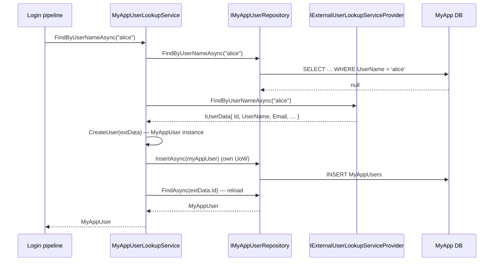

`Volo.Abp.Users.Domain` upgrades the abstractions package with two things: the `IUser` *aggregate-root* contract (so concrete user types can plug into ABP's DDD pipeline), and the `UserLookupService<TUser, TUserRepository>` base class that orchestrates local-vs-external user resolution. There is still no concrete aggregate — that lives in `Volo.Abp.Identity.Domain` (or your own user module).

## File inventory (`Volo/Abp/Users/`)

| File | Role |
| --- | --- |
| `AbpUsersDomainModule.cs` | Depends on `AbpUsersDomainSharedModule`, `AbpUsersAbstractionModule`, `AbpDddDomainModule`. |
| `IUser.cs` | The user aggregate-root contract. |
| `IUserRepository.cs` | `IUserRepository<TUser> : IBasicRepository<TUser, Guid>` plus search/lookup. |
| `IUserLookupService.cs` | The lookup pipeline contract. |
| `UserLookupService.cs` | The fallback orchestration base class. |
| `UserLookupServiceExtensions.cs` | `GetByIdAsync` / `GetByUserNameAsync` that throw `EntityNotFoundException`. |
| `AbpUserExtensions.cs` | `ToAbpUserData()` adapter from `IUser` → `UserData`. |
| `IUpdateUserData.cs` | The refresh hook implemented on concrete user aggregates. |

## `IUser`

```csharp
public interface IUser : IAggregateRoot<Guid>, IMultiTenant, IHasExtraProperties
{
    string UserName { get; }
    [CanBeNull] string Email { get; }
    [CanBeNull] string Name { get; }
    [CanBeNull] string Surname { get; }
    bool IsActive { get; }
    bool EmailConfirmed { get; }
    [CanBeNull] string PhoneNumber { get; }
    bool PhoneNumberConfirmed { get; }
}
```

A few things follow from this signature:

1. **`IAggregateRoot<Guid>` is fixed.** ABP user types are GUID-keyed; you cannot use `int` or `long`. The framework relies on this everywhere (`ICurrentUser.Id : Guid?`, `IdentityUser.Id : Guid`, audit logs, OpenIddict).
2. **All `string` properties are `get`-only.** Concrete aggregates expose setters as `private` or `protected` so mutation is funneled through methods (`SetUserName(...)`, `ChangeEmail(...)`).
3. **`IHasExtraProperties`** is inherited so cross-module consumers can read tenant-defined attributes without dragging the concrete aggregate.

## `IUserRepository<TUser>`

```csharp
public interface IUserRepository<TUser> : IBasicRepository<TUser, Guid>
    where TUser : class, IUser, IAggregateRoot<Guid>
{
    Task<TUser> FindByUserNameAsync(string userName, CancellationToken cancellationToken = default);
    Task<List<TUser>> GetListAsync(IEnumerable<Guid> ids, CancellationToken cancellationToken = default);
    Task<List<TUser>> SearchAsync(string sorting = null, int maxResultCount = int.MaxValue, int skipCount = 0,
                                  string filter = null, CancellationToken cancellationToken = default);
    Task<long> GetCountAsync(string filter = null, CancellationToken cancellationToken = default);
}
```

The contract is `IBasicRepository<>`, not `IRepository<>` — concrete derivations don't need to expose `GetQueryableAsync`. If you do need LINQ, derive a richer interface in your concrete module (`IIdentityUserRepository`).

`SearchAsync` and `GetCountAsync` are paginated and filtered over four columns (`UserName`, `Email`, `Name`, `Surname`). Both EF Core and MongoDB base classes implement the same predicate verbatim:

```csharp
.WhereIf(!filter.IsNullOrWhiteSpace(),
    u => u.UserName.Contains(filter) ||
         (u.Email != null && u.Email.Contains(filter)) ||
         (u.Name != null && u.Name.Contains(filter)) ||
         (u.Surname != null && u.Surname.Contains(filter)))
```

If `sorting` is empty, the default order is `UserName` ascending — convenient for a search UI.

## `IUserLookupService<TUser>`

```csharp
public interface IUserLookupService<TUser>
    where TUser : class, IUser
{
    Task<TUser> FindByIdAsync(Guid id, CancellationToken cancellationToken = default);
    Task<TUser> FindByUserNameAsync(string userName, CancellationToken cancellationToken = default);

    Task<List<IUserData>> SearchAsync(string sorting = null, string filter = null,
                                      int maxResultCount = int.MaxValue, int skipCount = 0,
                                      CancellationToken cancellationToken = default);
    Task<long> GetCountAsync(string filter = null, CancellationToken cancellationToken = default);
}
```

Note the asymmetry: `FindByIdAsync`/`FindByUserNameAsync` return `TUser` (the concrete aggregate), but `SearchAsync` returns `List<IUserData>` (the DTO). That's because external providers — which `SearchAsync` is allowed to delegate to entirely — don't have a way to produce `TUser`; they can only return shaped data. The concrete `CreateUser(IUserData)` happens *during lookup*, never *during search*.

The `UserLookupServiceExtensions` add throwing variants:

```csharp
public static async Task<TUser> GetByIdAsync<TUser>(this IUserLookupService<TUser> svc, Guid id, ...)
    where TUser : class, IUser
{
    var user = await svc.FindByIdAsync(id, cancellationToken);
    if (user == null) throw new EntityNotFoundException(typeof(TUser), id);
    return user;
}
```

…and `GetByUserNameAsync`. Use these in application code where missing-user is exceptional.

## `UserLookupService<TUser, TUserRepository>`

```csharp
public abstract class UserLookupService<TUser, TUserRepository> : IUserLookupService<TUser>, ITransientDependency
    where TUser : class, IUser
    where TUserRepository : IUserRepository<TUser>
{
    protected bool SkipExternalLookupIfLocalUserExists { get; set; } = true;

    public IExternalUserLookupServiceProvider ExternalUserLookupServiceProvider { get; set; }
    public ILogger<UserLookupService<TUser, TUserRepository>> Logger { get; set; } = NullLogger.Instance;

    private readonly TUserRepository _userRepository;
    private readonly IUnitOfWorkManager _unitOfWorkManager;

    protected UserLookupService(TUserRepository userRepository, IUnitOfWorkManager unitOfWorkManager) { ... }

    protected abstract TUser CreateUser(IUserData externalUser);
}
```

The four properties of interest:

| Property | Role |
| --- | --- |
| `SkipExternalLookupIfLocalUserExists` | Default `true`. Once a user lands in the local table, the external provider isn't consulted on subsequent lookups. Set to `false` to refresh on every login (costly for LDAP). |
| `ExternalUserLookupServiceProvider` | Property-injected. Optional. If `null`, the lookup behaves like a thin repository wrapper. |
| `Logger` | Logs external-provider failures with `LogException`. |
| `_unitOfWorkManager` | Every write happens in its own UoW (`Begin(requiresNew: true)`). |

### `FindByUserNameAsync` flow

```csharp
public async Task<TUser> FindByUserNameAsync(string userName, CancellationToken ct = default)
{
    var localUser = await _userRepository.FindByUserNameAsync(userName, ct);

    if (ExternalUserLookupServiceProvider == null) return localUser;
    if (SkipExternalLookupIfLocalUserExists && localUser != null) return localUser;

    IUserData externalUser;
    try { externalUser = await ExternalUserLookupServiceProvider.FindByUserNameAsync(userName, ct); }
    catch (Exception ex) { Logger.LogException(ex); return localUser; }

    if (externalUser == null)
    {
        if (localUser != null)
            await WithNewUowAsync(() => _userRepository.DeleteAsync(localUser, cancellationToken: ct));
        return null;
    }

    if (localUser == null)
    {
        await WithNewUowAsync(() => _userRepository.InsertAsync(CreateUser(externalUser), cancellationToken: ct));
        return await _userRepository.FindAsync(externalUser.Id, cancellationToken: ct);
    }

    if (localUser is IUpdateUserData && ((IUpdateUserData)localUser).Update(externalUser))
        await WithNewUowAsync(() => _userRepository.UpdateAsync(localUser, cancellationToken: ct));
    else
        return localUser;

    return await _userRepository.FindAsync(externalUser.Id, cancellationToken: ct);
}
```

`FindByIdAsync` is structurally identical, just keyed by id. Both:

* **Delete the local cache** when the external provider returns null. *This is destructive* — an LDAP outage that returns "no results" silently wipes your local user.
* **Reload from the local repository** after Insert/Update. The reload runs *outside* the new UoW so it sees the just-committed state.
* **Use `IUpdateUserData.Update` to decide whether to write**. Returning `false` from `Update` short-circuits the write — see the next section.

### `IUpdateUserData`

```csharp
public interface IUpdateUserData
{
    bool Update([NotNull] IUserData user);
}
```

The `IdentityUser` (in the Identity module) implements this to copy `Email`, `EmailConfirmed`, `Name`, `Surname`, `PhoneNumber`, `PhoneNumberConfirmed`, `ExtraProperties` from the external snapshot, and returns `true` only if at least one property changed. Your custom `TUser` does the same:

```csharp
public class MyAppUser : AggregateRoot<Guid>, IUser, IUpdateUserData
{
    // ... IUser members ...

    public bool Update(IUserData user)
    {
        var changed = false;
        if (Email != user.Email)       { SetEmail(user.Email);   changed = true; }
        if (Name  != user.Name)        { SetName(user.Name);     changed = true; }
        if (Surname != user.Surname)   { SetSurname(user.Surname); changed = true; }
        // EmailConfirmed, PhoneNumber, PhoneNumberConfirmed, ExtraProperties …
        return changed;
    }
}
```

Without `IUpdateUserData`, every successful external lookup is a no-op against the local DB — the lookup service simply trusts the local row.

### Concrete subclassing pattern

A concrete user module derives:

```csharp
public class MyAppUserLookupService
    : UserLookupService<MyAppUser, IMyAppUserRepository>, IMyAppUserLookupService, ITransientDependency
{
    public MyAppUserLookupService(IMyAppUserRepository repo, IUnitOfWorkManager uow)
        : base(repo, uow) { }

    protected override MyAppUser CreateUser(IUserData externalUser)
        => new MyAppUser(externalUser.Id, externalUser.UserName, externalUser.Email)
        {
            // copy remaining fields
        };
}
```

Only `CreateUser` is required. The base class is `ITransientDependency`, so DI registers it automatically — you typically still expose a concrete interface (`IMyAppUserLookupService`) and register that mapping in the module.

## `AbpUserExtensions.ToAbpUserData`

```csharp
public static IUserData ToAbpUserData(this IUser user)
    => new UserData(
        id: user.Id, userName: user.UserName, email: user.Email,
        name: user.Name, surname: user.Surname, isActive: user.IsActive,
        emailConfirmed: user.EmailConfirmed,
        phoneNumber: user.PhoneNumber, phoneNumberConfirmed: user.PhoneNumberConfirmed,
        tenantId: user.TenantId,
        extraProperties: user.ExtraProperties);
```

The canonical adapter. Use it whenever you need to hand an `IUser` to code that expects an `IUserData` (e.g. publishing a `UserEto`, populating an external system).

## Module wiring

```csharp
[DependsOn(typeof(AbpUsersDomainSharedModule), typeof(AbpUsersAbstractionModule), typeof(AbpDddDomainModule))]
public class AbpUsersDomainModule : AbpModule
{
}
```

No services are configured in `ConfigureServices` — the body is empty. The module exists to thread DI dependencies (`AbpDddDomainModule` for `AggregateRoot<>`, the abstraction module for `IUserData`/`UserEto`).

## Sequence: external-backed login



## Gotchas

* **`SkipExternalLookupIfLocalUserExists` short-circuits search semantics too.** If you set it to `false` you'll pay an external round-trip on every authenticated request that resolves `ICurrentUser` from the lookup.
* **External "not found" deletes local users.** Wrap your external provider with retry/timeout policies that surface failures as *exceptions* (caught and ignored) rather than as null returns (treated as "user no longer exists").
* **`Update` must opt-in by interface.** Implementing `IUpdateUserData` and returning `false` always is *not* a no-op — it's an explicit "don't sync" signal. The base class only writes when both `IUpdateUserData` is implemented and the override returns `true`.
* **`CreateUser` runs synchronously inside a new UoW.** It cannot perform async work safely; build whatever you need from `externalUser` and return it.
* **`IUserLookupService<TUser>` is `[CanReturnNull]`.** `FindByIdAsync` returning null is a normal control-flow outcome; the extensions throw `EntityNotFoundException` only when you opt in via `GetByIdAsync`.
* **The lookup is the only writer into the local user table for external systems.** Don't write a parallel sync job — race conditions with the lookup's per-call UoW will produce duplicate inserts.

## Cross-links

* [Overview](./overview) — package map and pipeline.
* [Abstractions](./abstractions) — `IUserData`, `UserEto`, `IExternalUserLookupServiceProvider`.
* [EF Core base classes](./efcore) — `EfCoreUserRepositoryBase`, `ConfigureAbpUser`.
* [MongoDB base classes](./mongodb) — `MongoUserRepositoryBase`.
* [Identity Domain](/modules/identity/domain) — concrete `IdentityUser` and `IdentityUserLookupService`.
* [Framework / Multi-tenancy](/framework/cross/multi-tenancy) — how `IMultiTenant` on `IUser` participates in filters.
