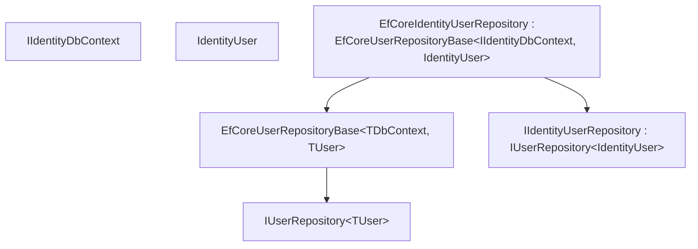
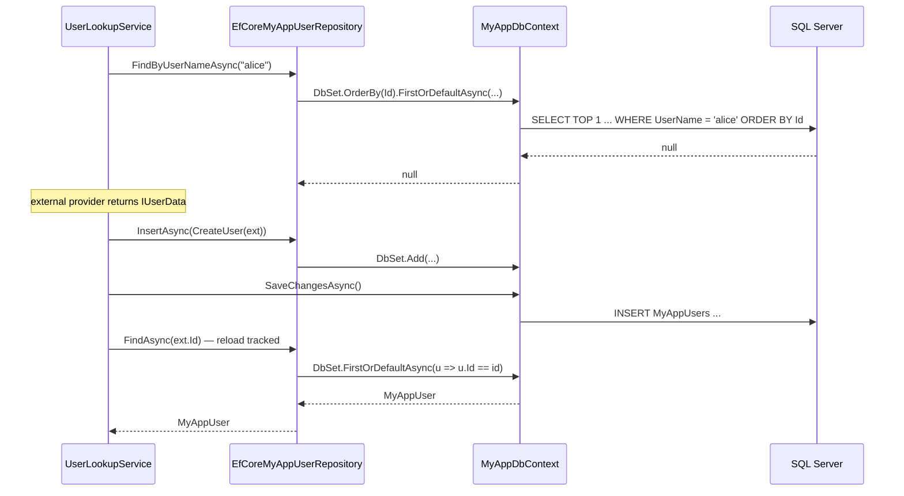

`Volo.Abp.Users.EntityFrameworkCore` ships *no DbContext and no migrations*. It contributes two reusable building blocks for concrete user modules: a generic repository base class (`EfCoreUserRepositoryBase<TDbContext, TUser>`) that implements `IUserRepository<TUser>`, and a fluent-config helper (`ConfigureAbpUser<TUser>(builder)`) that maps the eight `IUser` columns onto any `EntityTypeBuilder<TUser>`. Identity uses both; your own user module should too.

## File inventory (`Volo/Abp/Users/EntityFrameworkCore/`)

| File | Role |
| --- | --- |
| `AbpUsersEntityFrameworkCoreModule.cs` | Depends on `AbpUsersDomainModule` and `AbpEntityFrameworkCoreModule`. Empty body. |
| `AbpUsersDbContextModelCreatingExtensions.cs` | `ConfigureAbpUser<TUser>(this EntityTypeBuilder<TUser>)` — the mapping helper. |
| `EfCoreAbpUserRepositoryBase.cs` | `EfCoreUserRepositoryBase<TDbContext, TUser> : IUserRepository<TUser>`. |

## Module wiring

```csharp
[DependsOn(typeof(AbpUsersDomainModule), typeof(AbpEntityFrameworkCoreModule))]
public class AbpUsersEntityFrameworkCoreModule : AbpModule { }
```

No services are added. The module exists to declare the dependency on the EF Core framework module so concrete user modules can depend on it transitively.

## `ConfigureAbpUser<TUser>`

```csharp
public static class AbpUsersDbContextModelCreatingExtensions
{
    public static void ConfigureAbpUser<TUser>(this EntityTypeBuilder<TUser> b)
        where TUser : class, IUser
    {
        b.Property(u => u.TenantId).HasColumnName(nameof(IUser.TenantId));
        b.Property(u => u.UserName).IsRequired()
            .HasMaxLength(AbpUserConsts.MaxUserNameLength)
            .HasColumnName(nameof(IUser.UserName));
        b.Property(u => u.Email).IsRequired()
            .HasMaxLength(AbpUserConsts.MaxEmailLength)
            .HasColumnName(nameof(IUser.Email));
        b.Property(u => u.Name)
            .HasMaxLength(AbpUserConsts.MaxNameLength)
            .HasColumnName(nameof(IUser.Name));
        b.Property(u => u.Surname)
            .HasMaxLength(AbpUserConsts.MaxSurnameLength)
            .HasColumnName(nameof(IUser.Surname));
        b.Property(u => u.EmailConfirmed)
            .HasDefaultValue(false)
            .HasColumnName(nameof(IUser.EmailConfirmed));
        b.Property(u => u.PhoneNumber)
            .HasMaxLength(AbpUserConsts.MaxPhoneNumberLength)
            .HasColumnName(nameof(IUser.PhoneNumber));
        b.Property(u => u.PhoneNumberConfirmed)
            .HasDefaultValue(false)
            .HasColumnName(nameof(IUser.PhoneNumberConfirmed));
        b.Property(u => u.IsActive).HasColumnName(nameof(IUser.IsActive));
    }
}
```

What it does:

| Column | EF Core configuration |
| --- | --- |
| `TenantId` | `uniqueidentifier` NULL — explicit column name. |
| `UserName` | `nvarchar(256)` NOT NULL. |
| `Email` | `nvarchar(256)` NOT NULL. (Note: `IsRequired()` — the interface declares `[CanBeNull]` but the column is required.) |
| `Name` | `nvarchar(64)` NULL. |
| `Surname` | `nvarchar(64)` NULL. |
| `EmailConfirmed` | `bit` NOT NULL DEFAULT 0. |
| `PhoneNumber` | `nvarchar(16)` NULL. |
| `PhoneNumberConfirmed` | `bit` NOT NULL DEFAULT 0. |
| `IsActive` | `bit` NOT NULL — no default. |

Important subtleties:

* **`Email` is `IsRequired()`** despite `IUser.Email` being `[CanBeNull]`. The interface allows null for in-memory representations (e.g. an external lookup that hasn't fetched email yet), but the schema demands a value. Identity assigns `string.Empty` when no email is provided.
* **`UserName` length is 256.** That's larger than ASP.NET Core Identity's default (256 in newer versions; older 32-byte limits do not apply here).
* **`PhoneNumber` is `nvarchar(16)`** — fits E.164 (`+` + up to 15 digits). Bump `AbpUserConsts.MaxPhoneNumberLength` if you store extensions or formatting characters.
* **`Id` and `ExtraProperties` are not mapped here.** `Id` is handled by `ConfigureByConvention()` (the call site adds it); `ExtraProperties` is the framework's JSON column added by `IHasExtraProperties`.
* **No indexes are declared.** A unique index on `UserName` (and conventionally on `Email`) is the responsibility of the concrete entity type — `IdentityUser` declares `IX_AbpUsers_NormalizedUserName` and `IX_AbpUsers_NormalizedEmail` (case-insensitive) on top of `ConfigureAbpUser`.

### Typical caller

```csharp
public class MyAppDbContext : AbpDbContext<MyAppDbContext>
{
    public DbSet<MyAppUser> Users { get; set; }

    protected override void OnModelCreating(ModelBuilder builder)
    {
        base.OnModelCreating(builder);

        builder.Entity<MyAppUser>(b =>
        {
            b.ToTable("MyAppUsers");
            b.ConfigureByConvention();
            b.ConfigureAbpUser();   // <-- the eight IUser columns

            // Your own columns
            b.Property(u => u.DepartmentId);
            b.HasIndex(u => u.UserName).IsUnique();
        });
    }
}
```

You can layer additional `b.Property(...)` calls — `ConfigureAbpUser` doesn't lock the entity builder.

## `EfCoreUserRepositoryBase<TDbContext, TUser>`

```csharp
public abstract class EfCoreUserRepositoryBase<TDbContext, TUser>
    : EfCoreRepository<TDbContext, TUser, Guid>, IUserRepository<TUser>
    where TDbContext : IEfCoreDbContext
    where TUser : class, IUser
{
    protected EfCoreUserRepositoryBase(IDbContextProvider<TDbContext> dbContextProvider)
        : base(dbContextProvider) { }
}
```

`IUserRepository<TUser>` is implemented by four methods that look identical between EF Core and MongoDB providers:

### `FindByUserNameAsync`

```csharp
public async Task<TUser> FindByUserNameAsync(string userName, CancellationToken ct = default)
{
    return await (await GetDbSetAsync())
        .OrderBy(x => x.Id)
        .FirstOrDefaultAsync(u => u.UserName == userName, GetCancellationToken(ct));
}
```

Three things to note:

* **`OrderBy(x => x.Id)`** is a defensive tie-breaker. The schema doesn't enforce a unique constraint on `UserName` — the concrete entity does. Without the order-by, EF Core's `FirstOrDefaultAsync` returns an unspecified row when two users share the name.
* **No `AsNoTracking()`** — the result feeds into the lookup service, which may then mutate it via `IUpdateUserData.Update`. Tracking is required.
* **Case sensitivity** depends on the collation of the column. SQL Server's default `_CI_AS` is case-insensitive; PostgreSQL is case-sensitive unless you use `citext`. Identity adds a `NormalizedUserName` column to dodge this; on your own user module you must decide.

### `GetListAsync(IEnumerable<Guid>)`

```csharp
public virtual async Task<List<TUser>> GetListAsync(IEnumerable<Guid> ids, CancellationToken ct = default)
{
    return await (await GetDbSetAsync())
        .Where(u => ids.Contains(u.Id))
        .ToListAsync(GetCancellationToken(ct));
}
```

Bulk-fetch by id. EF Core translates `ids.Contains(u.Id)` to `WHERE u.Id IN (@p0, @p1, …)`. For very large id sets (10000+) consider a temporary table; the helper does not paginate.

### `SearchAsync`

```csharp
public async Task<List<TUser>> SearchAsync(
    string sorting = null, int maxResultCount = int.MaxValue, int skipCount = 0,
    string filter = null, CancellationToken ct = default)
{
    return await (await GetDbSetAsync())
        .WhereIf(!filter.IsNullOrWhiteSpace(),
            u => u.UserName.Contains(filter) ||
                 (u.Email != null && u.Email.Contains(filter)) ||
                 (u.Name != null && u.Name.Contains(filter)) ||
                 (u.Surname != null && u.Surname.Contains(filter)))
        .OrderBy(sorting.IsNullOrEmpty() ? nameof(IUser.UserName) : sorting)
        .PageBy(skipCount, maxResultCount)
        .ToListAsync(GetCancellationToken(ct));
}
```

The four-column OR-`Contains` filter is a SQL Server scan. Trigram or full-text indexes are the standard remedy:

```sql
-- PostgreSQL: trigram index per column
CREATE INDEX ix_users_username_trgm ON "MyAppUsers" USING gin (UserName gin_trgm_ops);

-- SQL Server: full-text catalog
CREATE FULLTEXT INDEX ON dbo.MyAppUsers (UserName, Email, Name, Surname) KEY INDEX PK_MyAppUsers;
```

Override `SearchAsync` in your concrete repository to use the chosen mechanism — the base implementation is correct but slow at scale.

### `GetCountAsync`

```csharp
public async Task<long> GetCountAsync(string filter = null, CancellationToken ct = default)
{
    return await (await GetDbSetAsync())
        .WhereIf(!filter.IsNullOrWhiteSpace(), /* same predicate as above */)
        .LongCountAsync(GetCancellationToken(ct));
}
```

Same filter, `LongCountAsync` for over-2 G row counts. Beware: this is a separate roundtrip from `SearchAsync` — caching the total for a list+count pair is your job.

## Concrete-derivation pattern



The same pattern applies to your custom user:

```csharp
public class EfCoreMyAppUserRepository
    : EfCoreUserRepositoryBase<IMyAppDbContext, MyAppUser>, IMyAppUserRepository
{
    public EfCoreMyAppUserRepository(IDbContextProvider<IMyAppDbContext> p) : base(p) { }

    // Add domain-specific reads here, e.g.:
    public async Task<List<MyAppUser>> GetByDepartmentAsync(Guid departmentId)
        => await (await GetDbSetAsync()).Where(u => u.DepartmentId == departmentId).ToListAsync();
}
```

…and register it in your module:

```csharp
context.Services.AddAbpDbContext<MyAppDbContext>(opt =>
{
    opt.AddRepository<MyAppUser, EfCoreMyAppUserRepository>();
});
```

## How `ConfigureAbpUser` interacts with object extensions

The helper does *not* call `b.ApplyObjectExtensionMappings()`. That's deliberate — the concrete entity's `ConfigureXxx` extension should call it after layering its own properties. The convention is:

```csharp
builder.Entity<MyAppUser>(b =>
{
    b.ToTable("MyAppUsers");
    b.ConfigureByConvention();
    b.ConfigureAbpUser();
    b.Property(u => u.DepartmentId);
    b.ApplyObjectExtensionMappings();
});
```

If you forget the last call, custom extra properties registered with `ObjectExtensionManager` won't become real columns.

## Persistence sequence: external-backed login



## Gotchas

* **`Email IsRequired()` clashes with `[CanBeNull]`.** Always supply *something* (empty string is fine) when constructing a `TUser` that derives from this mapping. The interface lies for the in-memory case.
* **No unique index on `UserName`.** The helper sets `IsRequired` and `HasMaxLength` but not `HasIndex`. Add a unique index in your concrete entity type or you'll get duplicate users at scale.
* **`Name` and `Surname` are 64 chars.** That's narrow for some cultures (compound surnames). Raise `AbpUserConsts.MaxSurnameLength` early.
* **Search is a four-column scan.** Use trigram / full-text indexes for production search.
* **`AsNoTracking` is not used.** Tracking is required for the lookup write-back path; if you build a pure-read path (e.g. user export), copy the query and add `AsNoTracking` yourself.
* **Cancellation tokens** flow through `GetCancellationToken(ct)` (the EfCore base class merges with `IUnitOfWork.Token`). Don't pass `ct` directly into `ToListAsync`; let the base helper combine tokens.

## Cross-links

* [Overview](/modules/users/overview) — package map.
* [Domain](/modules/users/domain) — `IUser`, `IUserRepository<>`, `UserLookupService<,>`.
* [MongoDB base classes](/modules/users/mongodb) — equivalent repository over MongoDB.
* [Identity EF Core](/modules/identity/efcore) — concrete `EfCoreIdentityUserRepository` derives from this base.
* [Object extensions](/framework/ddd/entities-and-aggregates) — `ApplyObjectExtensionMappings` follow-up.
