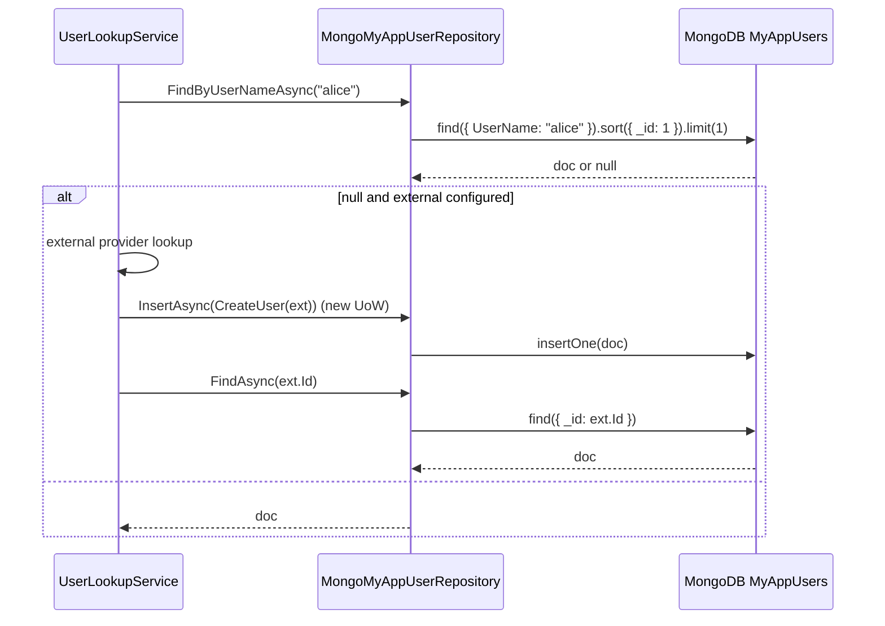

`Volo.Abp.Users.MongoDB` is the MongoDB counterpart of `Volo.Abp.Users.EntityFrameworkCore`. It ships exactly one thing: an abstract base class for concrete user repositories. There is no DbContext, no model builder extension (BSON mapping is implicit), and no migration — your concrete user module supplies the context and the collection name; this module supplies the repository code.

## File inventory (`Volo/Abp/Users/MongoDB/`)

| File | Role |
| --- | --- |
| `AbpUsersMongoDbModule.cs` | Depends on `AbpUsersDomainModule` and `AbpMongoDbModule`. Empty body. |
| `MongoUserRepositoryBase.cs` | `MongoUserRepositoryBase<TDbContext, TUser> : IUserRepository<TUser>`. |

## Module wiring

```csharp
[DependsOn(typeof(AbpUsersDomainModule), typeof(AbpMongoDbModule))]
public class AbpUsersMongoDbModule : AbpModule { }
```

No services are registered. The module's only job is to thread the dependency on `AbpMongoDbModule` so concrete user modules can `[DependsOn(typeof(AbpUsersMongoDbModule))]` without manually adding the MongoDB infrastructure module.

## `MongoUserRepositoryBase<TDbContext, TUser>`

```csharp
public abstract class MongoUserRepositoryBase<TDbContext, TUser>
    : MongoDbRepository<TDbContext, TUser, Guid>, IUserRepository<TUser>
    where TDbContext : IAbpMongoDbContext
    where TUser : class, IUser
{
    protected MongoUserRepositoryBase(IMongoDbContextProvider<TDbContext> dbContextProvider)
        : base(dbContextProvider) { }
}
```

It derives from `MongoDbRepository<TDbContext, TUser, Guid>` (the framework's MongoDB repository base) and implements four methods identical in shape to the EF Core variant. The only structural difference is that all four use `GetMongoQueryableAsync` and the MongoDB driver's `IMongoQueryable<T>`.

### `FindByUserNameAsync`

```csharp
public virtual async Task<TUser> FindByUserNameAsync(string userName, CancellationToken ct = default)
{
    ct = GetCancellationToken(ct);
    return await (await GetMongoQueryableAsync(ct))
        .OrderBy(x => x.Id)
        .FirstOrDefaultAsync(u => u.UserName == userName, ct);
}
```

This becomes the MongoDB pipeline:

```javascript
[
  { $match: { UserName: "alice" } },
  { $sort: { _id: 1 } },
  { $limit: 1 }
]
```

If you create an index on `UserName` (highly recommended), the `$match` becomes an index scan; the `$sort` on `_id` is the same tie-breaker as the EF Core version.

### `GetListAsync(IEnumerable<Guid>)`

```csharp
public virtual async Task<List<TUser>> GetListAsync(IEnumerable<Guid> ids, CancellationToken ct = default)
{
    ct = GetCancellationToken(ct);
    return await (await GetMongoQueryableAsync(ct))
        .Where(u => ids.Contains(u.Id))
        .ToListAsync(ct);
}
```

Translates to `{ _id: { $in: [...] } }`. MongoDB handles large `$in` arrays (thousands of ids) reasonably well, but the BSON wire payload grows linearly — split very large id sets into pages.

### `SearchAsync`

```csharp
public async Task<List<TUser>> SearchAsync(
    string sorting = null, int maxResultCount = int.MaxValue, int skipCount = 0,
    string filter = null, CancellationToken ct = default)
{
    ct = GetCancellationToken(ct);
    return await (await GetMongoQueryableAsync(ct))
        .WhereIf<TUser, IMongoQueryable<TUser>>(
            !filter.IsNullOrWhiteSpace(),
            u => u.UserName.Contains(filter) ||
                 (u.Email != null && u.Email.Contains(filter)) ||
                 (u.Name != null && u.Name.Contains(filter)) ||
                 (u.Surname != null && u.Surname.Contains(filter)))
        .OrderBy(sorting.IsNullOrEmpty() ? nameof(IUserData.UserName) : sorting)
        .As<IMongoQueryable<TUser>>()
        .PageBy<TUser, IMongoQueryable<TUser>>(skipCount, maxResultCount)
        .ToListAsync(ct);
}
```

Two interesting bits:

* **Default sort property is `nameof(IUserData.UserName)`**, *not* `IUser.UserName`. The string is identical (`"UserName"`), but the choice is deliberate — `IUserData` is what the MongoDB Linq3 translator sees on the BSON class map.
* **`Contains(filter)` becomes a regex match** in MongoDB. The driver translates string `.Contains` to `$regex` with `/<filter>/` (no anchors). That's an unanchored regex — *not* index-friendly. Even with an index on `UserName`, search hits `COLLSCAN` unless you front it with a search index (Atlas Search) or use a prefix-only filter.

### `GetCountAsync`

```csharp
public async Task<long> GetCountAsync(string filter = null, CancellationToken ct = default)
{
    ct = GetCancellationToken(ct);
    return await (await GetMongoQueryableAsync(ct))
        .WhereIf<TUser, IMongoQueryable<TUser>>(
            !filter.IsNullOrWhiteSpace(),
            u => u.UserName.Contains(filter) ||
                 (u.Email != null && u.Email.Contains(filter)) ||
                 (u.Name != null && u.Name.Contains(filter)) ||
                 (u.Surname != null && u.Surname.Contains(filter)))
        .LongCountAsync(ct);
}
```

Same filter, `LongCountAsync` returns the document count. Like the EF Core variant this is a separate roundtrip from `SearchAsync` — pair them inside an aggregation pipeline if your UI needs both atomically.

## Document shape

The module does *not* register a class map. BSON inspects the concrete entity at first serialization:

```json
{
  "_id": "BSON UUID",          // IUser.Id
  "TenantId": null,            // IUser.TenantId
  "UserName": "alice",
  "Email": "alice@example.com",
  "Name": "Alice",
  "Surname": "Liddell",
  "IsActive": true,
  "EmailConfirmed": true,
  "PhoneNumber": "+15551234567",
  "PhoneNumberConfirmed": false,
  "ExtraProperties": {},       // IHasExtraProperties
  "ConcurrencyStamp": "...",   // AggregateRoot
  "DepartmentId": "..."        // your own column
}
```

The collection name is whatever your concrete `IMongoModelBuilder` configuration sets — there is **no default** in this module. A typical mapping:

```csharp
public static void ConfigureMyApp(this IMongoModelBuilder builder)
{
    builder.Entity<MyAppUser>(b =>
    {
        b.CollectionName = "MyAppUsers";
    });
}
```

## Index recommendations

The module ships nothing. At minimum create:

```javascript
// case-insensitive unique on UserName
db.MyAppUsers.createIndex(
  { UserName: 1 },
  { unique: true, collation: { locale: "en", strength: 2 } }
);

// per-tenant lookup
db.MyAppUsers.createIndex(
  { TenantId: 1, UserName: 1 },
  { collation: { locale: "en", strength: 2 } }
);

// optional, supports search
db.MyAppUsers.createIndex({ Email: 1 }, { sparse: true });
```

The `collation` strength-2 makes `UserName` matching case-insensitive at the index level — the C# code does `u.UserName == userName` which becomes `{ UserName: { $eq: ... } }`; the collation in the index makes the equality case-insensitive.

For *search* (the four-column `.Contains` predicate) consider [Atlas Search](https://www.mongodb.com/docs/atlas/atlas-search/) or a denormalized lowercased `SearchTerm` field that you can prefix-search:

```javascript
db.MyAppUsers.createIndex({ SearchTerm: 1 });
```

…and override `SearchAsync` in the concrete repository.

## Concrete-derivation pattern

```csharp
public interface IMyAppUserRepository : IUserRepository<MyAppUser> { }

public class MongoMyAppUserRepository
    : MongoUserRepositoryBase<IMyAppMongoDbContext, MyAppUser>, IMyAppUserRepository
{
    public MongoMyAppUserRepository(IMongoDbContextProvider<IMyAppMongoDbContext> p) : base(p) { }
}
```

And in your module:

```csharp
context.Services.AddMongoDbContext<MyAppMongoDbContext>(opt =>
{
    opt.AddRepository<MyAppUser, MongoMyAppUserRepository>();
});
```

## Lookup sequence on MongoDB



## Multi-tenancy

The MongoDB base class does **not** carry `[IgnoreMultiTenancy]`. `MongoDbRepository` applies the framework's `IMultiTenant` filter automatically when the concrete `TUser` implements `IMultiTenant` — which `IUser` mandates. So a tenant-scoped read sees only its tenant's users; a host read sees only host users; flip the filter with `IDataFilter.Disable<IMultiTenant>()` to cross both.

## Gotchas

* **No collection name default.** Forget the `b.CollectionName = "…";` and BSON falls back to the type name, which collides if two services use the same entity type name.
* **`Contains(filter)` is unanchored regex.** Even with an index on `UserName` the search-by-filter is a collection scan. Use prefix-only filters or Atlas Search for production.
* **No case-insensitive index by default.** Unlike SQL Server's default `_CI_AS` collation, MongoDB indexes are case-sensitive — pair every user-facing string index with `collation: { locale: 'en', strength: 2 }` or you'll get duplicate user names that differ only in case.
* **Concurrency stamp.** `MongoDbRepository.UpdateAsync` appends `ConcurrencyStamp` to the filter; a stale update results in `matchedCount == 0` and `AbpDbConcurrencyException`. The lookup service catches nothing — your handler must.
* **`Email` is *not* `IsRequired` here.** Unlike the EF Core mapping (which sets `IsRequired()`), MongoDB has no schema enforcement; a null `Email` lands as `null` in the document. If you store `string.Empty` for compatibility with EF Core deployments, do it at the aggregate level.
* **No unique constraint by default.** MongoDB does not infer uniqueness from class structure; you must create `{ UserName: 1 }` as `unique: true` yourself. Skipping it allows duplicate `UserName` rows — `FindByUserNameAsync`'s `OrderBy(_id)` returns whichever has the smaller UUID, deterministically but not necessarily *correctly*.

## Cross-links

* [Overview](./overview) — the package map.
* [Domain](./domain) — `IUser`, `IUserRepository<>`, `UserLookupService<,>`.
* [EF Core base classes](./efcore) — relational equivalent.
* [Identity MongoDB](/modules/identity/mongodb) — concrete `MongoIdentityUserRepository` derives from this base.
* [Framework / MongoDB infrastructure](/framework/data/mongodb) — `IMongoDbContextProvider`, repository base classes.
