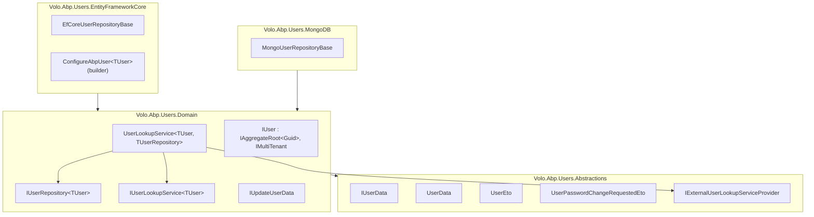
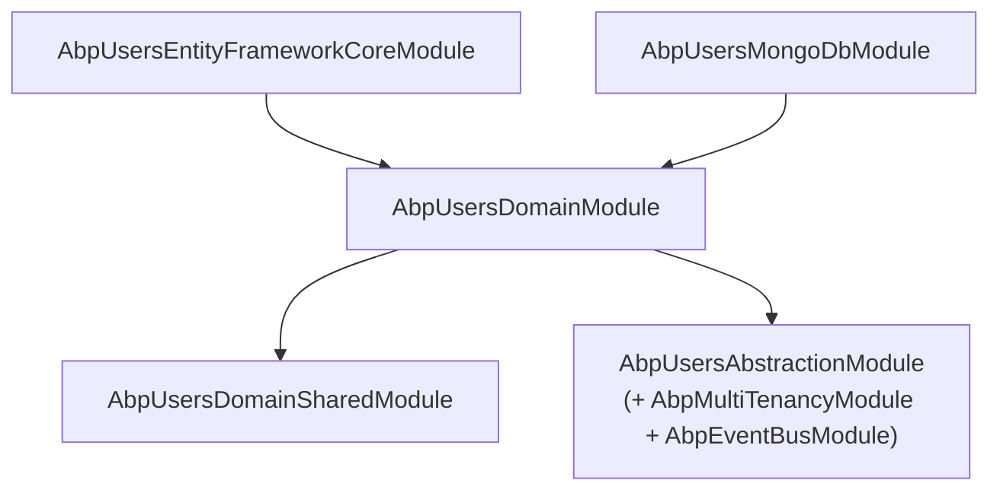

`Volo.Abp.Users` is the *shared user contract* layer. It does **not** ship a User aggregate — that belongs to `Volo.Abp.Identity` (and to whatever custom user module you might write). What it ships are:

* `IUser` — the aggregate-root contract every concrete user implementation honours,
* `IUserData` / `UserData` / `UserEto` / `UserPasswordChangeRequestedEto` — DTO / event shapes for moving users across modules,
* `IUserRepository<TUser>` — the per-user-type repository contract,
* `IUserLookupService<TUser>` and `UserLookupService<TUser, TUserRepository>` — the lookup pipeline with optional external-provider fallback,
* `IExternalUserLookupServiceProvider` — the plug for non-Identity sources (LDAP, legacy DB),
* EF Core / MongoDB *base classes* (`EfCoreUserRepositoryBase<TDbContext, TUser>`, `MongoUserRepositoryBase<TDbContext, TUser>`) every concrete user repository derives from.

If you want the Identity *User aggregate*, role management, password hashing and OU machinery — go to [Identity domain](/modules/identity/domain). This page documents the *abstractions* layer that lets multiple modules talk about users without forking the Identity aggregate.

## Package layout

| Package | Purpose |
| --- | --- |
| `Volo.Abp.Users.Abstractions` | `IUserData`, `UserData`, `UserEto`, `UserPasswordChangeRequestedEto`, `IExternalUserLookupServiceProvider`. Zero ABP-Domain dependency. |
| `Volo.Abp.Users.Domain.Shared` | `AbpUserConsts` (length defaults). |
| `Volo.Abp.Users.Domain` | `IUser`, `IUserRepository<TUser>`, `IUserLookupService<TUser>`, `UserLookupService<,>`, `IUpdateUserData`, `AbpUserExtensions.ToAbpUserData()`. |
| `Volo.Abp.Users.EntityFrameworkCore` | `EfCoreUserRepositoryBase<TDbContext, TUser>`, `AbpUsersDbContextModelCreatingExtensions.ConfigureAbpUser<TUser>(b)`. |
| `Volo.Abp.Users.MongoDB` | `MongoUserRepositoryBase<TDbContext, TUser>`. |
| `Volo.Abp.Users.Installer` | NuGet metapackage. |

There is **no DbContext, no model, no migration, no app service, no controller** in this module. Everything is abstract — concrete modules (Identity, Account, your own) plug in their `TUser` and pull the lookup / repository wiring through.

## What lives where



## The contract — `IUser`

```csharp
public interface IUser : IAggregateRoot<Guid>, IMultiTenant, IHasExtraProperties
{
    string UserName { get; }
    [CanBeNull] string Email { get; }
    [CanBeNull] string Name { get; }
    [CanBeNull] string Surname { get; }
    bool IsActive { get; }
    bool EmailConfirmed { get; }
    [CanBeNull] string PhoneNumber { get; }
    bool PhoneNumberConfirmed { get; }
}
```

Every concrete user aggregate (`IdentityUser`, `CmsUser`, your `MyAppUser`) implements this. The contract is *intentionally narrow* — it doesn't include `LockoutEnabled`, `TwoFactorEnabled`, claims, roles, or login providers. Those belong on the concrete aggregate. The shared contract is what cross-cutting modules (auditing, notifications, identity integration events) consume.

## The DTO / event family — `IUserData`

`IUserData` shares the same shape as `IUser` plus `Id` and `TenantId`:

```csharp
public interface IUserData : IHasExtraProperties
{
    Guid Id { get; }
    Guid? TenantId { get; }
    string UserName { get; }
    string Name { get; }
    string Surname { get; }
    bool IsActive { get; }
    [CanBeNull] string Email { get; }
    bool EmailConfirmed { get; }
    [CanBeNull] string PhoneNumber { get; }
    bool PhoneNumberConfirmed { get; }
}
```

Three implementations:

| Type | Role | Notes |
| --- | --- | --- |
| `UserData` | Plain DTO. | Constructor overloads for "build from another `IUserData`" and "build from scalars." |
| `UserEto` | Distributed-event payload for user changes. | `[EventName("Volo.Abp.Users.User")]`. Implements `IMultiTenant`. |
| `UserPasswordChangeRequestedEto` | `{TenantId, UserName, Password}`. | `[EventName("Volo.Abp.Users.UserPasswordChangeRequested")]`. The host publishes this when an admin resets a password and a tenant database needs to apply the change. |

`AbpUserExtensions.ToAbpUserData()` is the canonical adapter from `IUser` → `UserData`:

```csharp
public static IUserData ToAbpUserData(this IUser user)
    => new UserData(
        id: user.Id, userName: user.UserName, email: user.Email,
        name: user.Name, surname: user.Surname, isActive: user.IsActive,
        emailConfirmed: user.EmailConfirmed,
        phoneNumber: user.PhoneNumber, phoneNumberConfirmed: user.PhoneNumberConfirmed,
        tenantId: user.TenantId,
        extraProperties: user.ExtraProperties);
```

Any module that consumes "a user" without depending on Identity uses `IUserData` plus this extension.

## The lookup pipeline

`UserLookupService<TUser, TUserRepository>` is the *fallback orchestrator* between a local user table and an optional external source (LDAP / legacy DB):

```mermaid
flowchart TD
    A["FindByIdAsync(id) or FindByUserNameAsync(name)"] --> B{Local user exists?}
    B -- yes & SkipExternalLookupIfLocalUserExists --> Local["return local user"]
    B -- no & no external provider --> NullR["return null"]
    B -- yes & external configured --> Ext["external.FindByXxxAsync"]
    B -- no & external configured --> Ext
    Ext -- null & local existed --> Del["delete local user"] --> NullR
    Ext -- null & no local --> NullR
    Ext -- ext user & no local --> Ins["CreateUser(externalUser) + InsertAsync"] --> Reload["return reloaded local"]
    Ext -- ext user & local --> Update{IUpdateUserData.Update(extData) == true?}
    Update -- yes --> UpdLocal["UpdateAsync + return reloaded"]
    Update -- no --> Local
```

Concrete classes (`IdentityUserLookupService`) inherit from `UserLookupService<IdentityUser, IIdentityUserRepository>` and override `protected abstract TUser CreateUser(IUserData externalUser)` — that's the only required method. The base class handles:

* **`SkipExternalLookupIfLocalUserExists = true`** — once a user is in the local DB, the external provider is *not* consulted on subsequent lookups (huge performance win for LDAP-backed systems).
* **External provider failures** — wrapped in `Logger.LogException(ex)` and the local user is returned, so a flaky LDAP doesn't fail logins for already-imported users.
* **New unit of work** — every write (`Insert`, `Update`, `Delete`) uses `_unitOfWorkManager.Begin(requiresNew: true)`. The lookup runs inside the caller's UoW (typically a sign-in flow) but the local-cache mutation must succeed independently.

`IUpdateUserData.Update(extData)` is the **opt-in refresh hook**. Your concrete `TUser` implements it to copy whatever it cares about (e.g. `Email`, `Surname`) from `extData` and return `true` if anything changed. The base class only persists when `Update` returns `true`.

## Repository contract

```csharp
public interface IUserRepository<TUser> : IBasicRepository<TUser, Guid>
    where TUser : class, IUser, IAggregateRoot<Guid>
{
    Task<TUser> FindByUserNameAsync(string userName, CancellationToken cancellationToken = default);
    Task<List<TUser>> GetListAsync(IEnumerable<Guid> ids, CancellationToken cancellationToken = default);
    Task<List<TUser>> SearchAsync(string sorting = null, int maxResultCount = int.MaxValue, int skipCount = 0,
                                  string filter = null, CancellationToken cancellationToken = default);
    Task<long> GetCountAsync(string filter = null, CancellationToken cancellationToken = default);
}
```

It's generic over `TUser` so a single contract serves every user aggregate. The two persistence base classes implement *all four* methods identically across EF Core and MongoDB — the only difference is the underlying queryable.

`SearchAsync` and `GetCountAsync` both apply the same filter:

```csharp
.WhereIf(!filter.IsNullOrWhiteSpace(),
    u => u.UserName.Contains(filter) ||
         (u.Email != null && u.Email.Contains(filter)) ||
         (u.Name != null && u.Name.Contains(filter)) ||
         (u.Surname != null && u.Surname.Contains(filter)))
```

So a single search box hits the four user-visible columns; sort is `IUser.UserName` (or `IUserData.UserName` on MongoDB — same string).

## Length constants

```csharp
public class AbpUserConsts
{
    public static int MaxUserNameLength { get; set; } = 256;
    public static int MaxNameLength { get; set; } = 64;
    public static int MaxSurnameLength { get; set; } = 64;
    public static int MaxEmailLength { get; set; } = 256;
    public static int MaxPhoneNumberLength { get; set; } = 16;
}
```

Mutable statics — bump them in `PreConfigureServices` before EF Core builds the model.

## Module dependencies



`AbpUsersAbstractionModule` depends on `AbpMultiTenancyModule` and `AbpEventBusModule` because `UserEto` carries `IMultiTenant` and the eto's namespace is registered for the event bus. The whole abstractions package has zero references to ABP's DDD module — concrete modules can depend on it without picking up the heavyweight domain layer.

## Picking a persistence base class

When you write your own user module:

```csharp
public class MyAppUser : AggregateRoot<Guid>, IUser
{
    public string UserName { get; private set; }
    public string Email { get; private set; }
    // ... rest of IUser ...
    public Guid? TenantId { get; private set; }
    public ExtraPropertyDictionary ExtraProperties { get; protected set; } = new();
}

public interface IMyAppUserRepository : IUserRepository<MyAppUser> { }

public class EfCoreMyAppUserRepository
    : EfCoreUserRepositoryBase<MyAppDbContext, MyAppUser>, IMyAppUserRepository
{
    public EfCoreMyAppUserRepository(IDbContextProvider<MyAppDbContext> p) : base(p) { }
}
```

And map the columns in your DbContext:

```csharp
builder.Entity<MyAppUser>(b =>
{
    b.ToTable("MyAppUsers");
    b.ConfigureByConvention();
    b.ConfigureAbpUser();   // ← the helper from this module
});
```

The `ConfigureAbpUser<TUser>` extension assigns the eight `IUser` columns with the lengths from `AbpUserConsts`. You add your own properties on top.

## Gotchas

* **Don't add this module's repositories to DI directly.** They're abstract base classes; the concrete `IdentityUserRepository` (or your custom one) is what gets registered. The framework will fail to resolve `IUserRepository<>` directly because no concrete implementation is registered — always inject your *specific* `IIdentityUserRepository` or similar.
* **`UserLookupService<,>` is a base class.** It is *not* itself registered as a DI service. Identity registers `IdentityUserLookupService : UserLookupService<IdentityUser, IIdentityUserRepository>`. If you build your own user system, derive your own lookup service.
* **`ExternalUserLookupServiceProvider` is property-injected**, not constructor-injected. Set it after construction (typically via `[Dependency]` property injection) so it remains optional.
* **`SearchAsync` uses `Contains` on four columns.** That's four `LIKE '%…%'` predicates joined with OR — full table scan in SQL Server, `COLLSCAN` on MongoDB. Indexing strategies belong in the concrete module's DbContext.
* **`IUpdateUserData.Update` must return `true` to persist.** A subtle off-by-one: if your override copies fields but always returns `false`, lookups never write changes back.

## Cross-links

* [Users Abstractions package](./abstractions) — `IUserData`, `UserEto`, `IExternalUserLookupServiceProvider`.
* [Users Domain package](./domain) — `IUser`, `IUserRepository<>`, `UserLookupService<,>`.
* [Users EF Core base classes](./efcore) — `EfCoreUserRepositoryBase`, `ConfigureAbpUser`.
* [Users MongoDB base classes](./mongodb) — `MongoUserRepositoryBase`.
* [Identity Domain](/modules/identity/domain) — the concrete `IdentityUser` aggregate.
* [Framework / Auditing](/framework/cross/auditing) — uses `UserName`/`UserId` from the current user.
