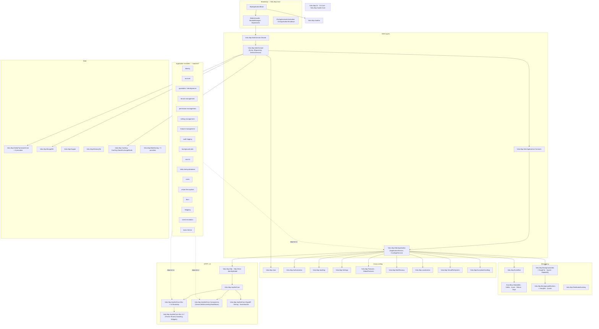

ABP Framework is structured as a small bootstrap kernel (`Volo.Abp.Core`) surrounded by ~150 framework packages and 19 prebuilt application modules. Every package is itself an `AbpModule` that participates in a single, ordered service-configuration graph rooted at the startup module of the host. This page walks the major subsystems, how they layer onto each other, the `AbpApplicationBase` lifecycle, the plug-in extension points, and how the Autofac container is wired in.

## The big picture

The following diagram mirrors the home page map and groups the 152 packages under `framework/src/` into eight subsystems. Every box maps to one or more `Volo.Abp.*` packages on disk.



<Note>
The arrows are package-level `[DependsOn]` edges and `ProjectReference` edges, not runtime control flow. Runtime ordering is covered in `/flows/application-startup`.
</Note>

## Module dependency layers

Every ABP "feature" — whether a framework package or an application module under `modules/` — is split across a fixed tier of projects so that contracts can flow downstream without dragging implementation. The framework itself follows the same tiers.

| Tier | Framework example | File path |
| --- | --- | --- |
| `Domain.Shared` | `Volo.Abp.Ddd.Domain.Shared` | `framework/src/Volo.Abp.Ddd.Domain.Shared/` |
| `Domain` | `Volo.Abp.Ddd.Domain` | `framework/src/Volo.Abp.Ddd.Domain/Volo/Abp/Domain/AbpDddDomainModule.cs` |
| `Application.Contracts` | `Volo.Abp.Ddd.Application.Contracts` | `framework/src/Volo.Abp.Ddd.Application.Contracts/` |
| `Application` | `Volo.Abp.Ddd.Application` | `framework/src/Volo.Abp.Ddd.Application/Volo/Abp/Application/AbpDddApplicationModule.cs` |
| `HttpApi` | `Volo.Abp.AspNetCore.Mvc` | `framework/src/Volo.Abp.AspNetCore.Mvc/` |
| `HttpApi.Client` | `Volo.Abp.Http.Client` | `framework/src/Volo.Abp.Http.Client/` |
| `Web` (Razor) | `Volo.Abp.AspNetCore.Mvc.UI` | `framework/src/Volo.Abp.AspNetCore.Mvc.UI/` |
| `Blazor` | `Volo.Abp.AspNetCore.Components.*` | `framework/src/Volo.Abp.AspNetCore.Components.Server/` |
| `EntityFrameworkCore` | `Volo.Abp.EntityFrameworkCore` | `framework/src/Volo.Abp.EntityFrameworkCore/` |
| `MongoDB` | `Volo.Abp.MongoDB` | `framework/src/Volo.Abp.MongoDB/` |

The same shape is repeated for every application module. For example the `identity` module under `modules/identity/src/` ships every tier:

- `Volo.Abp.Identity.Domain.Shared`
- `Volo.Abp.Identity.Domain`
- `Volo.Abp.Identity.Application.Contracts`
- `Volo.Abp.Identity.Application`
- `Volo.Abp.Identity.HttpApi`
- `Volo.Abp.Identity.HttpApi.Client`
- `Volo.Abp.Identity.Web`
- `Volo.Abp.Identity.Blazor` / `.Blazor.Server` / `.Blazor.WebAssembly`
- `Volo.Abp.Identity.EntityFrameworkCore`
- `Volo.Abp.Identity.MongoDB`
- `Volo.Abp.Identity.AspNetCore`
- `Volo.Abp.Identity.Installer`

Dependency rule of thumb (enforced by `ProjectReference` in every `.csproj`):

```text
Domain.Shared          ← Domain, Application.Contracts, EFCore, MongoDB
Domain                 ← Application, EFCore, MongoDB
Application.Contracts  ← Application, HttpApi, HttpApi.Client
Application            ← HttpApi (only via Application.Contracts), Host projects
HttpApi                ← Host projects
HttpApi.Client         ← Web (consumer-side), Blazor.WebAssembly
EFCore / MongoDB       ← Host (one persistence at a time)
```

The actual `AbpDddDomainModule` shows the upward dependency chain expressed as `[DependsOn]`:

```csharp framework/src/Volo.Abp.Ddd.Domain/Volo/Abp/Domain/AbpDddDomainModule.cs
[DependsOn(
    typeof(AbpAuditingModule),
    typeof(AbpDataModule),
    typeof(AbpEventBusModule),
    typeof(AbpGuidsModule),
    typeof(AbpTimingModule),
    typeof(AbpObjectMappingModule),
    typeof(AbpExceptionHandlingModule),
    typeof(AbpSpecificationsModule),
    typeof(AbpCachingModule),
    typeof(AbpDddDomainSharedModule)
    )]
public class AbpDddDomainModule : AbpModule
{
    public override void PreConfigureServices(ServiceConfigurationContext context)
    {
        context.Services.AddConventionalRegistrar(new AbpRepositoryConventionalRegistrar());
    }
}
```

And `AbpDddApplicationModule` shows how the Application layer composes Authorization, Validation, Settings, Features, etc.:

```csharp framework/src/Volo.Abp.Ddd.Application/Volo/Abp/Application/AbpDddApplicationModule.cs
[DependsOn(
    typeof(AbpDddDomainModule),
    typeof(AbpDddApplicationContractsModule),
    typeof(AbpSecurityModule),
    typeof(AbpObjectMappingModule),
    typeof(AbpValidationModule),
    typeof(AbpAuthorizationModule),
    typeof(AbpHttpAbstractionsModule),
    typeof(AbpSettingsModule),
    typeof(AbpFeaturesModule),
    typeof(AbpGlobalFeaturesModule)
    )]
public class AbpDddApplicationModule : AbpModule { /* ... */ }
```

<Tip>
Whenever you add a new project, copy the same tier layout. `Volo.Abp.Cli` (`framework/src/Volo.Abp.Cli/`) scaffolds it for you via `abp new-module`.
</Tip>

## Application lifecycle

`AbpApplicationBase` is the single bootstrap class in `framework/src/Volo.Abp.Core/Volo/Abp/AbpApplicationBase.cs`. It walks the module graph through three discrete phases — service configuration, runtime initialization, and shutdown.

| Phase | Method on `AbpApplicationBase` | Per-module hook invoked | Order |
| --- | --- | --- | --- |
| Load modules | `LoadModules(IServiceCollection, AbpApplicationCreationOptions)` | `IModuleLoader.LoadModules` → `AbpModuleHelper.FindAllModuleTypes` | Topological from startup module |
| Configure services (sync) | `ConfigureServices()` | `IPreConfigureServices.PreConfigureServices` → `IAbpModule.ConfigureServices` → `IPostConfigureServices.PostConfigureServices` | Topological |
| Configure services (async) | `ConfigureServicesAsync()` | `IPreConfigureServices.PreConfigureServicesAsync` → `IAbpModule.ConfigureServicesAsync` → `IPostConfigureServices.PostConfigureServicesAsync` | Topological |
| Initialize | `InitializeModulesAsync()` / `InitializeModules()` | `IOnPreApplicationInitialization` → `IOnApplicationInitialization` → `IOnPostApplicationInitialization` (via `IModuleManager`) | Topological |
| Shutdown | `ShutdownAsync()` / `Shutdown()` | `IOnApplicationShutdown` via `IModuleManager.ShutdownModulesAsync` | Reverse topological |

The constructor wires the core services in this exact order, taken verbatim from the file:

```csharp framework/src/Volo.Abp.Core/Volo/Abp/AbpApplicationBase.cs
services.AddSingleton<IAbpApplication>(this);
services.AddSingleton<IApplicationInfoAccessor>(this);
services.AddSingleton<IModuleContainer>(this);
services.AddSingleton<IAbpHostEnvironment>(new AbpHostEnvironment()
{
    EnvironmentName = options.Environment
});

services.AddCoreServices();
services.AddCoreAbpServices(this, options);

Modules = LoadModules(services, options);

if (!options.SkipConfigureServices)
{
    ConfigureServices();
}
```

`ConfigureServices()` then runs three module passes — `PreConfigureServices`, `ConfigureServices`, `PostConfigureServices` — each wrapping a module callback in `AbpInitializationException` so the failing module is reported by name. After all three passes, `Services.AddAssembly(assembly)` has been invoked for every assembly that backs a non-`SkipAutoServiceRegistration` module, populating the conventional registrars.

`InitializeModulesAsync` opens a child scope and delegates to `IModuleManager` (`framework/src/Volo.Abp.Core/Volo/Abp/Modularity/ModuleManager.cs`), which iterates the registered `IModuleLifecycleContributor` list against every module in load order:

```csharp framework/src/Volo.Abp.Core/Volo/Abp/Modularity/ModuleManager.cs
public virtual async Task InitializeModulesAsync(ApplicationInitializationContext context)
{
    foreach (var contributor in _lifecycleContributors)
    {
        foreach (var module in _moduleContainer.Modules)
        {
            await contributor.InitializeAsync(context, module.Instance);
        }
    }
    _logger.LogInformation("Initialized all ABP modules.");
}
```

The default contributors are defined in `DefaultModuleLifecycleContributor.cs` and bind to the three initialization interfaces:

| Contributor | Interface dispatched | File |
| --- | --- | --- |
| `OnPreApplicationInitializationModuleLifecycleContributor` | `IOnPreApplicationInitialization` | `framework/src/Volo.Abp.Core/Volo/Abp/Modularity/DefaultModuleLifecycleContributor.cs` |
| `OnApplicationInitializationModuleLifecycleContributor` | `IOnApplicationInitialization` | same |
| `OnPostApplicationInitializationModuleLifecycleContributor` | `IOnPostApplicationInitialization` | same |
| `OnApplicationShutdownModuleLifecycleContributor` | `IOnApplicationShutdown` | same |

Shutdown reverses the module list before invoking each contributor:

```csharp framework/src/Volo.Abp.Core/Volo/Abp/Modularity/ModuleManager.cs
public virtual async Task ShutdownModulesAsync(ApplicationShutdownContext context)
{
    var modules = _moduleContainer.Modules.Reverse().ToList();
    foreach (var contributor in _lifecycleContributors)
    foreach (var module in modules)
        await contributor.ShutdownAsync(context, module.Instance);
}
```

<Warning>
`AbpApplicationBase.ConfigureServices()` may be called only once. If you pass `SkipConfigureServices = true` and forget to call `ConfigureServicesAsync()` later, no `ServiceConfigurationContext` is created and the module graph is never validated. See `CheckMultipleConfigureServices()` in the same file.
</Warning>

## Plug-in points

The framework supports loading additional modules from outside the startup graph. `AbpApplicationCreationOptions.PlugInSources` is a `PlugInSourceList` (`framework/src/Volo.Abp.Core/Volo/Abp/Modularity/PlugIns/PlugInSourceList.cs`) of `IPlugInSource` implementations:

| Plug-in source | Behaviour | File |
| --- | --- | --- |
| `TypePlugInSource` | Pass module `Type`s explicitly | `framework/src/Volo.Abp.Core/Volo/Abp/Modularity/PlugIns/TypePlugInSource.cs` |
| `FilePlugInSource` | Load a list of `.dll` paths via `AssemblyLoadContext.Default.LoadFromAssemblyPath`, scan for `AbpModule.IsAbpModule(type)` | `framework/src/Volo.Abp.Core/Volo/Abp/Modularity/PlugIns/FilePlugInSource.cs` |
| `FolderPlugInSource` | Recursively (or top-only) scan a folder with optional `Func<string,bool> Filter` | `framework/src/Volo.Abp.Core/Volo/Abp/Modularity/PlugIns/FolderPlugInSource.cs` |
| `IPlugInSource` | Custom — implement `Type[] GetModules()` | `framework/src/Volo.Abp.Core/Volo/Abp/Modularity/PlugIns/IPlugInSource.cs` |

`ModuleLoader` then folds them into the regular descriptor list, marking them with `IsLoadedAsPlugIn = true`:

```csharp framework/src/Volo.Abp.Core/Volo/Abp/Modularity/ModuleLoader.cs
//Plugin modules
foreach (var moduleType in plugInSources.GetAllModules(logger))
{
    if (modules.Any(m => m.Type == moduleType)) continue;
    modules.Add(CreateModuleDescriptor(services, moduleType, isLoadedAsPlugIn: true));
}
```

<Tip>
Plug-ins go through the *same* `PreConfigure/Configure/PostConfigure/OnInit` pipeline as compile-time modules. Their dependencies are resolved by the same topological sort.
</Tip>

## DI container abstraction

ABP defaults to the Microsoft DI container, but ships an Autofac bridge for property injection, dynamic interception (used by UoW, auditing, authorization), and module-aware scopes. The bridge lives in `framework/src/Volo.Abp.Autofac/`:

- `Volo/Abp/Autofac/AbpAutofacServiceProviderFactory.cs` — `IServiceProviderFactory<ContainerBuilder>` that calls `_builder.Populate(services)` and wraps the built `IContainer` in an `AutofacServiceProvider`.
- `Volo/Abp/Autofac/AbpAutofacModule.cs` — an empty `AbpModule` that depends on `AbpCastleCoreModule` so DynamicProxy is available.
- `Volo/Abp/Autofac/AbpPropertySelector.cs` — controls property injection.

```csharp framework/src/Volo.Abp.Autofac/Volo/Abp/Autofac/AbpAutofacServiceProviderFactory.cs
public class AbpAutofacServiceProviderFactory : IServiceProviderFactory<ContainerBuilder>
{
    public ContainerBuilder CreateBuilder(IServiceCollection services)
    {
        _services = services;
        _builder.Populate(services);
        return _builder;
    }

    public IServiceProvider CreateServiceProvider(ContainerBuilder containerBuilder)
    {
        Check.NotNull(containerBuilder, nameof(containerBuilder));
        return new AutofacServiceProvider(containerBuilder.Build());
    }
}
```

```csharp framework/src/Volo.Abp.Autofac/Volo/Abp/Autofac/AbpAutofacModule.cs
using Volo.Abp.Castle;
using Volo.Abp.Modularity;

namespace Volo.Abp.Autofac;

[DependsOn(typeof(AbpCastleCoreModule))]
public class AbpAutofacModule : AbpModule
{
}
```

In an ASP.NET Core host the factory is wired in `Program.cs` via `builder.Host.UseAutofac()` and the host's startup module adds `[DependsOn(typeof(AbpAutofacModule))]`. There is also `Volo.Abp.Autofac.WebAssembly` (`framework/src/Volo.Abp.Autofac.WebAssembly/`) for Blazor WebAssembly hosts.

Service registration itself is driven by ABP's *conventional registrars* (`framework/src/Volo.Abp.Core/Volo/Abp/DependencyInjection/`), not by Autofac. `Services.AddAssembly(assembly)` calls every registered `IConventionalRegistrar.AddAssembly`, which scans for marker interfaces (`ITransientDependency`, `IScopedDependency`, `ISingletonDependency`) and the `[Dependency]` / `[ExposeServices]` attributes. The Autofac container then simply wraps the resulting `IServiceCollection`.

## Where to read next

<CardGroup cols={3}>
  <Card title="Application startup flow" icon="play" href="/flows/application-startup">
    Step-by-step of `AbpApplicationFactory` → `LoadModules` → `ConfigureServices` → `InitializeModulesAsync`.
  </Card>
  <Card title="AbpModule reference" icon="cube" href="/framework/core/abp-module">
    Every virtual method and the order in which they fire.
  </Card>
  <Card title="AbpApplicationBase" icon="rocket" href="/framework/core/application-base">
    Annotated source of the bootstrap class.
  </Card>
</CardGroup>
