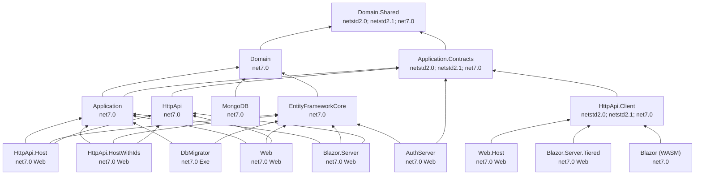

`abp new` produces a Domain-Driven Design layered solution: 17 csproj files under `templates/app/aspnet-core/src/`, each responsible for exactly one concern. The split is enforced by `ProjectReference` edges and by the framework's `[DependsOn]` graph, so a download from this template gives you the same dependency rules as the framework itself. This page lists every project, what it contains, and the legal edges between them. Project names use the canonical placeholder `MyCompanyName.MyProjectName` taken verbatim from the template.

## The 17 projects

| Project | Layer | SDK | Target | Role | File path |
| --- | --- | --- | --- | --- | --- |
| `MyCompanyName.MyProjectName.Domain.Shared` | Domain.Shared | `Microsoft.NET.Sdk` | `netstandard2.0;netstandard2.1;net7.0` | Constants, enums, localization keys, shared types reusable by every layer. | `templates/app/aspnet-core/src/MyCompanyName.MyProjectName.Domain.Shared/` |
| `MyCompanyName.MyProjectName.Domain` | Domain | `Microsoft.NET.Sdk` | `net7.0` | Entities, aggregates, domain services, repository interfaces, domain events. | `templates/app/aspnet-core/src/MyCompanyName.MyProjectName.Domain/` |
| `MyCompanyName.MyProjectName.Application.Contracts` | Contracts | `Microsoft.NET.Sdk` | `netstandard2.0;netstandard2.1;net7.0` | DTOs, `IXxxAppService` interfaces, permission definitions. | `templates/app/aspnet-core/src/MyCompanyName.MyProjectName.Application.Contracts/` |
| `MyCompanyName.MyProjectName.Application` | Application | `Microsoft.NET.Sdk` | `net7.0` | `XxxAppService : ApplicationService`, AutoMapper profiles. | `templates/app/aspnet-core/src/MyCompanyName.MyProjectName.Application/` |
| `MyCompanyName.MyProjectName.EntityFrameworkCore` | Persistence | `Microsoft.NET.Sdk` | `net7.0` | `XxxDbContext : AbpDbContext`, EF Core configuration, repository implementations. | `templates/app/aspnet-core/src/MyCompanyName.MyProjectName.EntityFrameworkCore/` |
| `MyCompanyName.MyProjectName.MongoDB` | Persistence | `Microsoft.NET.Sdk` | `net7.0` | `XxxMongoDbContext : AbpMongoDbContext`, repository implementations. | `templates/app/aspnet-core/src/MyCompanyName.MyProjectName.MongoDB/` |
| `MyCompanyName.MyProjectName.HttpApi` | API | `Microsoft.NET.Sdk` | `net7.0` | `XxxController : AbpController`, dynamic controller registration. | `templates/app/aspnet-core/src/MyCompanyName.MyProjectName.HttpApi/` |
| `MyCompanyName.MyProjectName.HttpApi.Client` | API client | `Microsoft.NET.Sdk` | `netstandard2.0;netstandard2.1;net7.0` | Dynamic HTTP proxies generated from `Application.Contracts` interfaces. | `templates/app/aspnet-core/src/MyCompanyName.MyProjectName.HttpApi.Client/` |
| `MyCompanyName.MyProjectName.HttpApi.Host` | Host | `Microsoft.NET.Sdk.Web` | `net7.0` | Non-tiered API host: Application + EFCore + HttpApi in one process. | `templates/app/aspnet-core/src/MyCompanyName.MyProjectName.HttpApi.Host/` |
| `MyCompanyName.MyProjectName.HttpApi.HostWithIds` | Host | `Microsoft.NET.Sdk.Web` | `net7.0` | API host that also embeds the AuthServer. | `templates/app/aspnet-core/src/MyCompanyName.MyProjectName.HttpApi.HostWithIds/` |
| `MyCompanyName.MyProjectName.AuthServer` | Host | `Microsoft.NET.Sdk.Web` | `net7.0` | Standalone OpenIddict/IdentityServer host. | `templates/app/aspnet-core/src/MyCompanyName.MyProjectName.AuthServer/` |
| `MyCompanyName.MyProjectName.Web` | UI (Razor) | `Microsoft.NET.Sdk.Web` | `net7.0` | Razor Pages MVC site (non-tiered). | `templates/app/aspnet-core/src/MyCompanyName.MyProjectName.Web/` |
| `MyCompanyName.MyProjectName.Web.Host` | UI (Razor) | `Microsoft.NET.Sdk.Web` | `net7.0` | Tiered MVC client that calls the API host. | `templates/app/aspnet-core/src/MyCompanyName.MyProjectName.Web.Host/` |
| `MyCompanyName.MyProjectName.Blazor` | UI (Blazor) | `Microsoft.NET.Sdk.BlazorWebAssembly` | `net7.0` | Blazor WebAssembly client (uses HttpApi.Client). | `templates/app/aspnet-core/src/MyCompanyName.MyProjectName.Blazor/` |
| `MyCompanyName.MyProjectName.Blazor.Server` | UI (Blazor) | `Microsoft.NET.Sdk.Web` | `net7.0` | Blazor Server (non-tiered) host. | `templates/app/aspnet-core/src/MyCompanyName.MyProjectName.Blazor.Server/` |
| `MyCompanyName.MyProjectName.Blazor.Server.Tiered` | UI (Blazor) | `Microsoft.NET.Sdk.Web` | `net7.0` | Tiered Blazor Server client. | `templates/app/aspnet-core/src/MyCompanyName.MyProjectName.Blazor.Server.Tiered/` |
| `MyCompanyName.MyProjectName.DbMigrator` | Tooling | `Microsoft.NET.Sdk` | `net7.0` (Exe) | Console runner that applies EF migrations and seeds data. | `templates/app/aspnet-core/src/MyCompanyName.MyProjectName.DbMigrator/` |

<Note>
A given solution typically ships **either** the non-tiered set (`HttpApi.Host` + `Web` + `Blazor.Server` + `Blazor` WASM) **or** the tiered set (`AuthServer` + `HttpApi.HostWithIds` + `Web.Host` + `Blazor.Server.Tiered` + `Blazor` WASM). MongoDB users replace `EntityFrameworkCore` with `MongoDB`.
</Note>

## Dependency rules

Every csproj in the template imports `..\..\common.props` from the template root so all projects share `<RootNamespace>MyCompanyName.MyProjectName</RootNamespace>` and the same `Nullable` settings. The `ProjectReference` edges encode the legal dependencies.

### Domain.Shared — base of the cone

`Domain.Shared` is the only project legal to reference from every other project. It targets `netstandard2.0;netstandard2.1;net7.0`, which is why it can be consumed by Blazor WebAssembly client and `HttpApi.Client` alike.

```xml templates/app/aspnet-core/src/MyCompanyName.MyProjectName.Domain.Shared/MyCompanyName.MyProjectName.Domain.Shared.csproj
<Project Sdk="Microsoft.NET.Sdk">
  <Import Project="..\..\common.props" />

  <PropertyGroup>
    <TargetFrameworks>netstandard2.0;netstandard2.1;net7.0</TargetFrameworks>
    <Nullable>enable</Nullable>
    <RootNamespace>MyCompanyName.MyProjectName</RootNamespace>
    <GenerateEmbeddedFilesManifest>true</GenerateEmbeddedFilesManifest>
  </PropertyGroup>

  <ItemGroup>
    <ProjectReference Include="..\..\..\..\..\modules\identity\src\Volo.Abp.Identity.Domain.Shared\Volo.Abp.Identity.Domain.Shared.csproj" />
    <ProjectReference Include="..\..\..\..\..\modules\background-jobs\src\Volo.Abp.BackgroundJobs.Domain.Shared\Volo.Abp.BackgroundJobs.Domain.Shared.csproj" />
    <ProjectReference Include="..\..\..\..\..\modules\audit-logging\src\Volo.Abp.AuditLogging.Domain.Shared\Volo.Abp.AuditLogging.Domain.Shared.csproj" />
    <ProjectReference Include="..\..\..\..\..\modules\tenant-management\src\Volo.Abp.TenantManagement.Domain.Shared\Volo.Abp.TenantManagement.Domain.Shared.csproj" />
    <ProjectReference Include="..\..\..\..\..\modules\feature-management\src\Volo.Abp.FeatureManagement.Domain.Shared\Volo.Abp.FeatureManagement.Domain.Shared.csproj" />
    <ProjectReference Include="..\..\..\..\..\modules\permission-management\src\Volo.Abp.PermissionManagement.Domain.Shared\Volo.Abp.PermissionManagement.Domain.Shared.csproj" />
    <ProjectReference Include="..\..\..\..\..\modules\setting-management\src\Volo.Abp.SettingManagement.Domain.Shared\Volo.Abp.SettingManagement.Domain.Shared.csproj" />
    <ProjectReference Include="..\..\..\..\..\modules\openiddict\src\Volo.Abp.OpenIddict.Domain.Shared\Volo.Abp.OpenIddict.Domain.Shared.csproj" />
  </ItemGroup>

  <ItemGroup>
    <EmbeddedResource Include="Localization\MyProjectName\*.json" />
    <Content Remove="Localization\MyProjectName\*.json" />
  </ItemGroup>

  <ItemGroup>
    <PackageReference Include="Microsoft.Extensions.FileProviders.Embedded" Version="7.0.10" />
  </ItemGroup>
</Project>
```

Allowed contents: enums, constants, error codes, shared `Permission` names, embedded JSON localization files.

### Domain — entities and repositories

`Domain` is `net7.0`-only. It references `Domain.Shared` plus the framework's `Volo.Abp.Emailing` and every module's `*.Domain` project:

```xml templates/app/aspnet-core/src/MyCompanyName.MyProjectName.Domain/MyCompanyName.MyProjectName.Domain.csproj
<ItemGroup>
  <ProjectReference Include="..\MyCompanyName.MyProjectName.Domain.Shared\MyCompanyName.MyProjectName.Domain.Shared.csproj" />
</ItemGroup>

<ItemGroup>
  <ProjectReference Include="..\..\..\..\..\framework\src\Volo.Abp.Emailing\Volo.Abp.Emailing.csproj" />
  <ProjectReference Include="..\..\..\..\..\modules\identity\src\Volo.Abp.Identity.Domain\Volo.Abp.Identity.Domain.csproj" />
  <ProjectReference Include="..\..\..\..\..\modules\identity\src\Volo.Abp.PermissionManagement.Domain.Identity\Volo.Abp.PermissionManagement.Domain.Identity.csproj" />
  <ProjectReference Include="..\..\..\..\..\modules\background-jobs\src\Volo.Abp.BackgroundJobs.Domain\Volo.Abp.BackgroundJobs.Domain.csproj" />
  <ProjectReference Include="..\..\..\..\..\modules\audit-logging\src\Volo.Abp.AuditLogging.Domain\Volo.Abp.AuditLogging.Domain.csproj" />
  <ProjectReference Include="..\..\..\..\..\modules\tenant-management\src\Volo.Abp.TenantManagement.Domain\Volo.Abp.TenantManagement.Domain.csproj" />
  <ProjectReference Include="..\..\..\..\..\modules\feature-management\src\Volo.Abp.FeatureManagement.Domain\Volo.Abp.FeatureManagement.Domain.csproj" />
  <ProjectReference Include="..\..\..\..\..\modules\setting-management\src\Volo.Abp.SettingManagement.Domain\Volo.Abp.SettingManagement.Domain.csproj" />
  <ProjectReference Include="..\..\..\..\..\modules\openiddict\src\Volo.Abp.OpenIddict.Domain\Volo.Abp.OpenIddict.Domain.csproj" />
  <ProjectReference Include="..\..\..\..\..\modules\openiddict\src\Volo.Abp.PermissionManagement.Domain.OpenIddict\Volo.Abp.PermissionManagement.Domain.OpenIddict.csproj" />
</ItemGroup>
```

Allowed contents: `IRepository<TEntity, TKey>` interfaces, domain services, entity classes, domain events, factories.

### Application.Contracts — DTOs and interfaces

`Application.Contracts` mirrors `Domain.Shared` in being multi-target (`netstandard2.0;netstandard2.1;net7.0`) because thin Blazor WASM and `HttpApi.Client` clients both reference it. It depends on `Domain.Shared` and on every module's `*.Application.Contracts` project plus the framework's `Volo.Abp.ObjectExtending`:

```xml templates/app/aspnet-core/src/MyCompanyName.MyProjectName.Application.Contracts/MyCompanyName.MyProjectName.Application.Contracts.csproj
<ItemGroup>
  <ProjectReference Include="..\MyCompanyName.MyProjectName.Domain.Shared\MyCompanyName.MyProjectName.Domain.Shared.csproj" />
</ItemGroup>

<ItemGroup>
  <ProjectReference Include="..\..\..\..\..\framework\src\Volo.Abp.ObjectExtending\Volo.Abp.ObjectExtending.csproj" />
  <ProjectReference Include="..\..\..\..\..\modules\account\src\Volo.Abp.Account.Application.Contracts\Volo.Abp.Account.Application.Contracts.csproj" />
  <ProjectReference Include="..\..\..\..\..\modules\identity\src\Volo.Abp.Identity.Application.Contracts\Volo.Abp.Identity.Application.Contracts.csproj" />
  <ProjectReference Include="..\..\..\..\..\modules\permission-management\src\Volo.Abp.PermissionManagement.Application.Contracts\Volo.Abp.PermissionManagement.Application.Contracts.csproj" />
  <ProjectReference Include="..\..\..\..\..\modules\tenant-management\src\Volo.Abp.TenantManagement.Application.Contracts\Volo.Abp.TenantManagement.Application.Contracts.csproj" />
  <ProjectReference Include="..\..\..\..\..\modules\feature-management\src\Volo.Abp.FeatureManagement.Application.Contracts\Volo.Abp.FeatureManagement.Application.Contracts.csproj" />
  <ProjectReference Include="..\..\..\..\..\modules\setting-management\src\Volo.Abp.SettingManagement.Application.Contracts\Volo.Abp.SettingManagement.Application.Contracts.csproj" />
</ItemGroup>
```

Allowed contents: DTO classes (`CreateUpdateXxxDto`, `XxxDto`), `IXxxAppService` interfaces, `PermissionDefinitionProvider`, `SettingDefinitionProvider`, AutoMapper-friendly value types.

### Application — implementations of the contracts

`Application` is `net7.0`-only. It references `Domain` (to use repositories) and `Application.Contracts` (to implement DTOs and `IXxxAppService`):

```xml templates/app/aspnet-core/src/MyCompanyName.MyProjectName.Application/MyCompanyName.MyProjectName.Application.csproj
<ItemGroup>
  <ProjectReference Include="..\MyCompanyName.MyProjectName.Domain\MyCompanyName.MyProjectName.Domain.csproj" />
  <ProjectReference Include="..\MyCompanyName.MyProjectName.Application.Contracts\MyCompanyName.MyProjectName.Application.Contracts.csproj" />
</ItemGroup>

<ItemGroup>
  <ProjectReference Include="..\..\..\..\..\modules\account\src\Volo.Abp.Account.Application\Volo.Abp.Account.Application.csproj" />
  <ProjectReference Include="..\..\..\..\..\modules\identity\src\Volo.Abp.Identity.Application\Volo.Abp.Identity.Application.csproj" />
  <ProjectReference Include="..\..\..\..\..\modules\permission-management\src\Volo.Abp.PermissionManagement.Application\Volo.Abp.PermissionManagement.Application.csproj" />
  <ProjectReference Include="..\..\..\..\..\modules\tenant-management\src\Volo.Abp.TenantManagement.Application\Volo.Abp.TenantManagement.Application.csproj" />
  <ProjectReference Include="..\..\..\..\..\modules\feature-management\src\Volo.Abp.FeatureManagement.Application\Volo.Abp.FeatureManagement.Application.csproj" />
  <ProjectReference Include="..\..\..\..\..\modules\setting-management\src\Volo.Abp.SettingManagement.Application\Volo.Abp.SettingManagement.Application.csproj" />
</ItemGroup>
```

Allowed contents: `XxxAppService : ApplicationService, IXxxAppService`, AutoMapper profiles, domain orchestration.

### EntityFrameworkCore / MongoDB — persistence

EF Core variant references `Domain` (to implement its repository interfaces), `Volo.Abp.EntityFrameworkCore.SqlServer`, and the EF Core implementations of every module:

```xml templates/app/aspnet-core/src/MyCompanyName.MyProjectName.EntityFrameworkCore/MyCompanyName.MyProjectName.EntityFrameworkCore.csproj
<ItemGroup>
  <ProjectReference Include="..\MyCompanyName.MyProjectName.Domain\MyCompanyName.MyProjectName.Domain.csproj" />
  <ProjectReference Include="..\..\..\..\..\framework\src\Volo.Abp.EntityFrameworkCore.SqlServer\Volo.Abp.EntityFrameworkCore.SqlServer.csproj" />
  <ProjectReference Include="..\..\..\..\..\modules\permission-management\src\Volo.Abp.PermissionManagement.EntityFrameworkCore\Volo.Abp.PermissionManagement.EntityFrameworkCore.csproj" />
  <ProjectReference Include="..\..\..\..\..\modules\setting-management\src\Volo.Abp.SettingManagement.EntityFrameworkCore\Volo.Abp.SettingManagement.EntityFrameworkCore.csproj" />
  <ProjectReference Include="..\..\..\..\..\modules\identity\src\Volo.Abp.Identity.EntityFrameworkCore\Volo.Abp.Identity.EntityFrameworkCore.csproj" />
  <ProjectReference Include="..\..\..\..\..\modules\background-jobs\src\Volo.Abp.BackgroundJobs.EntityFrameworkCore\Volo.Abp.BackgroundJobs.EntityFrameworkCore.csproj" />
  <ProjectReference Include="..\..\..\..\..\modules\audit-logging\src\Volo.Abp.AuditLogging.EntityFrameworkCore\Volo.Abp.AuditLogging.EntityFrameworkCore.csproj" />
  <ProjectReference Include="..\..\..\..\..\modules\tenant-management\src\Volo.Abp.TenantManagement.EntityFrameworkCore\Volo.Abp.TenantManagement.EntityFrameworkCore.csproj" />
  <ProjectReference Include="..\..\..\..\..\modules\feature-management\src\Volo.Abp.FeatureManagement.EntityFrameworkCore\Volo.Abp.FeatureManagement.EntityFrameworkCore.csproj" />
  <ProjectReference Include="..\..\..\..\..\modules\openiddict\src\Volo.Abp.OpenIddict.EntityFrameworkCore\Volo.Abp.OpenIddict.EntityFrameworkCore.csproj" />
</ItemGroup>

<ItemGroup>
  <PackageReference Include="Microsoft.EntityFrameworkCore.Tools" Version="7.0.1">
    <PrivateAssets>all</PrivateAssets>
    <IncludeAssets>runtime; build; native; contentfiles; analyzers</IncludeAssets>
  </PackageReference>
</ItemGroup>
```

The MongoDB sibling sits beside it under `templates/app/aspnet-core/src/MyCompanyName.MyProjectName.MongoDB/` and is mutually exclusive — pick one at solution-creation time. Only one of EFCore / MongoDB is referenced from the host.

### HttpApi — controllers

`HttpApi` references `Application.Contracts` (it never sees the implementations) and every module's `*.HttpApi`:

```xml templates/app/aspnet-core/src/MyCompanyName.MyProjectName.HttpApi/MyCompanyName.MyProjectName.HttpApi.csproj
<ItemGroup>
  <ProjectReference Include="..\MyCompanyName.MyProjectName.Application.Contracts\MyCompanyName.MyProjectName.Application.Contracts.csproj" />
</ItemGroup>

<ItemGroup>
  <ProjectReference Include="..\..\..\..\..\modules\account\src\Volo.Abp.Account.HttpApi\Volo.Abp.Account.HttpApi.csproj" />
  <ProjectReference Include="..\..\..\..\..\modules\identity\src\Volo.Abp.Identity.HttpApi\Volo.Abp.Identity.HttpApi.csproj" />
  <ProjectReference Include="..\..\..\..\..\modules\permission-management\src\Volo.Abp.PermissionManagement.HttpApi\Volo.Abp.PermissionManagement.HttpApi.csproj" />
  <ProjectReference Include="..\..\..\..\..\modules\tenant-management\src\Volo.Abp.TenantManagement.HttpApi\Volo.Abp.TenantManagement.HttpApi.csproj" />
  <ProjectReference Include="..\..\..\..\..\modules\feature-management\src\Volo.Abp.FeatureManagement.HttpApi\Volo.Abp.FeatureManagement.HttpApi.csproj" />
  <ProjectReference Include="..\..\..\..\..\modules\setting-management\src\Volo.Abp.SettingManagement.HttpApi\Volo.Abp.SettingManagement.HttpApi.csproj" />
</ItemGroup>
```

### HttpApi.Client — dynamic proxies

`HttpApi.Client` references `Application.Contracts` only. It is multi-target (`netstandard2.0;netstandard2.1;net7.0`) and embeds `**\*generate-proxy.json` so the CLI can refresh proxies:

```xml templates/app/aspnet-core/src/MyCompanyName.MyProjectName.HttpApi.Client/MyCompanyName.MyProjectName.HttpApi.Client.csproj
<PropertyGroup>
  <TargetFrameworks>netstandard2.0;netstandard2.1;net7.0</TargetFrameworks>
  <Nullable>enable</Nullable>
  <RootNamespace>MyCompanyName.MyProjectName</RootNamespace>
</PropertyGroup>

<ItemGroup>
  <ProjectReference Include="..\MyCompanyName.MyProjectName.Application.Contracts\MyCompanyName.MyProjectName.Application.Contracts.csproj" />
</ItemGroup>

<ItemGroup>
  <EmbeddedResource Include="**\*generate-proxy.json" />
  <Content Remove="**\*generate-proxy.json" />
</ItemGroup>
```

### Hosts (Web, HttpApi.Host, HttpApi.HostWithIds, AuthServer, Blazor.Server)

Host projects are the only ones that may reference `Application`, `EntityFrameworkCore`, and `HttpApi` together. `HttpApi.Host.csproj` is the canonical example of a non-tiered API host:

```xml templates/app/aspnet-core/src/MyCompanyName.MyProjectName.HttpApi.Host/MyCompanyName.MyProjectName.HttpApi.Host.csproj
<Project Sdk="Microsoft.NET.Sdk.Web">
  <Import Project="..\..\common.props" />

  <PropertyGroup>
    <TargetFramework>net7.0</TargetFramework>
    <Nullable>enable</Nullable>
    <RootNamespace>MyCompanyName.MyProjectName</RootNamespace>
    <PreserveCompilationReferences>true</PreserveCompilationReferences>
    <UserSecretsId>MyCompanyName.MyProjectName-4681b4fd-151f-4221-84a4-929d86723e4c</UserSecretsId>
  </PropertyGroup>

  <ItemGroup>
    <PackageReference Include="Serilog.AspNetCore" Version="5.0.0" />
    <PackageReference Include="Microsoft.AspNetCore.Authentication.JwtBearer" Version="7.0.10" />
    <PackageReference Include="Microsoft.AspNetCore.DataProtection.StackExchangeRedis" Version="7.0.10" />
    <PackageReference Include="DistributedLock.Redis" Version="1.0.2" />
    <ProjectReference Include="..\..\..\..\..\framework\src\Volo.Abp.AspNetCore.Mvc.UI.MultiTenancy\Volo.Abp.AspNetCore.Mvc.UI.MultiTenancy.csproj" />
    <ProjectReference Include="..\..\..\..\..\framework\src\Volo.Abp.Autofac\Volo.Abp.Autofac.csproj" />
    <ProjectReference Include="..\..\..\..\..\framework\src\Volo.Abp.Caching.StackExchangeRedis\Volo.Abp.Caching.StackExchangeRedis.csproj" />
    <ProjectReference Include="..\..\..\..\..\framework\src\Volo.Abp.DistributedLocking\Volo.Abp.DistributedLocking.csproj" />
    <ProjectReference Include="..\..\..\..\..\framework\src\Volo.Abp.AspNetCore.Serilog\Volo.Abp.AspNetCore.Serilog.csproj" />
    <ProjectReference Include="..\..\..\..\..\framework\src\Volo.Abp.Swashbuckle\Volo.Abp.Swashbuckle.csproj" />
  </ItemGroup>

  <ItemGroup>
    <ProjectReference Include="..\MyCompanyName.MyProjectName.Application\MyCompanyName.MyProjectName.Application.csproj" />
    <ProjectReference Include="..\MyCompanyName.MyProjectName.EntityFrameworkCore\MyCompanyName.MyProjectName.EntityFrameworkCore.csproj" />
    <ProjectReference Include="..\MyCompanyName.MyProjectName.HttpApi\MyCompanyName.MyProjectName.HttpApi.csproj" />
  </ItemGroup>
</Project>
```

The other hosts follow the same pattern but trim the set:

| Host | Adds | Drops |
| --- | --- | --- |
| `Web` | `MyCompanyName.MyProjectName.Web` Razor pages, `AspNetCore.Mvc.UI.Theme.Basic` | (non-tiered) |
| `Web.Host` | Razor pages + `Volo.Abp.AspNetCore.Mvc.Client.Web` | `Application`, `EntityFrameworkCore` — uses `HttpApi.Client` instead |
| `HttpApi.HostWithIds` | Embedded OpenIddict + `Volo.Abp.AspNetCore.Mvc.UI.Theme.Shared` | (tiered host) |
| `AuthServer` | OpenIddict server, no business endpoints | `Application`, `HttpApi` |
| `Blazor.Server` | `Volo.Abp.AspNetCore.Components.Server.BasicTheme` | n/a |
| `Blazor.Server.Tiered` | `Volo.Abp.Http.Client.IdentityModel.Web` | `Application`, `EntityFrameworkCore` |
| `Blazor` (WASM) | `Volo.Abp.AspNetCore.Components.WebAssembly.BasicTheme`, `HttpApi.Client` | server-only modules |

### DbMigrator

The migrator is a console host that needs `Application` (for data seed contributors) plus `EntityFrameworkCore` (for the migrations themselves):

```xml templates/app/aspnet-core/src/MyCompanyName.MyProjectName.DbMigrator/MyCompanyName.MyProjectName.DbMigrator.csproj
<Project Sdk="Microsoft.NET.Sdk">
  <Import Project="..\..\common.props" />

  <PropertyGroup>
    <OutputType>Exe</OutputType>
    <TargetFramework>net7.0</TargetFramework>
    <Nullable>enable</Nullable>
  </PropertyGroup>
  /* ... package + project references ... */
</Project>
```

## Dependency cone



## Reference rules — at a glance

| Can reference ↓ / from → | Domain.Shared | Domain | App.Contracts | App | EFCore / Mongo | HttpApi | HttpApi.Client | Web/Host |
| --- | --- | --- | --- | --- | --- | --- | --- | --- |
| Domain.Shared | — | ✅ | ✅ | ✅ | ✅ | ✅ | ✅ | ✅ |
| Domain | ❌ | — | ❌ | ✅ | ✅ | ❌ | ❌ | ✅ |
| Application.Contracts | ❌ | ❌ | — | ✅ | ❌ | ✅ | ✅ | ✅ |
| Application | ❌ | ❌ | ❌ | — | ❌ | ❌ | ❌ | ✅ |
| EFCore / MongoDB | ❌ | ❌ | ❌ | ❌ | — | ❌ | ❌ | ✅ |
| HttpApi | ❌ | ❌ | ❌ | ❌ | ❌ | — | ❌ | ✅ |
| HttpApi.Client | ❌ | ❌ | ❌ | ❌ | ❌ | ❌ | — | ✅ (tiered hosts) |

<Warning>
The CLI enforces these rules when scaffolding entities (`abp generate-proxy`, `abp add-module`). Bypassing them by manually adding a `ProjectReference` from `Domain` to `Application`, for example, breaks downstream Blazor WASM consumers because they cannot target `net7.0`-only assemblies.
</Warning>

## Module pattern equivalence

Each application module under `modules/<name>/src/` ships the *same* tier of projects. For example the Identity module (`modules/identity/src/`) exposes:

- `Volo.Abp.Identity.Domain.Shared`
- `Volo.Abp.Identity.Domain`
- `Volo.Abp.Identity.Application.Contracts`
- `Volo.Abp.Identity.Application`
- `Volo.Abp.Identity.HttpApi`
- `Volo.Abp.Identity.HttpApi.Client`
- `Volo.Abp.Identity.Web`
- `Volo.Abp.Identity.Blazor` / `Blazor.Server` / `Blazor.WebAssembly`
- `Volo.Abp.Identity.EntityFrameworkCore`
- `Volo.Abp.Identity.MongoDB`
- `Volo.Abp.Identity.AspNetCore`
- `Volo.Abp.Identity.Installer`

That means the host's `EntityFrameworkCore.csproj` directly composes the module's `EntityFrameworkCore` project, the host's `Application.csproj` composes the module's `Application` project, and so on — no glue code is required.

## Cross-references

<CardGroup cols={2}>
  <Card title="App template walkthrough" icon="layer-group" href="/templates/aspnetcore/app">
    Full guided tour of the layered template.
  </Card>
  <Card title="Module template" icon="cube" href="/templates/aspnetcore/module">
    The 13-project module template under `templates/module/`.
  </Card>
  <Card title="App-nolayers template" icon="square" href="/templates/aspnetcore/app-nolayers">
    Single-project variant under `templates/app-nolayers/`.
  </Card>
  <Card title="Conventions" icon="ruler" href="/overview/conventions">
    Naming and DI conventions referenced throughout the layers.
  </Card>
</CardGroup>
