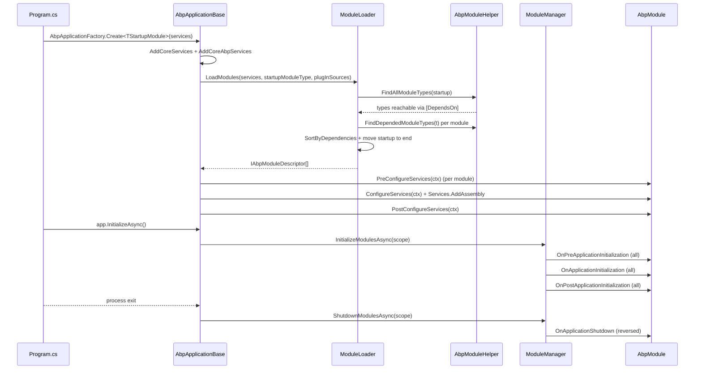

Every ABP package — framework or application — is delivered as a single class deriving from `AbpModule`. The framework discovers modules by walking `[DependsOn]` attributes from the application's startup module, topologically sorts them, and then runs each one through three service-configuration phases and four runtime lifecycle phases. This page reads the relevant source files end-to-end and explains the contracts each module participates in.

## `AbpModule`: the base class

`AbpModule` is defined at `framework/src/Volo.Abp.Core/Volo/Abp/Modularity/AbpModule.cs`. It implements seven interfaces in one class so a single override is enough to participate in any phase:

```csharp framework/src/Volo.Abp.Core/Volo/Abp/Modularity/AbpModule.cs
public abstract class AbpModule :
    IAbpModule,
    IOnPreApplicationInitialization,
    IOnApplicationInitialization,
    IOnPostApplicationInitialization,
    IOnApplicationShutdown,
    IPreConfigureServices,
    IPostConfigureServices
{
    protected internal bool SkipAutoServiceRegistration { get; protected set; }
    /* ... ServiceConfigurationContext property elided ... */
}
```

`IAbpModule` itself is intentionally minimal:

```csharp framework/src/Volo.Abp.Core/Volo/Abp/Modularity/IAbpModule.cs
public interface IAbpModule
{
    Task ConfigureServicesAsync(ServiceConfigurationContext context);
    void ConfigureServices(ServiceConfigurationContext context);
}
```

The other six interfaces (`IPreConfigureServices`, `IPostConfigureServices`, `IOnPreApplicationInitialization`, `IOnApplicationInitialization`, `IOnPostApplicationInitialization`, `IOnApplicationShutdown`) live in the same folder and each declares a sync method + an async method.

### Virtual methods you override

| Phase | Sync override | Async override | When it runs |
| --- | --- | --- | --- |
| Service config — pre | `PreConfigureServices(context)` | `PreConfigureServicesAsync(context)` | First pass over `Modules.Where(m => m.Instance is IPreConfigureServices)` |
| Service config — main | `ConfigureServices(context)` | `ConfigureServicesAsync(context)` | Second pass over all modules; also auto-registers assemblies via `Services.AddAssembly` |
| Service config — post | `PostConfigureServices(context)` | `PostConfigureServicesAsync(context)` | Third pass over `Modules.Where(m => m.Instance is IPostConfigureServices)` |
| Runtime init — pre | `OnPreApplicationInitialization(context)` | `OnPreApplicationInitializationAsync(context)` | `OnPreApplicationInitializationModuleLifecycleContributor` |
| Runtime init | `OnApplicationInitialization(context)` | `OnApplicationInitializationAsync(context)` | `OnApplicationInitializationModuleLifecycleContributor` |
| Runtime init — post | `OnPostApplicationInitialization(context)` | `OnPostApplicationInitializationAsync(context)` | `OnPostApplicationInitializationModuleLifecycleContributor` |
| Shutdown | `OnApplicationShutdown(context)` | `OnApplicationShutdownAsync(context)` | `OnApplicationShutdownModuleLifecycleContributor`, modules reversed |

The default async overrides simply call the sync overrides, so most modules only implement the sync ones:

```csharp framework/src/Volo.Abp.Core/Volo/Abp/Modularity/AbpModule.cs
public virtual Task ConfigureServicesAsync(ServiceConfigurationContext context)
{
    ConfigureServices(context);
    return Task.CompletedTask;
}

public virtual void ConfigureServices(ServiceConfigurationContext context) { }
```

### `ServiceConfigurationContext`

The `context` argument is a thin wrapper around `IServiceCollection` with an `Items` dictionary for cross-module data sharing:

```csharp framework/src/Volo.Abp.Core/Volo/Abp/Modularity/ServiceConfigurationContext.cs
public class ServiceConfigurationContext
{
    public IServiceCollection Services { get; }
    public IDictionary<string, object?> Items { get; }

    public object? this[string key] {
        get => Items.GetOrDefault(key);
        set => Items[key] = value;
    }

    public ServiceConfigurationContext([NotNull] IServiceCollection services)
    {
        Services = Check.NotNull(services, nameof(services));
        Items = new Dictionary<string, object?>();
    }
}
```

<Warning>
`AbpModule.ServiceConfigurationContext` getter throws if accessed outside the three Configure phases — `AbpApplicationBase` nulls the field as soon as `ConfigureServices` returns. Don't capture it for later use.
</Warning>

### Options helpers

`AbpModule` exposes `Configure<TOptions>`, `PreConfigure<TOptions>`, `PostConfigure<TOptions>`, `PostConfigureAll<TOptions>` shortcuts that delegate to the `IServiceCollection` extension methods of the same names:

```csharp framework/src/Volo.Abp.Core/Volo/Abp/Modularity/AbpModule.cs
protected void Configure<TOptions>(Action<TOptions> configureOptions)
    where TOptions : class
{
    ServiceConfigurationContext.Services.Configure(configureOptions);
}

protected void PreConfigure<TOptions>(Action<TOptions> configureOptions)
    where TOptions : class
{
    ServiceConfigurationContext.Services.PreConfigure(configureOptions);
}

protected void PostConfigure<TOptions>(Action<TOptions> configureOptions)
    where TOptions : class
{
    ServiceConfigurationContext.Services.PostConfigure(configureOptions);
}
```

`PreConfigure<TOptions>` writes into a `PreConfigureActionList<TOptions>` singleton, which any *other* module can read during its `ConfigureServices` to influence its own setup:

```csharp framework/src/Volo.Abp.Core/Volo/Abp/Options/PreConfigureActionList.cs
public class PreConfigureActionList<TOptions> : List<Action<TOptions>>
{
    public void Configure(TOptions options)
    {
        foreach (var action in this) { action(options); }
    }

    public TOptions Configure()
    {
        var options = Activator.CreateInstance<TOptions>();
        Configure(options);
        return options;
    }
}
```

This is how, for example, the EF Core module's `ConfigureServices` already knows which `DbContext`s the consumer wants to register.

## `[DependsOn]` and topological sort

Module dependencies are declared with `DependsOnAttribute`. The attribute is class-level and `AllowMultiple = true`, so each module either repeats it or passes a `params Type[]`:

```csharp framework/src/Volo.Abp.Core/Volo/Abp/Modularity/DependsOnAttribute.cs
[AttributeUsage(AttributeTargets.Class, AllowMultiple = true)]
public class DependsOnAttribute : Attribute, IDependedTypesProvider
{
    public Type[] DependedTypes { get; }

    public DependsOnAttribute(params Type[]? dependedTypes)
    {
        DependedTypes = dependedTypes ?? Type.EmptyTypes;
    }

    public virtual Type[] GetDependedTypes() => DependedTypes;
}
```

A real example — the DDD domain module declares its 10 dependencies in one attribute:

```csharp framework/src/Volo.Abp.Ddd.Domain/Volo/Abp/Domain/AbpDddDomainModule.cs
[DependsOn(
    typeof(AbpAuditingModule),
    typeof(AbpDataModule),
    typeof(AbpEventBusModule),
    typeof(AbpGuidsModule),
    typeof(AbpTimingModule),
    typeof(AbpObjectMappingModule),
    typeof(AbpExceptionHandlingModule),
    typeof(AbpSpecificationsModule),
    typeof(AbpCachingModule),
    typeof(AbpDddDomainSharedModule)
    )]
public class AbpDddDomainModule : AbpModule
{
    public override void PreConfigureServices(ServiceConfigurationContext context)
    {
        context.Services.AddConventionalRegistrar(new AbpRepositoryConventionalRegistrar());
    }
}
```

### `[AdditionalAssembly]`

For modules whose runtime code lives in additional assemblies (a host shipping shared Razor views, for example) the framework provides `AdditionalAssemblyAttribute`:

```csharp framework/src/Volo.Abp.Core/Volo/Abp/Modularity/AdditionalAssemblyAttribute.cs
[AttributeUsage(AttributeTargets.Class, AllowMultiple = true)]
public class AdditionalAssemblyAttribute : Attribute, IAdditionalModuleAssemblyProvider
{
    public Type[] TypesInAssemblies { get; }

    public AdditionalAssemblyAttribute(params Type[]? typesInAssemblies)
    {
        TypesInAssemblies = typesInAssemblies ?? Type.EmptyTypes;
    }

    public virtual Assembly[] GetAssemblies()
    {
        return TypesInAssemblies.Select(t => t.Assembly).Distinct().ToArray();
    }
}
```

Those extra assemblies are exposed via `IAbpModuleDescriptor.AllAssemblies` and the conventional registrars scan them too.

## `ModuleLoader`: building the descriptor list

`ModuleLoader` is the implementation injected as `IModuleLoader` in `AbpApplicationBase`. It splits its work into discover → resolve dependencies → topological sort:

```csharp framework/src/Volo.Abp.Core/Volo/Abp/Modularity/ModuleLoader.cs
public class ModuleLoader : IModuleLoader
{
    public IAbpModuleDescriptor[] LoadModules(
        IServiceCollection services,
        Type startupModuleType,
        PlugInSourceList plugInSources)
    {
        Check.NotNull(services, nameof(services));
        Check.NotNull(startupModuleType, nameof(startupModuleType));
        Check.NotNull(plugInSources, nameof(plugInSources));

        var modules = GetDescriptors(services, startupModuleType, plugInSources);
        modules = SortByDependency(modules, startupModuleType);
        return modules.ToArray();
    }
    /* ... */
}
```

The interesting bits:

- `FillModules` walks `AbpModuleHelper.FindAllModuleTypes(startupModuleType, logger)`, instantiating each module via `Activator.CreateInstance(moduleType)` and registering it as a singleton in `IServiceCollection`.
- Plug-in modules from `PlugInSourceList` are folded in afterwards with `isLoadedAsPlugIn: true` so they cannot be confused with compile-time ones.
- `SetDependencies` walks every module and resolves its `[DependsOn]` targets to existing descriptors; an unresolved target throws `AbpException("Could not find a depended module …")`.
- `SortByDependency` performs the topological sort and then moves the startup module to the end so it is the last to configure / initialize:

```csharp framework/src/Volo.Abp.Core/Volo/Abp/Modularity/ModuleLoader.cs
protected virtual List<IAbpModuleDescriptor> SortByDependency(
    List<IAbpModuleDescriptor> modules, Type startupModuleType)
{
    var sortedModules = modules.SortByDependencies(m => m.Dependencies);
    sortedModules.MoveItem(m => m.Type == startupModuleType, modules.Count - 1);
    return sortedModules;
}
```

### `AbpModuleDescriptor`

Each descriptor is the runtime record of a loaded module — its `Type`, primary `Assembly`, the union of `AllAssemblies` (primary + `[AdditionalAssembly]`s), the cached `IAbpModule` instance, an `IsLoadedAsPlugIn` flag, and a mutable list of resolved dependencies:

```csharp framework/src/Volo.Abp.Core/Volo/Abp/Modularity/AbpModuleDescriptor.cs
public class AbpModuleDescriptor : IAbpModuleDescriptor
{
    public Type Type { get; }
    public Assembly Assembly { get; }
    public Assembly[] AllAssemblies { get; }
    public IAbpModule Instance { get; }
    public bool IsLoadedAsPlugIn { get; }
    public IReadOnlyList<IAbpModuleDescriptor> Dependencies => _dependencies.ToImmutableList();
    /* ... */
}
```

## `ModuleManager`: driving the lifecycle

Once the application's DI container has been built, `AbpApplicationBase.InitializeModulesAsync` resolves `IModuleManager` from a child scope and delegates:

```csharp framework/src/Volo.Abp.Core/Volo/Abp/Modularity/ModuleManager.cs
public class ModuleManager : IModuleManager, ISingletonDependency
{
    public ModuleManager(
        IModuleContainer moduleContainer,
        ILogger<ModuleManager> logger,
        IOptions<AbpModuleLifecycleOptions> options,
        IServiceProvider serviceProvider)
    {
        _moduleContainer = moduleContainer;
        _logger = logger;
        _lifecycleContributors = options.Value
            .Contributors
            .Select(serviceProvider.GetRequiredService)
            .Cast<IModuleLifecycleContributor>()
            .ToArray();
    }

    public virtual async Task InitializeModulesAsync(ApplicationInitializationContext context)
    {
        foreach (var contributor in _lifecycleContributors)
        {
            foreach (var module in _moduleContainer.Modules)
            {
                await contributor.InitializeAsync(context, module.Instance);
            }
        }
        _logger.LogInformation("Initialized all ABP modules.");
    }
}
```

The contributors themselves are declared in `AbpModuleLifecycleOptions`:

```csharp framework/src/Volo.Abp.Core/Volo/Abp/Modularity/AbpModuleLifecycleOptions.cs
public class AbpModuleLifecycleOptions
{
    public ITypeList<IModuleLifecycleContributor> Contributors { get; }

    public AbpModuleLifecycleOptions()
    {
        Contributors = new TypeList<IModuleLifecycleContributor>();
    }
}
```

The four defaults come from `DefaultModuleLifecycleContributor.cs`:

```csharp framework/src/Volo.Abp.Core/Volo/Abp/Modularity/DefaultModuleLifecycleContributor.cs
public class OnPreApplicationInitializationModuleLifecycleContributor : ModuleLifecycleContributorBase
{
    public async override Task InitializeAsync(ApplicationInitializationContext context, IAbpModule module)
    {
        if (module is IOnPreApplicationInitialization onPreApplicationInitialization)
        {
            await onPreApplicationInitialization.OnPreApplicationInitializationAsync(context);
        }
    }
    /* ... */
}

public class OnApplicationInitializationModuleLifecycleContributor : ModuleLifecycleContributorBase { /* ... */ }
public class OnPostApplicationInitializationModuleLifecycleContributor : ModuleLifecycleContributorBase { /* ... */ }
public class OnApplicationShutdownModuleLifecycleContributor : ModuleLifecycleContributorBase { /* ... */ }
```

Each contributor brackets *all modules* before the next contributor runs. So all modules see `OnPreApplicationInitialization` first, then all see `OnApplicationInitialization`, then all see `OnPostApplicationInitialization`.

On shutdown the order is reversed:

```csharp framework/src/Volo.Abp.Core/Volo/Abp/Modularity/ModuleManager.cs
public virtual async Task ShutdownModulesAsync(ApplicationShutdownContext context)
{
    var modules = _moduleContainer.Modules.Reverse().ToList();
    foreach (var contributor in _lifecycleContributors)
    foreach (var module in modules)
        await contributor.ShutdownAsync(context, module.Instance);
}
```

<Note>
Custom contributors can be registered by adding to `AbpModuleLifecycleOptions.Contributors` in a `PreConfigureServices` override. Anything you register must implement `IModuleLifecycleContributor` and be available in DI.
</Note>

## Sequence diagram



## Plug-in modules

`AbpApplicationCreationOptions.PlugInSources` is a `PlugInSourceList`. Each source contributes module types that are appended after the compile-time graph but participate in the same pipelines.

| Source | When to use | File |
| --- | --- | --- |
| `TypePlugInSource(params Type[] moduleTypes)` | You have the module type at startup but don't want a `[DependsOn]` reference. | `framework/src/Volo.Abp.Core/Volo/Abp/Modularity/PlugIns/TypePlugInSource.cs` |
| `FilePlugInSource(params string[] filePaths)` | You ship plug-in DLLs to a known path. Calls `AssemblyLoadContext.Default.LoadFromAssemblyPath`. | `framework/src/Volo.Abp.Core/Volo/Abp/Modularity/PlugIns/FilePlugInSource.cs` |
| `FolderPlugInSource(folder, searchOption, filter)` | Scan a folder. `SearchOption.AllDirectories` for recursion, `Filter` for fine-grained selection. | `framework/src/Volo.Abp.Core/Volo/Abp/Modularity/PlugIns/FolderPlugInSource.cs` |
| Custom `IPlugInSource` | Anything else. | `framework/src/Volo.Abp.Core/Volo/Abp/Modularity/PlugIns/IPlugInSource.cs` |

The folder source illustrates the pattern:

```csharp framework/src/Volo.Abp.Core/Volo/Abp/Modularity/PlugIns/FolderPlugInSource.cs
public Type[] GetModules()
{
    var modules = new List<Type>();

    foreach (var assembly in GetAssemblies())
    {
        try
        {
            foreach (var type in assembly.GetTypes())
            {
                if (AbpModule.IsAbpModule(type))
                {
                    modules.AddIfNotContains(type);
                }
            }
        }
        catch (Exception ex)
        {
            throw new AbpException("Could not get module types from assembly: " + assembly.FullName, ex);
        }
    }

    return modules.ToArray();
}
```

`AbpModule.IsAbpModule(Type)` is the canonical predicate:

```csharp framework/src/Volo.Abp.Core/Volo/Abp/Modularity/AbpModule.cs
public static bool IsAbpModule(Type type)
{
    var typeInfo = type.GetTypeInfo();
    return
        typeInfo.IsClass &&
        !typeInfo.IsAbstract &&
        !typeInfo.IsGenericType &&
        typeof(IAbpModule).GetTypeInfo().IsAssignableFrom(type);
}
```

<Tip>
Plug-in module dependencies are resolved by the same `SetDependencies` loop. If a plug-in `[DependsOn(typeof(AbpSomethingModule))]` and that module isn't reachable from the startup module either, you'll get the same `AbpException` as for a missing compile-time dependency.
</Tip>

## End-to-end checklist for a new module

<Steps>
  <Step title="Define the class">
    Inherit from `AbpModule` in a new project. Put it in the namespace of your package's root.
  </Step>
  <Step title="Declare dependencies">
    Add `[DependsOn(typeof(AbpDddApplicationModule), …)]` for everything you need at any phase. The order inside the attribute doesn't matter.
  </Step>
  <Step title="Override what you need">
    Override `ConfigureServices` and any of the `PreConfigureServices`, `PostConfigureServices`, `OnApplicationInitialization`, `OnApplicationShutdown` methods you actually use. Don't keep references to `ServiceConfigurationContext`.
  </Step>
  <Step title="Use `Configure<TOptions>`">
    Configure framework / module options through the inherited `Configure<TOptions>` helper so the calls flow through MS Options correctly.
  </Step>
  <Step title="Register additional assemblies">
    If you have separate satellite assemblies (e.g. Razor views in a sibling DLL) annotate the module with `[AdditionalAssembly(typeof(SomeTypeInThatAssembly))]`.
  </Step>
  <Step title="Reference from the host">
    Either add a `[DependsOn(typeof(YourModule))]` to the host's startup module or register it as a plug-in via `options.PlugInSources.AddTypes(typeof(YourModule))`.
  </Step>
</Steps>

## Cross-references

<CardGroup cols={2}>
  <Card title="AbpApplicationBase" icon="rocket" href="/framework/core/application-base">
    The host class that drives this pipeline.
  </Card>
  <Card title="Application startup flow" icon="play" href="/flows/application-startup">
    End-to-end startup sequence from `Program.cs` to `RunAsync`.
  </Card>
  <Card title="Dependency injection" icon="diamond" href="/flows/dependency-injection">
    How `Services.AddAssembly` walks the conventional registrars.
  </Card>
  <Card title="Conventions" icon="ruler" href="/overview/conventions">
    Naming, options, marker interfaces.
  </Card>
</CardGroup>
