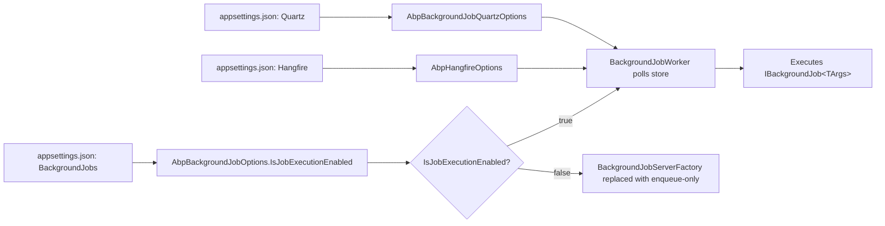
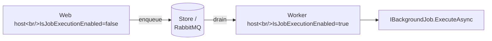

ABP exposes three layers of background-processing configuration: the
job pipeline itself (`AbpBackgroundJobOptions`), the polling worker
that drains the in-memory / EF / MongoDB store
(`AbpBackgroundJobWorkerOptions`), and the on/off switch for the
entire worker host (`AbpBackgroundWorkerOptions`). Provider modules
(Hangfire, Quartz, RabbitMQ) add their own options classes on top and
honour the same master `IsJobExecutionEnabled` flag — flipping it off
turns the host into an enqueue-only client. This page documents every
option, its default, and the appsettings layout that binds it.

## File inventory

| Type | Location |
| --- | --- |
| `AbpBackgroundJobOptions` | `framework/src/Volo.Abp.BackgroundJobs.Abstractions/Volo/Abp/BackgroundJobs/AbpBackgroundJobOptions.cs` |
| `AbpBackgroundJobWorkerOptions` | `framework/src/Volo.Abp.BackgroundJobs/Volo/Abp/BackgroundJobs/AbpBackgroundJobWorkerOptions.cs` |
| `AbpBackgroundWorkerOptions` | `framework/src/Volo.Abp.BackgroundWorkers/Volo/Abp/BackgroundWorkers/AbpBackgroundWorkerOptions.cs` |
| `BackgroundJobConfiguration` | `framework/src/Volo.Abp.BackgroundJobs.Abstractions/Volo/Abp/BackgroundJobs/BackgroundJobConfiguration.cs` |
| `AbpHangfireOptions` | `framework/src/Volo.Abp.Hangfire/Volo/Abp/Hangfire/AbpHangfireOptions.cs` |
| `AbpDashboardOptionsProvider` | `framework/src/Volo.Abp.BackgroundJobs.HangFire/Volo/Abp/BackgroundJobs/Hangfire/AbpDashboardOptionsProvider.cs` |
| `AbpBackgroundJobQuartzOptions` | `framework/src/Volo.Abp.BackgroundJobs.Quartz/Volo/Abp/BackgroundJobs/Quartz/AbpBackgroundJobQuartzOptions.cs` |
| `AbpRabbitMqBackgroundJobOptions` | `framework/src/Volo.Abp.BackgroundJobs.RabbitMQ/Volo/Abp/BackgroundJobs/RabbitMQ/AbpRabbitMqBackgroundJobOptions.cs` |

## Configuration map



## AbpBackgroundJobOptions

Master option for the job pipeline; bound from `BackgroundJobs`.

| Key | Type | Default | Environment variable | Description |
| --- | --- | --- | --- | --- |
| `BackgroundJobs:IsJobExecutionEnabled` | `bool` | `true` | `BackgroundJobs__IsJobExecutionEnabled` | When `false`, the host can still enqueue jobs via `IBackgroundJobManager.EnqueueAsync` but the in-process worker (or Hangfire server) does not pick them up. Used to split enqueue hosts from worker hosts. |

The class also stores a dictionary of `BackgroundJobConfiguration`
entries keyed by *job args type* and *job name* — these are added
in-code via `options.AddJob<TJob>()`, not from appsettings.

```csharp
// Registering a job
Configure<AbpBackgroundJobOptions>(options =>
{
    options.AddJob<EmailSendingJob>();
});
```

## AbpBackgroundJobWorkerOptions

Tunes the default in-memory / EF / MongoDB worker. Defaults set in the
constructor.

| Property | Type | Default | Description |
| --- | --- | --- | --- |
| `JobPollPeriod` | `int` (ms) | `5000` | Interval between `IBackgroundJobStore` polls. |
| `MaxJobFetchCount` | `int` | `1000` | Maximum jobs the worker fetches per poll loop. |
| `DefaultFirstWaitDuration` | `int` (sec) | `60` | First retry delay after a failure. |
| `DefaultTimeout` | `int` (sec) | `172800` (2 days) | When a job's `NextTryTime` is older than this, the worker marks `BackgroundJobInfo.IsAbandoned = true`. |
| `DefaultWaitFactor` | `double` | `2.0` | Multiplier applied to the last wait time to produce the next wait time (exponential backoff). |

This class is normally only changed via code:

```csharp
Configure<AbpBackgroundJobWorkerOptions>(options =>
{
    options.JobPollPeriod = 1000;        // poll every second
    options.MaxJobFetchCount = 200;
    options.DefaultFirstWaitDuration = 30;
    options.DefaultWaitFactor = 1.5;
});
```

## AbpBackgroundWorkerOptions

Single switch that disables the *background worker host* (different
from the job worker — this controls `IBackgroundWorker`
implementations like `AsyncPeriodicBackgroundWorkerBase`).

| Key | Type | Default | Environment variable |
| --- | --- | --- | --- |
| `BackgroundWorkers:IsEnabled` | `bool` | `true` | `BackgroundWorkers__IsEnabled` |

```csharp
Configure<AbpBackgroundWorkerOptions>(context.Services
    .GetConfiguration()
    .GetSection("BackgroundWorkers"));
```

In a multi-host deployment you typically set `BackgroundJobs:IsJobExecutionEnabled=false`
and `BackgroundWorkers:IsEnabled=false` on the web-facing host, and
both `true` on the worker host.

## BackgroundJobConfiguration

Auto-registered when you call `options.AddJob<TJob>()`. Read-only at
runtime:

| Property | Type | Source |
| --- | --- | --- |
| `JobType` | `Type` | The `IBackgroundJob<TArgs>` implementation. |
| `ArgsType` | `Type` | Inferred from `IBackgroundJob<TArgs>` interface. |
| `JobName` | `string` | `[BackgroundJobName("...")]` on the args type, or the FQN otherwise. |

## Hangfire integration

When `AbpBackgroundJobsHangfireModule` is in the dependency graph,
ABP additionally binds:

### AbpHangfireOptions

| Property | Type | Default | Description |
| --- | --- | --- | --- |
| `ServerOptions` | `BackgroundJobServerOptions?` | `null` (Hangfire default) | Passed straight through to Hangfire's `BackgroundJobServer`. |
| `AdditionalProcesses` | `IEnumerable<IBackgroundProcess>?` | `null` | Extra Hangfire background processes (e.g. cron schedulers). |
| `Storage` | `JobStorage?` | resolved from DI | Override the Hangfire job storage. |
| `BackgroundJobServerFactory` | `Func<IServiceProvider, BackgroundJobServer?>` | `CreateJobServer` | Replaced with an enqueue-only stub when `IsJobExecutionEnabled=false`. |

### AbpDashboardOptionsProvider

Produces a `DashboardOptions` instance whose `DisplayNameFunc` resolves
ABP job names from the `[BackgroundJobName]` attribute. To enable the
dashboard, wire it in your host:

```csharp
// HttpApiHostModule.OnApplicationInitialization
app.UseHangfireDashboard(
    pathMatch: "/hangfire",
    options: context.ServiceProvider.GetRequiredService<DashboardOptions>());
```

The boolean `Hangfire:Dashboard:IsEnabled` switch is conventionally
read by the host module from `IConfiguration`:

```csharp
if (configuration.GetSection("Hangfire:Dashboard:IsEnabled").Get<bool>())
{
    app.UseHangfireDashboard("/hangfire",
        context.ServiceProvider.GetRequiredService<DashboardOptions>());
}
```

## Quartz integration

### AbpBackgroundJobQuartzOptions

| Property | Type | Default | Description |
| --- | --- | --- | --- |
| `RetryCount` | `int` | `3` | Maximum retries before the trigger is unscheduled. |
| `RetryIntervalMillisecond` | `int` | `3000` | Wait between retries (ms). |
| `RetryStrategy` | `Func<int, IJobExecutionContext, JobExecutionException, Task>` | `DefaultRetryStrategy` | Overrides Quartz's `RefireImmediately` / `UnscheduleAllTriggers` behaviour. |

Quartz also accepts a `Quartz:Properties:*` section in appsettings that
maps directly onto `Quartz.NET`'s `IScheduler.Properties` dictionary —
e.g. `Quartz:Properties:quartz.threadPool.threadCount=10`. ABP forwards
this section verbatim through its `IConfigureOptions<QuartzOptions>`
registration when `AbpQuartzOptions.Configurator` is null.

## RabbitMQ-backed jobs

`AbpRabbitMqBackgroundJobOptions` configures the RabbitMQ queue layout:

| Property | Type | Default | Description |
| --- | --- | --- | --- |
| `JobQueues` | `Dictionary<Type, JobQueueConfiguration>` | empty | Per-args-type override. |
| `DefaultQueueNamePrefix` | `string` | `"AbpBackgroundJobs."` | Prefix for primary queues. |
| `DefaultDelayedQueueNamePrefix` | `string` | `"AbpBackgroundJobsDelayed."` | Prefix for retry/delay queues. |
| `PrefetchCount` | `ushort?` | `null` | RabbitMQ channel `BasicQos.prefetch_count`. |

## Sample appsettings.json

```json
{
  "BackgroundJobs": {
    "IsJobExecutionEnabled": true
  },
  "BackgroundWorkers": {
    "IsEnabled": true
  },
  "Hangfire": {
    "Dashboard": {
      "IsEnabled": true
    }
  },
  "Quartz": {
    "Properties": {
      "quartz.threadPool.threadCount": "10",
      "quartz.jobStore.type": "Quartz.Simpl.RAMJobStore, Quartz"
    }
  }
}
```

## How the binding actually happens

```csharp
// Inside a host module
public override void ConfigureServices(ServiceConfigurationContext context)
{
    var configuration = context.Services.GetConfiguration();

    Configure<AbpBackgroundJobOptions>(configuration.GetSection("BackgroundJobs"));
    Configure<AbpBackgroundWorkerOptions>(configuration.GetSection("BackgroundWorkers"));

    Configure<AbpBackgroundJobWorkerOptions>(options =>
    {
        options.JobPollPeriod = 1000;
    });

    Configure<AbpBackgroundJobOptions>(options =>
    {
        options.AddJob<EmailSendingJob>();
        options.AddJob<NotificationDistributionJob>();
    });
}
```

`AbpBackgroundJobsHangfireModule` then reads `IsJobExecutionEnabled` in
`OnPreApplicationInitialization` and rewrites
`AbpHangfireOptions.BackgroundJobServerFactory` to return `null` if job
execution is disabled, so the host enqueues but never dequeues.

## Gotchas

- Setting `BackgroundJobs:IsJobExecutionEnabled=false` does *not* stop
  the in-memory worker on its own — it just changes the Hangfire path.
  For the default `BackgroundJobWorker`, set
  `BackgroundWorkers:IsEnabled=false` as well to avoid spinning up the
  polling loop.
- `AbpBackgroundJobWorkerOptions.MaxJobFetchCount` is the *upper bound*
  per poll. With small `JobPollPeriod` values this can spike CPU
  because the worker single-threads through the batch.
- `[BackgroundJobName(...)]` is required on the args type when you
  serialise jobs across versions — otherwise renaming the args class
  breaks queued payloads in storage.
- Hangfire's `DashboardOptions.Authorization` is *not* set by ABP. You
  must add an `IDashboardAuthorizationFilter` before exposing the URL
  in production.
- RabbitMQ delayed queues require the
  `rabbitmq_delayed_message_exchange` plug-in to be installed on the
  broker.

## Split enqueue / worker host recipe

A common deployment topology runs a *web* host that only enqueues
jobs and a *worker* host that consumes them. The configuration is
symmetric:

| Host role | `BackgroundJobs:IsJobExecutionEnabled` | `BackgroundWorkers:IsEnabled` | Notes |
| --- | --- | --- | --- |
| Web (enqueue-only) | `false` | `false` | `IBackgroundJobManager.EnqueueAsync` writes to the store / RabbitMQ; nothing pulls locally. |
| Worker | `true` | `true` | Polling worker / Hangfire server runs. |
| Both | `true` | `true` | Single-process dev mode. |



## Naming jobs explicitly

The job name is what survives serialisation, so it should be stable
across renames of the args type:

```csharp
[BackgroundJobName("emailing.send")]
public class EmailSendingArgs
{
    public string To { get; set; } = default!;
    public string Subject { get; set; } = default!;
    public string Body { get; set; } = default!;
}
```

Without the attribute, the job name is the FQN of the args type;
renaming the type or moving it to a different namespace orphans every
queued payload. Always set `[BackgroundJobName]` for jobs that are
persisted across deploys.

## Cross-references

- [Background job execution flow](/flows/background-job-execution)
- [Options pattern](/reference/config/options-pattern)
- [Module options catalogue](/reference/config/module-options)
- [Event bus configuration](/reference/config/event-bus-config) — for
  comparing outbox semantics with retry semantics.
- [Connection strings](/reference/config/connection-strings) — the EF /
  Mongo job store reads `ConnectionStrings:AbpBackgroundJobs`.
