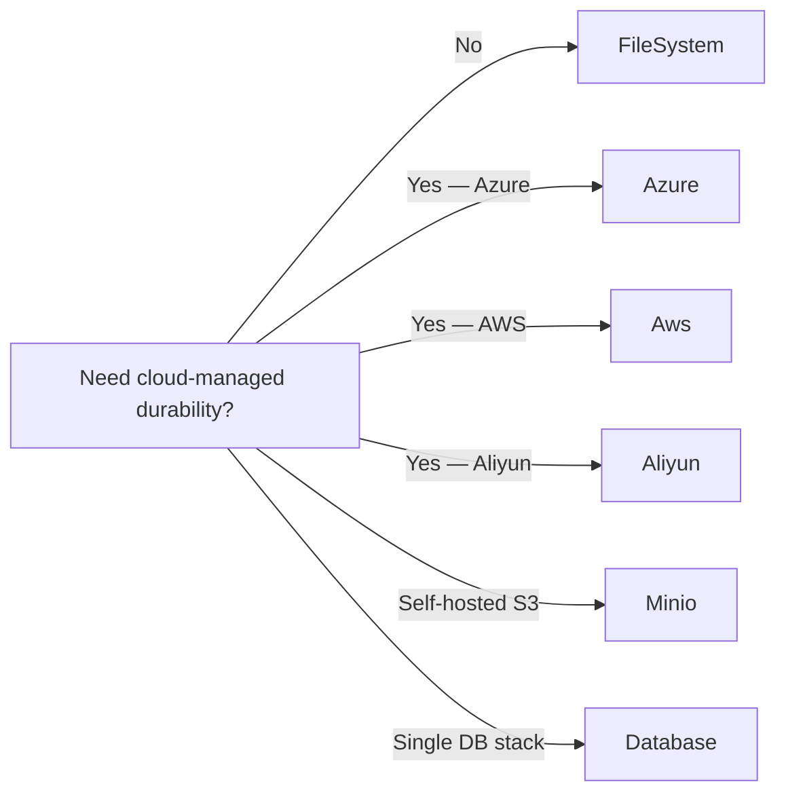

ABP's BLOB Storing abstraction lets a single application talk to many
storage providers through a uniform `IBlobContainer` interface. Each
container is named, optionally typed, optionally tenant-isolated, and
backed by exactly one provider — but the *defaults* are inherited from
a special `default` container so most apps only configure that one
container and override per-purpose containers when they need a
different backend. This page documents `AbpBlobStoringOptions`, the
container fallback chain, and the configuration keys that each
first-party provider reads.

## File inventory

| Type | Location |
| --- | --- |
| `AbpBlobStoringOptions` | `framework/src/Volo.Abp.BlobStoring/Volo/Abp/BlobStoring/AbpBlobStoringOptions.cs` |
| `BlobContainerConfiguration` | `framework/src/Volo.Abp.BlobStoring/Volo/Abp/BlobStoring/BlobContainerConfiguration.cs` |
| `BlobContainerConfigurations` | `framework/src/Volo.Abp.BlobStoring/Volo/Abp/BlobStoring/BlobContainerConfigurations.cs` |
| `DefaultContainer` | `framework/src/Volo.Abp.BlobStoring/Volo/Abp/BlobStoring/DefaultContainer.cs` |
| `BlobContainerNameAttribute` | `framework/src/Volo.Abp.BlobStoring/Volo/Abp/BlobStoring/BlobContainerNameAttribute.cs` |
| `AzureBlobProviderConfigurationNames` | `framework/src/Volo.Abp.BlobStoring.Azure/Volo/Abp/BlobStoring/Azure/AzureBlobProviderConfigurationNames.cs` |
| `AwsBlobProviderConfigurationNames` | `framework/src/Volo.Abp.BlobStoring.Aws/Volo/Abp/BlobStoring/Aws/AwsBlobProviderConfigurationNames.cs` |
| `AliyunBlobProviderConfigurationNames` | `framework/src/Volo.Abp.BlobStoring.Aliyun/Volo/Abp/BlobStoring/Aliyun/AliyunBlobProviderConfigurationNames.cs` |
| `MinioBlobProviderConfigurationNames` | `framework/src/Volo.Abp.BlobStoring.Minio/Volo/Abp/BlobStoring/Minio/MinioBlobProviderConfigurationNames.cs` |
| `FileSystemBlobProviderConfigurationNames` | `framework/src/Volo.Abp.BlobStoring.FileSystem/Volo/Abp/BlobStoring/FileSystem/FileSystemBlobProviderConfigurationNames.cs` |

## Top-level shape

`AbpBlobStoringOptions` contains exactly one property:

```csharp
public class AbpBlobStoringOptions
{
    public BlobContainerConfigurations Containers { get; }
}
```

`Containers` is a wrapper around a `Dictionary<string, BlobContainerConfiguration>`
that always seeds a `default` entry on construction. Every other entry
is created lazily on first `Configure(...)` call and uses the
`default` container as its **fallback configuration** — so any key
unset on the named container falls back to whatever you set on
`default`.

## Container resolution chain

```mermaid
flowchart TD
    A[IBlobContainerFactory.Create&lt;T&gt;] --> B{Container name<br/>from [BlobContainerName] attribute}
    B --> C[BlobContainerConfigurations.GetConfiguration(name)]
    C --> D{Found?}
    D -->|yes| E[Named BlobContainerConfiguration]
    D -->|no| F[default container]
    E --> G[BlobContainerConfiguration.GetConfigurationOrNull(key)]
    G --> H{Found?}
    H -->|yes| I[Return value]
    H -->|no| J[Fallback to default container]
    J --> I
```

`BlobContainerConfiguration.GetConfigurationOrNull` walks
`_properties`, then the fallback configuration (the `default`
container), then the supplied default.

## BlobContainerConfiguration

| Property | Type | Default | Description |
| --- | --- | --- | --- |
| `ProviderType` | `Type?` | `null` | The `IBlobProvider` implementation. Required on the default container; per-container types override. |
| `IsMultiTenant` | `bool` | `true` | When `false` the container is shared across all tenants. Ignored when multi-tenancy is off. |
| `NamingNormalizers` | `ITypeList<IBlobNamingNormalizer>` | empty | Pipeline of name normalisers (lowercasing, slugging, etc.). |

Per-container, free-form properties are written via
`SetConfiguration(name, value)` and read back with
`GetConfigurationOrDefault<T>(name)`. Provider modules expose their
keys via `*ConfigurationNames` static classes (see below).

## Configuring containers in code

```csharp
public class MyStorageModule : AbpModule
{
    public override void ConfigureServices(ServiceConfigurationContext context)
    {
        Configure<AbpBlobStoringOptions>(options =>
        {
            // 1) Default container — used as fallback for all others
            options.Containers.ConfigureDefault(container =>
            {
                container.UseFileSystem(fs =>
                {
                    fs.BasePath = "C:\\my-app-blobs";
                });
            });

            // 2) A profile-pictures container that overrides only the path
            options.Containers.Configure<ProfilePicturesContainer>(container =>
            {
                container.IsMultiTenant = false;
                container.SetConfiguration(
                    FileSystemBlobProviderConfigurationNames.BasePath,
                    "C:\\my-app-profile-pictures");
            });
        });
    }
}

[BlobContainerName("profile-pictures")]
public class ProfilePicturesContainer { }
```

`UseFileSystem`, `UseAzure`, `UseAws`, `UseAliyun`, `UseMinio`, and
`UseDatabase` are extension methods that set `ProviderType` and
forward known keys onto `SetConfiguration` so you do not have to type
the string keys by hand.

## Provider key reference

### Azure (`Volo.Abp.BlobStoring.Azure`)

| Constant | String key | Type |
| --- | --- | --- |
| `AzureBlobProviderConfigurationNames.ConnectionString` | `Azure.ConnectionString` | `string` |
| `AzureBlobProviderConfigurationNames.ContainerName` | `Azure.ContainerName` | `string` |
| `AzureBlobProviderConfigurationNames.CreateContainerIfNotExists` | `Azure.CreateContainerIfNotExists` | `bool` |

### AWS S3 (`Volo.Abp.BlobStoring.Aws`)

| String key | Type | Notes |
| --- | --- | --- |
| `Aws.AccessKeyId` | `string` | Optional when `UseCredentials=true`. |
| `Aws.SecretAccessKey` | `string` | |
| `Aws.UseCredentials` | `bool` | Use the AWS SDK credential chain. |
| `Aws.UseTemporaryCredentials` | `bool` | Use STS `AssumeRole`. |
| `Aws.UseTemporaryFederatedCredentials` | `bool` | STS federation tokens. |
| `Aws.ProfileName` | `string` | Local credential profile. |
| `Aws.ProfilesLocation` | `string` | Override `~/.aws/credentials` path. |
| `Aws.DurationSeconds` | `int` | Session token TTL. |
| `Aws.TemporaryCredentialsCacheKey` | `string` | Cache key for STS calls. |
| `Aws.Name` | `string` | Display name for federation. |
| `Aws.Policy` | `string` | Inline session policy. |
| `Aws.Region` | `string` | AWS region (`us-east-1`, …). |
| `Aws.ContainerName` | `string` | S3 bucket name. |
| `Aws.CreateContainerIfNotExists` | `bool` | |

### Aliyun OSS (`Volo.Abp.BlobStoring.Aliyun`)

| String key | Type |
| --- | --- |
| `Aliyun.AccessKeyId` | `string` |
| `Aliyun.AccessKeySecret` | `string` |
| `Aliyun.Endpoint` | `string` |
| `Aliyun.UseSecurityTokenService` | `bool` |
| `Aliyun.RegionId` | `string` |
| `Aliyun.RoleArn` | `string` |
| `Aliyun.RoleSessionName` | `string` |
| `Aliyun.DurationSeconds` | `int` |
| `Aliyun.Policy` | `string` |
| `Aliyun.ContainerName` | `string` |
| `Aliyun.CreateContainerIfNotExists` | `bool` |
| `Aliyun.TemporaryCredentialsCacheKey` | `string` |

### Minio (`Volo.Abp.BlobStoring.Minio`)

| String key | Type |
| --- | --- |
| `Minio.BucketName` | `string` |
| `Minio.EndPoint` | `string` |
| `Minio.AccessKey` | `string` |
| `Minio.SecretKey` | `string` |
| `Minio.WithSSL` | `bool` |
| `Minio.CreateBucketIfNotExists` | `bool` |

### FileSystem (`Volo.Abp.BlobStoring.FileSystem`)

| String key | Type |
| --- | --- |
| `FileSystem.BasePath` | `string` |
| `FileSystem.AppendContainerNameToBasePath` | `bool` (default `true`) |

### Database

`Volo.Abp.BlobStoring.Database` reuses the application's connection
string (`ConnectionStrings:Default` unless you override with the
`AbpBlobStoring` connection-string name) and stores BLOBs in the
`AbpBlobs` table. There are no per-container provider keys beyond
the standard `ProviderType = typeof(DatabaseBlobProvider)`.

## Sample appsettings.json bindings

`AbpBlobStoringOptions` itself is not typically populated from JSON;
the provider keys are. The conventional layout when you want
configuration-driven secrets is to surface a custom section and
forward it to `SetConfiguration` in your module:

```json
{
  "AbpBlobStoring": {
    "Default": {
      "Provider": "Azure",
      "Azure": {
        "ConnectionString": "DefaultEndpointsProtocol=https;...",
        "ContainerName": "my-app-default",
        "CreateContainerIfNotExists": true
      }
    },
    "ProfilePictures": {
      "Provider": "FileSystem",
      "FileSystem": {
        "BasePath": "/var/lib/myapp/profile-pictures",
        "AppendContainerNameToBasePath": false
      }
    }
  }
}
```

Your module then reads and binds explicitly:

```csharp
var configuration = context.Services.GetConfiguration();
var defaultSection = configuration.GetSection("AbpBlobStoring:Default:Azure");

Configure<AbpBlobStoringOptions>(options =>
{
    options.Containers.ConfigureDefault(container =>
    {
        container.UseAzure(azure =>
        {
            azure.ConnectionString = defaultSection["ConnectionString"];
            azure.ContainerName = defaultSection["ContainerName"];
            azure.CreateContainerIfNotExists =
                defaultSection.GetValue<bool>("CreateContainerIfNotExists");
        });
    });
});
```

## Multi-tenancy semantics

`BlobContainerConfiguration.IsMultiTenant = true` (the default) tells
the provider to prefix BLOB names / containers with the current
tenant's id. The exact strategy depends on the provider:

- **Azure / AWS / Aliyun / Minio** prefix the `ContainerName` /
  `BucketName` with a normalised tenant id.
- **FileSystem** adds a `tenants/{tenantId}` segment under `BasePath`.
- **Database** filters the `AbpBlobs` table by `TenantId`.

Setting `IsMultiTenant = false` is appropriate for system-wide content
(e.g. product catalogue images shared across all tenants).

## Gotchas

- The `default` container is created in `BlobContainerConfigurations`'
  constructor with no `ProviderType`. If you never call
  `ConfigureDefault`, any container that does not explicitly set
  `ProviderType` will throw at first save.
- `SetConfiguration` calls `Check.NotNull` on the value — you cannot
  set a property to `null` via this API, only via direct property
  access on the strongly-typed builder methods.
- `IsMultiTenant` is read by the *provider*, not by the BLOB
  abstraction. A custom provider that does not respect the flag will
  silently mix tenant data.
- `Containers.Configure<TContainer>(...)` resolves the container name
  via `BlobContainerNameAttribute.GetContainerName<TContainer>()`. If
  you forget the attribute, the FQN of the class becomes the
  container name and your provider may reject it (Azure forbids
  uppercase characters and dots in container names).
- Naming normalisers run in the order they are listed in
  `NamingNormalizers`; the canonical recipe is
  `LowerCaseNamingNormalizer` followed by a provider-specific one.

## Picking a provider



Notes:

- The **FileSystem** provider is fine for single-instance hosts but
  cannot serve content directly through CDN without a sidecar; for
  multi-instance hosts use a shared mount or switch to one of the
  cloud providers.
- The **Database** provider keeps everything in one connection string
  but adds I/O pressure to your main database; bench it against a
  realistic upload profile before committing.
- **Azure** and **AWS** support presigned URLs out of the box; ABP's
  abstraction does not expose presigning, so you call the underlying
  SDK directly when you need it.

## Reading BLOBs from a typed container

The typed entry point matches the `[BlobContainerName]` attribute on
the container marker class:

```csharp
public class AvatarService : ITransientDependency
{
    private readonly IBlobContainer<ProfilePicturesContainer> _container;

    public AvatarService(IBlobContainer<ProfilePicturesContainer> container)
    {
        _container = container;
    }

    public Task SaveAsync(Guid userId, Stream stream)
        => _container.SaveAsync(userId.ToString("N"), stream, overrideExisting: true);
}
```

The factory uses
`IBlobContainerFactory.Create(BlobContainerNameAttribute.GetContainerName<TContainer>())`
under the hood and walks the resolution chain illustrated above.

## Cross-references

- [Connection strings](/reference/config/connection-strings) — for the
  database provider's `AbpBlobStoring` connection-string name.
- [Multi-tenancy configuration](/reference/config/multi-tenancy-config)
  for `IsEnabled` semantics that feed `IsMultiTenant`.
- [Options pattern](/reference/config/options-pattern) for the
  `Configure<AbpBlobStoringOptions>` plumbing.
- [Module options catalogue](/reference/config/module-options).
