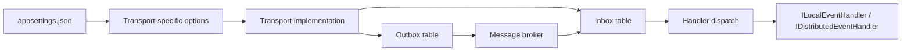
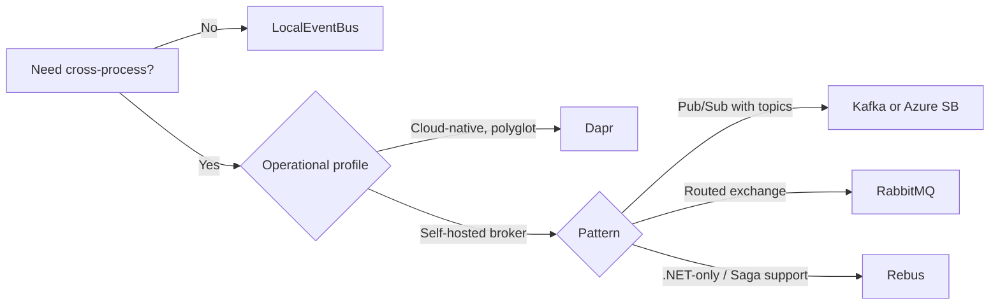

ABP exposes two event buses: a local, in-process bus and a distributed
bus. The local bus has no configuration surface — it relies on
convention-based handler discovery — but the distributed bus has a
rich options graph because it has to deal with a transport, a topic /
exchange topology, optional transactional outbox / inbox tables, and
per-event-type routing. This page documents the canonical option
classes for the framework's five built-in transports and the
`OutboxConfig` / `InboxConfig` entries that turn the bus into an
at-least-once message pipeline.

## File inventory

| Type | Location |
| --- | --- |
| `AbpDistributedEventBusOptions` | `framework/src/Volo.Abp.EventBus.Abstractions/Volo/Abp/EventBus/Distributed/AbpDistributedEventBusOptions.cs` |
| `OutboxConfig` | `framework/src/Volo.Abp.EventBus.Abstractions/Volo/Abp/EventBus/Distributed/OutboxConfig.cs` |
| `InboxConfig` | `framework/src/Volo.Abp.EventBus.Abstractions/Volo/Abp/EventBus/Distributed/InboxConfig.cs` |
| `AbpRabbitMqOptions` | `framework/src/Volo.Abp.RabbitMQ/Volo/Abp/RabbitMQ/AbpRabbitMqOptions.cs` |
| `RabbitMqConnections` | `framework/src/Volo.Abp.RabbitMQ/Volo/Abp/RabbitMQ/RabbitMqConnections.cs` |
| `AbpRabbitMqEventBusOptions` | `framework/src/Volo.Abp.EventBus.RabbitMQ/Volo/Abp/EventBus/RabbitMq/AbpRabbitMqEventBusOptions.cs` |
| `AbpKafkaOptions` | `framework/src/Volo.Abp.Kafka/Volo/Abp/Kafka/AbpKafkaOptions.cs` |
| `AbpKafkaEventBusOptions` | `framework/src/Volo.Abp.EventBus.Kafka/Volo/Abp/EventBus/Kafka/AbpKafkaEventBusOptions.cs` |
| `AbpAzureServiceBusOptions` | `framework/src/Volo.Abp.AzureServiceBus/Volo/Abp/AzureServiceBus/AbpAzureServiceBusOptions.cs` |
| `AbpAzureEventBusOptions` | `framework/src/Volo.Abp.EventBus.Azure/Volo/Abp/EventBus/Azure/AbpAzureEventBusOptions.cs` |
| `AbpDaprEventBusOptions` | `framework/src/Volo.Abp.EventBus.Dapr/Volo/Abp/EventBus/Dapr/AbpDaprEventBusOptions.cs` |
| `AbpRebusEventBusOptions` | `framework/src/Volo.Abp.EventBus.Rebus/Volo/Abp/EventBus/Rebus/AbpRebusEventBusOptions.cs` |

## Local event bus

The local event bus is implemented by `LocalEventBus` in
`Volo.Abp.EventBus`. It has **no options class**; handlers are
discovered automatically via the `ITransientDependency` /
`ILocalEventHandler<T>` interfaces and registered through ABP's
conventional registration. No `appsettings.json` keys participate.
Use the local bus for synchronous, in-process notifications.

## Distributed event bus



### AbpDistributedEventBusOptions

| Property | Type | Default | Description |
| --- | --- | --- | --- |
| `Handlers` | `ITypeList<IEventHandler>` | empty | Manually registered handler types (most handlers register via DI conventions; this list is the explicit escape hatch). |
| `Outboxes` | `OutboxConfigDictionary` | empty | Named outbox configurations. Each entry maps a database to a publish strategy. |
| `Inboxes` | `InboxConfigDictionary` | empty | Named inbox configurations. |

```csharp
Configure<AbpDistributedEventBusOptions>(options =>
{
    options.Outboxes.Configure("default", config =>
    {
        config.UseDbContext<MyDbContext>();
        config.IsSendingEnabled = true;
        config.Selector = type => type.Namespace?.StartsWith("MyApp.Events") == true;
    });

    options.Inboxes.Configure("default", config =>
    {
        config.UseDbContext<MyDbContext>();
        config.IsProcessingEnabled = true;
    });
});
```

### OutboxConfig

| Property | Type | Default | Description |
| --- | --- | --- | --- |
| `Name` | `string` | (ctor) | The dictionary key. |
| `DatabaseName` | `string` | (set by `UseDbContext<T>()`) | The connection string name the outbox writer uses. |
| `ImplementationType` | `Type` | `null` | Concrete `IEventOutbox` type. |
| `Selector` | `Func<Type, bool>` | `null` | Event types that should be routed via this outbox. |
| `IsSendingEnabled` | `bool` | `true` | Set `false` on enqueue-only hosts that never publish. |

### InboxConfig

| Property | Type | Default | Description |
| --- | --- | --- | --- |
| `Name` | `string` | (ctor) | Dictionary key. |
| `DatabaseName` | `string` | (set by `UseDbContext<T>()`) | Connection string name. |
| `ImplementationType` | `Type` | `null` | Concrete `IEventInbox` type. |
| `EventSelector` | `Func<Type, bool>` | `null` | Events to accept into this inbox. |
| `HandlerSelector` | `Func<Type, bool>` | `null` | Handlers to dispatch through this inbox. |
| `IsProcessingEnabled` | `bool` | `true` | Set `false` to pause processing without changing the schema. |

The outbox / inbox tables live alongside your domain data so the
publish is part of the same database transaction as the change that
raised the event.

## RabbitMQ

### AbpRabbitMqOptions

| Property | Type | Default | Description |
| --- | --- | --- | --- |
| `Connections` | `RabbitMqConnections` | one `Default` entry | Dictionary of named `ConnectionFactory` instances. |

`RabbitMqConnections.Default` is the canonical entry; additional named
connections are looked up by `RabbitMqConnections.GetOrDefault(name)`.

### AbpRabbitMqEventBusOptions

| Property | Type | Default | Description |
| --- | --- | --- | --- |
| `ConnectionName` | `string` | `"Default"` (via fallback) | Which entry in `RabbitMqConnections` to use. |
| `ClientName` | `string` | `null` | Sets the RabbitMQ AMQP `connection_name`. |
| `ExchangeName` | `string` | `null` | The exchange the event bus publishes to. |
| `ExchangeType` | `string` | `"direct"` (via `GetExchangeTypeOrDefault()`) | Direct / fanout / topic / headers. |
| `PrefetchCount` | `ushort?` | `null` | Channel-level `BasicQos.prefetch_count`. |

### appsettings.json for RabbitMQ

```json
{
  "RabbitMQ": {
    "Connections": {
      "Default": {
        "HostName": "rabbit.svc",
        "Port": 5672,
        "UserName": "guest",
        "Password": "guest",
        "VirtualHost": "/"
      }
    },
    "EventBus": {
      "ClientName": "MyApp.HttpApi.Host",
      "ExchangeName": "MyApp",
      "ExchangeType": "direct"
    }
  }
}
```

Module binding:

```csharp
Configure<AbpRabbitMqOptions>(options =>
{
    options.Connections.Default.UserName =
        configuration["RabbitMQ:Connections:Default:UserName"]!;
    options.Connections.Default.Password =
        configuration["RabbitMQ:Connections:Default:Password"]!;
    options.Connections.Default.HostName =
        configuration["RabbitMQ:Connections:Default:HostName"]!;
});

Configure<AbpRabbitMqEventBusOptions>(configuration.GetSection("RabbitMQ:EventBus"));
```

## Kafka

### AbpKafkaOptions

| Property | Type | Default | Description |
| --- | --- | --- | --- |
| `Connections` | `KafkaConnections` | one `Default` entry | Dictionary keyed by name; values are `ClientConfig`-derived. |
| `ConfigureProducer` | `Action<ProducerConfig>` | `null` | Tweak producer config (acks, batching). |
| `ConfigureConsumer` | `Action<ConsumerConfig>` | `null` | Tweak consumer config (auto-offset-reset, etc.). |
| `ConfigureTopic` | `Action<TopicSpecification>` | `null` | Adjust topic creation specs. |

### AbpKafkaEventBusOptions

| Property | Type | Default | Description |
| --- | --- | --- | --- |
| `ConnectionName` | `string` | `null` (falls back to `Default`) | Which Kafka cluster entry to use. |
| `TopicName` | `string` | `null` | The single topic events are written to. |
| `GroupId` | `string` | `null` | Consumer group id for this host. |

### appsettings.json for Kafka

```json
{
  "Kafka": {
    "Connections": {
      "Default": { "BootstrapServers": "kafka:9092" }
    },
    "EventBus": {
      "TopicName": "MyApp",
      "GroupId": "MyApp.HttpApi.Host"
    }
  }
}
```

## Azure Service Bus

### AbpAzureServiceBusOptions

| Property | Type | Default | Description |
| --- | --- | --- | --- |
| `Connections` | `AzureServiceBusConnections` | one `Default` entry | Named connection strings. |

### AbpAzureEventBusOptions

| Property | Type | Default | Description |
| --- | --- | --- | --- |
| `ConnectionName` | `string` | `null` (`Default`) | Connection entry to use. |
| `SubscriberName` | `string` | `null` | The Service Bus subscription this host listens on. |
| `TopicName` | `string` | `null` | The topic events are published to. |
| `IsServiceBusDisabled` | `bool` | `false` | Pause publish / subscribe without removing the module. |

### appsettings.json for Azure Service Bus

```json
{
  "Azure": {
    "ServiceBus": {
      "Connections": {
        "Default": "Endpoint=sb://my-app.servicebus.windows.net/;..."
      },
      "EventBus": {
        "TopicName": "myapp-events",
        "SubscriberName": "myapp-api"
      }
    }
  }
}
```

## Dapr

### AbpDaprEventBusOptions

| Property | Type | Default | Description |
| --- | --- | --- | --- |
| `PubSubName` | `string` | `"pubsub"` | The Dapr pub/sub component name. |

ABP's Dapr event bus reuses Dapr's HTTP sidecar; the endpoint is
configured via `AbpDaprOptions.HttpEndpoint` from the Dapr abstraction
module.

```json
{
  "Dapr": {
    "HttpEndpoint": "http://localhost:3500",
    "EventBus": {
      "PubSubName": "pubsub"
    }
  }
}
```

## Rebus

### AbpRebusEventBusOptions

| Property | Type | Default | Description |
| --- | --- | --- | --- |
| `InputQueueName` | `string` | (required) | The Rebus input queue. |
| `Configurer` | `Action<RebusConfigurer>` | in-memory transport + persistence | Replace with `t => t.UseRabbitMq(...)` or any Rebus transport. |
| `Publish` | `Func<IBus, Type, object, Task>` | `null` (default to `IBus.Publish`) | Custom dispatch (e.g. to honour multi-tenant routing). |

```csharp
Configure<AbpRebusEventBusOptions>(options =>
{
    options.InputQueueName = "MyApp";
    options.Configurer = configure =>
    {
        configure.Transport(t => t.UseRabbitMq("amqp://...", "MyApp"));
        configure.Subscriptions(s => s.StoreInRabbitMq("amqp://...", "subs"));
    };
});
```

## Choosing a transport



## Sample full appsettings.json

```json
{
  "RabbitMQ": {
    "Connections": {
      "Default": {
        "HostName": "rabbit.internal",
        "UserName": "abp",
        "Password": "abp"
      }
    },
    "EventBus": {
      "ClientName": "MyApp.HttpApi.Host",
      "ExchangeName": "MyApp",
      "ExchangeType": "topic"
    }
  },
  "EventBus": {
    "Outboxes": {
      "default": {
        "DatabaseName": "Default",
        "IsSendingEnabled": true
      }
    },
    "Inboxes": {
      "default": {
        "DatabaseName": "Default",
        "IsProcessingEnabled": true
      }
    }
  }
}
```

## Gotchas

- The local event bus does not honour `OutboxConfig` /
  `InboxConfig`. Outbox processing only applies to
  `IDistributedEventBus` publishes.
- `OutboxConfig.IsSendingEnabled=false` lets a host queue events into
  the outbox table but never publish them, which is useful when you
  want a separate worker to drain the table. Pair with
  `IsProcessingEnabled=false` on the same host if it also does not
  consume.
- `AbpRabbitMqEventBusOptions.ExchangeType` must match an existing
  exchange — RabbitMQ will refuse to redeclare an exchange of a
  different type at startup.
- Kafka's `GroupId` is what makes the host a competing consumer.
  Multiple hosts sharing a `GroupId` load-balance partitions;
  different `GroupId`s receive every message.
- `AbpAzureEventBusOptions.IsServiceBusDisabled` short-circuits both
  send and receive, but it does *not* delete the subscription — start
  the host again and the queue drains its backlog.
- Dapr's `PubSubName` must match the `metadata.name` of a `pubsub`
  component file. There is no validation at startup; mismatches
  surface as HTTP 404 from the sidecar at publish time.
- Rebus' `InputQueueName` is also the queue from which the host
  *consumes* — choose unique queue names per logical host or
  competing consumers will share work.

## Cross-references

- [Event publication flow](/flows/event-publication)
- [Options pattern](/reference/config/options-pattern)
- [Connection strings](/reference/config/connection-strings) — outbox /
  inbox tables live in the database identified by `DatabaseName`.
- [Background jobs configuration](/reference/config/background-jobs-config)
  for an alternative at-least-once messaging path.
- [Module options catalogue](/reference/config/module-options).
