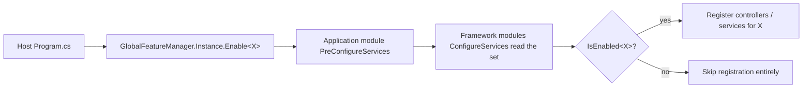

Global features in ABP are *compile-time-style* feature toggles
configured **before the dependency-injection container is built**. The
single static `GlobalFeatureManager.Instance` holds a set of enabled
feature names; modules consult that set during
`ConfigureServices` to decide whether to register types, expose
controllers, or activate authorization handlers. Because the decision
is made so early, the configuration entry point is not
`appsettings.json` — it is a callback inside your application module's
`PreConfigureServices`. This page documents the manager API, the
recommended `GlobalFeatureConfigurator.Configure(...)` pattern, the
attributes that consume the flags, and the framework subsystems that
respect them.

## File inventory

| Type | Location |
| --- | --- |
| `GlobalFeatureManager` | `framework/src/Volo.Abp.GlobalFeatures/Volo/Abp/GlobalFeatures/GlobalFeatureManager.cs` |
| `GlobalFeature` (abstract) | `framework/src/Volo.Abp.GlobalFeatures/Volo/Abp/GlobalFeatures/GlobalFeature.cs` |
| `GlobalModuleFeatures` (abstract) | `framework/src/Volo.Abp.GlobalFeatures/Volo/Abp/GlobalFeatures/GlobalModuleFeatures.cs` |
| `GlobalFeatureNameAttribute` | `framework/src/Volo.Abp.GlobalFeatures/Volo/Abp/GlobalFeatures/GlobalFeatureNameAttribute.cs` |
| `RequiresGlobalFeatureAttribute` | `framework/src/Volo.Abp.GlobalFeatures/Volo/Abp/GlobalFeatures/RequiresGlobalFeatureAttribute.cs` |
| `RequireGlobalFeaturesSimpleStateChecker` | `framework/src/Volo.Abp.GlobalFeatures/Volo/Abp/GlobalFeatures/RequireGlobalFeaturesSimpleStateChecker.cs` |
| `GlobalFeatureInterceptor` | `framework/src/Volo.Abp.GlobalFeatures/Volo/Abp/GlobalFeatures/GlobalFeatureInterceptor.cs` |
| `AbpServiceConvention` (MVC consumer) | `framework/src/Volo.Abp.AspNetCore.Mvc/Volo/Abp/AspNetCore/Mvc/Conventions/AbpServiceConvention.cs` |
| `AbpApplicationConfigurationAppService` (client consumer) | `framework/src/Volo.Abp.AspNetCore.Mvc/Volo/Abp/AspNetCore/Mvc/ApplicationConfigurations/AbpApplicationConfigurationAppService.cs` |

## Why static?



Because controllers, type-list-driven services and validators are
*added to the service collection* at startup, flipping a global feature
at runtime would mean re-running module wiring — which ABP does not
support. `GlobalFeatureManager.Instance` is therefore a process-wide
singleton initialised before the container is built.

## GlobalFeatureManager

The complete API surface:

```csharp
public class GlobalFeatureManager
{
    public static GlobalFeatureManager Instance { get; protected set; }
        = new GlobalFeatureManager();

    public Dictionary<object, object> Configuration { get; }
    public GlobalModuleFeaturesDictionary Modules { get; }

    public bool IsEnabled<TFeature>();
    public bool IsEnabled(Type featureType);
    public bool IsEnabled(string featureName);

    public void Enable<TFeature>();
    public void Enable(Type featureType);
    public void Enable(string featureName);

    public void Disable<TFeature>();
    public void Disable(Type featureType);
    public void Disable(string featureName);

    public IEnumerable<string> GetEnabledFeatureNames();
}
```

`Modules` groups features by module (`GlobalModuleFeatures` subclasses
such as `CmsKitFeatures`). `Configuration` is a free-form bag where
feature owners can stash arbitrary per-feature data — for example, a
URL template the feature uses.

## Recommended call site

The recommended pattern is to enable features in `PreConfigureServices`
of your application contracts module, so that every downstream module
sees the final set:

```csharp
public class MyAppApplicationContractsModule : AbpModule
{
    public override void PreConfigureServices(ServiceConfigurationContext context)
    {
        GlobalFeatureManager.Instance.Modules.CmsKit(cms =>
        {
            cms.Blogs.Enable();
            cms.Comments.Enable();
            cms.Tags.Enable();
        });

        // Or directly by feature type:
        GlobalFeatureManager.Instance.Enable<MyCustomFeature>();
    }
}
```

ABP's product templates expose static `GlobalFeatureConfigurator`
helper classes inside each module pair (e.g.
`CmsKitGlobalFeatureConfigurator`) — wrappers that call
`GlobalFeatureManager.Instance.Modules.CmsKit(...)` so consumers do
not have to remember which module exposes which feature group.

```csharp
public static class CmsKitGlobalFeatureConfigurator
{
    private static readonly object SyncLock = new object();
    private static bool _configured;

    public static void Configure(Action<CmsKitGlobalFeature> configure)
    {
        lock (SyncLock)
        {
            if (_configured) return;
            _configured = true;

            GlobalFeatureManager.Instance.Modules.CmsKit(configure);
        }
    }
}
```

## Defining a feature

A feature type must derive from `GlobalFeature` (no abstract members
other than what `GlobalFeature` already declares) and carry a
`[GlobalFeatureName]` attribute:

```csharp
[GlobalFeatureName(Name)]
public class BlogsFeature : GlobalFeature
{
    public const string Name = "CmsKit.Blogs";

    public BlogsFeature(CmsKitGlobalFeature module) : base(module) { }
}
```

The matching module group:

```csharp
public class CmsKitGlobalFeature : GlobalModuleFeatures
{
    public CmsKitGlobalFeature(GlobalFeatureManager featureManager)
        : base(featureManager)
    {
        AddFeature(Blogs = new BlogsFeature(this));
        AddFeature(Comments = new CommentsFeature(this));
    }

    public BlogsFeature Blogs { get; }
    public CommentsFeature Comments { get; }
}
```

## How features gate behaviour

### Service registration

```csharp
public override void ConfigureServices(ServiceConfigurationContext context)
{
    if (GlobalFeatureManager.Instance.IsEnabled<BlogsFeature>())
    {
        context.Services.AddTransient<IBlogManager, BlogManager>();
        context.Services.AddTransient<IBlogRepository, EfCoreBlogRepository>();
    }
}
```

### Controllers and remote services

`AbpServiceConvention.IsRemoteService(...)` calls
`GlobalFeatureHelper.IsGlobalFeatureEnabled(controllerType)`, which
reads the `[RequiresGlobalFeature]` attribute on the controller type
and returns `GlobalFeatureManager.Instance.IsEnabled(featureName)`.
Disabled controllers are hidden from the auto-routing convention and
from generated `dynamic-http-proxy` clients.

```csharp
[RequiresGlobalFeature(typeof(BlogsFeature))]
public class BlogController : AbpController { }
```

### Authorization

`RequireGlobalFeaturesSimpleStateChecker` is the permission-state
checker that disables a permission unless all of its required global
features are enabled. The permission definition provider attaches
this checker via:

```csharp
myGroup.AddPermission("Blogs.Create")
    .RequireGlobalFeatures(typeof(BlogsFeature));
```

If `BlogsFeature` is off, the permission is reported as `disabled`
to the client through `AbpApplicationConfigurationAppService`, so the
UI hides the relevant menu items.

### Method interception

`GlobalFeatureInterceptor` is registered on application services
through `GlobalFeatureInterceptorRegistrar` (see
`AbpGlobalFeaturesModule.PreConfigureServices`):

```csharp
context.Services.OnRegistered(GlobalFeatureInterceptorRegistrar.RegisterIfNeeded);
```

Calls into methods decorated with `[RequiresGlobalFeature(...)]` throw
`AbpGlobalFeatureNotEnabledException` when the feature is off — even
if the framework's MVC layer is bypassed (e.g. via direct DI calls).

## Reading at runtime

The simplest read paths:

```csharp
if (GlobalFeatureManager.Instance.IsEnabled<BlogsFeature>())
{
    // ...
}

// Or by feature name string:
GlobalFeatureManager.Instance.IsEnabled("CmsKit.Blogs");
```

The client-side configuration endpoint reports the full list via
`AbpApplicationConfigurationAppService` so SPA / Blazor clients can
also branch on enabled features:

```csharp
foreach (var enabledFeatureName in GlobalFeatureManager.Instance.GetEnabledFeatureNames())
{
    result.GlobalFeatures.EnabledFeatures.Add(enabledFeatureName);
}
```

## No appsettings.json binding

There is intentionally no JSON binding for global features. The
manager is static and configured in code so that:

- module initialisation order is preserved (the manager is read
  *during* `ConfigureServices`),
- the set is deterministic across host instances (no environment-
  specific drift), and
- the choice is reflected in generated client artefacts (proxies, menu
  entries) at build time.

If you need configuration-driven flags, read `IConfiguration` inside
`PreConfigureServices` and forward to `GlobalFeatureManager.Instance`:

```csharp
public override void PreConfigureServices(ServiceConfigurationContext context)
{
    var configuration = context.Services.GetConfiguration();
    if (configuration.GetValue<bool>("Features:Blogs"))
    {
        GlobalFeatureManager.Instance.Enable<BlogsFeature>();
    }
}
```

## Lifecycle diagram

```mermaid
sequenceDiagram
    participant Program as Program.cs
    participant App as App module (PreConfigureServices)
    participant Mgr as GlobalFeatureManager.Instance
    participant Mod as Framework module (ConfigureServices)
    Program->>App: AbpApplicationFactory.Create&lt;AppModule&gt;
    App->>Mgr: Enable&lt;X&gt;
    Mgr-->>App: EnabledFeatures += "X"
    App->>Mod: dependency graph proceeds
    Mod->>Mgr: IsEnabled&lt;X&gt;
    Mgr-->>Mod: true
    Mod->>Mod: Register controllers / services for X
```

## Gotchas

- The manager is **static** and shared across the process. Tests that
  enable a feature must explicitly disable it in `Dispose` or use a
  fresh process to avoid bleed-through.
- Enabling a feature *after* `ConfigureServices` has run for the
  module that gates on it has no effect — the services were already
  decided. The latest safe point is `PreConfigureServices` of the
  application module.
- `GlobalFeatureNameAttribute.GetName(...)` falls back to the FQN of
  the feature type if the attribute is missing. Renaming feature
  types without the attribute breaks comparisons against persisted
  feature names.
- `GlobalFeatureInterceptor` intercepts virtual methods on
  application services. Sealed types or non-virtual methods bypass
  the check; rely on the controller-level convention as well.
- `GlobalFeatureManager.Instance` can be replaced (the setter is
  `protected set`) but only by deriving the manager and using
  reflection — almost no app should do this.

## Cross-references

- [Authorization flow](/flows/authorization-flow) for how permission
  state checkers fold in `RequireGlobalFeaturesSimpleStateChecker`.
- [Application startup flow](/flows/application-startup) for the
  module hook ordering that constrains when features must be set.
- [Options pattern](/reference/config/options-pattern).
- [Module options catalogue](/reference/config/module-options).
