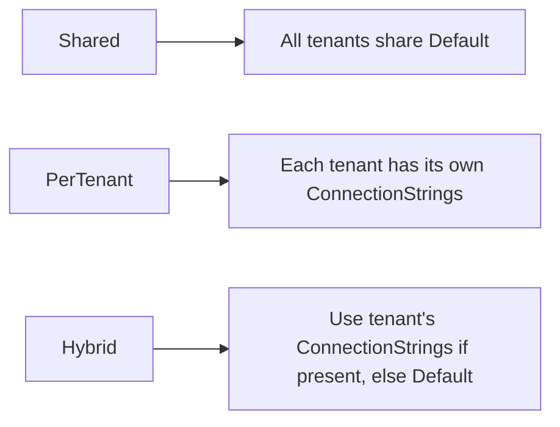
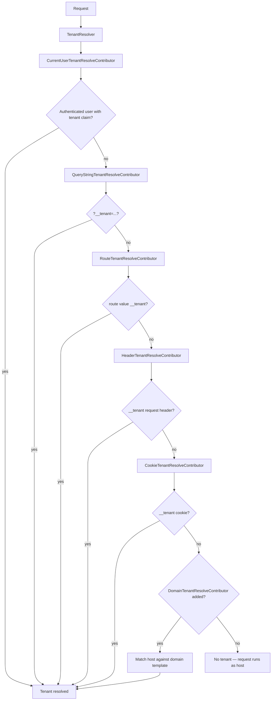
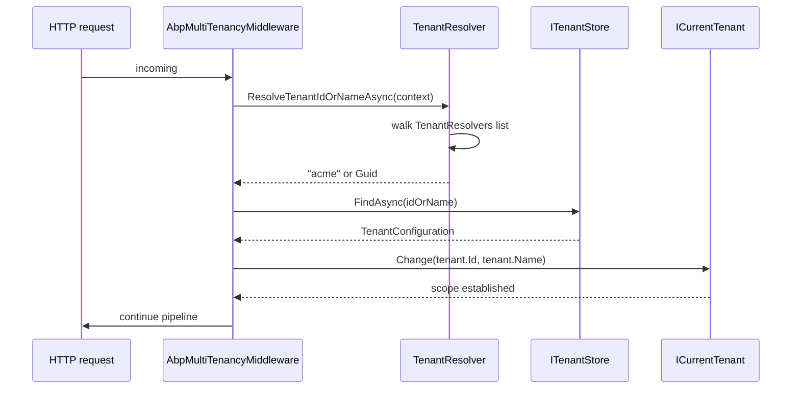

ABP's multi-tenancy is opt-in: nothing in the framework treats requests
as tenanted until you flip `AbpMultiTenancyOptions.IsEnabled` to
`true`. Once enabled, the framework runs a *tenant resolver chain* on
every request to pick a `__tenant` identifier from the URL, header,
cookie, route, form or claim — and persists that decision into
`ICurrentTenant.Id`. This page documents the three central options
classes (`AbpMultiTenancyOptions`, `AbpTenantResolveOptions`,
`AbpDefaultTenantStoreOptions`), the ASP.NET layer's
`AbpAspNetCoreMultiTenancyOptions`, and how each piece binds to
`appsettings.json`.

## File inventory

| Type | Location |
| --- | --- |
| `AbpMultiTenancyOptions` | `framework/src/Volo.Abp.MultiTenancy/Volo/Abp/MultiTenancy/AbpMultiTenancyOptions.cs` |
| `MultiTenancyDatabaseStyle` | `framework/src/Volo.Abp.MultiTenancy.Abstractions/Volo/Abp/MultiTenancy/MultiTenancyDatabaseStyle.cs` |
| `AbpTenantResolveOptions` | `framework/src/Volo.Abp.MultiTenancy/Volo/Abp/MultiTenancy/AbpTenantResolveOptions.cs` |
| `AbpDefaultTenantStoreOptions` | `framework/src/Volo.Abp.MultiTenancy/Volo/Abp/MultiTenancy/ConfigurationStore/AbpDefaultTenantStoreOptions.cs` |
| `TenantConfiguration` | `framework/src/Volo.Abp.MultiTenancy.Abstractions/Volo/Abp/MultiTenancy/TenantConfiguration.cs` |
| `TenantResolverConsts` | `framework/src/Volo.Abp.MultiTenancy.Abstractions/Volo/Abp/MultiTenancy/TenantResolverConsts.cs` |
| `AbpAspNetCoreMultiTenancyOptions` | `framework/src/Volo.Abp.AspNetCore.MultiTenancy/Volo/Abp/AspNetCore/MultiTenancy/AbpAspNetCoreMultiTenancyOptions.cs` |
| `CurrentUserTenantResolveContributor` | `framework/src/Volo.Abp.MultiTenancy/Volo/Abp/MultiTenancy/CurrentUserTenantResolveContributor.cs` |
| `QueryStringTenantResolveContributor` | `framework/src/Volo.Abp.AspNetCore.MultiTenancy/Volo/Abp/AspNetCore/MultiTenancy/QueryStringTenantResolveContributor.cs` |
| `RouteTenantResolveContributor` | `framework/src/Volo.Abp.AspNetCore.MultiTenancy/Volo/Abp/AspNetCore/MultiTenancy/RouteTenantResolveContributor.cs` |
| `HeaderTenantResolveContributor` | `framework/src/Volo.Abp.AspNetCore.MultiTenancy/Volo/Abp/AspNetCore/MultiTenancy/HeaderTenantResolveContributor.cs` |
| `CookieTenantResolveContributor` | `framework/src/Volo.Abp.AspNetCore.MultiTenancy/Volo/Abp/AspNetCore/MultiTenancy/CookieTenantResolveContributor.cs` |
| `DomainTenantResolveContributor` | `framework/src/Volo.Abp.AspNetCore.MultiTenancy/Volo/Abp/AspNetCore/MultiTenancy/DomainTenantResolveContributor.cs` |

## The master switch

```csharp
public class AbpMultiTenancyOptions
{
    public bool IsEnabled { get; set; }
    public MultiTenancyDatabaseStyle DatabaseStyle { get; set; }
        = MultiTenancyDatabaseStyle.Hybrid;
}
```

| Key | Type | Default | Environment variable | Description |
| --- | --- | --- | --- | --- |
| `MultiTenancy:IsEnabled` | `bool` | `false` | `MultiTenancy__IsEnabled` | Master switch. Every multi-tenancy-aware filter (data filter, settings, blob storing) consults `ICurrentTenant.IsAvailable` which short-circuits to `false` when the flag is off. |
| `MultiTenancy:DatabaseStyle` | `MultiTenancyDatabaseStyle` | `Hybrid` | `MultiTenancy__DatabaseStyle` | `Shared`, `PerTenant`, or `Hybrid` (= `Shared | PerTenant`). Drives `MultiTenantConnectionStringResolver` behaviour. |



## Tenant resolver chain

`AbpTenantResolveOptions.TenantResolvers` is a `List<ITenantResolveContributor>`
walked in order on every request. The first contributor that returns a
non-null `TenantIdOrName` wins.

`AbpMultiTenancyModule.ConfigureServices` seeds the list with a single
entry — `CurrentUserTenantResolveContributor` — at index 0:

```csharp
Configure<AbpTenantResolveOptions>(options =>
{
    options.TenantResolvers.Insert(0, new CurrentUserTenantResolveContributor());
});
```

`AbpAspNetCoreMultiTenancyModule` appends the HTTP-layer contributors:

```csharp
Configure<AbpTenantResolveOptions>(options =>
{
    options.TenantResolvers.Add(new QueryStringTenantResolveContributor());
    options.TenantResolvers.Add(new RouteTenantResolveContributor());
    options.TenantResolvers.Add(new HeaderTenantResolveContributor());
    options.TenantResolvers.Add(new CookieTenantResolveContributor());
});
```

`DomainTenantResolveContributor` is **not** added by default — it is
opt-in because it requires a domain template (e.g. `{0}.myapp.com`).



The literal key for every contributor is **`__tenant`**, defined as
`TenantResolverConsts.DefaultTenantKey` and surfaced through
`AbpAspNetCoreMultiTenancyOptions.TenantKey`.

## AbpAspNetCoreMultiTenancyOptions

| Property | Type | Default | Description |
| --- | --- | --- | --- |
| `TenantKey` | `string` | `"__tenant"` | The query-string parameter / header / cookie / route value key used by every HTTP contributor. |
| `MultiTenancyMiddlewareErrorPageBuilder` | `Func<HttpContext, Exception, Task<bool>>` | Built-in handler | Renders the *Tenant not found* / *Tenant inactive* page; can return `true` to stop the pipeline. |

The default error builder also deletes the tenant cookie and signs the
user out of cookie authentication if the only resolver that fired was
`CurrentUserTenantResolveContributor` — this prevents loops where a
stale claim keeps re-resolving an inactive tenant.

## Tenant store

When you do not use the Tenant Management module, ABP reads tenants
from `appsettings.json` via `AbpDefaultTenantStoreOptions`:

```csharp
public class AbpDefaultTenantStoreOptions
{
    public TenantConfiguration[] Tenants { get; set; } = Array.Empty<TenantConfiguration>();
}
```

`AbpMultiTenancyModule.ConfigureServices` binds the whole
`IConfiguration` root onto this options class, so the JSON shape is:

```json
{
  "Tenants": [
    {
      "Id": "33333333-3333-3333-3333-333333333333",
      "Name": "acme",
      "IsActive": true,
      "ConnectionStrings": {
        "Default": "Server=db-acme;Database=Acme;...",
        "AbpAuditLogging": "Server=audit;Database=Acme_Audit;..."
      }
    },
    {
      "Id": "44444444-4444-4444-4444-444444444444",
      "Name": "globex",
      "IsActive": true
    }
  ]
}
```

Each entry maps to `TenantConfiguration`:

| Field | Type | Default | Description |
| --- | --- | --- | --- |
| `Id` | `Guid` | (required) | Stable tenant identifier. |
| `Name` | `string` | (required) | URL-friendly tenant name. Matched by `CurrentUserTenantResolveContributor` and HTTP contributors. |
| `IsActive` | `bool` | `true` | Inactive tenants raise the *Tenant inactive* page. |
| `ConnectionStrings` | `ConnectionStrings?` | `null` | Per-tenant overrides honoured by `MultiTenantConnectionStringResolver`. |

## Sample appsettings.json

```json
{
  "App": {
    "CurrentUrlPrefix": "",
    "CorsOrigins": "https://*.myapp.com",
    "RedirectAllowedUrls": "https://*.myapp.com"
  },
  "MultiTenancy": {
    "IsEnabled": true,
    "DatabaseStyle": "Hybrid"
  },
  "Tenants": [
    {
      "Id": "33333333-3333-3333-3333-333333333333",
      "Name": "acme",
      "IsActive": true,
      "ConnectionStrings": {
        "Default": "Server=db-acme;Database=Acme;..."
      }
    }
  ]
}
```

The `App:CorsOrigins` entry conventionally uses a wildcard subdomain
when `DomainTenantResolveContributor` is in play; the framework's CORS
middleware splits the value on `,` and resolves wildcards per-request.

## Wiring the resolver chain

To insert your own contributor (e.g. a `SubdomainTenantResolveContributor`),
do it after `AbpAspNetCoreMultiTenancyModule` has run:

```csharp
public class MyHostModule : AbpModule
{
    public override void ConfigureServices(ServiceConfigurationContext context)
    {
        Configure<AbpTenantResolveOptions>(options =>
        {
            options.TenantResolvers.Insert(0, new SubdomainTenantResolveContributor());
        });

        Configure<AbpAspNetCoreMultiTenancyOptions>(options =>
        {
            options.TenantKey = "__tenant";   // keep the default
        });
    }
}
```

Inserting at index 0 makes your resolver run *before*
`CurrentUserTenantResolveContributor`, which is what you want when the
URL is the authoritative source.

## Domain template recipe

```csharp
Configure<AbpTenantResolveOptions>(options =>
{
    options.TenantResolvers.Add(
        new DomainTenantResolveContributor("{0}.myapp.com"));
});
```

`{0}` is the tenant name; the contributor extracts the leftmost host
segment and looks it up via `ITenantStore.FindAsync(name)`.

## Database routing

`MultiTenantConnectionStringResolver` overrides
`DefaultConnectionStringResolver` when the `AbpMultiTenancyModule` is
in the dependency graph. Its algorithm is documented in
[Connection strings](/reference/config/connection-strings):

1. Look up the requested name in `ICurrentTenant.Tenant.ConnectionStrings`.
2. Fall back to `ICurrentTenant.Tenant.ConnectionStrings.Default`.
3. Fall back to the host-level `AbpDbConnectionOptions`.

`MultiTenancyDatabaseStyle.Shared` forces step 3 every time (tenants
ignore their own `ConnectionStrings`). `PerTenant` skips step 3 and
throws if no tenant string is available. `Hybrid` (default) is the
full chain above.

## Gotchas

- `__tenant` is the **literal string** used in every channel. If you
  change `AbpAspNetCoreMultiTenancyOptions.TenantKey`, you must
  update SPA / Blazor clients that set the header / cookie
  themselves.
- `DomainTenantResolveContributor` is not registered by default. The
  resolver chain works without it; you only need it for subdomain-
  based routing.
- The cookie set by `CookieTenantResolveContributor` is **not**
  HttpOnly by default. If your app exposes the tenant id in JavaScript
  for client-side branding, leave it alone; if not, customise the
  contributor.
- The header / cookie / query-string contributors all read the same
  `TenantKey` value. Setting different keys per channel is not
  supported out of the box.
- When `MultiTenancy:IsEnabled=false`, every contributor still runs,
  but `ICurrentTenant.Change(...)` no-ops and data filters treat the
  request as the host context.
- `AbpDefaultTenantStoreOptions.Tenants` binds from the **root** of
  the configuration (top-level `"Tenants"`), not from a `"MultiTenancy:Tenants"`
  section. This is unusual relative to other ABP options.

## Reading the current tenant

`ICurrentTenant` is the runtime view of the resolved tenant. It is a
scoped service whose value is set by the multi-tenancy middleware:

```csharp
public class OrderService : ITransientDependency
{
    private readonly ICurrentTenant _currentTenant;

    public OrderService(ICurrentTenant currentTenant)
    {
        _currentTenant = currentTenant;
    }

    public Task DoAsync()
    {
        if (_currentTenant.IsAvailable)
        {
            // Scoped to a tenant
        }
        else
        {
            // Running as host
        }
    }
}
```

To run code on behalf of a specific tenant, use `ICurrentTenant.Change`:

```csharp
using (_currentTenant.Change(tenantId))
{
    await _orderRepository.GetListAsync();
}
```

The `using` block restores the previous value on dispose. This is the
canonical way background workers iterate over every tenant.

## Tenant resolution diagram



## Cross-references

- [Multi-tenancy resolution flow](/flows/multi-tenancy-resolution).
- [Connection strings](/reference/config/connection-strings) for the
  resolver chain that consumes `Tenant.ConnectionStrings`.
- [Options pattern](/reference/config/options-pattern).
- [appsettings.json layout](/reference/config/appsettings) for the
  `App` section that hosts CORS / URL templates.
- [Authentication configuration](/reference/config/auth-config) — the
  OpenIddict claims pipeline carries the resolved tenant id forward.
