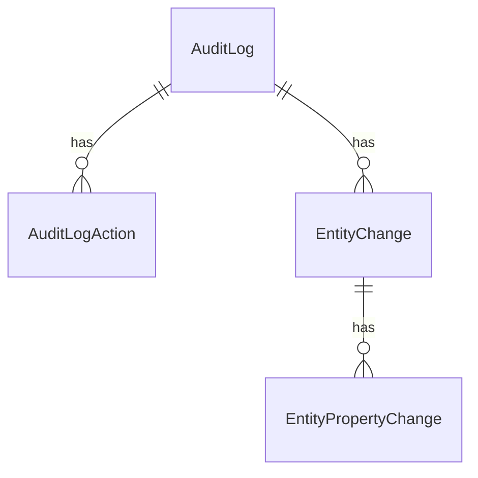

The Audit Logging module persists a structured record of every audited HTTP request, application-service call, and entity mutation. Four aggregates form a small tree rooted at `AuditLog`. The tree is built by `AuditLogInfoToAuditLogConverter` from `AuditLogInfo` runtime DTOs collected by `IAuditingHelper`.

Source path: `modules/audit-logging/src/Volo.Abp.AuditLogging.Domain/Volo/Abp/AuditLogging/`.

All four classes carry `[DisableAuditing]` so that they do not recursively cause more audit records when they are themselves saved.

## Tree shape



## `AuditLog`

Base: `AggregateRoot<Guid>` + `IMultiTenant`. The single row per audited operation.

```csharp
[DisableAuditing]
public class AuditLog : AggregateRoot<Guid>, IMultiTenant
{
    public virtual string ApplicationName { get; set; }
    public virtual Guid? UserId { get; protected set; }
    public virtual string UserName { get; protected set; }
    public virtual Guid? TenantId { get; protected set; }
    public virtual string TenantName { get; protected set; }
    public virtual Guid? ImpersonatorUserId { get; protected set; }
    public virtual string ImpersonatorUserName { get; protected set; }
    public virtual Guid? ImpersonatorTenantId { get; protected set; }
    public virtual string ImpersonatorTenantName { get; protected set; }
    public virtual DateTime ExecutionTime { get; protected set; }
    public virtual int ExecutionDuration { get; protected set; }
    public virtual string ClientIpAddress { get; protected set; }
    public virtual string ClientName { get; protected set; }
    public virtual string ClientId { get; set; }
    public virtual string CorrelationId { get; set; }
    public virtual string BrowserInfo { get; protected set; }
    public virtual string HttpMethod { get; protected set; }
    public virtual string Url { get; protected set; }
    public virtual string Exceptions { get; protected set; }
    public virtual string Comments { get; protected set; }
    public virtual int? HttpStatusCode { get; set; }
    public virtual ICollection<EntityChange> EntityChanges { get; protected set; }
    public virtual ICollection<AuditLogAction> Actions { get; protected set; }
}
```

### Properties

| Property                  | Type             | Length / constraint (`AuditLogConsts`)      | Notes                                                       |
| ------------------------- | ---------------- | ------------------------------------------- | ----------------------------------------------------------- |
| `Id`                      | `Guid`           | PK                                          |                                                             |
| `ApplicationName`         | `string`         | `MaxApplicationNameLength`                  | Logical service identity.                                    |
| `UserId` / `UserName`     | `Guid?` / `string`| `MaxUserNameLength`                        |                                                             |
| `TenantId` / `TenantName` | `Guid?` / `string`| `MaxTenantNameLength`                      | Multi-tenant filter.                                         |
| `Impersonator*`           | same             |                                             | Captured when an admin impersonates another user.            |
| `ExecutionTime`           | `DateTime`       |                                             | Start of the operation.                                      |
| `ExecutionDuration`       | `int`            | milliseconds                                | Elapsed time.                                                |
| `ClientIpAddress`         | `string`         | `MaxClientIpAddressLength`                  | Captured from HTTP headers.                                  |
| `ClientName`              | `string`         | `MaxClientNameLength`                       | Logical client.                                              |
| `ClientId`                | `string`         | `MaxClientIdLength`                         | OAuth client id.                                             |
| `CorrelationId`           | `string`         | `MaxCorrelationIdLength`                    | Distributed trace correlation.                               |
| `BrowserInfo`             | `string`         | `MaxBrowserInfoLength`                      | User-agent.                                                  |
| `HttpMethod` / `Url`      | `string`         | `MaxHttpMethodLength` / `MaxUrlLength`      |                                                             |
| `HttpStatusCode`          | `int?`           |                                             |                                                              |
| `Exceptions`              | `string`         |                                             | Concatenated exception traces.                               |
| `Comments`                | `string`         | `MaxCommentsLength`                         | Free-text annotation.                                        |
| `ExtraProperties`         | `ExtraPropertyDictionary` |                                  | From `AggregateRoot`.                                        |
| `EntityChanges`           | `EntityChange[]` |                                             | Owned set.                                                   |
| `Actions`                 | `AuditLogAction[]` |                                           | Owned set.                                                   |

### Indexes

- `IX_AbpAuditLogs_TenantId_ExecutionTime`
- `IX_AbpAuditLogs_TenantId_UserId_ExecutionTime`

## `AuditLogAction`

Base: `Entity<Guid>` + `IMultiTenant`, `IHasExtraProperties`. Represents a single application-service / API method invocation inside the parent request.

```csharp
[DisableAuditing]
public class AuditLogAction : Entity<Guid>, IMultiTenant, IHasExtraProperties
{
    public virtual Guid? TenantId { get; protected set; }
    public virtual Guid AuditLogId { get; protected set; }
    public virtual string ServiceName { get; protected set; }
    public virtual string MethodName { get; protected set; }
    public virtual string Parameters { get; protected set; }
    public virtual DateTime ExecutionTime { get; protected set; }
    public virtual int ExecutionDuration { get; protected set; }
    public virtual ExtraPropertyDictionary ExtraProperties { get; protected set; }
}
```

| Property            | Type     | Length (`AuditLogActionConsts`)    |
| ------------------- | -------- | ---------------------------------- |
| `Id`                | `Guid`   | PK                                  |
| `AuditLogId`        | `Guid`   | FK to `AuditLog`                    |
| `ServiceName`       | `string` | `MaxServiceNameLength`             |
| `MethodName`        | `string` | `MaxMethodNameLength`              |
| `Parameters`        | `string` | `MaxParametersLength` (JSON)       |
| `ExecutionTime`     | `DateTime` |                                   |
| `ExecutionDuration` | `int`    | ms                                  |
| `ExtraProperties`   | `ExtraPropertyDictionary` |                      |

The constructor truncates `ServiceName` / `MethodName` and clears `Parameters` if its serialized JSON exceeds the configured cap.

## `EntityChange`

Base: `Entity<Guid>` + `IMultiTenant`, `IHasExtraProperties`. One row per entity that was created/updated/deleted in the audited operation.

```csharp
[DisableAuditing]
public class EntityChange : Entity<Guid>, IMultiTenant, IHasExtraProperties
{
    public virtual Guid AuditLogId { get; protected set; }
    public virtual Guid? TenantId { get; protected set; }
    public virtual DateTime ChangeTime { get; protected set; }
    public virtual EntityChangeType ChangeType { get; protected set; }
    public virtual Guid? EntityTenantId { get; protected set; }
    public virtual string EntityId { get; protected set; }
    public virtual string EntityTypeFullName { get; protected set; }
    public virtual ICollection<EntityPropertyChange> PropertyChanges { get; protected set; }
    public virtual ExtraPropertyDictionary ExtraProperties { get; protected set; }
}
```

| Property             | Type                | Length (`EntityChangeConsts`)     | Notes                                                       |
| -------------------- | ------------------- | --------------------------------- | ----------------------------------------------------------- |
| `AuditLogId`         | `Guid`              |                                   | FK to `AuditLog`.                                            |
| `ChangeTime`         | `DateTime`          |                                   |                                                              |
| `ChangeType`         | `EntityChangeType`  | `Created`/`Updated`/`Deleted`     | byte enum.                                                  |
| `EntityTenantId`     | `Guid?`             |                                   | TenantId of the *changed* entity (may differ from log row). |
| `EntityId`           | `string`            | `MaxEntityTypeFullNameLength`     | Stringified primary key.                                     |
| `EntityTypeFullName` | `string`            | `MaxEntityTypeFullNameLength`     | Truncated *from the beginning* to keep the rightmost suffix. |
| `PropertyChanges`    | `EntityPropertyChange[]` |                              | Owned set.                                                  |

`EntityChangeType` enum:

```csharp
public enum EntityChangeType : byte
{
    Created = 0,
    Updated = 1,
    Deleted = 2
}
```

## `EntityPropertyChange`

Base: `Entity<Guid>` + `IMultiTenant`. Captures one property-level diff inside an `EntityChange`.

```csharp
[DisableAuditing]
public class EntityPropertyChange : Entity<Guid>, IMultiTenant
{
    public virtual Guid? TenantId { get; protected set; }
    public virtual Guid EntityChangeId { get; protected set; }
    public virtual string NewValue { get; protected set; }
    public virtual string OriginalValue { get; protected set; }
    public virtual string PropertyName { get; protected set; }
    public virtual string PropertyTypeFullName { get; protected set; }
}
```

| Property               | Type     | Length (`EntityPropertyChangeConsts`)                  |
| ---------------------- | -------- | ------------------------------------------------------ |
| `EntityChangeId`       | `Guid`   | FK to `EntityChange`                                    |
| `NewValue`             | `string` | `MaxNewValueLength`                                    |
| `OriginalValue`        | `string` | `MaxOriginalValueLength`                               |
| `PropertyName`         | `string` | `MaxPropertyNameLength`                                |
| `PropertyTypeFullName` | `string` | `MaxPropertyTypeFullNameLength`                        |

## Tables and indexes

| Entity                  | Table                       | Notable indexes                                          |
| ----------------------- | --------------------------- | -------------------------------------------------------- |
| `AuditLog`              | `AbpAuditLogs`              | `(TenantId, ExecutionTime)`, `(TenantId, UserId, ExecutionTime)` |
| `AuditLogAction`        | `AbpAuditLogActions`        | `(TenantId, ServiceName, MethodName)` per migrations      |
| `EntityChange`          | `AbpEntityChanges`          | `(TenantId, EntityTypeFullName, EntityId)`               |
| `EntityPropertyChange`  | `AbpEntityPropertyChanges`  | `EntityChangeId` FK                                       |

## Lifecycle

1. `AbpAuditingMiddleware` opens an `AuditLogScope` per HTTP request.
2. Application-service and entity-change interceptors append `AuditLogActionInfo` and `EntityChangeInfo` records to the scope.
3. On scope dispose, `AuditingStore` invokes `IAuditLogInfoToAuditLogConverter.Convert(auditInfo)` to materialise the tree, then persists via `IAuditLogRepository`.

The whole tree is saved as a single aggregate, which keeps `AuditLog` queries cheap (you only need to project one root) and lets the unit-of-work batch it.

## See also

- [Audit Logging module](/modules/audit-logging)
- [Auditing flow](/flows/auditing-flow)
- [`Volo.Abp.Auditing`](/framework/cross/auditing)
- [Identity Security Log entity](/reference/models/identity-entities#identitysecuritylog) (parallel, identity-only)
