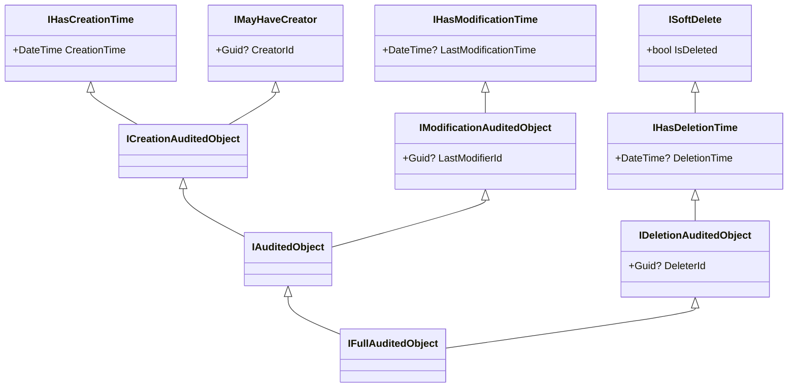

ABP packages three layers of auditing — *creation*, *modification*, and *deletion* — into a small ladder of abstract bases. Every persisted module entity (`IdentityUser`, `Tenant`, `Client`, `BlogPost`, …) descends from one of them, so understanding the contracts is the easiest way to predict how the framework populates `CreationTime`, `CreatorId`, `LastModificationTime`, `LastModifierId`, `IsDeleted`, `DeleterId` and `DeletionTime`.

Source path: `framework/src/Volo.Abp.Ddd.Domain/Volo/Abp/Domain/Entities/Auditing/`.

## Contracts (from `Volo.Abp.Auditing.Contracts`)



Each interface is intentionally tiny; you can implement them directly on a custom class if you do not want to inherit from an ABP base.

```csharp
public interface IHasCreationTime { DateTime CreationTime { get; } }
public interface IMayHaveCreator  { Guid? CreatorId { get; } }
public interface ICreationAuditedObject : IHasCreationTime, IMayHaveCreator { }

public interface IHasModificationTime    { DateTime? LastModificationTime { get; } }
public interface IModificationAuditedObject : IHasModificationTime { Guid? LastModifierId { get; } }
public interface IAuditedObject : ICreationAuditedObject, IModificationAuditedObject { }

public interface ISoftDelete       { bool IsDeleted { get; } }
public interface IHasDeletionTime  : ISoftDelete { DateTime? DeletionTime { get; } }
public interface IDeletionAuditedObject : IHasDeletionTime { Guid? DeleterId { get; } }
public interface IFullAuditedObject : IAuditedObject, IDeletionAuditedObject { }
```

## `CreationAuditedEntity` / `CreationAuditedEntity<TKey>`

```csharp
public abstract class CreationAuditedEntity<TKey> : Entity<TKey>, ICreationAuditedObject
{
    public virtual DateTime CreationTime { get; protected set; }
    public virtual Guid? CreatorId { get; protected set; }
}
```

| Property       | Type        | Constraints       | Source            |
| -------------- | ----------- | ----------------- | ----------------- |
| `Id`           | `TKey`      | PK (inherited)    | `Entity<TKey>`     |
| `CreationTime` | `DateTime`  | Not null          | `AuditPropertySetter` |
| `CreatorId`    | `Guid?`     | Indexed by EF mappings | `ICurrentUser.Id` |

Used for one-shot append-only entities — for example `OrganizationUnitRole` and `IdentityUserOrganizationUnit` in the Identity module:

```csharp
public class IdentityUserOrganizationUnit : CreationAuditedEntity, IMultiTenant
{
    public virtual Guid? TenantId { get; protected set; }
    public virtual Guid UserId { get; protected set; }
    public virtual Guid OrganizationUnitId { get; protected set; }
    public override object[] GetKeys() => new object[] { UserId, OrganizationUnitId };
}
```

## `AuditedEntity` / `AuditedEntity<TKey>`

Adds modification audit on top of creation audit.

```csharp
public abstract class AuditedEntity<TKey> : CreationAuditedEntity<TKey>, IAuditedObject
{
    public virtual DateTime? LastModificationTime { get; set; }
    public virtual Guid? LastModifierId { get; set; }
}
```

| Property               | Type        | Notes                                                  |
| ---------------------- | ----------- | ------------------------------------------------------ |
| `LastModificationTime` | `DateTime?` | Null until the first update.                            |
| `LastModifierId`       | `Guid?`     | Null for system-driven updates with no `ICurrentUser`.  |

## `FullAuditedEntity` / `FullAuditedEntity<TKey>`

Adds soft-delete + deletion audit; this is the workhorse base for most module entities.

```csharp
public abstract class FullAuditedEntity<TKey> : AuditedEntity<TKey>, IFullAuditedObject
{
    public virtual bool IsDeleted { get; set; }
    public virtual Guid? DeleterId { get; set; }
    public virtual DateTime? DeletionTime { get; set; }
}
```

| Property       | Type        | Behaviour                                                                                     |
| -------------- | ----------- | --------------------------------------------------------------------------------------------- |
| `IsDeleted`    | `bool`      | Filtered out by the `ISoftDelete` data filter. UoW converts `DELETE` into `UPDATE`.            |
| `DeleterId`    | `Guid?`     | Captured from `ICurrentUser.Id` at delete time.                                                |
| `DeletionTime` | `DateTime?` | Captured at delete time.                                                                       |

When the framework receives a `DELETE` for a `FullAuditedEntity`, the EF Core save-changes interceptor swaps the operation to `UPDATE`, sets `IsDeleted = true`, `DeletionTime = now`, `DeleterId = ICurrentUser.Id`.

## Aggregate-root variants

For each entity base above, an identical aggregate-root counterpart exists.

### `CreationAuditedAggregateRoot<TKey>`

```csharp
public abstract class CreationAuditedAggregateRoot<TKey> : AggregateRoot<TKey>, ICreationAuditedObject
{
    public virtual DateTime CreationTime { get; set; }
    public virtual Guid? CreatorId { get; set; }
}
```

Inherits `ExtraProperties` and `ConcurrencyStamp` from `AggregateRoot<TKey>`. The IdentityServer `DeviceFlowCodes` aggregate uses it directly.

### `AuditedAggregateRoot<TKey>`

```csharp
public abstract class AuditedAggregateRoot<TKey> : CreationAuditedAggregateRoot<TKey>, IAuditedObject
{
    public virtual DateTime? LastModificationTime { get; set; }
    public virtual Guid? LastModifierId { get; set; }
}
```

Used by `MenuItem` and `GlobalResource` in CMS Kit, and by many domain aggregates in commercial modules.

### `FullAuditedAggregateRoot<TKey>`

```csharp
public abstract class FullAuditedAggregateRoot<TKey> : AuditedAggregateRoot<TKey>, IFullAuditedObject
{
    public virtual bool IsDeleted { get; set; }
    public virtual Guid? DeleterId { get; set; }
    public virtual DateTime? DeletionTime { get; set; }
}
```

The most-used aggregate base. `IdentityUser`, `Tenant`, `Client`, `ApiResource`, `OpenIddictApplication`, `Page`, `BlogPost`, … all derive from it.

## `…WithUser` variants

For projects that prefer object navigations over GUID references, each base has a `WithUser<TUser>` variant exposing `Creator`, `LastModifier`, `Deleter` reference properties.

```csharp
public abstract class FullAuditedAggregateRootWithUser<TUser> : FullAuditedAggregateRoot, IFullAuditedObject<TUser>
{
    public virtual TUser? Creator { get; set; }
    public virtual TUser? LastModifier { get; set; }
    public virtual TUser? Deleter { get; set; }
}
```

These are rare in framework code because most modules avoid cross-aggregate references; commercial modules ship their own user-aware projections instead.

## Effect on persistence

| Layer        | Side-effect                                                                                                                                  |
| ------------ | -------------------------------------------------------------------------------------------------------------------------------------------- |
| EF Core      | `AbpDbContext` applies global filters: `IsDeleted == false` (when `ISoftDelete` filter is on) and `TenantId == CurrentTenant.Id` (when `IMultiTenant`). |
| MongoDB      | `AbpMongoDbContext` registers the same filters via `IMongoDbContextFilterer`.                                                                |
| Repositories | `IRepository<TEntity>` only returns rows that satisfy filters. Use `IDataFilter<ISoftDelete>.Disable()` to bypass.                            |
| Auditing     | `AuditPropertySetter` runs during `SaveChangesAsync` and only writes properties on entities implementing the right interfaces.               |

## Mapping table

| Source file                          | Class                                              | Implements                              |
| ------------------------------------ | -------------------------------------------------- | --------------------------------------- |
| `CreationAuditedEntity.cs`           | `CreationAuditedEntity`, `CreationAuditedEntity<TKey>` | `ICreationAuditedObject`            |
| `AuditedEntity.cs`                   | `AuditedEntity`, `AuditedEntity<TKey>`              | `IAuditedObject`                        |
| `FullAuditedEntity.cs`               | `FullAuditedEntity`, `FullAuditedEntity<TKey>`      | `IFullAuditedObject`                    |
| `CreationAuditedAggregateRoot.cs`    | `CreationAuditedAggregateRoot`, `…<TKey>`           | `ICreationAuditedObject`                |
| `AuditedAggregateRoot.cs`            | `AuditedAggregateRoot`, `…<TKey>`                   | `IAuditedObject`                        |
| `FullAuditedAggregateRoot.cs`        | `FullAuditedAggregateRoot`, `…<TKey>`               | `IFullAuditedObject`                    |
| `…WithUser.cs`                       | `…WithUser<TUser>`                                   | adds `Creator` / `LastModifier` / `Deleter` |

## See also

- [Entity base types](/reference/models/entities-base-types)
- [Auditing flow](/flows/auditing-flow)
- [Audit-logging entities](/reference/models/audit-logging-entities)
- [`Volo.Abp.Auditing` package](/framework/ddd/volo-abp-auditing)
